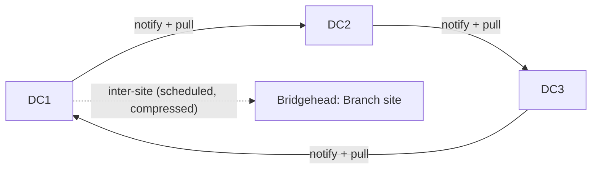

# AD Replication

Active Directory replication is the process by which changes made on one Domain Controller are copied to all other Domain Controllers, keeping the distributed directory consistent. AD uses **multi-master** replication — any writable DC can accept changes — reconciled through update sequence numbers, version stamps, and conflict resolution.

## Overview

Replication keeps the directory eventually consistent across DCs and sites. Intra-site replication is fast and uncompressed; inter-site replication is scheduled and compressed to conserve WAN bandwidth. Understanding replication is essential for troubleshooting divergence and for recognizing the DCSync attack.

## Concepts

- **Multi-master** — every writable DC can originate a change; there is no single master for ordinary object writes (contrast with [FSMO-Roles](FSMO-Roles.md)).
- **USN (Update Sequence Number)** — a per-DC counter incremented on each change; DCs track the highest USN they have seen from every partner.
- **High-watermark & Up-to-dateness vector** — metadata that lets a DC request only the changes it has not yet received, preventing loops and redundant transfer.
- **Partitions replicated**:
  - **Schema** partition — forest-wide.
  - **Configuration** partition — forest-wide.
  - **Domain** partition — per domain.
  - **Application** partitions (for example, DNS zones).
- **Intra-site vs. inter-site**:

| Aspect | Intra-site | Inter-site |
|--------|-----------|------------|
| Trigger | Change notification (near real-time) | Scheduled interval (default 15 min minimum) |
| Compression | None | Compressed |
| Transport | RPC | RPC over IP (or legacy SMTP) |
| Topology | KCC ring | Site links / bridgeheads |

- **Urgent replication** — certain changes (account lockout, password on the PDC Emulator, RID pool changes) replicate immediately rather than waiting for the schedule.

## Architecture



Within a site the KCC builds a bidirectional ring; between sites, bridgehead servers replicate over site links.

## PowerShell / Command-line

Check and force replication:

```powershell
# untested
# Show replication partners and last sync status
repadmin /showrepl

# Summary of replication health across all DCs
repadmin /replsummary

# Force replication of all partitions between partners
repadmin /syncall /AdeP

# PowerShell: show replication partner metadata
Get-ADReplicationPartnerMetadata -Target "DC1" -Scope Server

# PowerShell: show replication failures
Get-ADReplicationFailure -Target "DC1"
```

Health checks: `dcdiag /test:replications` validates replication end to end.

## Security Considerations

> [!WARNING]
> **DCSync abuses replication**
> The **DCSync** attack impersonates a Domain Controller and issues a `DsGetNCChanges` (directory replication) request to pull password hashes — including the `krbtgt` key — from a DC, without touching NTDS.dit on disk. It only requires the **Replicating Directory Changes** and **Replicating Directory Changes All** rights. Monitor for replication requests from accounts that are not Domain Controllers, and restrict these extended rights.

- Replication metadata (USNs, `whenChanged`) is useful to defenders for detecting object tampering.
- Compromise of a single DC compromises the whole domain because it replicates all secrets.

## Troubleshooting

- `repadmin /showrepl` and `/replsummary` — pinpoint failing partners and last-success times.
- `dcdiag /test:replications` — end-to-end health.
- Common causes of failure: DNS misconfiguration, blocked RPC/ephemeral ports, time skew beyond Kerberos tolerance, and lingering objects (use `repadmin /removelingeringobjects`).

> [!TIP]
> **Tombstone lifetime**
> A DC offline longer than the **tombstone lifetime** (default 180 days) must not simply be reconnected — it can reintroduce deleted (lingering) objects. Rebuild it instead.

## Best Practices

- Design site links and costs so the KCC builds an efficient inter-site topology (see [AD-Sites-and-Services](AD-Sites-and-Services.md)).
- Keep DCs time-synchronized to the PDC Emulator hierarchy.
- Monitor replication health continuously with `repadmin` / `dcdiag` or an equivalent tool.
- Restrict directory-replication rights to Domain Controllers only.

## References

- Microsoft Learn — Active Directory Replication Concepts: https://learn.microsoft.com/windows-server/identity/ad-ds/get-started/replication/active-directory-replication-concepts
- Microsoft Learn — Monitoring and Troubleshooting Replication (`repadmin`): https://learn.microsoft.com/troubleshoot/windows-server/active-directory/troubleshoot-replication-error

## Related

- [Enterprise Windows Infrastructure Security](../Readme.md) — course hub and map of content
- [AD-Sites-and-Services](AD-Sites-and-Services.md) — related note (topology that schedules replication)
- [FSMO-Roles](FSMO-Roles.md) — related note (single-master exceptions to multi-master)
- [SAM-vs-NTDS.dit](SAM-vs-NTDS.dit.md) — related note (the database replication synchronizes)
- [Global-Catalog](Global-Catalog.md) — related note (partial replicas built via replication)
