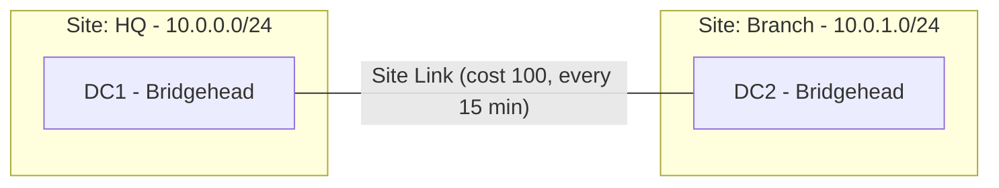

# AD Sites and Services

Active Directory Sites and Services represents the **physical** topology of a network within AD. Sites, subnets, and site links let AD optimize authentication and replication traffic to match the underlying network — keeping fast intra-site traffic local and controlling slow, expensive inter-site traffic.

## Overview

A **site** is a set of well-connected IP subnets (typically a LAN or data center). By mapping subnets to sites, AD directs clients to the nearest Domain Controller and schedules replication between sites according to available bandwidth.

## Concepts

- **Site** — a collection of one or more IP subnets with fast, reliable connectivity.
- **Subnet** — an IP range associated with exactly one site; how AD decides which site a client belongs to.
- **Site Link** — a logical connection between two or more sites, carrying a **cost**, **replication schedule**, and **replication interval**.
- **Bridgehead Server** — the DC in a site chosen to send/receive inter-site replication with other sites.
- **KCC (Knowledge Consistency Checker)** — the process on each DC that automatically builds and maintains the replication topology (connection objects) within and between sites.

| Concept | Purpose |
|---------|---------|
| Site | Groups well-connected subnets |
| Subnet | Maps client IPs to a site |
| Site Link | Defines cost/schedule for inter-site replication |
| Bridgehead | Handles inter-site replication for a site |
| KCC | Auto-generates the replication topology |

> [!NOTE]
> **Why sites matter**
> Without correct sites and subnets, clients may authenticate against a Domain Controller across a WAN link, and SYSVOL/DFS referrals become inefficient. Accurate subnet-to-site mapping is one of the cheapest, highest-impact AD performance fixes.

## Architecture



## PowerShell

Inspect and manage sites, subnets, and links:

```powershell
# untested
# List all sites
Get-ADReplicationSite -Filter *

# List subnets and their site associations
Get-ADReplicationSubnet -Filter * | Select-Object Name, Site

# Create a new site
New-ADReplicationSite -Name "Branch"

# Associate a subnet with a site
New-ADReplicationSubnet -Name "10.0.1.0/24" -Site "Branch"

# Create a site link between two sites
New-ADReplicationSiteLink -Name "HQ-Branch" -SitesIncluded "HQ","Branch" -Cost 100 -ReplicationFrequencyInMinutes 15
```

Legacy tooling: `nltest /dsgetsite` shows a machine's current site.

## GUI Steps

1. Open **Active Directory Sites and Services** (`dssite.msc`).
2. Under **Sites**, create sites and rename `Default-First-Site-Name` as appropriate.
3. Under **Subnets**, add each subnet and assign it to a site.
4. Under **Inter-Site Transports → IP**, create site links and set cost, schedule, and interval.

> [!NOTE]
> **Screenshot**
> 

## Security Considerations

- Misconfigured sites can send clients to a DC in a less-trusted location; align site design with security tiers.
- Site topology reveals the physical layout of the environment to an attacker who can query AD — treat it as reconnaissance-sensitive.

## Best Practices

- Map **every** production subnet to a site to avoid clients landing in the wrong site.
- Set site-link **cost** to reflect real bandwidth so the KCC builds an efficient topology.
- Place at least one DC (and ideally a Global Catalog) in each site with local authentication needs; use an [RODC or GC](Global-Catalog.md) in branch sites where appropriate.
- Review the KCC-generated topology with `repadmin /showrepl`.

## References

- Microsoft Learn — Designing the Site Topology: https://learn.microsoft.com/windows-server/identity/ad-ds/plan/creating-a-site-design
- Microsoft Learn — Sites Overview: https://learn.microsoft.com/windows-server/identity/ad-ds/get-started/replication/active-directory-replication-concepts

## Related

- [Enterprise Windows Infrastructure Security](../Readme.md) — course hub and map of content
- [AD-Replication](AD-Replication.md) — related note (what site links schedule)
- [Active-Directory-Domain-Services](Active-Directory-Domain-Services.md) — related note (AD DS physical components)
- [Global-Catalog](Global-Catalog.md) — related note (placed per site for query efficiency)
- [FSMO-Roles](FSMO-Roles.md) — related note (roles that coordinate the topology)
