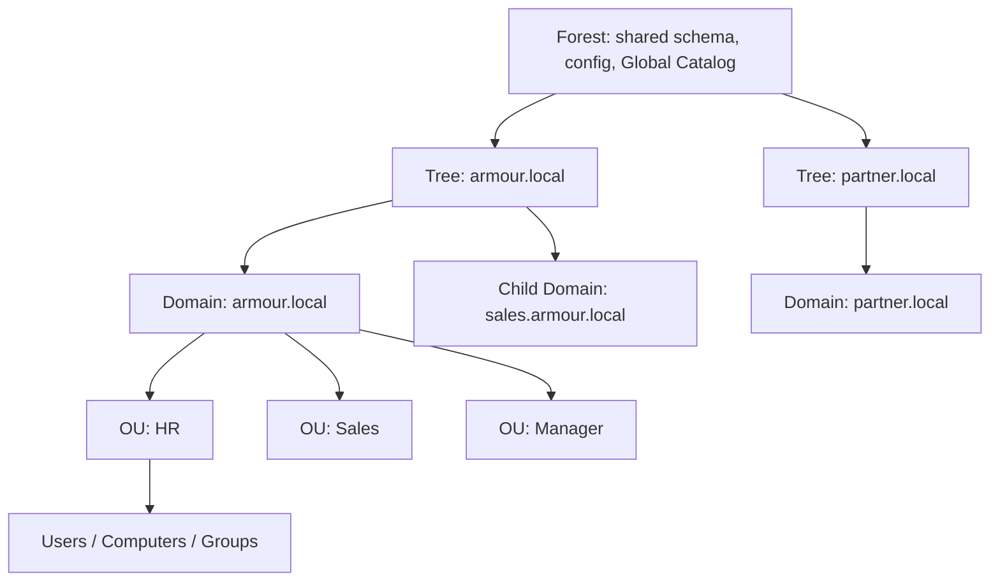

# Active Directory Domain Services (AD DS)

Active Directory Domain Services (AD DS) is a core service in Microsoft Windows Server that provides a centralized platform for managing and securing access to network resources. It is the foundation for implementing a domain-based network infrastructure.

## Overview

AD DS stores directory objects (users, computers, groups, and resources) in a hierarchical database and provides centralized authentication, authorization, and policy enforcement across the network.

> [!NOTE]
> **Why AD DS matters**
> AD DS is the backbone of most enterprise Windows networks. It delivers single sign-on, centralized management, and Group Policy enforcement, and it is the primary target and pivot point in Windows-focused offensive engagements.

### Key Features

- **Database of Users, Groups, Services, and Resources** — stores information about network objects such as users, computers, groups, and resources (for example, printers).
- **Centralized Authentication** — for users and computers, supporting **Kerberos** (primary) and **NTLM** (legacy support).
- **Single Point of Access to Network Resources** — users access file shares, printers, and applications with a single login; permissions and policies are centrally managed.
- **Hierarchical Organizational Structure** — logical structure of **Forests**, **Trees**, **Domains**, and **Organizational Units (OUs)**.
- **Single Sign-On (SSO)** — log in once to access multiple authorized resources within the domain.
- **Group Policy Management** — enforce security settings, configurations, and policies network-wide.

### Benefits

- **Centralized Management** — simplifies user, computer, and resource management.
- **Improved Security** — centralized authentication and access control.
- **Scalability** — supports networks from small to enterprise-level.
- **High Availability** — redundancy through multiple domain controllers.
- **Flexible Administration** — delegate tasks using Organizational Units (OUs).

## Concepts

AD DS is composed of **logical** components (how the directory is organized) and **physical** components (how it is deployed on hardware and across the network), backed by a **data store** and **security** components.

### Logical Components

- **Domains** — basic units containing users, computers, and policies, each with a unique DNS namespace (for example, `example.com`). See [Forest-Tree-and-Domain](Forest-Tree-and-Domain.md).
- **Organizational Units (OUs)** — logical containers within domains used for administrative delegation and Group Policy application. See [Organizational-Units-OU](Organizational-Units-OU.md).
- **Trees** — a hierarchy of domains sharing a contiguous namespace. See [Forest-Tree-and-Domain](Forest-Tree-and-Domain.md).
- **Forests** — a collection of domain trees sharing a common schema, configuration, and Global Catalog. See [Forest-Tree-and-Domain](Forest-Tree-and-Domain.md) and [Global-Catalog](Global-Catalog.md).
- **Trust Relationships** — enable secure communication between domains. See [Trust-Relationships](Trust-Relationships.md).

| Type | Description | Example |
|------|-------------|---------|
| **Transitive** | Extends beyond two domains | A trusts B, B trusts C → A trusts C |
| **Non-Transitive** | Limited to two domains | A trusts B only |
| **One-Way** | One domain trusts another | A trusts B, but B doesn't trust A |
| **Two-Way** | Both domains trust each other | A trusts B and B trusts A |
| **Forest Trust** | Between forests | `corp.local` trusts `partner.local` |
| **External Trust** | Trust between an AD domain and a non-forest domain | For legacy systems or isolated domains |

### Physical Components

- **Domain Controllers (DCs)** — store the AD database, handle authentication and authorization, and replicate data across DCs.
- **Global Catalog (GC)** — provides information about every object in the forest. See [Global-Catalog](Global-Catalog.md).
- **Read-Only Domain Controller (RODC)** — used in remote or less secure locations; contains read-only copies of AD data.
- **Sites** — represent the physical structure of the network and optimize replication and authentication based on network topology. See [AD-Sites-and-Services](AD-Sites-and-Services.md).
- **Replication** — synchronizes AD data. See [AD-Replication](AD-Replication.md).

| Type | Description |
|------|-------------|
| **Intra-site** | Within the same site (fast) |
| **Inter-site** | Between sites (optimized) |

### Security Components

- **Security Groups** — control access to resources.
  - **Security Groups** — for assigning permissions.
  - **Distribution Groups** — for email distribution.
- **Group Policies** — configure security, software deployment, and system behavior using the Group Policy Management Console (**GPMC**).
- **Authentication Protocols**:
  - **Kerberos** — default protocol for secure authentication. See [Kerberos-Authentication](Kerberos-Authentication.md).
  - **NTLM** — legacy protocol for backward compatibility. See [NTLM](NTLM.md).

### FSMO Roles (Flexible Single Master Operations)

| FSMO Role | Scope | Function |
|-----------|-------|----------|
| **Schema Master** | Forest | Manages AD schema modifications |
| **Domain Naming Master** | Forest | Manages adding/removing domains in the forest |
| **RID Master** | Domain | Allocates RID pools for objects |
| **PDC Emulator** | Domain | Time sync, password changes, backwards compatibility |
| **Infrastructure Master** | Domain | Updates cross-domain group references |

See [FSMO-Roles](FSMO-Roles.md) for a full breakdown.

## Architecture

The following diagram shows the AD DS logical structure — how forests, trees, domains, and OUs nest.



### Data Store — Active Directory Database (`NTDS.dit`)

The **`NTDS.dit`** file is the **Active Directory database** used by **Domain Controllers** (DCs) in a Windows domain. It contains all **Active Directory (AD)** data, including user accounts, group memberships, computer accounts, and password hashes for domain users.

File location (on a Domain Controller):

```text
C:\Windows\NTDS\NTDS.dit
```

> [!WARNING]
> **Locked while running**
> This file is locked by the OS while Active Directory is running. Offline access requires shadow copies, `ntdsutil` snapshots, or booting from another OS.

What's inside:

| Content Type | Description |
|--------------|-------------|
| AD Objects | All users, groups, OUs, policies, computers |
| Password Hashes | NTLM (and possibly LM and Kerberos AES) |
| Group Membership | Who's in Domain Admins, Enterprise Admins, etc. |
| Schema Info | Defines object structure in AD |

Password hash storage — each domain user's **NTLM hash** is stored here, alongside other possible encryption formats:

- **NT Hash** — standard NTLM hash.
- **LM Hash** — often disabled.
- **Kerberos Keys** — AES-128/256 keys for Kerberos authentication.

> [!IMPORTANT]
> **Boot key required**
> The **boot key** stored in the SYSTEM hive is required to **decrypt the hashes** in `NTDS.dit`.

Dumping password hashes from `NTDS.dit` (penetration testing) requires three things:

- the `NTDS.dit` file,
- the `SYSTEM` hive (for decrypting the hashes), and
- a dumping tool (such as Impacket `secretsdump`).

See [SAM-vs-NTDS.dit](SAM-vs-NTDS.dit.md) for the local-vs-domain credential store comparison.

## Installation

### Requirements

**Operating System** — Windows Server (Standard, Enterprise, or Datacenter).

**File System** — an **NTFS partition** is required, for:

- **NTDS.dit** (database)
- **SYSVOL** (Group Policies and login scripts)

Example paths:

```text
C:\Windows\NTDS
C:\Windows\SYSVOL
```

**Space Requirements** — minimum **2 GB** free on the NTFS volume (more recommended).

**Static Configuration** — a **static IP address** and **hostname** are required.

**DNS Requirement** — must have an **authoritative DNS server** supporting **SRV records** for the domain.

### PowerShell — AD DS Deployment

The following script installs the AD DS role and promotes the server to the first Domain Controller of a new forest.

```powershell
# Active Directory Domain Services
# Windows PowerShell script for AD DS Deployment
#

Import-Module ADDSDeployment
Install-ADDSForest `
-CreateDnsDelegation:$false `
-DatabasePath "C:\WINDOWS\NTDS" `
-DomainMode "Win2025" `
-DomainName "armour.local" `
-DomainNetbiosName "ARMOUR" `
-ForestMode "Win2025" `
-InstallDns:$true `
-LogPath "C:\WINDOWS\NTDS" `
-NoRebootOnCompletion:$false `
-SysvolPath "C:\WINDOWS\SYSVOL" `
-Force:$true
```

> [!NOTE]
> **Screenshot**
> 

## Configuration

### Common Ports Used by AD DS

| Protocol | Port | Purpose |
|----------|------|---------|
| LDAP | 389 | Directory Services |
| LDAPS | 636 | Secure LDAP over SSL/TLS |
| Kerberos | 88 | Authentication |
| DNS | 53 | Name resolution |
| SMB | 445 | SYSVOL and NETLOGON shares |
| RPC | 135 | Remote Procedure Call |
| Ephemeral | 49152-65535 | Dynamic RPC for replication |

See [LDAP](LDAP.md) for details on the directory access protocol.

## Security Considerations

### SAM (Security Account Manager)

The **Security Account Manager (SAM)** is a **Windows subsystem** that manages **local user accounts and their credentials**. These credentials are stored **hashed** (usually in NTLM format) in a protected registry hive:

```text
C:\Windows\System32\config\SAM
```

This file is used during logins to authenticate local users on the system.

Key characteristics:

| Feature | Description |
|---------|-------------|
| Stores | Local user account information and password hashes |
| Location | `C:\Windows\System32\config\SAM` |
| Access | Only SYSTEM or Administrator privileges can read it |
| Protection Mechanism | The file is locked while Windows is running |
| Hash Algorithm | NTLM (New Technology LAN Manager); LM hashes are often disabled |

What can be extracted — once the **SAM** and corresponding **SYSTEM** hive are obtained, tools like **Mimikatz** or **Impacket** can extract:

- **Username**
- **RID (Relative Identifier)**
- **NTLM password hash**
- (Optional) LM hash if enabled (usually it is not)

Why SAM matters in penetration testing:

- Post-exploitation goal: gaining **hashes** for **offline cracking** or **pass-the-hash attacks**.
- Frequently used after **privilege escalation**.
- A source of **persistent access** by extracting admin credentials.

> [!WARNING]
> **Security implications**
> Local SAM is only for **local accounts**; domain accounts are stored in the **NTDS.dit** on Domain Controllers. Protecting SAM means protecting local accounts from credential theft — a SAM file compromise equals total local compromise.

## Best Practices

- Deploy at least **two Domain Controllers** per domain for redundancy.
- Regularly back up **NTDS.dit** and **SYSVOL**.
- Place **RODCs** in remote/branch offices.
- Harden Group Policies:
  - Disable **NTLM** where possible.
  - Enforce password and account lockout policies.
- Monitor replication health using tools like `repadmin` and `dcdiag`.
- Implement proper **DNS configuration**.
- Regularly review and clean unused accounts and groups.

## Summary

Active Directory Domain Services (AD DS) provides a comprehensive solution for managing network resources and securing user access in a Windows-based environment. With its logical and physical components, centralized authentication, resource management, and policy enforcement, AD DS is the foundation of most enterprise Windows networks.

## References

- Microsoft Learn — Active Directory Domain Services Overview: https://learn.microsoft.com/windows-server/identity/ad-ds/get-started/virtual-dc/active-directory-domain-services-overview
- Microsoft Learn — Install a New Windows Server 2012 Active Directory Forest: https://learn.microsoft.com/windows-server/identity/ad-ds/deploy/install-a-new-windows-server-2012-active-directory-forest--level-200-

## Related

- [Enterprise Windows Infrastructure Security](../Readme.md) — course hub and map of content
- [Forest-Tree-and-Domain](Forest-Tree-and-Domain.md) — related note (logical structure of AD)
- [Organizational-Units-OU](Organizational-Units-OU.md) — related note (delegation and GPO containers)
- [FSMO-Roles](FSMO-Roles.md) — related note (single-master operation roles)
- [Global-Catalog](Global-Catalog.md) — related note (forest-wide object index)
- [AD-Replication](AD-Replication.md) — related note (how DCs stay in sync)
- [Kerberos-Authentication](Kerberos-Authentication.md) — related note (default authentication protocol)
- [NTLM](NTLM.md) — related note (legacy authentication protocol)
- [LDAP](LDAP.md) — related note (directory access protocol)
- [SAM-vs-NTDS.dit](SAM-vs-NTDS.dit.md) — related note (credential store comparison)
- [Managing-Domain-Users-and-Groups-with-PowerShell](Managing-Domain-Users-and-Groups-with-PowerShell.md) — related note (populating the directory)
