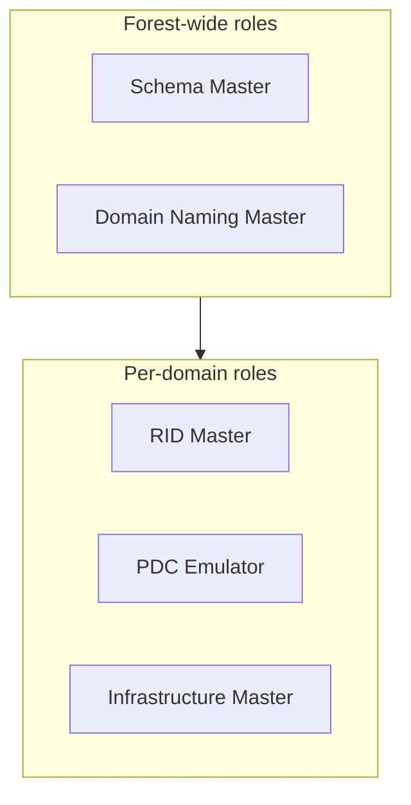

# FSMO Roles

Flexible Single Master Operations (FSMO) roles are five specialized Domain Controller roles that handle operations unsuited to multi-master replication. Two roles are **forest-wide** (Schema Master, Domain Naming Master) and three are **domain-wide** (RID Master, PDC Emulator, Infrastructure Master).

## Overview

Most AD changes replicate in a multi-master fashion — any DC can accept a write. A few operations, however, must be performed by exactly one DC to avoid conflicts. FSMO roles designate that single master per operation.

## Concepts

| FSMO Role | Scope | Function |
|-----------|-------|----------|
| **Schema Master** | Forest | Manages AD schema modifications |
| **Domain Naming Master** | Forest | Manages adding/removing domains in the forest |
| **RID Master** | Domain | Allocates RID pools for objects |
| **PDC Emulator** | Domain | Time sync, password changes, account lockout, backward compatibility |
| **Infrastructure Master** | Domain | Updates cross-domain group-to-user references |

### Role details

- **Schema Master** — the only DC that can write to the schema partition. There is exactly one per forest.
- **Domain Naming Master** — controls adding and removing domains and application partitions. One per forest.
- **RID Master** — hands out blocks (pools) of Relative Identifiers to each DC so that every SID created in the domain is unique. One per domain.
- **PDC Emulator** — the most operationally critical role: authoritative time source for the domain, processes urgent password changes and account lockouts, and is the default target for Group Policy edits. One per domain.
- **Infrastructure Master** — keeps cross-domain references (for example, a foreign user shown in a local group) up to date. One per domain.

> [!IMPORTANT]
> **Infrastructure Master and the Global Catalog**
> In a multi-domain forest, do **not** place the Infrastructure Master on a Global Catalog server (unless *every* DC is a GC), or it cannot detect stale cross-domain references. In a single-domain forest this does not matter.

## Architecture



## PowerShell

Locate the current role holders and transfer roles:

```powershell
# untested
# Show forest-wide role holders
Get-ADForest | Select-Object SchemaMaster, DomainNamingMaster

# Show domain-wide role holders
Get-ADDomain | Select-Object PDCEmulator, RIDMaster, InfrastructureMaster

# Transfer a role to another DC (graceful)
Move-ADDirectoryServerOperationMasterRole -Identity "DC2" -OperationMasterRole PDCEmulator

# Seize a role when the current holder is permanently offline
Move-ADDirectoryServerOperationMasterRole -Identity "DC2" -OperationMasterRole SchemaMaster -Force
```

Legacy tooling: `netdom query fsmo` lists all five role holders.

> [!WARNING]
> **Transfer vs. seize**
> Use **transfer** when both DCs are online — it hands the role over cleanly. Use **seize** (`-Force`) only when the original holder is permanently gone, and never bring the old holder back online afterward, as duplicate roles corrupt the directory (especially RID and Schema).

## Security Considerations

- FSMO holders — particularly the **Schema Master** and **PDC Emulator** — are tier-0 assets; compromise enables schema tampering, time manipulation, and privileged authentication abuse.
- A failed **PDC Emulator** breaks Kerberos time-sync tolerance and can cause authentication failures domain-wide.

## Best Practices

- Document which DC holds each role and keep placement deliberate, not accidental.
- Keep the two forest roles together on a well-protected DC in the forest root.
- Keep the PDC Emulator on a robust, well-connected DC; point it at an authoritative external NTP source.
- Verify role holders after DC promotions/demotions and before decommissioning a DC.

## References

- Microsoft Learn — FSMO Roles: https://learn.microsoft.com/troubleshoot/windows-server/active-directory/fsmo-roles
- Microsoft Learn — Transfer or Seize FSMO Roles: https://learn.microsoft.com/troubleshoot/windows-server/active-directory/transfer-or-seize-fsmo-roles-in-ad-ds

## Related

- [Enterprise Windows Infrastructure Security](../Readme.md) — course hub and map of content
- [Active-Directory-Domain-Services](Active-Directory-Domain-Services.md) — related note (AD DS overview)
- [Global-Catalog](Global-Catalog.md) — related note (interacts with the Infrastructure Master)
- [AD-Replication](AD-Replication.md) — related note (FSMO handles non-multi-master operations)
- [Forest-Tree-and-Domain](Forest-Tree-and-Domain.md) — related note (forest vs. domain scope of roles)
