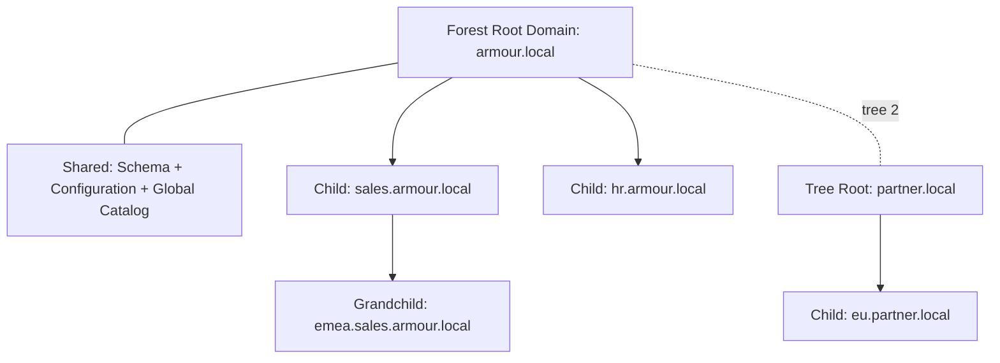

# Forest, Tree, and Domain

Forests, trees, and domains are the three logical containers that define the structure of Active Directory. A **domain** is the base administrative and security boundary, a **tree** is a chain of domains sharing a contiguous DNS namespace, and a **forest** is the top-level security boundary containing one or more trees that share a schema, configuration, and Global Catalog.

## Overview

Understanding this hierarchy is essential for planning delegation, replication, trust, and the blast radius of a compromise. The forest — not the domain — is the true security boundary in Active Directory.

## Concepts

### Domain

- The base unit of the AD logical structure, holding users, computers, groups, and policies.
- Has a unique DNS name (for example, `armour.local`).
- Acts as an **administrative boundary** (Domain Admins) and a **replication boundary** for the domain partition.
- Every domain has at least one Domain Controller.

### Tree

- A hierarchy of one or more domains that share a **contiguous namespace**.
- A child domain automatically inherits the parent's suffix — for example, `armour.local` → `sales.armour.local` → `emea.sales.armour.local`.
- Parent and child domains are joined by an automatic two-way transitive trust.

### Forest

- The top-level container and the **security boundary** of Active Directory.
- Contains one or more trees.
- All domains in a forest share:
  - a common **schema** (the definition of every object class and attribute),
  - a common **configuration** partition, and
  - a common **Global Catalog**.
- The first domain created in a forest is the **forest root domain**.

> [!IMPORTANT]
> **The forest is the security boundary**
> A domain is only an administrative boundary. Because all domains in a forest share a schema and trust each other transitively, compromising any domain can lead to forest-wide compromise (for example, via the `krbtgt` key or a forged inter-realm trust ticket). Design forest boundaries around true security isolation, not just organizational units.

## Architecture



The diagram shows one forest containing two trees. `armour.local` and `partner.local` are separate contiguous namespaces (two trees) but one forest, joined by an automatic two-way transitive tree-root trust.

## PowerShell

Inspect the current forest, its domains, and trees:

```powershell
# untested
# Forest-level information (schema master, domains, sites, GC servers)
Get-ADForest

# Domain-level information for the current domain
Get-ADDomain

# List every domain in the forest
(Get-ADForest).Domains

# Show the forest and domain functional levels
Get-ADForest | Select-Object Name, ForestMode
Get-ADDomain | Select-Object Name, DomainMode
```

## Security Considerations

- **Functional levels** gate available security features (for example, newer Kerberos armoring and Protected Users). Raise them once all DCs meet the required OS version.
- **Forest trusts** extend the reachable attack surface; enable **SID filtering** and **selective authentication** on trusts to non-owned forests. See [Trust-Relationships](Trust-Relationships.md).
- Treat the **forest root domain** and its DCs as tier-0 assets — control of the root threatens every domain.

## Best Practices

- Keep the number of domains minimal; use [Organizational-Units-OU](Organizational-Units-OU.md) for delegation instead of extra domains.
- Use a single forest unless you have a hard security or political isolation requirement.
- Protect the forest root and `krbtgt` account, and rotate the `krbtgt` password on a schedule.

## References

- Microsoft Learn — AD DS Logical Concepts: https://learn.microsoft.com/windows-server/identity/ad-ds/plan/understanding-active-directory-site-topology
- Microsoft Learn — Forests as Security Boundaries: https://learn.microsoft.com/windows-server/identity/ad-ds/plan/security-best-practices/appendix-b--privileged-accounts-and-groups-in-active-directory

## Related

- [Enterprise Windows Infrastructure Security](../Readme.md) — course hub and map of content
- [Active-Directory-Domain-Services](Active-Directory-Domain-Services.md) — related note (AD DS overview)
- [Organizational-Units-OU](Organizational-Units-OU.md) — related note (subdividing a domain)
- [Trust-Relationships](Trust-Relationships.md) — related note (linking domains and forests)
- [Global-Catalog](Global-Catalog.md) — related note (forest-wide object index)
- [FSMO-Roles](FSMO-Roles.md) — related note (forest- and domain-wide master roles)
