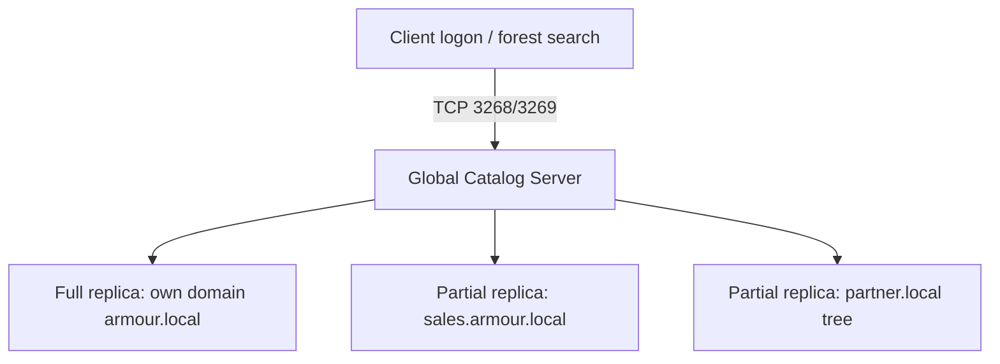

# Global Catalog

The Global Catalog (GC) is a distributed data repository, held on designated Domain Controllers, that contains a **partial, read-only replica of every object in the forest** plus a full replica of the objects in its own domain. It enables forest-wide searches and universal group membership resolution during logon.

## Overview

A DC normally holds a full copy of its own domain only. Finding an object in *another* domain of the forest would otherwise require querying that domain's DCs. The Global Catalog solves this by keeping a searchable, forest-wide index of every object's most commonly used attributes.

## Concepts

- **Partial Attribute Set (PAS)** — the GC stores a subset of each object's attributes (those marked "replicate to GC" in the schema), not the entire object. This makes forest-wide searches fast without replicating everything.
- **Ports** — GC lookups use **TCP 3268** (LDAP over GC) and **TCP 3269** (LDAP over GC with SSL/TLS), distinct from standard LDAP 389/636.
- **Roles the GC serves**:
  - Forest-wide object search (for example, resolving a user in any domain).
  - **Universal group membership** enumeration during logon.
  - **UPN resolution** — mapping a `user@forest` logon name to the correct domain.
  - Supplying the Exchange Global Address List and similar directory-wide services.

> [!NOTE]
> **GC and logon**
> During interactive logon, a DC contacts a GC to expand the user's **universal group** memberships. If no GC is reachable and Universal Group Membership Caching is not enabled, logon can fail or fall back — which is why branch sites often need a local GC or caching.

## Architecture



## PowerShell

Find Global Catalog servers and check/set the GC flag:

```powershell
# untested
# List all Global Catalog servers in the forest
Get-ADForest | Select-Object -ExpandProperty GlobalCatalogs

# Check whether a specific DC is a GC
Get-ADDomainController -Identity "DC1" | Select-Object Name, IsGlobalCatalog

# Query the GC directly over port 3268 (forest-wide search)
Get-ADObject -Server "DC1:3268" -LDAPFilter "(objectClass=user)" -SearchBase "DC=armour,DC=local"
```

Legacy tooling: `nltest /dsgetdc:armour.local /gc` locates a GC.

## GUI Steps

1. Open **Active Directory Sites and Services** (`dssite.msc`).
2. Expand the site → **Servers** → the DC → **NTDS Settings**.
3. Open **Properties** and toggle the **Global Catalog** checkbox.

> [!NOTE]
> **Screenshot**
> 

## Security Considerations

- The GC exposes a **forest-wide** view of objects; an attacker who can query port 3268 can enumerate users, groups, and SPNs across *all* domains from a single DC.
- Restrict and monitor LDAP/GC queries; anomalous bulk GC enumeration is a reconnaissance indicator.

## Best Practices

- Place a GC in **every site** that has clients authenticating locally, or enable **Universal Group Membership Caching** for GC-less branch sites.
- Do not co-locate the **Infrastructure Master** with a GC in a multi-domain forest unless all DCs are GCs (see [FSMO-Roles](FSMO-Roles.md)).
- Ensure adequate GC redundancy — losing all GCs breaks logon and forest-wide search.

## References

- Microsoft Learn — Global Catalog: https://learn.microsoft.com/windows-server/identity/ad-ds/plan/planning-global-catalog-server-placement
- Microsoft Learn — Universal Group Membership Caching: https://learn.microsoft.com/windows-server/identity/ad-ds/get-started/replication/active-directory-replication-concepts

## Related

- [Enterprise Windows Infrastructure Security](../Readme.md) — course hub and map of content
- [Forest-Tree-and-Domain](Forest-Tree-and-Domain.md) — related note (the forest the GC indexes)
- [FSMO-Roles](FSMO-Roles.md) — related note (Infrastructure Master interaction)
- [AD-Sites-and-Services](AD-Sites-and-Services.md) — related note (GC placement per site)
- [LDAP](LDAP.md) — related note (protocol the GC serves on 3268/3269)
