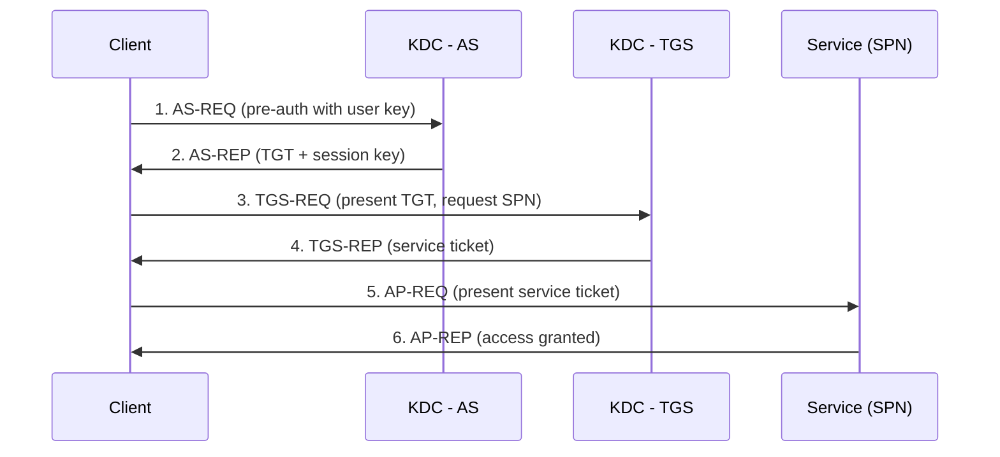

# Kerberos Authentication

Kerberos is the default authentication protocol in Active Directory. It uses a trusted third party — the **Key Distribution Center (KDC)** running on every Domain Controller — to issue time-limited, encrypted **tickets** so that users and services can authenticate without sending passwords over the network.

## Overview

Kerberos replaces the older challenge/response of [NTLM](NTLM.md) with a ticket-based model. A user authenticates once to obtain a **Ticket Granting Ticket (TGT)**, then exchanges it for **service tickets** to individual resources. Kerberos operates over **TCP/UDP 88**.

## Concepts

- **KDC (Key Distribution Center)** — the Kerberos service on each DC, comprising the Authentication Service (AS) and the Ticket Granting Service (TGS).
- **TGT (Ticket Granting Ticket)** — proof of identity issued by the AS, encrypted with the `krbtgt` account's key.
- **Service Ticket (TGS ticket)** — grants access to one specific service, encrypted with that service account's key.
- **SPN (Service Principal Name)** — the unique name identifying a service instance to which a service ticket is issued.
- **PAC (Privilege Attribute Certificate)** — authorization data (group SIDs) embedded in tickets.
- **`krbtgt` account** — the domain account whose key signs all TGTs; its compromise enables Golden Tickets.

| Component | Role |
|-----------|------|
| AS (Authentication Service) | Issues the TGT after pre-authentication |
| TGS (Ticket Granting Service) | Issues service tickets using the TGT |
| `krbtgt` | Key that encrypts/signs every TGT |
| SPN | Identifies the target service for a service ticket |

## Architecture

## Concepts in Practice

- **Pre-authentication** — the client encrypts a timestamp with its password-derived key to prove identity before the AS issues a TGT. Accounts with pre-auth disabled are vulnerable to **AS-REP Roasting**.
- **Time sensitivity** — Kerberos requires clocks within a tolerance (default 5 minutes); the PDC Emulator anchors domain time (see [FSMO-Roles](FSMO-Roles.md)).

## Security Considerations

> [!WARNING]
> **Common Kerberos attacks**
> - **Kerberoasting** — request service tickets for accounts with SPNs, then crack the ticket offline to recover the service account password (tickets are encrypted with the service account's key).
> - **AS-REP Roasting** — request a TGT for an account with pre-authentication disabled and crack the returned blob offline.
> - **Golden Ticket** — forge arbitrary TGTs after stealing the `krbtgt` key (for example, via [DCSync](AD-Replication.md)).
> - **Silver Ticket** — forge a service ticket for one service using that service account's key.
> - **Unconstrained/Constrained delegation abuse** — impersonate users to back-end services when delegation is misconfigured.

- Use **strong, long passwords** for service accounts (or Group Managed Service Accounts) to resist Kerberoasting.
- Enforce **Kerberos pre-authentication** on all accounts.
- Rotate the **`krbtgt`** password periodically (twice, allowing replication in between).

## Troubleshooting

- `klist` — list cached tickets on a client; `klist purge` clears them.
- Event ID **4768** (TGT requested), **4769** (service ticket requested), and **4771** (pre-auth failed) in the Security log trace Kerberos activity.
- `KRB_AP_ERR_SKEW` indicates clock skew beyond tolerance — fix time sync.

## Best Practices

- Prefer Kerberos over NTLM; disable NTLM where feasible (see [NTLM](NTLM.md)).
- Register SPNs correctly to avoid fallback to NTLM.
- Monitor 4769 events with weak encryption (RC4) as a Kerberoasting indicator.
- Use Group Managed Service Accounts (gMSA) for services.

## References

- Microsoft Learn — Kerberos Authentication Overview: https://learn.microsoft.com/windows-server/security/kerberos/kerberos-authentication-overview
- MIT Kerberos Documentation: https://web.mit.edu/kerberos/

## Related

- [Enterprise Windows Infrastructure Security](../Readme.md) — course hub and map of content
- [NTLM](NTLM.md) — related note (legacy fallback protocol)
- [Active-Directory-Domain-Services](Active-Directory-Domain-Services.md) — related note (AD DS authentication component)
- [Trust-Relationships](Trust-Relationships.md) — related note (inter-realm Kerberos)
- [AD-Replication](AD-Replication.md) — related note (DCSync exposes the krbtgt key)
