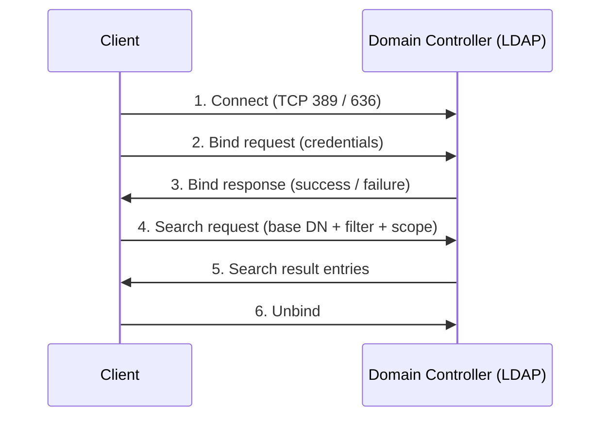

# Lightweight Directory Access Protocol (LDAP)

The Lightweight Directory Access Protocol (LDAP) is an open, vendor-neutral protocol for querying and modifying directory services over an IP network. In a Windows environment it is the primary wire protocol that clients and applications use to read and write objects in [Active Directory Domain Services (AD DS)](Active-Directory-Domain-Services.md).

## Overview

A directory is a specialized, read-optimized database that stores information as a hierarchy of entries — users, groups, computers, and other resources. LDAP defines how a client connects to a [Domain Controller](Active-Directory-Domain-Services.md), authenticates (binds), and then searches or modifies that directory. It is defined by [RFC 4511](https://www.rfc-editor.org/rfc/rfc4511) and related RFCs.

In AD DS, nearly every management action ultimately speaks LDAP: PowerShell's `Get-ADUser`, the `dsquery` tools, `ldp.exe`, and third-party enumeration tools all issue LDAP searches under the hood. Because it exposes the full contents of the directory, LDAP is also a primary reconnaissance surface for attackers — see [NTLM](NTLM.md) and [Kerberos-Authentication](Kerberos-Authentication.md) for the authentication mechanisms that back an LDAP bind.

## How It Works

LDAP organizes data as a **Directory Information Tree (DIT)** — a hierarchy of entries identified by a **Distinguished Name (DN)**.

- **Entry** — a single object (for example, a user) with a set of attributes.
- **Attribute** — a typed name/value pair (for example, `sAMAccountName`, `mail`, `memberOf`).
- **objectClass** — defines which attributes an entry must and may have (for example, `user`, `group`, `computer`).
- **Distinguished Name (DN)** — the unique, fully-qualified path to an entry, read leaf-to-root, for example `CN=John Doe,OU=Sales,DC=armour,DC=local`.
- **Relative Distinguished Name (RDN)** — the leftmost component of a DN (`CN=John Doe`).

DN components:

| Component | Meaning | Example |
|-----------|---------|---------|
| `DC` | Domain Component | `DC=armour,DC=local` |
| `OU` | Organizational Unit | `OU=Sales` |
| `CN` | Common Name | `CN=John Doe` |

### LDAP Operations

| Operation | Purpose |
|-----------|---------|
| **Bind** | Authenticate the client to the directory |
| **Search** | Query for entries matching a filter |
| **Compare** | Test whether an entry holds a given attribute value |
| **Add / Modify / Delete** | Create, change, or remove entries |
| **ModifyDN** | Rename or move an entry |
| **Unbind** | Close the session |

A search specifies a **base DN** (where to start), a **scope** (base, one-level, or subtree), and a **filter** written in the [RFC 4515](https://www.rfc-editor.org/rfc/rfc4515) syntax, for example `(&(objectClass=user)(sAMAccountName=jdoe))`.

> [!NOTE]
> **Bind types**
> An LDAP session can be **anonymous** (no credentials), **simple** (username + password sent to the server), or **SASL** (a stronger mechanism such as Kerberos/GSSAPI). A simple bind over an unencrypted connection sends the password in cleartext — always use LDAPS or StartTLS for simple binds.

The following diagram shows a typical authenticated search sequence.



## Ports and Protocols

| Protocol | Port | Transport | Purpose |
|----------|------|-----------|---------|
| LDAP | 389 | TCP/UDP | Directory queries (cleartext, or StartTLS-upgradable) |
| LDAPS | 636 | TCP | LDAP over SSL/TLS (encrypted) |
| Global Catalog (LDAP) | 3268 | TCP | Forest-wide queries via the [Global-Catalog](Global-Catalog.md) |
| Global Catalog (LDAPS) | 3269 | TCP | Global Catalog over SSL/TLS |

> [!TIP]
> **LDAPS vs StartTLS**
> Port 636 (LDAPS) is TLS from the first byte. On port 389, a client can instead issue the **StartTLS** extended operation to upgrade an existing plaintext connection to TLS. Both give an encrypted channel; prefer either over an unencrypted simple bind.

## LDAP in Active Directory

Each Domain Controller exposes several **naming contexts** (directory partitions) as LDAP search bases:

- **Domain** — `DC=armour,DC=local` (users, groups, computers, OUs).
- **Configuration** — `CN=Configuration,DC=armour,DC=local` (forest-wide topology: sites, services). See [AD-Sites-and-Services](AD-Sites-and-Services.md).
- **Schema** — `CN=Schema,CN=Configuration,DC=armour,DC=local` (object and attribute definitions).

The [Global-Catalog](Global-Catalog.md) (ports 3268/3269) holds a partial, forest-wide replica, letting a single query span every domain in the forest — useful for locating objects without knowing which domain holds them.

## Enumeration and Common Commands

Querying the directory anonymously or with any valid domain credential reveals users, groups, and computers — a core enumeration step in AD attacks.

Query with the OpenLDAP client (`ldapsearch`) from Linux:

```bash
# Anonymous bind, dump the domain naming context
ldapsearch -x -H ldap://dc.armour.local -b "DC=armour,DC=local"

# Authenticated (simple) bind, filter for all user accounts
ldapsearch -x -H ldap://dc.armour.local \
  -D "CN=jdoe,OU=Sales,DC=armour,DC=local" -w 'Password123' \
  -b "DC=armour,DC=local" "(objectClass=user)" sAMAccountName
```

From Windows, `ldp.exe` is the built-in GUI LDAP client, and PowerShell can bind through ADSI:

```powershell
# Bind to the domain naming context and read an object via ADSI
$root = [ADSI]"LDAP://DC=armour,DC=local"
$searcher = New-Object System.DirectoryServices.DirectorySearcher($root)
$searcher.Filter = "(&(objectClass=user)(sAMAccountName=jdoe))"
$searcher.FindOne()
```

Scan and enumerate LDAP with `nmap`:

```bash
nmap -p 389 --script ldap-rootdse,ldap-search <dc-ip>   # untested
```

## Security Considerations

> [!WARNING]
> **LDAP is a high-value target**
> - **Unauthenticated enumeration** — if anonymous or null binds are allowed, an attacker can read directory objects (users, groups, descriptions) without credentials, feeding password spraying and privilege-escalation paths.
> - **Cleartext credentials** — a simple bind over port 389 without TLS sends the bind password in the clear, exposing it to anyone sniffing the network.
> - **LDAP relay** — NTLM authentication can be relayed to LDAP/LDAPS on a Domain Controller. If **LDAP signing** and **channel binding** are not enforced, the attacker can act as the victim and modify the directory. See [NTLM](NTLM.md).
> - **LDAP injection** — applications that build LDAP filters from unsanitized user input can be tricked into altering the query, bypassing authentication or disclosing data.
> - **Overly broad read access** — attributes such as account descriptions or `userPassword`/legacy fields sometimes leak secrets to any authenticated reader.

Defenders should enforce **LDAP signing** and **LDAP channel binding** on Domain Controllers, disable anonymous binds, and require LDAPS/StartTLS for any credential-bearing bind.

## Best Practices

- Require **LDAPS (636)** or **StartTLS**; never allow simple binds over plaintext 389.
- Enforce **LDAP signing** and **LDAP channel binding** on Domain Controllers to defeat relay and tampering.
- Disable **anonymous / null binds** and apply least-privilege read permissions on sensitive attributes.
- Use dedicated, low-privilege service accounts for applications that bind to LDAP, and rotate their credentials.
- Monitor for unsigned/cleartext binds and unusually broad directory searches.

## Troubleshooting

| Symptom | Likely cause & fix |
|---------|--------------------|
| Bind fails with "invalid credentials" (LDAP error 49) | Wrong DN/password, or account locked/expired — verify the bind DN and account state |
| Connection refused on 636 | LDAPS not configured — the DC needs a valid server certificate for LDAP over TLS |
| Simple bind rejected after hardening | DC now requires signing/TLS — switch the client to LDAPS or StartTLS |
| Object not found across domains | Query the [Global-Catalog](Global-Catalog.md) on 3268 instead of a single domain's 389 |

## References

- [RFC 4511 — LDAP: The Protocol](https://www.rfc-editor.org/rfc/rfc4511)
- [RFC 4515 — LDAP: String Representation of Search Filters](https://www.rfc-editor.org/rfc/rfc4515)
- [Microsoft Learn — Active Directory Lightweight Directory Services / LDAP](https://learn.microsoft.com/en-us/windows/win32/adschema/active-directory-schema)
- [Microsoft Learn — 2020 LDAP channel binding and LDAP signing requirements](https://support.microsoft.com/en-us/topic/2020-and-2023-ldap-channel-binding-and-ldap-signing-requirements-for-windows-ef185fa8-b781-b8b4-8a5c-b52c778e8b9e)

## Related

- [Enterprise Windows Infrastructure Security](../Readme.md) — course hub
- [Active-Directory-Domain-Services](Active-Directory-Domain-Services.md) — related note (the directory LDAP queries)
- [Global-Catalog](Global-Catalog.md) — related note (forest-wide LDAP on 3268/3269)
- [AD-Sites-and-Services](AD-Sites-and-Services.md) — related note (Configuration naming context)
- [Kerberos-Authentication](Kerberos-Authentication.md) — related note (SASL/GSSAPI bind authentication)
- [NTLM](NTLM.md) — related note (LDAP relay and channel binding)
- [Organizational-Units-OU](Organizational-Units-OU.md) — related note (OU containers in the DN hierarchy)
