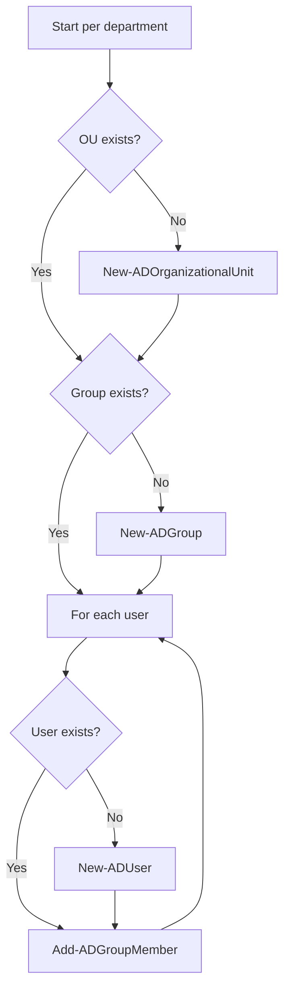

# Managing Domain Users and Groups with PowerShell

A complete guide to automating user and group creation in **Active Directory** using **PowerShell** and the `ActiveDirectory` module.

## Overview

Bulk provisioning of departmental [Organizational Units](Organizational-Units-OU.md), security groups, and user accounts is a routine [AD DS](Active-Directory-Domain-Services.md) administration task. This note automates it for three departments — HR, Sales, and Manager (MGR) — with idempotent scripts that only create objects when they do not already exist. The `ActiveDirectory` module cmdlets wrap the same [LDAP](LDAP.md) directory operations you would otherwise perform by hand in Active Directory Users and Computers (ADUC).

> [!IMPORTANT]
> **Run context**
> These cmdlets require the `ActiveDirectory` PowerShell module and must run as a **Domain Admin** (or a delegated user with rights to create OUs, groups, and users) on a Domain Controller or a management host with RSAT installed.

## Administration

Each department follows the same three-step, idempotent pattern: ensure the OU exists, ensure the security group exists, then loop over the users — creating each one only if it is missing and adding it to the department group. The guard clauses (`if (-not (Get-AD...))`) make the script safe to re-run without producing duplicate-object errors.



### Create HR Users and Group

Create the HR Organizational Unit and Group (if they do not exist):

```powershell
$groupName = "HR"
$ouPath = "OU=HR,DC=armour,DC=local"

# Create OU if not exists
if (-not (Get-ADOrganizationalUnit -Filter "Name -eq 'HR'")) {
    New-ADOrganizationalUnit -Name "HR" -Path "DC=armour,DC=local"
}

# Create Group if not exists
if (-not (Get-ADGroup -Filter {Name -eq $groupName})) {
    New-ADGroup -Name $groupName -SamAccountName $groupName -GroupCategory Security -GroupScope Global -Path $ouPath -Description "HR Department Group"
}
```

Create HR users and add them to the HR group:

```powershell
$hrUsers = @("hr1", "hr2", "hr3")
$password = ConvertTo-SecureString "@rmour123" -AsPlainText -Force

foreach ($user in $hrUsers) {
    if (-not (Get-ADUser -Filter {SamAccountName -eq $user})) {
        New-ADUser -Name $user `
            -SamAccountName $user `
            -UserPrincipalName "$user@armour.local" `
            -Path $ouPath `
            -AccountPassword $password `
            -Enabled $true `
            -PasswordNeverExpires $true `
            -Description "HR Department User"
    }

    Add-ADGroupMember -Identity "HR" -Members $user
    Add-ADGroupMember -Identity "Users" -Members $user
}
```

Verify HR group members:

```powershell
Get-ADGroupMember -Identity "HR"
```

### Create Sales Users and Group

Create the Sales Organizational Unit and Group (if they do not exist):

```powershell
$groupName = "Sales"
$ouPath = "OU=Sales,DC=armour,DC=local"

# Create OU if not exists
if (-not (Get-ADOrganizationalUnit -Filter "Name -eq 'Sales'")) {
    New-ADOrganizationalUnit -Name "Sales" -Path "DC=armour,DC=local"
}

# Create Group if not exists
if (-not (Get-ADGroup -Filter {Name -eq $groupName})) {
    New-ADGroup -Name $groupName -SamAccountName $groupName -GroupCategory Security -GroupScope Global -Path $ouPath -Description "Sales Department Group"
}
```

Create Sales users and add them to the Sales group:

```powershell
$salesUsers = @("sales1", "sales2", "sales3")
$password = ConvertTo-SecureString "@rmour123" -AsPlainText -Force

foreach ($user in $salesUsers) {
    if (-not (Get-ADUser -Filter {SamAccountName -eq $user})) {
        New-ADUser -Name $user `
            -SamAccountName $user `
            -UserPrincipalName "$user@armour.local" `
            -Path $ouPath `
            -AccountPassword $password `
            -Enabled $true `
            -PasswordNeverExpires $true `
            -Description "Sales Department User"
    }

    Add-ADGroupMember -Identity "Sales" -Members $user
    Add-ADGroupMember -Identity "Users" -Members $user
}
```

Verify Sales group members:

```powershell
Get-ADGroupMember -Identity "Sales"
```

### Create Manager (MGR) Users and Group

Create the MGR Organizational Unit and Group (if they do not exist):

```powershell
$groupName = "MGR"
$ouPath = "OU=Manager,DC=armour,DC=local"

# Create OU if not exists
if (-not (Get-ADOrganizationalUnit -Filter "Name -eq 'Manager'")) {
    New-ADOrganizationalUnit -Name "Manager" -Path "DC=armour,DC=local"
}

# Create Group if not exists
if (-not (Get-ADGroup -Filter {Name -eq $groupName})) {
    New-ADGroup -Name $groupName -SamAccountName $groupName -GroupCategory Security -GroupScope Global -Path $ouPath -Description "Manager Department Group"
}
```

Create Manager users and add them to the MGR group:

```powershell
$mgrUsers = @("mgr1", "mgr2", "mgr3")
$password = ConvertTo-SecureString "@rmour123" -AsPlainText -Force

foreach ($user in $mgrUsers) {
    if (-not (Get-ADUser -Filter {SamAccountName -eq $user})) {
        New-ADUser -Name $user `
            -SamAccountName $user `
            -UserPrincipalName "$user@armour.local" `
            -Path $ouPath `
            -AccountPassword $password `
            -Enabled $true `
            -PasswordNeverExpires $true `
            -Description "Manager Department User"
    }

    Add-ADGroupMember -Identity "MGR" -Members $user
    Add-ADGroupMember -Identity "Users" -Members $user
}
```

Verify Manager (MGR) group members:

```powershell
Get-ADGroupMember -Identity "MGR"
```

## GUI Steps

### How to Run the Script

1. Log in as **Domain Admin** (or a user with AD permissions).
2. Install/import the Active Directory module:

```powershell
Import-Module ActiveDirectory
```

3. Copy and execute the script in **PowerShell**.

> [!NOTE]
> **Screenshot**
> 

## Security Considerations

> [!WARNING]
> **Hardcoded plaintext password**
> The scripts set every account to the same password with `-PasswordNeverExpires $true`. This is convenient for lab provisioning but insecure for production. In real deployments, prompt for a unique password (`Read-Host -AsSecureString`), require password change at first logon (`-ChangePasswordAtLogon $true`), and never commit plaintext credentials to source control.

> [!TIP]
> **Least privilege**
> Delegate group and user management to a scoped account per OU rather than using Domain Admin for routine provisioning. See [Organizational-Units-OU](Organizational-Units-OU.md) for delegation of control.

## Best Practices

- Keep scripts **idempotent** — guard every creation with a `Get-AD*` existence check so re-runs are safe.
- Prompt for or generate a **unique password per account** with `Read-Host -AsSecureString`; never hardcode credentials or set `-PasswordNeverExpires $true` in production.
- Force `-ChangePasswordAtLogon $true` on newly provisioned accounts so the initial password cannot persist.
- Place users in the correct **OU** at creation via `-Path` to inherit the intended Group Policy and delegation scope.
- Run provisioning under a **delegated, least-privilege account** scoped to the target OUs rather than Domain Admin.
- Log or export results (`Get-ADGroupMember`, `... | Export-Csv`) to verify the run and keep an audit trail.

## Troubleshooting

| Symptom | Likely cause & fix |
|---------|--------------------|
| `The term 'New-ADUser' is not recognized` | `ActiveDirectory` module not loaded — run `Import-Module ActiveDirectory`; install RSAT-AD-PowerShell if the module is absent. |
| `Directory object not found` on `-Path` | The target OU/DN does not exist yet or the DN is mistyped — create the OU first and verify `DC=armour,DC=local` matches the domain. |
| `Access is denied` creating objects | Account lacks rights on the OU — run as Domain Admin or a user delegated create permissions on that container. |
| `The password does not meet the length, complexity...` | Password fails the domain policy — supply a compliant `-AccountPassword`. |
| `New-ADUser : The specified account already exists` | Existence guard was skipped or `-Filter` did not match — confirm the `Get-ADUser -Filter` clause before `New-ADUser`. |
| Group membership not applied | `Add-ADGroupMember` targeted a group that does not exist — ensure the `New-ADGroup` step ran first. |

## References

- Microsoft Learn — `New-ADUser`: https://learn.microsoft.com/powershell/module/activedirectory/new-aduser
- Microsoft Learn — `New-ADGroup`: https://learn.microsoft.com/powershell/module/activedirectory/new-adgroup
- Microsoft Learn — `New-ADOrganizationalUnit`: https://learn.microsoft.com/powershell/module/activedirectory/new-adorganizationalunit

## Related

- [Enterprise Windows Infrastructure Security](../Readme.md) — course hub and map of content
- [Active-Directory-Domain-Services](Active-Directory-Domain-Services.md) — related note (directory holding the users/groups)
- [Organizational-Units-OU](Organizational-Units-OU.md) — related note (containers created by these scripts)
- [Forest-Tree-and-Domain](Forest-Tree-and-Domain.md) — related note (domain that hosts these objects)
- [LDAP](LDAP.md) — related note (protocol behind these queries)
