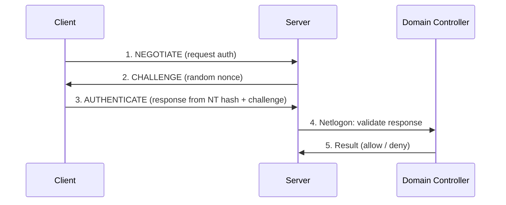

# NTLM

NTLM (NT LAN Manager) is a legacy Microsoft challenge/response authentication protocol suite, retained in Active Directory for backward compatibility. It is used when Kerberos is not available — for example, authenticating by IP address, to a workgroup host, or across certain trust configurations. NTLM is weaker than Kerberos and is a frequent target in Windows attacks.

## Overview

NTLM does not use tickets or a trusted third party the way [Kerberos](Kerberos-Authentication.md) does. Instead, the server (or a Domain Controller acting as the netlogon verifier) challenges the client, and the client proves knowledge of the password hash without sending the password itself.

## Concepts

- **NT hash** — the unsalted MD4 hash of the user's password; NTLM authentication is built on this value, which is what makes **pass-the-hash** possible.
- **Challenge/response** — the server sends a random challenge (nonce); the client returns a response computed from the NT hash and the challenge.
- **NTLMv1 vs. NTLMv2**:

| Feature | NTLMv1 | NTLMv2 |
|---------|--------|--------|
| Response basis | DES-based, weak | HMAC-MD5, stronger |
| Challenge | Server only | Client + server (with timestamp) |
| Replay resistance | Poor | Better (includes timestamp/target) |
| Recommendation | Disable | Only if NTLM is unavoidable |

- **No salting** — the NT hash is not salted, so identical passwords produce identical hashes; this enables precomputation and pass-the-hash.

## Architecture



## Security Considerations

> [!WARNING]
> **Why NTLM is dangerous**
> - **Pass-the-Hash (PtH)** — because authentication depends only on the NT hash, an attacker who steals the hash can authenticate without ever cracking the password.
> - **NTLM Relay** — an attacker relays a victim's NTLM authentication to another service (SMB, LDAP, HTTP) to act as the victim; effective when **SMB signing / LDAP signing / channel binding** are not enforced.
> - **Offline cracking** — captured NTLMv1/NTLMv2 responses (for example, via Responder) can be cracked to recover passwords.
> - **No mutual authentication** by default, unlike Kerberos.

- Enforce **SMB signing** and **LDAP signing + channel binding** to break relay attacks.
- Enable **Extended Protection for Authentication (EPA)** on web/LDAP services.
- Restrict or audit NTLM usage via Group Policy (**Network security: Restrict NTLM** settings).

## Configuration

Restrict and audit NTLM through Group Policy under:

```text
Computer Configuration > Windows Settings > Security Settings >
Local Policies > Security Options > Network security: Restrict NTLM: ...
```

Available controls include auditing incoming/outgoing NTLM traffic before enforcing a deny, and setting the LAN Manager authentication level to refuse LM and NTLMv1 (send NTLMv2 response only, refuse LM & NTLM).

> [!TIP]
> **Audit before you block**
> Turn on NTLM auditing first to discover which applications still depend on NTLM, then move to enforcement. Blocking NTLM cold can break legacy applications and IP-based access.

## Best Practices

- Prefer **Kerberos**; disable NTLM where the environment allows.
- Disable **NTLMv1 and LM** entirely; require **NTLMv2** only.
- Add sensitive accounts to the **Protected Users** group (which blocks NTLM for them).
- Enforce signing and channel binding across SMB and LDAP.

## Troubleshooting

- Event ID **4776** (NTLM credential validation) on Domain Controllers traces NTLM authentications.
- NTLM operational logs (`Microsoft-Windows-NTLM/Operational`) surface blocked/audited NTLM when Restrict NTLM auditing is enabled.

## References

- Microsoft Learn — NTLM Overview: https://learn.microsoft.com/windows-server/security/windows-authentication/ntlm-overview
- Microsoft Learn — Restrict NTLM: https://learn.microsoft.com/windows/security/threat-protection/security-policy-settings/network-security-restrict-ntlm-in-this-domain

## Related

- [Enterprise Windows Infrastructure Security](../Readme.md) — course hub and map of content
- [Kerberos-Authentication](Kerberos-Authentication.md) — related note (the preferred protocol NTLM falls back from)
- [SAM-vs-NTDS.dit](SAM-vs-NTDS.dit.md) — related note (where NT hashes are stored)
- [Active-Directory-Domain-Services](Active-Directory-Domain-Services.md) — related note (AD DS authentication component)
