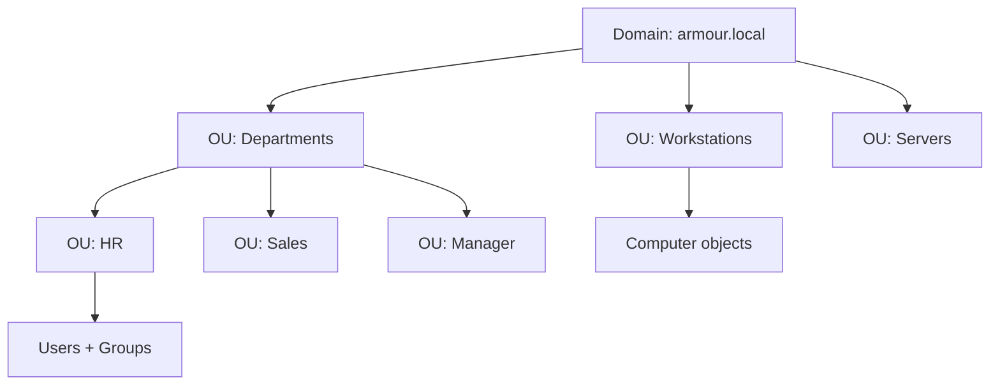

# Organizational Units (OU)

An Organizational Unit (OU) is a logical container inside an Active Directory domain used to organize users, groups, and computers, to delegate administrative control, and to scope Group Policy. OUs are the primary tool for structuring a domain without creating additional domains.

## Overview

OUs let administrators mirror an organization's structure (departments, sites, roles) and apply management — delegation and Group Policy — precisely where it is needed. Unlike security groups, OUs are not security principals: you cannot assign resource permissions to an OU.

## Concepts

- **Container vs. OU** — the default `CN=Users` and `CN=Computers` are *containers*, not OUs; you cannot link a GPO to a container. Create OUs to gain GPO and delegation capability.
- **Nesting** — OUs can be nested to build a hierarchy (for example, `OU=Workstations,OU=IT,OU=Departments`).
- **Delegation of Control** — grant a user or group specific rights (reset passwords, create users, manage group membership) over an OU subtree without making them Domain Admins.
- **GPO linking** — Group Policy Objects are linked at the site, domain, or OU level; OU linkage gives the most granular targeting.

> [!TIP]
> **Design for management, not aesthetics**
> Structure OUs around how you *manage* objects (who administers them and what policy they receive), not around the org chart. A common pattern separates by object type first (Users, Computers, Groups, Service Accounts) then by department or role.

## Architecture



## PowerShell

Create, query, move, and protect OUs:

```powershell
# untested
# Create an OU at the domain root
New-ADOrganizationalUnit -Name "Departments" -Path "DC=armour,DC=local"

# Create a nested OU
New-ADOrganizationalUnit -Name "HR" -Path "OU=Departments,DC=armour,DC=local"

# List all OUs
Get-ADOrganizationalUnit -Filter * | Select-Object Name, DistinguishedName

# Move a user into an OU
Get-ADUser -Identity "hr1" | Move-ADObject -TargetPath "OU=HR,OU=Departments,DC=armour,DC=local"

# Protect an OU from accidental deletion
Set-ADOrganizationalUnit -Identity "OU=HR,OU=Departments,DC=armour,DC=local" -ProtectedFromAccidentalDeletion $true
```

## GUI Steps

1. Open **Active Directory Users and Computers** (`dsa.msc`).
2. Right-click the domain or a parent OU, choose **New → Organizational Unit**.
3. Name the OU and keep **Protect container from accidental deletion** checked.
4. To delegate rights, right-click the OU and choose **Delegate Control...**, then run the wizard.

> [!NOTE]
> **Screenshot**
> 

## Security Considerations

- **Delegation creep** — audit delegated ACLs on OUs regularly; over-broad delegation (for example, `GenericAll` on an OU) is a common privilege-escalation path abused by attackers.
- OUs are enumerated by attackers to map the domain; the structure itself is not secret, but delegated permissions on it are high value.
- Keep **accidental-deletion protection** enabled — deleting an OU tombstones every child object.

## Best Practices

- Separate object types into dedicated OUs to target GPOs cleanly.
- Delegate the least privilege needed, to groups rather than individuals.
- Document OU purpose and linked GPOs to avoid policy conflicts.
- Avoid deep nesting (more than 3–5 levels) to keep GPO processing and troubleshooting manageable.

## References

- Microsoft Learn — Organizational Units: https://learn.microsoft.com/windows-server/identity/ad-ds/plan/reviewing-ou-design-concepts
- Microsoft Learn — Delegating Administration: https://learn.microsoft.com/windows-server/identity/ad-ds/plan/delegating-administration-of-account-ous-and-resource-ous

## Related

- [Enterprise Windows Infrastructure Security](../Readme.md) — course hub and map of content
- [Active-Directory-Domain-Services](Active-Directory-Domain-Services.md) — related note (AD DS overview)
- [Forest-Tree-and-Domain](Forest-Tree-and-Domain.md) — related note (the domain that contains OUs)
- [Managing-Domain-Users-and-Groups-with-PowerShell](Managing-Domain-Users-and-Groups-with-PowerShell.md) — related note (creating OUs and objects at scale)
