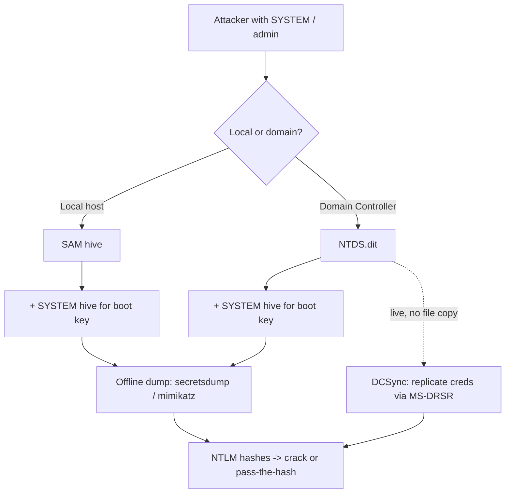

# SAM vs NTDS.dit

The SAM and NTDS.dit are the two credential stores in the Windows world: the **SAM** holds *local* account hashes on every Windows host, while **NTDS.dit** holds *domain* account hashes on Domain Controllers. Knowing which is which is fundamental to both administration and credential-access tradecraft.

## Overview

Both files store password material as hashes and both require SYSTEM-level access to read, but they differ in scope, location, and value. The **SAM** is a single-machine store used to authenticate local accounts; the **[NTDS.dit](Active-Directory-Domain-Services.md)** is the entire Active Directory database, replicated across every Domain Controller. Neither store keeps hashes in the clear — both are encrypted with the machine's **boot key**, which lives in the `SYSTEM` registry hive — so a credential-access operation must always pair the store with its `SYSTEM` hive (or use a live technique such as [DCSync](AD-Replication.md)).

## Components

### SAM (Security Account Manager)

**Location:** `C:\Windows\System32\config\SAM`

**Used in:** local user accounts (non-domain systems such as standalone PCs or workgroup members).

Details:

- Stores **local user account** information.
- Includes **hashed passwords**, stored in combination with the `SYSTEM` hive for decryption.
- Accessible only with **admin** or **SYSTEM-level** privileges.
- Locked by the OS while Windows is running (registry hive open by the kernel).
- Often targeted using tools like `mimikatz`, `secretsdump.py`, and `pwdump`.

> [!NOTE]
> **Example scenario**
> Dumping local admin hashes from a Windows 10 machine for offline cracking, or for a **pass-the-hash** move to another host that shares the same local administrator password. See [NTLM](NTLM.md) for why the NT hash alone is enough to authenticate.

### NTDS.dit (NT Directory Services)

**Location:** `C:\Windows\NTDS\NTDS.dit` (on Domain Controllers only).

**Used in:** Active Directory domain environments.

Details:

- Central database for **[Active Directory](Active-Directory-Domain-Services.md)** (an ESE / Extensible Storage Engine database).
- Stores **all domain user credentials**, group memberships, password history, and more.
- Passwords are stored as NTLM hashes (and sometimes LM, plus Kerberos AES keys, depending on settings).
- Highly sensitive; access requires **Domain Admin or SYSTEM** privileges.
- Often dumped using `ntdsutil`, `secretsdump.py`, `vssadmin` + file copy, or `Mimikatz` (via [DCSync](AD-Replication.md)).

> [!WARNING]
> **Example scenario**
> An attacker dumps the NTDS.dit from a compromised Domain Controller to obtain every domain user's hash — a full domain credential compromise. Because the directory is [replicated](AD-Replication.md), the same data can be pulled from *any* writable DC.

## Comparison

| Feature | SAM | NTDS.dit |
|---------|-----|----------|
| Location | `System32\config\SAM` | `Windows\NTDS\NTDS.dit` |
| Applies to | Local accounts only | Domain accounts (AD) |
| Hash storage | NTLM, sometimes LM | NTLM, Kerberos keys, more |
| Access needed | SYSTEM privileges | SYSTEM / Domain Admin privileges |
| Used by | Standalone/workgroup systems | Domain Controllers |
| Decryption key | Boot key in `SYSTEM` hive | Boot key in `SYSTEM` hive |
| Tools to extract | Mimikatz, secretsdump.py, pwdump | Mimikatz (DCSync), ntdsutil, secretsdump |
| Target value | Local hashes (one host) | Entire AD database (whole domain) |

## How Extraction Works

Both stores are locked while Windows runs, so extraction either takes an **offline copy** of the file plus the `SYSTEM` hive, or uses a **live** technique that asks Windows (or the directory) for the data directly.



### SAM — offline dump

Save the two hives from a live host, then parse them offline with Impacket:

```cmd
reg save HKLM\SAM  C:\temp\sam.save
reg save HKLM\SYSTEM C:\temp\system.save
```

```bash
secretsdump.py -sam sam.save -system system.save LOCAL
```

### NTDS.dit — offline dump

Because the database is locked, copy it via a Volume Shadow Copy (or `ntdsutil` snapshot), then parse it with the `SYSTEM` hive:

```cmd
vssadmin create shadow /for=C:
ntdsutil "activate instance ntds" "ifm" "create full C:\temp\ifm" quit quit
```

```bash
secretsdump.py -ntds ntds.dit -system system.save LOCAL   # untested
```

### NTDS — live via DCSync

`DCSync` abuses the directory-replication (MS-DRSR) protocol to pull hashes from a DC without touching the file, using an account that holds replication rights:

```bash
secretsdump.py -just-dc armour.local/Administrator:'Password'@dc01.armour.local   # untested
```

## Security Considerations

> [!WARNING]
> **One store owns a host, the other owns the forest**
> A SAM compromise yields local hashes on a single machine. An `NTDS.dit` compromise yields **every** domain credential — including `krbtgt`, which enables Golden Ticket forgery and effectively permanent domain persistence. Treat any DC file access, shadow-copy creation, or non-DC replication request as a top-severity event.

> [!IMPORTANT]
> **Boot key dependency**
> Both stores encrypt their hashes with the boot key held in the `SYSTEM` registry hive. Extracting usable hashes requires both the credential store *and* the SYSTEM hive together — which is why offline dumping tools always ask for both.

> [!TIP]
> **Blue-team focus**
> Protecting the SAM protects a single host; protecting NTDS.dit protects the whole domain. Restrict Domain Controller logon rights, monitor for shadow-copy and `ntdsutil` activity, and alert on directory replication requests from non-DC accounts (DCSync).

## Best Practices

- Restrict local administrator rights and use **LAPS** so a stolen SAM hash cannot pass-the-hash across many hosts.
- Limit **Domain Controller logon** and file-system access to Tier-0 administrators only; store DC and `NTDS.dit` backups with the same protection as a live DC.
- Audit and minimize accounts that hold **replication rights** (`DS-Replication-Get-Changes` / `-All`) to shrink the DCSync attack surface.
- Add high-value accounts to the **Protected Users** group and enforce **NTLMv2**-only to reduce the value of stolen hashes.
- Enable **Credential Guard** where supported to keep secrets out of easily-dumped memory, and monitor for `vssadmin`, `ntdsutil`, and shadow-copy activity on DCs.

## Troubleshooting

| Symptom | Likely cause & fix |
|---------|--------------------|
| `secretsdump ... LOCAL` errors on the SAM | Wrong or missing `SYSTEM` hive — the boot key must come from the *same* machine as the SAM. |
| Cannot copy `NTDS.dit` ("file in use") | The DB is locked while AD runs — use a Volume Shadow Copy or `ntdsutil ... ifm`, never a direct copy. |
| DCSync fails with access denied | The account lacks `Get-Changes`/`Get-Changes-All` replication rights — DCSync needs replication permissions, not just Domain Admin membership. |
| Only LM/blank hashes returned | LM storage disabled (expected on modern Windows); rely on the NT hash column. |

## References

- Microsoft Learn — Active Directory Domain Services Overview: https://learn.microsoft.com/windows-server/identity/ad-ds/get-started/virtual-dc/active-directory-domain-services-overview
- Microsoft Learn — Active Directory Replication Concepts (the mechanism DCSync abuses): https://learn.microsoft.com/windows-server/identity/ad-ds/get-started/replication/active-directory-replication-concepts
- Microsoft Learn — Local Administrator Password Solution (LAPS): https://learn.microsoft.com/windows-server/identity/laps/laps-overview
- MITRE ATT&CK — OS Credential Dumping: NTDS (T1003.003): https://attack.mitre.org/techniques/T1003/003/

## Related

- [Enterprise Windows Infrastructure Security](../Readme.md) — course hub and map of content
- [Active-Directory-Domain-Services](Active-Directory-Domain-Services.md) — related note (NTDS.dit is the AD-DS database)
- [NTLM](NTLM.md) — related note (hash format stored in both files, and pass-the-hash)
- [Kerberos-Authentication](Kerberos-Authentication.md) — related note (AES keys also stored in NTDS.dit; krbtgt and Golden Tickets)
- [AD-Replication](AD-Replication.md) — related note (the mechanism DCSync abuses)
- [FSMO-Roles](FSMO-Roles.md) — related note (DC roles behind replication)
- [Managing-Domain-Users-and-Groups-with-PowerShell](Managing-Domain-Users-and-Groups-with-PowerShell.md) — related note (the accounts whose hashes land in NTDS.dit)
