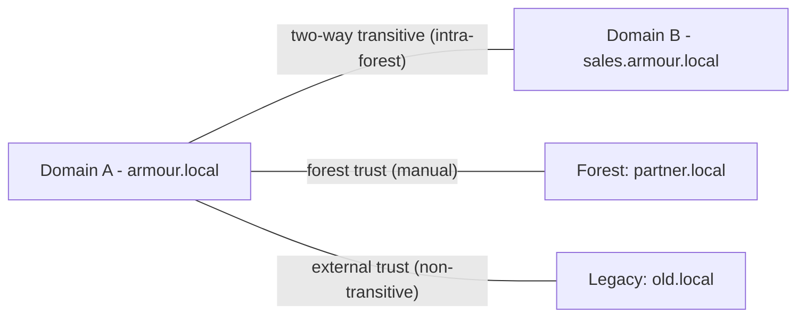

# Trust Relationships

A trust relationship is an authentication link between two Active Directory domains or forests that lets users in one domain access resources in another. Trusts are defined by three properties: **direction** (one-way or two-way), **transitivity** (transitive or non-transitive), and **type** (parent-child, tree-root, external, forest, realm, or shortcut).

## Overview

Within a forest, trusts between domains are created automatically and are two-way transitive. Trusts to *other* forests or non-Windows realms must be created manually and are the point where cross-boundary attacks (SID history abuse, cross-forest Kerberos) become relevant.

## Concepts

### Direction

- **One-way** — domain A trusts domain B, so users in B can access resources in A, but not vice versa. Trust direction is the opposite of the access direction.
- **Two-way** — both domains trust each other.

### Transitivity

- **Transitive** — trust flows through the chain: if A trusts B and B trusts C, then A trusts C.
- **Non-transitive** — limited to the two domains involved.

### Trust Types

| Type | Transitivity | Direction | Use |
|------|--------------|-----------|-----|
| **Parent-Child** | Transitive | Two-way | Automatic between a parent and child domain in a tree |
| **Tree-Root** | Transitive | Two-way | Automatic between tree roots in the same forest |
| **External** | Non-transitive | One- or two-way | To a domain in another forest or an NT4 domain |
| **Forest** | Transitive | One- or two-way | Between two forest root domains |
| **Realm** | Transitive or non-transitive | One- or two-way | To a non-Windows Kerberos (MIT) realm |
| **Shortcut** | Transitive | One- or two-way | Optimizes authentication paths inside a forest |

> [!IMPORTANT]
> **Direction vs. access**
> The trust arrow points the opposite way to resource access. If the "trusting" domain trusts the "trusted" domain, users from the *trusted* domain reach resources in the *trusting* domain. Get this backwards and access-planning fails.

## Architecture



## PowerShell

Enumerate and inspect trusts:

```powershell
# untested
# List all trusts for the current domain
Get-ADTrust -Filter *

# Show detail for a specific trust
Get-ADTrust -Identity "partner.local" | Select-Object Name, Direction, TrustType, SelectiveAuthentication, SIDFilteringForestAware
```

Legacy tooling: `nltest /domain_trusts` and `netdom trust` enumerate and manage trusts from the command line.

## Security Considerations

> [!WARNING]
> **Trusts widen the attack surface**
> A trust to another forest can be abused for cross-forest attacks. Two key mitigations:
> - **SID filtering** — strips foreign SIDs from authentication data so an attacker cannot inject a privileged SID (SID history) from the trusted domain. Enabled by default on forest and external trusts.
> - **Selective authentication** — requires that accounts be explicitly granted the "Allowed to authenticate" right on each resource, instead of trusting the whole domain.

- Kerberos inter-realm TGTs (referral tickets) can be forged if the trust key is compromised — protect trust account passwords.
- Enumerate trusts during reconnaissance to map reachable domains; defenders should minimize unnecessary trusts.

## Best Practices

- Prefer **forest trusts** over multiple external trusts when linking whole forests.
- Keep **SID filtering** enabled; only relax it with a documented, time-bound reason.
- Use **selective authentication** for trusts to less-trusted partners.
- Use **shortcut trusts** to speed authentication in large multi-domain forests.
- Regularly audit existing trusts and remove those no longer needed.

## References

- Microsoft Learn — How Domain and Forest Trusts Work: https://learn.microsoft.com/previous-versions/windows/it-pro/windows-server-2003/cc773178(v=ws.10)
- Microsoft Learn — Security Considerations for Trusts: https://learn.microsoft.com/windows-server/identity/ad-ds/manage/how-to-configure-selective-authentication

## Related

- [Enterprise Windows Infrastructure Security](../Readme.md) — course hub and map of content
- [Forest-Tree-and-Domain](Forest-Tree-and-Domain.md) — related note (structures that trusts connect)
- [Kerberos-Authentication](Kerberos-Authentication.md) — related note (inter-realm authentication over trusts)
- [Active-Directory-Domain-Services](Active-Directory-Domain-Services.md) — related note (AD DS overview)
- [Global-Catalog](Global-Catalog.md) — related note (resolves objects across trusted domains)
