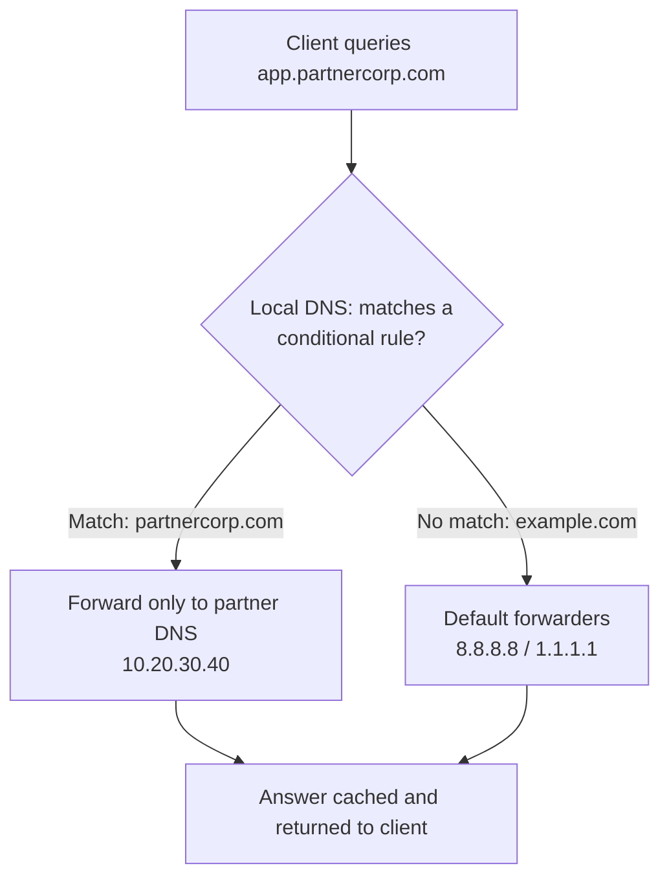

# Conditional Forwarders in DNS

## Overview

A **Conditional Forwarder** is a DNS configuration that forwards queries **only for specific domain names** to designated DNS servers. Unlike standard forwarders (which handle all unresolved queries), conditional forwarders apply **domain-based routing**, giving precise control over where DNS queries are sent.

## Concepts

### Example Scenario

- Your organization manages: `yourcompany.local`
- You collaborate with: `partnercorp.com`
- The partner has internal DNS records that are **not publicly resolvable**

### Configuration Logic

- **Default queries** are forwarded to:
    - Google Public DNS (`8.8.8.8`)
    - Cloudflare (`1.1.1.1`)
- **Specific domain (`partnercorp.com`)** is forwarded to:
    - `10.20.30.40` (partner's internal DNS)

### Conditional vs Standard Forwarders

| Feature | Standard Forwarder | Conditional Forwarder |
| --- | --- | --- |
| Scope | All unresolved queries | Specific domains only |
| Control | General | Fine-grained |
| Use Case | General internet resolution | Partner/internal domains |
| Flexibility | Low | High |

## Architecture



### Matching Query Flow — Accessing `app.partnercorp.com`

1. **Client Request** — user queries `app.partnercorp.com`.
2. **Local DNS Server** — checks whether the domain matches a conditional rule. Match found for `partnercorp.com`.
3. **Conditional Forwarding** — query is sent **only** to the partner DNS server:

```text
10.20.30.40
```

4. **Response Handling** — the partner DNS resolves the request, the local DNS caches the result, and the response is returned to the client.

### Non-Matching Query

- Query: `example.com`
- No conditional rule match, so the **default forwarders** are used.

## Configuration

### BIND — Conditional Forwarder

```conf
zone "partnercorp.com" IN {
    type forward;
    forward only;
    forwarders { 10.20.30.40; };
};
```

### BIND — Default Forwarders

```conf
options {
    forwarders { 8.8.8.8; 1.1.1.1; };
    forward only;
};
```

### Windows DNS (GUI)

Using **Microsoft Windows DNS Server**:

1. Open **DNS Manager**.
2. Right-click the server and choose **Properties**.
3. Navigate to **Conditional Forwarders**.
4. Click **New**.
5. Enter:
    - Domain: `partnercorp.com`
    - DNS Server IP: `10.20.30.40`
6. Apply the changes.

> [!NOTE]
> **Screenshot**
> 

## Examples

Common use cases for conditional forwarders:

- **Cross-organization DNS resolution** — e.g., partner networks reachable over VPN.
- **Hybrid cloud environments** — route queries to cloud-specific DNS.
- **Private/internal domains** — resolve non-public infrastructure.
- **Security segmentation** — restrict sensitive queries to trusted DNS servers.

## Best Practices

- Route specific domains to specific DNS servers for **granular control**.
- Avoid unnecessary recursive lookups to **improve performance**.
- Keep sensitive queries on **trusted DNS servers** for enhanced security.
- Reduce load on public resolvers by using **efficient traffic routing**.

## Security Considerations

- Point conditional forwarders only at DNS servers you trust; a compromised forwarder can return poisoned answers for the delegated domain.
- Combine with VPN/IPsec when the partner DNS is reachable across untrusted links.
- Log and monitor conditional-forwarder queries to detect exfiltration over DNS.

## Troubleshooting

| Symptom | Likely cause | Resolution |
| --- | --- | --- |
| Partner domain fails to resolve | Wrong forwarder IP or partner DNS unreachable | Verify the forwarder IP and network/VPN path |
| Public domains break | Conditional rule too broad | Scope the rule to the exact partner domain only |
| Stale partner records | Local cache holding old answers | Clear the DNS server cache |

## References

- <https://learn.microsoft.com/en-us/windows-server/networking/dns/dns-conditional-forwarders>
- <https://bind9.readthedocs.io/en/latest/reference.html>

## Related

- [Forwarders-Nameserver](Forwarders-Nameserver.md) — forwarders this conditional variant refines
- [DNS-Server-Types](DNS-Server-Types.md) — where conditional forwarders fit among DNS roles
- [Recursive-(Caching)-DNS-Server](Recursive-(Caching)-DNS-Server.md) — resolver that may forward queries
- [Enterprise Windows Infrastructure Security](../Readme.md) — course hub and map of content
