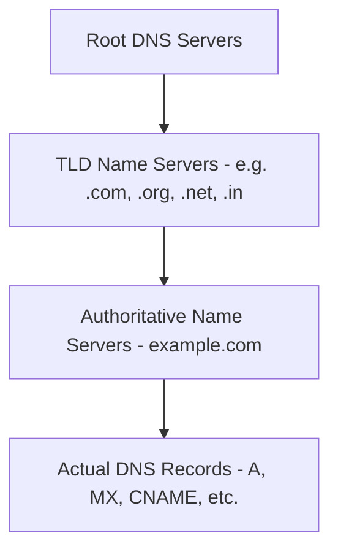
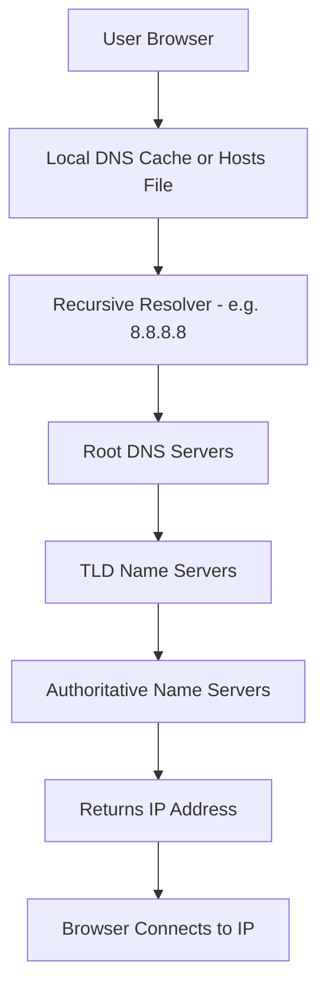

# DNS Hierarchy and How It Works

The **Domain Name System (DNS)** follows a hierarchical structure that translates human-readable domain names into IP addresses. This process involves multiple layers of DNS servers working together to resolve domain queries.

## Overview

DNS is a distributed, hierarchical database. Resolution flows top-down from the root, to the Top-Level Domain (TLD) servers, to the authoritative servers that hold a domain's actual records. The namespace being resolved is described in [Domain-Name-Structure](Domain-Name-Structure.md), the record types returned are covered in [DNS-Records-and-Their-Types](DNS-Records-and-Their-Types.md), and the server roles that participate — resolvers, primaries, and secondaries — are covered in [DNS-Server-Types](DNS-Server-Types.md). A [Recursive-(Caching)-DNS-Server](Recursive-(Caching)-DNS-Server.md) walks this hierarchy on the client's behalf and caches the answers.



> [!TIP]
> **Analogy — the phonebook**
> Think of DNS like a phonebook:
> - **Root Servers** → Tell you which section to look in (e.g., `.com`, `.org`)
> - **TLD Servers** → Point you to the right page (e.g., `example.com`)
> - **Authoritative Servers** → Give you the actual phone number (IP address)

## Concepts

### Root DNS Servers

Root DNS Servers are the **highest level** in the DNS hierarchy. They handle queries for **Top-Level Domain (TLD)** name servers.

**Key points:**

- There are **13 sets** of Root DNS Servers (`A` to `M`) operated by organizations worldwide.
- Their main role is to **direct queries to the appropriate TLD Name Servers**.
- They **do not store actual domain-to-IP mappings**, only **TLD server locations**.

| Server             | IPv4           | IPv6                | Operator                             |
| ------------------ | -------------- | ------------------- | ------------------------------------ |
| a.root-servers.net | 198.41.0.4     | 2001:503:ba3e::2:30 | Verisign, Inc.                       |
| b.root-servers.net | 170.247.170.2  | 2801:1b8:10::b      | USC - Information Sciences Institute |
| c.root-servers.net | 192.33.4.12    | 2001:500:2::c       | Cogent Communications                |
| d.root-servers.net | 199.7.91.13    | 2001:500:2d::d      | University of Maryland               |
| e.root-servers.net | 192.203.230.10 | 2001:500:a8::e      | NASA (Ames Research Center)          |
| f.root-servers.net | 192.5.5.241    | 2001:500:2f::f      | Internet Systems Consortium          |
| g.root-servers.net | 192.112.36.4   | 2001:500:12::d0d    | US Department of Defense (NIC)       |
| h.root-servers.net | 198.97.190.53  | 2001:500:1::53      | US Army Research Lab                 |
| i.root-servers.net | 192.36.148.17  | 2001:7fe::53        | Netnod                               |
| j.root-servers.net | 192.58.128.30  | 2001:503:c27::2:30  | Verisign, Inc.                       |
| k.root-servers.net | 193.0.14.129   | 2001:7fd::1         | RIPE NCC                             |
| l.root-servers.net | 199.7.83.42    | 2001:500:9f::42     | ICANN                                |
| m.root-servers.net | 202.12.27.33   | 2001:dc3::35        | WIDE Project                         |

**Store:** Names and IPs of **TLD Name Servers** (e.g., `.com`, `.org`, `.net`, `.in`, `.uk`).
**Do NOT store:** Domain-specific records (`A`, `AAAA`, `MX`, etc.).

Example:

- `.com` → `a.gtld-servers.net`, `b.gtld-servers.net`, etc.
- `.org` → `a0.org.afilias-nst.info`, etc.

### TLD (Top-Level Domain) Name Servers

TLD Name Servers manage domain extensions such as `.com`, `.org`, `.net`, `.edu`, and country-specific TLDs like `.in`, `.uk`, etc.

**Key points:**

- Each TLD has **its own set of servers**.
- They direct queries to the **Authoritative Name Servers** for specific domains.
- They store **delegation information**, not actual IPs.

| Host Name          | IPv4          | IPv6                |
| ------------------ | ------------- | ------------------- |
| a.gtld-servers.net | 192.5.6.30    | 2001:503:a83e::2:30 |
| b.gtld-servers.net | 192.33.14.30  | 2001:503:231d::2:30 |
| c.gtld-servers.net | 192.26.92.30  | 2001:503:83eb::30   |
| d.gtld-servers.net | 192.31.80.30  | 2001:500:856e::30   |
| e.gtld-servers.net | 192.12.94.30  | 2001:502:1ca1::30   |
| f.gtld-servers.net | 192.35.51.30  | 2001:503:d414::30   |
| g.gtld-servers.net | 192.42.93.30  | 2001:503:eea3::30   |
| h.gtld-servers.net | 192.54.112.30 | 2001:502:8cc::30    |
| i.gtld-servers.net | 192.43.172.30 | 2001:503:39c1::30   |
| j.gtld-servers.net | 192.48.79.30  | 2001:502:7094::30   |
| k.gtld-servers.net | 192.52.178.30 | 2001:503:d2d::30    |
| l.gtld-servers.net | 192.41.162.30 | 2001:500:d937::30   |
| m.gtld-servers.net | 192.55.83.30  | 2001:501:b1f9::30   |

**Store:** Delegation info mapping domain → its authoritative name servers, e.g. `example.com` → `ns1.example.com`, `ns2.example.com`.
**Do NOT store:** IP address records (`A`, `AAAA`, etc.).

### Authoritative Name Servers

Authoritative Name Servers hold the **actual DNS records** for a domain. They respond with final answers for the domain (not referrals) and contain various DNS records:

| Record Type | Description             | Example                                  |
| ----------- | ----------------------- | ---------------------------------------- |
| **A**       | IPv4 address            | `example.com → 93.184.216.34`            |
| **AAAA**    | IPv6 address            | `example.com → 2606:2800:220:1:248:1893` |
| **MX**      | Mail server             | `example.com → mail.example.com`         |
| **CNAME**   | Alias                   | `www.example.com → example.com`          |
| **NS**      | Authoritative servers   | `example.com → ns1.example.com`          |
| **TXT**     | Text records (SPF/DKIM) | `"v=spf1 include:_spf.example.com -all"` |
| **SRV**     | Service record          | `_sip._tcp.example.com`                  |
| **SOA**     | Start of Authority      | Administrative zone details              |

**Example zone file (`example.com`):**

```text
example.com. 3600 IN A 93.184.216.34
example.com. 3600 IN MX 10 mail.example.com.
example.com. 3600 IN NS ns1.example.com.
example.com. 3600 IN NS ns2.example.com.
example.com. 3600 IN TXT "v=spf1 include:_spf.example.com -all"
example.com. 3600 IN SOA ns1.example.com. admin.example.com. 2025060201 7200 3600 1209600 3600
```

### TTL (Time To Live)

Each DNS record includes a **TTL value** (in seconds). It defines how long a resolver or browser can cache the record before querying again.

- `3600` seconds = 1 hour
- Shorter TTL = faster updates
- Longer TTL = less DNS traffic

## Architecture

### DNS Resolution Process

When you enter `www.example.com` in your browser, the following steps occur:

1. **Local Cache Check** – Browser/OS checks local DNS cache or `/etc/hosts` file.
2. **Recursive Resolver** – If not cached, query a resolver (e.g., Google 8.8.8.8).
3. **Root Server** – Provides address of relevant TLD server.
4. **TLD Server** – Provides address of the domain's authoritative name server.
5. **Authoritative Server** – Returns the actual IP address (`A`/`AAAA` record).
6. **Browser Connects** – Uses the IP to connect to the website.



### Recursive Resolver Examples

| Provider      | Primary DNS    | Secondary DNS   |
| ------------- | -------------- | --------------- |
| Google        | 8.8.8.8        | 8.8.4.4         |
| Cloudflare    | 1.1.1.1        | 1.0.0.1         |
| Quad9         | 9.9.9.9        | 149.112.112.112 |
| OpenDNS       | 208.67.222.222 | 208.67.220.220  |
| AdGuard DNS   | 94.140.14.14   | 94.140.15.15    |
| Control D     | 76.76.2.0      | 76.76.10.0      |
| CleanBrowsing | 185.228.168.9  | 185.228.169.9   |
| Alternate DNS | 76.76.19.19    | 76.223.122.150  |

## Examples

### Check DNS Resolution Using dig

```bash
# Step-by-step DNS tracing
dig +trace www.example.com

# Query specific root server
dig @a.root-servers.net com. NS

# Query TLD server
dig @a.gtld-servers.net example.com. NS

# Query authoritative server for A record
dig @ns1.example.com www.example.com A
```

> [!NOTE]
> **Screenshot**
> 

### Summary of the Hierarchy

| DNS Level                | Stores                | Does NOT Store    | Example Query                       |
| ------------------------ | --------------------- | ----------------- | ----------------------------------- |
| **Root DNS Server**      | TLD name server list  | Domain IPs        | `.com` → `.gtld-servers.net`        |
| **TLD Name Server**      | Authoritative NS info | A/AAAA/MX records | `example.com` → `ns1.example.com`   |
| **Authoritative Server** | Actual domain records | Delegations       | `www.example.com` → `93.184.216.34` |

> [!NOTE]
> **In short**
> **Root → TLD → Authoritative → IP Address → Website**

## Security Considerations

Because DNS is public, distributed, and rarely blocked at the perimeter, each layer of the hierarchy is both a reconnaissance goldmine and an attack surface.

- **Footprinting the hierarchy** — walking from the authoritative servers down through `NS`, `MX`, `TXT`, and `A`/`AAAA` records maps an organization's infrastructure before any packet touches the target. See DNS-Enumeration.
- **Zone transfer (AXFR)** — an authoritative server that allows unrestricted zone transfers will hand an attacker the entire zone in one request, exposing every host name and record. See DNS-Zone-Transfer-(AXFR).
- **Cache poisoning / spoofing** — forged responses injected into a [recursive resolver](Recursive-(Caching)-DNS-Server.md)'s cache redirect victims to attacker-controlled IPs. [DNSSEC](DNSSEC.md) cryptographically signs records to defend against this.
- **DNS tunneling** — data encoded inside DNS queries/responses can bypass egress filtering for exfiltration or command-and-control, because DNS (port 53) is almost always permitted outbound.

```bash
# Attempt a zone transfer against an authoritative server (recon)
dig axfr @ns1.example.com example.com

# Enumerate an organisation's records from the hierarchy
dig example.com ANY +noall +answer   # untested
```

> [!WARNING]
> **DNS is the map to the network**
> Misconfigured DNS leaks the shape of an entire environment. Restricting zone transfers to authorised secondaries, signing zones with DNSSEC, and monitoring for high-entropy or abnormally long query labels (a hallmark of tunneling) close the most common DNS-layer footholds.

## Best Practices

- Restrict **zone transfers (AXFR)** to explicitly authorised secondary name servers only.
- Deploy **[DNSSEC](DNSSEC.md)** on authoritative zones to protect resolution integrity against spoofing and cache poisoning.
- Use trusted recursive resolvers and consider **DoT/DoH** (DNS over TLS/HTTPS) to protect query privacy in transit.
- Separate internal from external namespaces with **[Split-DNS](Split-DNS.md)** so internal host names are never exposed to public resolution.
- Set TTLs deliberately — lower them ahead of planned record changes, and monitor DNS query logs for anomalous patterns.

## Troubleshooting

| Symptom | Likely cause & fix |
| ------- | ------------------ |
| `NXDOMAIN` for a domain you know exists | Missing record, typo, or unpropagated change — verify with `dig <name>` and wait out the TTL. |
| Old IP returned after a record change | A stale cached record — flush the resolver/OS cache and lower the TTL *before* future changes. |
| Query times out / very slow | Unreachable or overloaded resolver — test directly with `dig @<resolver> <name>`. |
| `Transfer failed` on `dig axfr` | Zone transfers restricted (the secure default) — use an authorised secondary. |
| Internal name resolves to the wrong (public) IP | Split-DNS view mismatch — confirm the client is querying the internal view. |

## References

- [RFC 1034 — Domain Names: Concepts and Facilities](https://datatracker.ietf.org/doc/html/rfc1034)
- [Verisign: How DNS Works](https://www.verisign.com/en_US/website-presence/online/how-dns-works/index.xhtml)
- [ICANN Root Server Information](https://www.iana.org/domains/root/servers)
- [DNS Records Explained (Cloudflare Docs)](https://developers.cloudflare.com/dns/)

## Related

- [Enterprise Windows Infrastructure Security](../Readme.md) — course hub and map of content
- [Domain-Name-Structure](Domain-Name-Structure.md) — namespace the hierarchy resolves — related note
- [DNS-Records-and-Their-Types](DNS-Records-and-Their-Types.md) — records returned at each level — related note
- [Recursive-(Caching)-DNS-Server](Recursive-(Caching)-DNS-Server.md) — walks the hierarchy on behalf of clients — related note
- [DNS-Server-Types](DNS-Server-Types.md) — the server roles in the hierarchy — related note
- [DNSSEC](DNSSEC.md) — signs records to defend the hierarchy against spoofing — related note
- DNS-Enumeration — offensive footprinting of the hierarchy — related note
