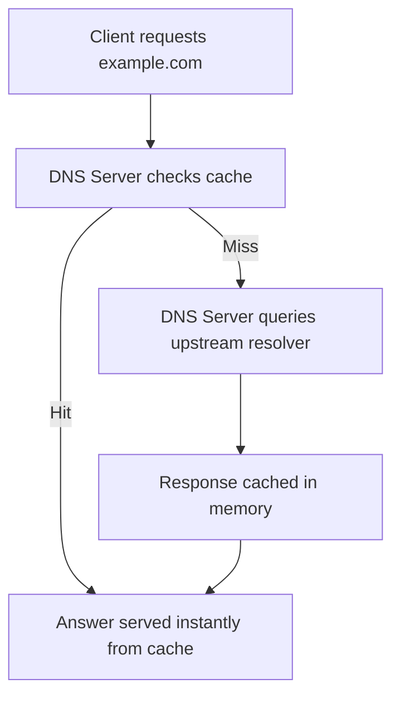

# DNS Server Cache

The **DNS Server Cache** is the memory-resident store on a Microsoft DNS Server that holds previously resolved queries, so future requests from any client on the network can be answered instantly without repeating recursive lookups.

## Overview

DNS Server Cache stores previously resolved DNS queries to:

- Improve response time
- Reduce external DNS traffic
- Increase network efficiency

> [!NOTE]
> **Managed by**
> The cache is managed by the **Microsoft DNS Server** role. Unlike the per-machine [DNS-Cache](DNS-Cache.md), it serves the entire network.

## Architecture

### How DNS Server Cache Works



1. Client requests domain (e.g., `example.com`)
2. DNS server queries upstream resolver
3. Response is cached in memory
4. Future requests are answered instantly from cache

## PowerShell

### View Cache Configuration

```powershell
Get-DnsServerCache
```

#### Example Output

```text
MaxTTL                           : 1.00:00:00
MaxNegativeTTL                   : 00:15:00
MaxKBSize                        : 0
EnablePollutionProtection        : True
LockingPercent                   : 100
StoreEmptyAuthenticationResponse : True
IgnorePolicies                   : False
```

#### Configuration Parameters Explained

| Parameter | Meaning | Notes |
| --- | --- | --- |
| `MaxTTL` | Maximum time a record stays in cache | Format `days.hours:minutes:seconds`; e.g. `1.00:00:00` = 1 day |
| `MaxNegativeTTL` | Cache duration for failed lookups (NXDOMAIN) | e.g. `00:15:00` = 15 minutes |
| `MaxKBSize` | Maximum cache size in KB | `0` = unlimited; custom value limits memory usage |
| `EnablePollutionProtection` | Protects against DNS cache poisoning | `True` blocks unrelated/malicious DNS records |
| `LockingPercent` | Prevents modification of cached records | `100` = records locked until TTL expires |
| `StoreEmptyAuthenticationResponse` | Stores empty DNSSEC responses | Improves performance and validation efficiency |
| `IgnorePolicies` | Whether DNS policies are ignored | `False` = policies are applied normally |

### View Cached DNS Records

```powershell
Get-DnsServerCache -ComputerName localhost
```

> [!NOTE]
> **Output depends on Windows Server version**

To see actual cached records, run:

```powershell
Get-DnsServerCache | Select-Object -ExpandProperty Cache
```

or simply:

```powershell
Get-DnsServerCache -ComputerName localhost
```

Depending on version, you may need:

```powershell
Get-DnsServerResourceRecord -ZoneName "."
```

### Clear DNS Server Cache

```powershell
Clear-DnsServerCache -Force
```

### Restart DNS Service

```powershell
Restart-Service DNS
```

## Security Considerations

### DNS Cache Poisoning

Attackers may:

- Inject fake DNS entries
- Redirect users to malicious servers

### Mitigation

- Enable pollution protection
- Use DNSSEC
- Keep `LockingPercent` high
- Monitor DNS logs
- Flush cache if suspicious activity is observed

> [!WARNING]
> **Poisoning risk**
> A poisoned server cache affects every client on the network, not just one machine. Prioritize pollution protection and [DNSSEC](DNSSEC.md) validation on recursive servers.

## Best Practices

- Keep pollution protection enabled
- Use appropriate TTL values
- Avoid unlimited cache in low-RAM systems
- Regularly monitor cache behavior
- Use logging for troubleshooting

## Examples

### Client vs Server Cache

| Feature | DNS Client Cache | DNS Server Cache |
| --- | --- | --- |
| Scope | Single machine | Entire network |
| Managed by | DNS Client | DNS Server role |
| Storage | RAM | RAM |
| Command | `ipconfig` | `Get-DnsServerCache` |

## Troubleshooting

> [!TIP]
> **Quick recap**
> - DNS Server Cache improves speed and efficiency.
> - Stored in RAM and controlled by TTL.
> - Configurable via PowerShell.
> - Security features help prevent cache poisoning.

## Related

- [Enterprise Windows Infrastructure Security](../Readme.md) — course hub and map of content
- [DNS-Cache](DNS-Cache.md) — client-side cache counterpart — related note
- [Recursive-(Caching)-DNS-Server](Recursive-(Caching)-DNS-Server.md) — server that maintains this cache — related note
- [DNS-Server-Types](DNS-Server-Types.md) — where caching servers fit among roles — related note
- [DNSSEC](DNSSEC.md) — validation that hardens the cache — related note
