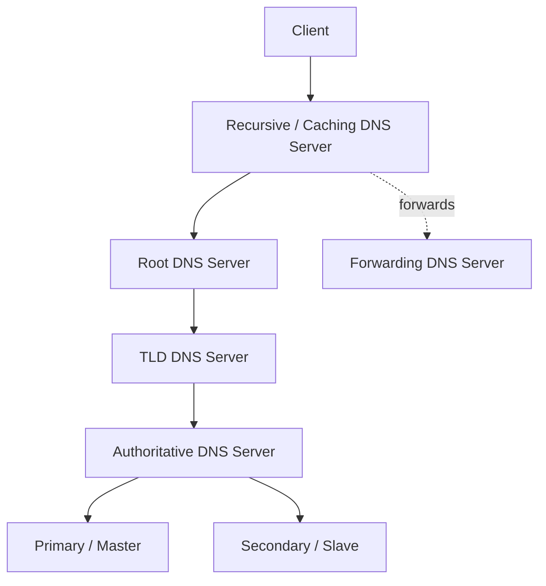

# DNS Server Types and Their Roles

DNS servers work together to resolve domain names into IP addresses. This note covers the key server types in the DNS hierarchy, how a query travels between them, and the record types they serve.

## Overview

No single DNS server holds the whole namespace. Instead, distinct server roles cooperate: a client hands its request to a **recursive (caching) resolver**, which walks the [DNS hierarchy](DNS-Hierarchy-and-How-It-Works.md) — from the **root** servers, to the **TLD** servers, to the **authoritative** server that actually owns the zone — and caches the answer for reuse. On authoritative infrastructure, a **primary (master)** server holds the editable zone file while one or more **secondary (slave)** servers replicate it for redundancy. A **forwarder** short-circuits recursion by relaying queries to a designated upstream resolver. Each role appears as its own sibling note: [Primary-(Master)-DNS-Server](Primary-(Master)-DNS-Server.md), [Secondary-(Slave)-DNS-Server](Secondary-(Slave)-DNS-Server.md), [Recursive-(Caching)-DNS-Server](Recursive-(Caching)-DNS-Server.md), [Forwarders-Nameserver](Forwarders-Nameserver.md), and [Conditional-Forwarders-in-DNS](Conditional-Forwarders-in-DNS.md).



## Server Types

### 1. Root DNS Server

- **Role**: Entry point at the highest level of the DNS hierarchy.
- **Function**: When a recursive DNS server (like your ISP's or Google DNS) can't resolve a domain, it queries the root DNS server. The root server doesn't store actual domain records—it directs the query to the appropriate TLD name server.
- **Examples**: `a.root-servers.net`, `b.root-servers.net` … `m.root-servers.net`
- **Number of Clusters**: 13 worldwide (each backed by many anycast instances)

### 2. TLD DNS Server (Top-Level Domain Server)

- **Role**: Manages TLDs like `.com`, `.org`, `.net`, `.edu`, etc.
- **Function**: After a query reaches the root DNS server, the recursive server contacts the TLD server, which points to the authoritative server for the requested domain.
- **Examples**:
    - `.com` → Managed by Verisign
    - `.org` → Managed by Public Interest Registry (PIR)
    - `.net` → Managed by Verisign

### 3. Authoritative DNS Server

- **Role**: Holds definitive DNS records for domains it manages.
- **Function**: Provides authoritative answers about domains.
- **Types**:
    - **Primary (Master) DNS Server**: Holds the original, writable zone file for a domain. Example: `ns1.example.com`. See [Primary-(Master)-DNS-Server](Primary-(Master)-DNS-Server.md).
    - **Secondary (Slave) DNS Server**: Receives updates from the primary via zone transfers (AXFR/IXFR); provides redundancy. See [Secondary-(Slave)-DNS-Server](Secondary-(Slave)-DNS-Server.md).

> [!NOTE]
> **Authoritative vs. recursive**
> An authoritative server answers *only* for zones it hosts, from its own records. A recursive server answers for *any* name by chasing the hierarchy on the client's behalf. Keeping these two roles on separate servers is a core hardening practice — see Security Considerations.

### 4. Recursive (Caching) DNS Server

- **Role**: Handles DNS lookups on behalf of clients.
- **Function**: Queries servers step by step until it finds the answer, then caches results for faster lookups. See [Recursive-(Caching)-DNS-Server](Recursive-(Caching)-DNS-Server.md) and [DNS-Server-Cache](DNS-Server-Cache.md).
- **Examples**:
    - Google Public DNS: `8.8.8.8`, `8.8.4.4`
    - Cloudflare DNS: `1.1.1.1`
    - OpenDNS: `208.67.222.222`, `208.67.220.220`

### 5. Forwarding DNS Server

- **Role**: Forwards DNS queries to another DNS server (often recursive or authoritative).
- **Function**: Useful for content filtering, security policies, and reducing load on primary DNS servers by caching and relaying queries. A **conditional forwarder** forwards only queries for a specific domain to a designated server. See [Forwarders-Nameserver](Forwarders-Nameserver.md) and [Conditional-Forwarders-in-DNS](Conditional-Forwarders-in-DNS.md).

## Querying Each Tier

You can observe each server type in action with `dig` or `nslookup`. `dig +trace` walks the hierarchy from the root downward, showing which tier answers at each step:

```bash
# Trace resolution from the root, through the TLD, to the authoritative server
dig +trace www.example.com

# Ask a specific root server which servers handle the .com TLD
dig @a.root-servers.net com NS

# Query a public recursive resolver directly
dig @8.8.8.8 www.example.com A

# Windows equivalent: query a chosen resolver
nslookup www.example.com 8.8.8.8
```

## DNS Record Types

DNS records store information about a domain's services and are served by authoritative DNS servers. Here are the main record types:

|Record Type|Explanation|Purpose|
|---|---|---|
|**A**|Address record (IPv4)|Maps a domain name to its IPv4 address, allowing browsers and devices to find the host.|
|**AAAA**|IPv6 address record|Maps a domain name to its IPv6 address, supporting modern networking.|
|**CNAME**|Canonical Name record|Creates an alias that points to another domain name. Useful for mapping subdomains to a main domain.|
|**MX**|Mail Exchange record|Directs email traffic for the domain to a mail server. Specifies the priority and server responsible for handling email.|
|**TXT**|Text record|Stores arbitrary text data, often used for SPF, DKIM, DMARC (email security), domain verification (e.g., Google Search Console).|
|**NS**|Name Server record|Specifies the authoritative DNS servers for the domain, telling others which servers to query for accurate answers.|
|**SOA**|Start of Authority record|Marks the start of a DNS zone and includes administrative info (e.g., serial number, refresh interval). Essential for zone transfers and authoritative status.|
|**PTR**|Pointer record|Used in reverse DNS lookups to map an IP address to a domain name.|
|**SRV**|Service locator record|Specifies the location of services like SIP, XMPP, LDAP. Contains port and target information for the service.|
|**CAA**|Certification Authority Authorization record|Specifies which Certificate Authorities (CAs) can issue SSL/TLS certificates for the domain. Helps prevent unauthorized certificate issuance.|

> [!TIP]
> **Full record reference**
> For each record type in detail (fields, examples, and pentesting relevance), see [DNS-Records-and-Their-Types](DNS-Records-and-Their-Types.md).

## Security Considerations

> [!WARNING]
> **Recursive resolver exposure**
> An open recursive resolver reachable from the internet can be abused for **DNS amplification DDoS** attacks and **cache poisoning**. Restrict recursion to trusted client subnets, and keep authoritative and recursive roles on separate servers so that compromising or overloading one does not affect the other.

- **Zone transfers** — an authoritative server that permits AXFR to anyone leaks its entire zone (every hostname, service, and internal IP) to attackers. Restrict transfers to named secondaries only. See [Secondary-(Slave)-DNS-Server](Secondary-(Slave)-DNS-Server.md).
- **Reconnaissance value** — `NS`, `MX`, `SRV`, and `TXT` records reveal infrastructure, mail routing, and service locations; `SRV` records are especially useful for locating Active Directory Domain Controllers.
- **Cache poisoning** — recursive resolvers are the prime poisoning target; mitigate with source-port randomization and DNSSEC validation (see [DNSSEC](DNSSEC.md)).

## Best Practices

- Separate **authoritative** and **recursive/caching** roles onto different servers to limit exposure and blast radius.
- Disable or tightly restrict recursion on authoritative servers so they only answer for their own zones.
- Deploy at least one **secondary** per zone for redundancy, and restrict zone transfers to explicitly named secondary servers.
- Prefer **forwarders / conditional forwarders** over open recursion when upstream policy or content filtering is required.
- Keep resolver software patched and enable **DNSSEC validation** plus source-port randomization to resist poisoning.

## Troubleshooting

| Symptom | Likely cause & fix |
|---------|--------------------|
| Public resolver works but internal names fail | Forwarder or conditional forwarder misconfigured; verify the upstream server IPs. See [Forwarders-Nameserver](Forwarders-Nameserver.md). |
| Secondary serving stale records | SOA serial not incremented, or zone transfer blocked; check AXFR/IXFR and the refresh interval. |
| Resolver returns an old IP after a change | Answer still cached within its TTL; flush the cache or wait for the TTL to expire. See [DNS-Cache](DNS-Cache.md). |
| Root/TLD lookups fail but forwarded queries succeed | Recursion disabled or root hints missing/outdated on the resolver. |

## References

- [ICANN / IANA Root Server Information](https://www.iana.org/domains/root/servers)
- [Cloudflare: DNS server types](https://www.cloudflare.com/learning/dns/dns-server-types/)
- [Microsoft Learn: DNS on Windows Server](https://learn.microsoft.com/en-us/windows-server/networking/dns/dns-top)
- [RFC 1034 — Domain Names: Concepts and Facilities](https://www.rfc-editor.org/rfc/rfc1034)

## Related

- [Enterprise Windows Infrastructure Security](../Readme.md) — course hub and map of content
- [DNS-Hierarchy-and-How-It-Works](DNS-Hierarchy-and-How-It-Works.md) — how these roles chain together — related note
- [Primary-(Master)-DNS-Server](Primary-(Master)-DNS-Server.md) — authoritative primary role — related note
- [Secondary-(Slave)-DNS-Server](Secondary-(Slave)-DNS-Server.md) — replicated secondary role — related note
- [Recursive-(Caching)-DNS-Server](Recursive-(Caching)-DNS-Server.md) — resolver/caching role — related note
- [Forwarders-Nameserver](Forwarders-Nameserver.md) — forwarding role — related note
- [Conditional-Forwarders-in-DNS](Conditional-Forwarders-in-DNS.md) — domain-specific forwarding — related note
- [DNS-Records-and-Their-Types](DNS-Records-and-Their-Types.md) — full record-type reference — related note
