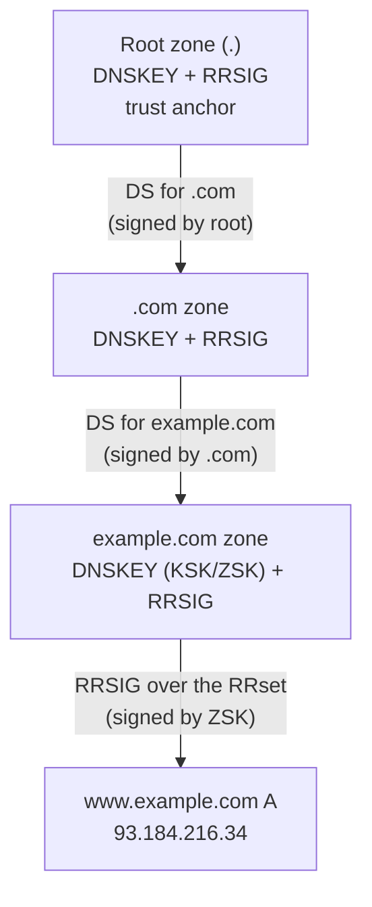
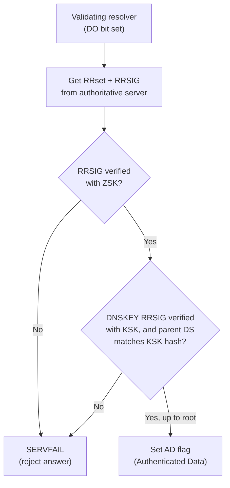

# DNSSEC

**DNS Security Extensions (DNSSEC)** is a suite of IETF specifications (RFC 4033/4034/4035, with NSEC3 in RFC 5155) that add **origin authentication** and **data integrity** to DNS. It lets a resolver cryptographically verify that a DNS answer really came from the zone's authoritative operator and was not modified in transit — closing the door on cache poisoning and answer-spoofing attacks. DNSSEC does **not** provide confidentiality (it does not encrypt DNS traffic).

## Overview

Classic DNS has no way to prove that a response is authentic. A resolver simply trusts whatever answer arrives first, which is what makes **cache poisoning** (e.g. the 2008 Kaminsky attack) and on-path spoofing possible: an attacker who guesses or races the transaction can inject a forged `A` record and redirect victims to a malicious host.

DNSSEC solves this by having each zone **digitally sign** its records. Every signed record set carries a signature that a validating resolver checks against the zone's public key, and each zone's key is in turn vouched for by its parent — forming a **chain of trust** back to the DNS root.

> [!IMPORTANT]
> **What DNSSEC does and does not do**
> - **Does:** authenticate the origin of DNS data and guarantee its integrity; provide authenticated denial of existence (proof that a name/type does *not* exist).
> - **Does not:** encrypt DNS queries or answers (use DoT/DoH for privacy), protect against DDoS, or fix an already-compromised authoritative server.

## Concepts

### Resource records introduced by DNSSEC

| Record     | Full name                     | Purpose                                                                                          |
| ---------- | ----------------------------- | ------------------------------------------------------------------------------------------------ |
| **RRSIG**  | Resource Record Signature     | The digital signature over a resource record set (RRset).                                        |
| **DNSKEY** | DNS Public Key                | Holds the zone's public key(s) used to verify RRSIG signatures.                                  |
| **DS**     | Delegation Signer             | A hash of a child zone's DNSKEY, published in the **parent** zone to link the chain of trust.    |
| **NSEC**   | Next Secure                   | Authenticated denial of existence — proves no record exists between two names.                   |
| **NSEC3**  | Next Secure v3                | Like NSEC but with hashed names to prevent easy **zone walking** (enumeration of all records).   |
| **CDS / CDNSKEY** | Child DS / Child DNSKEY | Published by the child to signal the parent to update the DS record (RFC 7344 automation).       |

### Signing keys: ZSK and KSK

DNSSEC conventionally splits signing duties across two key pairs, both published as `DNSKEY` records:

| Key                          | Signs                          | Rotation frequency | Notes                                                                 |
| ---------------------------- | ------------------------------ | ------------------ | --------------------------------------------------------------------- |
| **ZSK** (Zone Signing Key)   | All the zone's RRsets          | Frequent (e.g. monthly/quarterly) | Smaller key; changed often, so the parent DS never needs updating.    |
| **KSK** (Key Signing Key)    | The DNSKEY RRset only          | Rare (e.g. yearly) | Larger/stronger; its hash is what the parent publishes as the **DS**. |

Separating the two lets you roll the frequently used ZSK without ever touching the parent delegation, while the long-lived KSK is the single anchor the parent (and ultimately the root's **trust anchor**) vouches for.

> [!NOTE]
> **RRset, not individual records**
> DNSSEC signs an entire **RRset** — all records of the same name and type (e.g. all `A` records for `www.example.com`) — as a unit. One `RRSIG` covers the whole set.

### The chain of trust

Trust flows downward from the DNS root. Each level signs its own keys and publishes a `DS` record in its parent that fingerprints the child's `KSK`. A validating resolver, starting from the **root trust anchor** it ships with, verifies each link until it reaches the answer's zone.



## Architecture

### How validation works

When a **validating resolver** (e.g. a Windows DNS server with DNSSEC validation, `unbound`, or BIND) resolves a name in a signed zone:

1. It requests the record **with the `DO` (DNSSEC OK) bit set**, so authoritative servers return the `RRSIG` alongside the answer.
2. It fetches the zone's `DNSKEY` RRset and verifies the answer's `RRSIG` using the **ZSK** public key.
3. It verifies the `DNSKEY` RRset's own `RRSIG` using the **KSK**.
4. It fetches the parent's `DS` record for the zone and confirms it matches a hash of the child's `KSK`.
5. It repeats steps 2–4 up the delegation chain until it reaches the **root trust anchor** it already trusts.
6. If every link validates, the answer is marked **Authenticated Data** (the `AD` flag is set). If any signature fails or is missing where expected, the resolver returns **SERVFAIL** rather than a potentially forged answer.



### Authenticated denial of existence

To prove a name does **not** exist without signing an infinite number of non-existent names, DNSSEC uses `NSEC`/`NSEC3` records that assert "there is no name between X and Y." `NSEC` exposes the zone contents in sorted order (enabling **zone walking**), so `NSEC3` hashes the names to make enumeration harder.

## Configuration

DNSSEC on Windows Server is managed with the **DNS Manager** GUI (zone-signing wizard) or the `DnsServer` PowerShell module. The general workflow is: sign the zone on the authoritative server → publish the resulting `DS` record at the parent (registrar/parent zone) → enable validation on resolvers.

> [!WARNING]
> **Publish the DS at the parent**
> Signing the zone alone does not create a chain of trust. You must give the generated **DS** (or `CDS`/`CDNSKEY`) record to the parent zone's operator (for a public domain, your **registrar**). Until the parent publishes a matching DS, validating resolvers treat the zone as unsigned/insecure.

## GUI Steps

Sign a zone using the DNS Manager wizard:

1. Open **DNS Manager** (`dnsmgmt.msc`) on the DNS server.
2. Expand **Forward Lookup Zones**, right-click the target zone → **DNSSEC** → **Sign the Zone**.
3. In the **Zone Signing Wizard**, choose **Customize zone signing parameters** (or use defaults with recommended settings).
4. Configure the **KSK** and **ZSK** (algorithm, key length, rollover), the `NSEC3` options for authenticated denial, and trust anchor distribution.
5. Complete the wizard; the server generates keys and populates `DNSKEY`, `RRSIG`, and `NSEC3` records.
6. Export/retrieve the `DS` record and submit it to the parent zone / registrar.

> [!NOTE]
> **Screenshot**
> 

## PowerShell

> [!WARNING]
> **Unverified commands**
> The cmdlets below are marked `# untested` — validate parameters against your Windows Server version before use in production.

Sign a zone with default parameters:

```powershell
# untested
Invoke-DnsServerZoneSign -ZoneName "example.com" -SignWithDefault
```

Sign a zone with explicitly generated keys (KSK + ZSK), as the wizard does under the hood:

```powershell
# untested
# Add a Key Signing Key (KSK)
Add-DnsServerSigningKey -ZoneName "example.com" -Type KeySigningKey `
    -CryptoAlgorithm ECDSAP256SHA256 -KeyLength 256

# Add a Zone Signing Key (ZSK)
Add-DnsServerSigningKey -ZoneName "example.com" -Type ZoneSigningKey `
    -CryptoAlgorithm ECDSAP256SHA256 -KeyLength 256

# Sign the zone using the configured keys
Invoke-DnsServerZoneSign -ZoneName "example.com" -Force
```

Inspect the DNSSEC configuration and generated keys:

```powershell
# untested
Get-DnsServerDnsSecZoneSetting -ZoneName "example.com"
Get-DnsServerSigningKey -ZoneName "example.com"
```

Retrieve the DS record to hand to the parent zone:

```powershell
# untested
Get-DnsServerResourceRecord -ZoneName "example.com" -RRType DS
```

Enable DNSSEC validation on a resolving DNS server (trust anchor for the root):

```powershell
# untested
Add-DnsServerTrustAnchor -Root
```

Unsign a zone if you need to roll back:

```powershell
# untested
Invoke-DnsServerZoneUnsign -ZoneName "example.com" -Force
```

## Examples

Validate a signed zone from a client using `dig` with the `+dnssec` flag. A validated answer sets the **`ad`** (Authenticated Data) flag in the response header:

```bash
# Request DNSSEC records and show the RRSIG
dig +dnssec www.example.com A

# Query the zone's DNSKEY set
dig example.com DNSKEY

# Query the DS record held by the parent
dig example.com DS

# Follow and validate the full chain from the root
dig +sigchase +trusted-key=./root.key www.example.com A
```

> [!TIP]
> **Reading the flags**
> In `dig` output, look at the header line `flags:`. The `ad` flag means the resolver validated the DNSSEC chain. A **SERVFAIL** on an otherwise-resolvable name is a classic sign of a **broken** DNSSEC chain (e.g. expired RRSIGs or a mismatched DS).

## Security Considerations

- **Mitigates cache poisoning / spoofing:** forged answers fail signature validation and are rejected (SERVFAIL), defeating Kaminsky-style attacks.
- **No confidentiality:** DNSSEC is signed, not encrypted — queries and answers are still visible on the wire. Pair with **DNS over TLS/HTTPS (DoT/DoH)** for privacy.
- **Amplification risk:** signed responses are larger (extra DNSKEY/RRSIG data), which can make authoritative servers more attractive for **DNS amplification DDoS**. Apply response-rate limiting.
- **Zone walking:** plain `NSEC` lets attackers enumerate every name in a zone. Prefer **NSEC3** (with a salt and opt-out where appropriate) to raise the cost of enumeration.
- **Operational fragility:** the leading cause of DNSSEC outages is **expired signatures** or a **stale/mismatched DS** after a key rollover — both cause validating resolvers to return SERVFAIL, taking the domain offline for validating clients.

## Best Practices

- Use modern algorithms — **ECDSA P-256 (algorithm 13)** or Ed25519 — over older RSA/SHA-1 for smaller signatures and strong security.
- Separate **KSK** and **ZSK**; roll the ZSK frequently and the KSK rarely.
- Automate signature refresh and key rollovers; monitor **RRSIG expiry** proactively.
- Use **CDS/CDNSKEY** (RFC 7344) where the registrar supports it to automate DS updates and avoid manual mismatches.
- Prefer **NSEC3** over NSEC to hinder zone walking.
- Always confirm the parent **DS** matches your current **KSK** before and after any rollover.
- Enable **validation on resolvers**, not just signing on authoritative servers — signing without validating resolvers gains no client-side protection.

## Troubleshooting

| Symptom                                   | Likely cause                                              | Action                                                                 |
| ----------------------------------------- | -------------------------------------------------------- | ---------------------------------------------------------------------- |
| `SERVFAIL` on a name that should resolve  | Expired `RRSIG`, or DS at parent doesn't match KSK       | Re-sign the zone; verify/republish the DS at the registrar.            |
| Answer resolves but `ad` flag is absent   | Resolver isn't validating, or chain is broken above zone | Confirm resolver validation is on and the trust anchor is present.     |
| Validation fails after a key rollover     | Parent DS still references the old KSK                    | Update the DS/CDS at the parent; wait for TTLs to expire.              |
| Intermittent failures                     | Clock skew (signatures are time-bound)                   | Ensure NTP is synchronized on servers and resolvers.                   |

Useful checks:

```bash
# Verify the chain and see detailed validation output
dig +dnssec +multiline example.com SOA

# Check whether a resolver is validating (should return SERVFAIL for a
# deliberately broken test domain such as dnssec-failed.org)
dig @<resolver> dnssec-failed.org A
```

## References

- [RFC 4033 — DNS Security Introduction and Requirements](https://www.rfc-editor.org/rfc/rfc4033)
- [RFC 4034 — Resource Records for the DNS Security Extensions](https://www.rfc-editor.org/rfc/rfc4034)
- [RFC 4035 — Protocol Modifications for the DNS Security Extensions](https://www.rfc-editor.org/rfc/rfc4035)
- [RFC 5155 — DNSSEC Hashed Authenticated Denial of Existence (NSEC3)](https://www.rfc-editor.org/rfc/rfc5155)
- [RFC 7344 — Automating DNSSEC Delegation Trust Maintenance (CDS/CDNSKEY)](https://www.rfc-editor.org/rfc/rfc7344)
- [ICANN — DNSSEC / Root Trust Anchor](https://www.icann.org/dnssec)
- [Microsoft Learn — DNSSEC in Windows Server](https://learn.microsoft.com/en-us/windows-server/networking/dns/dnssec)

## Related
- [Enterprise Windows Infrastructure Security](../Readme.md) — course hub and map of content
- [DNS-Records-and-Their-Types](DNS-Records-and-Their-Types.md) — the RRsets that DNSSEC signs (DNSKEY, RRSIG, DS, NSEC) — related note
- [DNS-Hierarchy-and-How-It-Works](DNS-Hierarchy-and-How-It-Works.md) — the delegation path the chain of trust follows — related note
- [DNS-Server-Cache](DNS-Server-Cache.md) — cache poisoning is the primary threat DNSSEC mitigates — related note
- [DNS-Server-Types](DNS-Server-Types.md) — authoritative vs. validating resolver roles — related note
- [Split-DNS](Split-DNS.md) — internal/external views that interact with signing decisions — related note
