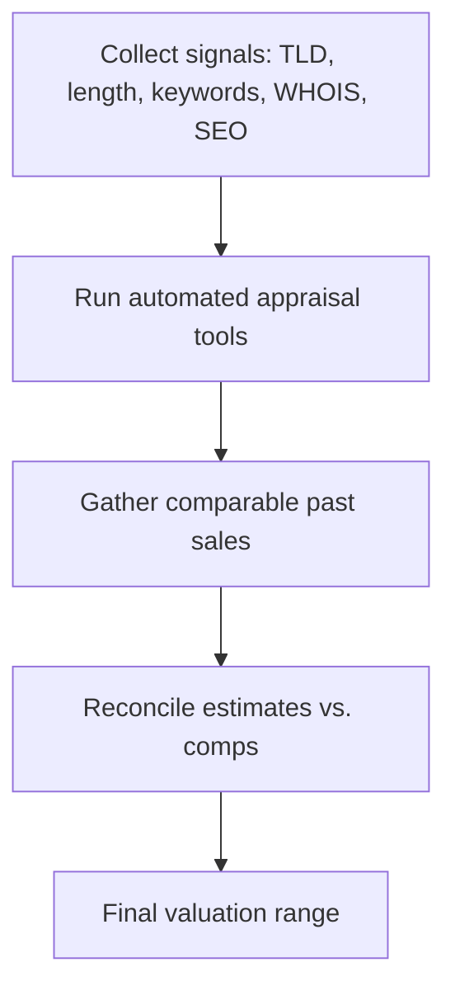

# Domain Appraisals

**Domain appraisal** is the process of estimating the market value of a domain name. Value is driven by a mix of the TLD, the length and brandability of the name, its keyword and traffic profile, and comparable past sales.

## Overview

There is no single formula for a domain's worth — appraisal blends objective signals (length, TLD, SEO metrics) with market demand. The factors below are the ones buyers and valuation tools weigh most heavily. Because valuation leans on the same public data used in reconnaissance — [Whois](Whois.md) registration records, the [domain namespace](Domain-Name-Structure.md), and the [top-level domain](dot-shop-Top-Level-Domain.md) — appraisal sits at the intersection of domain investing and OSINT.

## Factors That Affect Domain Value

1. **TLD (Top-Level Domain)**
   - `.com` domains generally have higher value due to their global recognition.
   - Country-specific TLDs (e.g., `.in`, `.io`, `.co.uk`) can have value depending on their target market.
   - Newer TLDs (e.g., `.xyz`, `.tech`, `.ai`) may have niche value.

2. **Domain Length & Simplicity**
   - Shorter domains (1–3 words) are easier to remember and more valuable (e.g., `car.com` > `bestusedcarsforsale.com`).
   - Single-word and brandable names tend to be premium (e.g., `apple.com`, `voice.io`).

3. **Keyword Value & Search Volume**
   - Domains with high-value commercial keywords are more valuable (e.g., `insurance.com`, `hotels.com`).
   - Keywords with high search volume attract buyers.

4. **Brandability**
   - Unique and catchy names are highly desirable (e.g., "Google" was a made-up word).
   - Easily pronounceable and spellable domains tend to be more valuable.

5. **Market Trends & Niche Popularity**
   - Domains related to tech, AI, finance, healthcare, and crypto are in demand (e.g., `blockchain.io`).
   - `.io` domains are popular for tech startups, while `.ai` is trending in artificial intelligence.

6. **Existing Traffic & SEO Metrics**
   - Domains with existing backlinks, traffic, and a good SEO profile are more valuable.
   - Expired domains with strong SEO history may sell for higher prices.

7. **Past Sales of Similar Domains**
   - Reviewing past domain sales helps estimate current market value.

## Appraisal Workflow

Appraisal is a pipeline: collect objective signals, run one or more automated estimators, then anchor the result against real comparable sales before settling on a number.

### Domain Appraisal Tools

| Tool | URL |
|---|---|
| GoDaddy Domain Appraisal | https://www.godaddy.com/domain-value-appraisal |
| Estibot | https://www.estibot.com/ |
| Flippa Domain Valuation | https://flippa.com/ |
| Sedo Domain Appraisal | https://www.sedo.com/ |

> [!TIP]
> **Cross-check estimates**
> Automated appraisal tools disagree widely — run a name through two or three and compare against **actual** comparable sales rather than trusting a single machine estimate.

## Security Considerations

Domain valuation is not just a commercial exercise — the same signals that make a name valuable to a legitimate buyer make it attractive to an attacker.

> [!WARNING]
> **Valuable domains are attractive attack assets**
> - **Expired / aged domains** — names with an established registration history, clean reputation, and residual backlinks are prized by attackers because their age and category help them bypass reputation- and age-based filtering when reused for **phishing**, **malware delivery**, or **C2** infrastructure.
> - **Dropcatching** — high-value names are monitored and re-registered the instant they expire; a lapsed brand or infrastructure domain can be seized and weaponised against the original owner's users.
> - **Typosquatting / combosquatting** — the brandability and keyword factors that raise a name's value also make look-alike variants (`paypa1.com`, `micros0ft-login.com`) commercially and maliciously appealing.
> - **Residual traffic** — a domain's existing traffic (a value driver) becomes a ready-made pool of victims if the name is acquired for malicious use.

From a defensive standpoint, appraisal signals double as monitoring priorities: know which of your brand-adjacent and previously owned domains carry value, and watch them.

## Best Practices

- Cross-check every estimate against **real comparable sales**, not a single automated model.
- Before buying an expired domain, inspect its history (Wayback Machine, WHOIS history, blocklists) for prior **spam, penalties, or abuse** that destroy value.
- Defensively **register or renew** brand-adjacent and look-alike names so attackers can't acquire them cheaply.
- Do not let valuable owned domains lapse — set auto-renew and monitor expiry to avoid **dropcatching**.
- Weigh recurring **renewal cost** (especially premium and newer TLDs) against the resale estimate, not just the headline appraisal.

## Troubleshooting

| Symptom | Likely cause & fix |
|---|---|
| Appraisal tools return wildly different numbers | Each model weights factors differently — anchor on comparable sales and treat tool output as a range, not a price. |
| High appraisal but no buyers | The estimate reflects theoretical keyword value, not actual demand; domains are illiquid — price to the market. |
| Bought an "SEO-rich" expired domain that underperforms | Prior spam or a search-engine penalty; check Wayback Machine and blocklists before purchase. |
| Premium name costs far more to renew than expected | Registry-set premium or newer-TLD pricing; confirm renewal cost before valuing on resale alone. |

## References

- [ICANN — About Domain Names](https://www.icann.org/resources/pages/domain-name-basics-2017-06-20-en)
- [IANA — Root Zone Database (list of TLDs)](https://www.iana.org/domains/root/db)
- [ICANN Lookup — registration data](https://lookup.icann.org/)

## Related

- [Enterprise Windows Infrastructure Security](../Readme.md) — course hub and map of content
- [Whois](Whois.md) — ownership/registration data used in appraisals — related note
- [Domain-Name-Structure](Domain-Name-Structure.md) — naming factors that affect value — related note
- [dot-shop-Top-Level-Domain](dot-shop-Top-Level-Domain.md) — TLD relevant to domain valuation — related note
