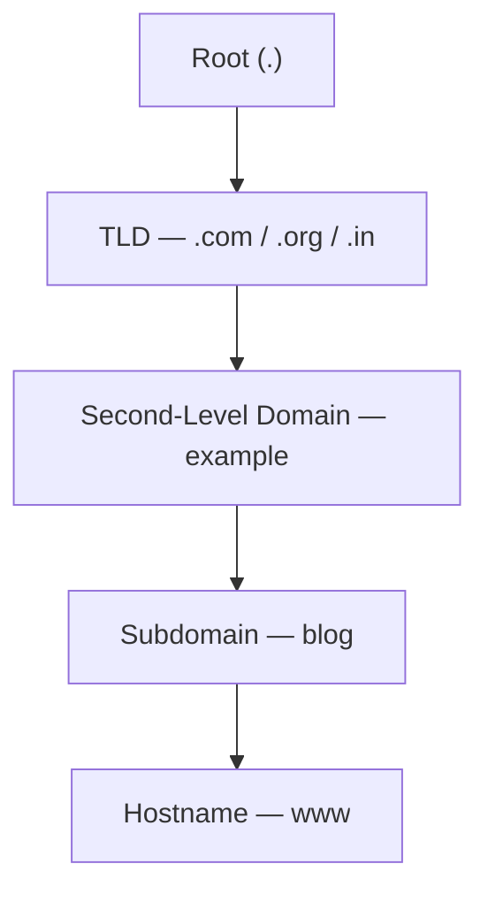

# Domain Name Structure

The **Domain Name Structure** is a hierarchical system used in the **Domain Name System (DNS)** to organize and identify domains on the internet. It follows a tree-like structure, starting from the **Root Domain** at the top and descending to specific **Subdomains** and **Hostnames**.

## Overview

Domain names are read **right to left**, from the most general label (the root) to the most specific (the hostname). Each label is delegated by the level above it, which is what allows the internet's namespace to be administered in a distributed way.



> [!NOTE]
> **Reading order**
> The FQDN `www.blog.example.com.` maps to Hostname → Subdomain → SLD → TLD → Root. The trailing dot for the root is usually hidden in browsers.

## Concepts

### Root Domain (`.`)

The **Root Domain**, represented by a **dot (`.`)**, is the **highest level** in the **Domain Name System (DNS) hierarchy**. It serves as the starting point of the DNS structure and encompasses all domain names.

#### Key Characteristics

- It is the **top of the domain name hierarchy**.
- Represented by a **dot (`.`)** at the end of every fully qualified domain name (FQDN), though it is usually **omitted** in web browsers.
- It is managed by the **Internet Assigned Numbers Authority (IANA)** and operated by **root name servers** distributed globally.

#### Example

A fully qualified domain name (FQDN) includes the root:

```text
www.example.com.
```

- Here, the final `.` indicates the **root domain**, though most user interfaces hide it.

#### Role of the Root Domain

- Acts as the **reference point** for all top-level domains (TLDs).
- Delegates control to TLDs such as `.com`, `.org`, `.net`, `.in`, etc.
- Root name servers respond to DNS queries by pointing to authoritative servers for the requested TLD.

#### Root Zone File

- The **root zone file** contains a list of all valid TLDs and their respective authoritative name servers.
- Maintained by **IANA** and published by **Verisign** under the supervision of **ICANN**.

#### Summary

|Property|Description|
|---|---|
|Symbol|`.` (dot)|
|Level|Highest (root of the DNS tree)|
|Managed by|IANA (under ICANN)|
|Purpose|Delegates control to TLDs|
|Visibility|Usually hidden in browser URLs|

### Top-Level Domain (TLD)

A **Top-Level Domain (TLD)** is the **highest domain level** directly under the root in the Domain Name System (DNS) hierarchy. It appears **at the end of a domain name**, following the last dot (`.`).

#### Example

```text
www.example.com
```

- **TLD**: `.com`

#### Key Characteristics

- TLDs define the **type or purpose** of a domain, such as commercial use, geographical location, or organizational function.
- Managed by **IANA** under **ICANN**.
- Each TLD is delegated to a **registry operator**, which manages domain registrations under it.

#### Types of TLDs

|Type|Description|Examples|
|---|---|---|
|**Generic TLDs (gTLDs)**|Open for general use, often global.|`.com`, `.org`, `.net`, `.xyz`|
|**Sponsored TLDs (sTLDs)**|Managed by organizations for specific communities or uses.|`.edu`, `.gov`, `.mil`, `.museum`|
|**Country-Code TLDs (ccTLDs)**|Assigned to countries or territories, based on ISO 3166 codes.|`.in`, `.us`, `.uk`, `.jp`|
|**IDN TLDs**|TLDs with non-Latin scripts (e.g., Arabic, Chinese, Cyrillic).|`.भारत`, `.中国`, `.рф`|
|**Infrastructure TLD**|Reserved for internet infrastructure.|`.arpa`|

#### Examples of TLD Usage

- `.com` – Commercial websites (global use)
- `.org` – Non-profit organizations
- `.edu` – Accredited U.S. educational institutions
- `.gov` – U.S. government entities
- `.in` – India (ccTLD)
- `.io` – British Indian Ocean Territory, popular in tech
- `.co.uk` – Commercial use in the UK (structured under `.uk`)

#### Top-Level Domain (TLD) - Types

Top-Level Domains are categorized into several types based on their intended purpose and managing authority:

##### 1. Generic Top-Level Domains (gTLDs)

- Used for general purposes, not specific to any country.
- Open to individuals and organizations globally.
- **Examples**: `.com`, `.org`, `.net`, `.info`, `.biz`, `.xyz`

##### 2. Sponsored Top-Level Domains (sTLDs)

- Managed by private organizations or agencies with established rules for eligibility.
- Often restricted to specific communities or purposes.
- **Examples**: `.edu` (education), `.gov` (U.S. government), `.mil` (U.S. military), `.museum`, `.coop`, `.aero`

##### 3. Country-Code Top-Level Domains (ccTLDs)

- Assigned to specific countries or territories.
- Based on ISO 3166-1 alpha-2 country codes.
- **Examples**: `.in` (India), `.uk` (United Kingdom), `.us` (United States), `.jp` (Japan), `.de` (Germany)

##### 4. Internationalized Domain Name TLDs (IDN TLDs)

- TLDs that use non-ASCII characters (e.g., Arabic, Cyrillic, Chinese).
- Enable users to register domains in native scripts.
- **Examples**: `.भारत` (India in Devanagari), `.中国` (China in Chinese), `.рф` (Russia in Cyrillic)

##### 5. Infrastructure Top-Level Domain

- Reserved for technical infrastructure use.
- **Example**: `.arpa` – used for Internet infrastructure and protocols (e.g., reverse DNS lookups)

> [!NOTE]
> **Structured second-level domains**
> TLDs are the **first level** beneath the root (`.`) in DNS. Some TLDs, like `.gov.in` or `.co.uk`, use **structured second-level domains** for categorization.

### Second-Level Domain (SLD)

The **Second-Level Domain (SLD)** is the part of a domain name that appears **directly to the left of the Top-Level Domain (TLD)**. It is typically the **main identity** or **brand name** of the domain and is registered by the domain owner.

#### Key Characteristics

- It sits **just below** the TLD in the domain hierarchy.
- It is often selected by the person or organization registering the domain.
- It is the **most recognizable** part of a domain name.

#### Example Breakdown

For the domain:

```text
example.com
```

- **TLD**: `.com`
- **SLD**: `example`

For:

```text
gov.in
```

- **TLD**: `.in`
- **SLD**: `gov`

#### Uses

- **Branding**: Companies often use their business name as the SLD (e.g., `apple.com`, `amazon.in`)
- **Descriptive Naming**: Websites may use descriptive names (e.g., `learnpython.org`, `writethedocs.io`)
- **Institutional Identity**: Government and education sites may use structured naming (e.g., `nic.gov.in`, `mit.edu`)

#### Second-Level Domain (SLD) – Types

**Second-Level Domains (SLDs)** can also be categorized based on how they are used and structured under various Top-Level Domains (TLDs). While not as formally classified as TLDs, SLDs typically fall into the following types depending on the naming policy of the TLD registry (especially for country-code TLDs):

##### 1. Open/Generic SLDs

- Directly registered by anyone under open TLDs like `.com`, `.net`, `.org`.
- The SLD is freely chosen by the registrant.
- **Examples**: `google.com`, `wikipedia.org`, `github.io`

##### 2. Structured/Reserved SLDs (Under ccTLDs)

- Some **country-code TLDs (ccTLDs)** use structured SLDs for categorization.
- These are predefined and categorized by purpose (government, education, commercial, etc.).
- Registrants register domains at the **third level** under these SLDs.

Common types under ccTLDs like `.in`, `.uk`, `.jp`, etc.:

|SLD|Purpose|Example|
|---|---|---|
|`.gov.in`|Government entities in India|`nic.gov.in`|
|`.edu.in`|Educational institutions in India|`du.edu.in`|
|`.ac.uk`|Academic institutions in the UK|`cam.ac.uk`|
|`.co.uk`|Commercial organizations in the UK|`bbc.co.uk`|
|`.or.jp`|Organizations in Japan|`example.or.jp`|
|`.go.jp`|Japanese government|`mofa.go.jp`|

##### 3. Brand/Trademark-Based SLDs

- Specific to a brand or trademark name.
- Usually registered as a direct SLD under a TLD.
- **Examples**: `apple.com`, `tesla.com`, `samsung.net`

##### 4. Geographic SLDs

- Used to represent regional or city-based domains.
- Either part of a structured ccTLD or a gTLD designed for cities/regions.
- **Examples**: `delhi.gov.in`, `nyc.gov`, `london.uk`

### Subdomain

A **Subdomain** is a domain that is part of a larger domain name. It comes **before the Second-Level Domain (SLD)** and is used to organize or divide a website into sections or services.

#### Key Characteristics

- Subdomains appear to the **left of the SLD and TLD**.
- They allow organizations to host different services or sections under the same main domain.
- They do **not require a new domain registration**—they are created within the domain management system (DNS) of the existing domain.

#### Syntax

```text
subdomain.sld.tld
```

#### Example Breakdown

For the domain:

```text
blog.example.com
```

- **TLD**: `.com`
- **SLD**: `example`
- **Subdomain**: `blog`

Other examples:

- `mail.google.com` – subdomain `mail` for email service
- `developer.mozilla.org` – subdomain `developer` for documentation
- `support.microsoft.com` – subdomain `support` for customer support

#### Common Uses of Subdomains

|Subdomain|Purpose|
|---|---|
|`www`|Default web access (traditionally)|
|`mail`|Email services|
|`blog`|Company or product blog|
|`shop`|E-commerce or online store|
|`dev`|Development or staging server|
|`support`|Customer service or help desk|

> [!NOTE]
> **Nested subdomains**
> Subdomains are treated as **separate websites** by search engines and browsers. You can have **multiple levels** of subdomains, e.g., `test.dev.blog.example.com`.

### Hostname

A **Hostname** is a **label assigned to a specific device** (such as a computer, server, or network service) on a domain. It identifies a **specific host** within a domain name and usually appears at the **leftmost part** of the Fully Qualified Domain Name (FQDN).

#### Key Characteristics

- Used to identify **individual machines or services** in a domain.
- Part of the **DNS hierarchy**, appearing **before the subdomain** or directly under the domain.
- Combined with a domain name to form a **FQDN** (Fully Qualified Domain Name).
- Can point to **web servers, mail servers, APIs**, or any network-accessible host.

#### Example Breakdown

For the FQDN:

```text
www.example.com
```

- **TLD**: `.com`
- **SLD**: `example`
- **Hostname**: `www` (represents the web server)

For:

```text
mail.google.com
```

- **Hostname**: `mail` (used for Google's email services)

#### Common Hostnames and Their Uses

|Hostname|Purpose|
|---|---|
|`www`|Web server (HTTP/HTTPS)|
|`mail`|Mail server (SMTP, IMAP)|
|`ftp`|File Transfer Protocol server|
|`api`|Application programming interface|
|`ns1`, `ns2`|DNS name servers|

> [!NOTE]
> **Hostnames vs subdomains**
> A hostname is often a **subdomain**, but with a functional intent (e.g., `www`, `mail`, `ftp`). Hostnames can also refer to **internal network devices** like `printer01.office.local`. Multiple hostnames can exist under one domain, each pointing to **different IP addresses or services**.

## Examples

### Full Breakdown

For the domain: `www.exam.armour.local`

- **Root Domain**: `.`
- **TLD**: `.local`
- **SLD**: `armour`
- **Subdomain**: `exam`
- **Hostname**: `www`

This hierarchical structure allows efficient management and resolution of domain names across the internet or private networks.

### Specific TLD and Domain Examples

#### .in (Country-Code TLD - ccTLD)

- Country-code top-level domain for **India**.
- Managed by **NIXI** (National Internet Exchange of India).
- Used by individuals, businesses, and organizations in India.
- **Example**: `example.in`

#### .gov.in (Government Subdomain under .in)

- Subdomain under `.in` reserved for Indian government entities.
- Used by government departments, agencies, and public sector units.
- **Example**: `nic.gov.in`

#### .gov (Government TLD - gTLD)

- Generic TLD for U.S. government entities.
- Managed by **CISA** (Cybersecurity and Infrastructure Security Agency).
- **Example**: `usa.gov`

#### .com (Commercial - gTLD)

- Stands for **Commercial**.
- One of the most widely used domain extensions globally.
- **Example**: `google.com`

#### .org (Organization - gTLD)

- Stands for **Organization**.
- Traditionally used by nonprofits and educational groups.
- **Example**: `wikipedia.org`

#### .net (Network - gTLD)

- Originally for network providers (ISPs, etc.), now widely used.
- **Example**: `cloudflare.net`

#### .io (Country-Code TLD turned Tech Favorite)

- Country-code TLD for **British Indian Ocean Territory**.
- Popular among tech startups because "I/O" stands for Input/Output.
- **Example**: `github.io`

#### .edu (Educational - gTLD)

- Reserved for accredited educational institutions in the U.S.
- Managed by **EDUCAUSE**, under the U.S. Department of Commerce.
- Only post-secondary accredited institutions can register.
- **Examples**: `harvard.edu`, `mit.edu`

### Domain Name Examples

#### Google-Related Domains

These domains are associated with Google services and subdomains used to provide various features and applications.

```text
www.google.com
www.youtube.com
play.google.com
meet.google.com
chat.google.com
photos.google.com
mail.google.com/mail
translate.google.co.in
drive.google.com
www.google.co.in
```

#### GoDaddy-Related Domains

These domains represent GoDaddy's global presence, services, and regional platforms.

```text
www.godaddy.com
events.godaddy.com
careers.godaddy.com
developer.godaddy.com
mcc.godaddy.com
ph.godaddy.com
tw.godaddy.com
kr.godaddy.com
pk.godaddy.com
tr.godaddy.com
```

#### Indian Government Domains

These are official domains used by the Indian government and its departments, typically under `.gov.in`.

```text
gov.in
email.gov.in
www.india.gov.in
www.mygov.in
www.indiapost.gov.in
www.mohfw.gov.in
services.gst.gov.in
www.bis.gov.in
pgportal.gov.in
```

## Security Considerations

> [!WARNING]
> **Subdomains as an attack surface**
> Because subdomains resolve independently and are often provisioned automatically, forgotten or dangling subdomains (e.g. pointing to a decommissioned cloud bucket) are a common target for **subdomain takeover**. Enumerating an organisation's SLD and its subdomains is a standard reconnaissance step, so keep an accurate inventory of every delegated name.

## Best Practices

- Keep an authoritative inventory of every registered domain and delegated subdomain; retire DNS records for decommissioned hosts promptly to prevent stale or dangling entries.
- Use a consistent, service-based subdomain naming scheme (`www`, `mail`, `api`, `dev`) rather than ad-hoc labels, so the namespace stays predictable and auditable.
- Register defensive variations of your brand SLD (common TLDs and obvious typo variants) to reduce phishing and impersonation risk.
- For internal namespaces prefer a domain you actually own or a delegated internal zone; avoid names that collide with real public TLDs (a historic risk with `.local`-style private naming).
- Read and validate names **right to left** — the rightmost label is the most authoritative — and use the trailing-dot FQDN form when absolute resolution matters.

> [!TIP]
> **FQDN vs. relative name**
> A name ending in a dot (`www.example.com.`) is an absolute FQDN and is resolved as-is. A name **without** the trailing dot may have the resolver's DNS search suffixes appended, so the same label can resolve differently depending on client configuration.

## Troubleshooting

| Symptom | Likely cause & fix |
|---------|--------------------|
| A short name resolves to an unexpected host | DNS search-suffix list is appending a domain to the relative name — query the full FQDN (with trailing dot) to force absolute resolution. |
| A subdomain fails to resolve while the parent domain works | Missing record in the zone, or missing delegation (`NS` records) at the parent — verify the record and the delegation chain from the SLD downward. |
| A structured name like `nic.gov.in` looks like a subdomain but is registrable | Some ccTLDs use **structured second-level domains** (`.gov.in`, `.co.uk`); registrants operate at the third level. Read the TLD's naming policy rather than assuming a flat `sld.tld` model. |

## References

- [RFC 1034 — Domain Names: Concepts and Facilities](https://www.rfc-editor.org/rfc/rfc1034)
- [RFC 1035 — Domain Names: Implementation and Specification](https://www.rfc-editor.org/rfc/rfc1035)
- [IANA — Root Zone Database](https://www.iana.org/domains/root/db)
- [ICANN — Domain Name Basics](https://www.icann.org/resources/pages/domain-name-basics-2017-06-20-en)

## Related

- [Enterprise Windows Infrastructure Security](../Readme.md) — course hub and map of content
- [Fully-Qualified-Domain-Name(FQDN)](Fully-Qualified-Domain-Name(FQDN).md) — full path within the structure — related note
- [DNS-Hierarchy-and-How-It-Works](DNS-Hierarchy-and-How-It-Works.md) — how the structure resolves — related note
- [dot-shop-Top-Level-Domain](dot-shop-Top-Level-Domain.md) — example top-level domain — related note
- [DNS-Records-and-Their-Types](DNS-Records-and-Their-Types.md) — the records that live under these names — related note
- [Whois](Whois.md) — registration and ownership lookups for SLDs — related note
