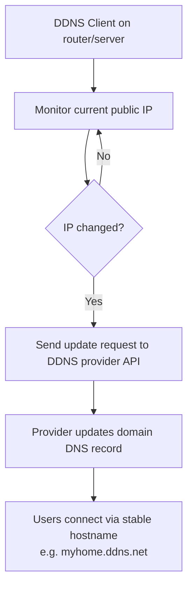

# Dynamic DNS (DDNS)

**Dynamic DNS (DDNS)** is a mechanism that automatically updates DNS records (typically **A** or **AAAA**) whenever a device's public IP address changes. It allows you to access devices using a **fixed domain name**, even when the underlying IP address is dynamic.

## Overview

### Why Use Dynamic DNS?

- **Home Networks** — ISPs often assign **dynamic public IPs** that change periodically.
- **Remote Access** — reach services like CCTV systems, NAS (Network Attached Storage), and VPN servers.
- **Self-Hosting** — host websites, game servers, and APIs.
- **IoT & Smart Devices** — maintain consistent connectivity for remote monitoring and control.

## Architecture

### How Dynamic DNS Works



1. **DDNS Client** — runs on a router, server, or local machine.
2. **IP Monitoring** — continuously checks the current public IP.
3. **Change Detection** — detects when the IP address changes.
4. **Update Request** — sends the new IP to the DDNS provider via API.
5. **DNS Record Update** — the provider updates the domain's DNS record.
6. **Access via Hostname** — users connect using a stable domain (e.g., `myhome.ddns.net`).

## Configuration

### Common Dynamic DNS Providers

| Provider | Free Tier | Custom Domains |
| --- | --- | --- |
| No-IP | Yes | Paid |
| Dyn | No | Paid |
| DuckDNS | Yes | Subdomain only |
| Cloudflare | Yes (API-based) | Yes |
| FreeDNS Afraid | Yes | Yes |

### Example: DuckDNS Client (Linux)

```bash
# Run periodically (e.g., cron job)
curl -k "https://www.duckdns.org/update?domains=mydomain&token=YOUR-TOKEN&ip="
```

> [!TIP]
> **What this does**
> - Sends the current public IP to DuckDNS.
> - Updates the DNS record automatically.
> - Replace `mydomain` → your domain and `YOUR-TOKEN` → your API token.

## Examples

### Scenario: Home Web Server

You run a web server on your home network and your ISP assigns a **dynamic IP address**.

**Without DDNS** — you must check your IP manually and update DNS records each time it changes.

**With DDNS:**

1. Register a domain like:

    ```text
    myserver.duckdns.org
    ```

2. Configure a DDNS client on the router / server.
3. On IP change, the client updates DNS automatically.
4. Access remains consistent:

    ```text
    http://myserver.duckdns.org
    ```

### Where DDNS Is Commonly Used

- Home labs / pentesting labs
- Self-hosted services (e.g., dashboards, APIs)
- VPN endpoints (e.g., OpenVPN, WireGuard)
- Remote desktop access
- Smart home / IoT environments

## Enterprise Deployment

> [!NOTE]
> **Secure dynamic updates in Windows**
> In Active Directory-integrated zones, Windows clients and DHCP register their own A/PTR records via **secure dynamic updates**, which authenticate the updater against AD. This is the enterprise analog of internet DDNS — the record source is dynamic, but updates are restricted to authenticated principals. See [DNS-Server-Types](DNS-Server-Types.md) for the roles that accept dynamic updates.

## Security Considerations

- **Exposed services** — a stable hostname makes self-hosted services easy to find; protect them with authentication, TLS, and firewalling.
- **Provider dependency** — resolution depends on DDNS provider uptime and account security; a compromised DDNS token lets an attacker repoint your hostname.
- **DNS propagation delay** — updates are usually fast but not instant.

## Best Practices

- **No need for static IP** — automate updates instead.
- **Automated updates** — run the client on a schedule (cron/service).
- **Easy remote access** — combine with a VPN rather than exposing raw services.
- **Low cost** — many providers offer a free tier.

## Troubleshooting

| Limitation / Symptom | Cause | Note |
| --- | --- | --- |
| Hostname resolves to old IP | Propagation delay or client not running | Confirm the DDNS client updated and TTL has elapsed |
| Service reachable but insecure | Exposed service without protection | Add auth/TLS/firewall rules |
| Updates stop working | DDNS provider outage or expired token | Verify provider status and rotate the token |

## Related

- [Enterprise Windows Infrastructure Security](../Readme.md) — course hub and map of content
- [DNS-Records-and-Their-Types](DNS-Records-and-Their-Types.md) — records updated dynamically — related note
- [DNS-Server-Types](DNS-Server-Types.md) — server roles that accept dynamic updates — related note
- [DNS-Hierarchy-and-How-It-Works](DNS-Hierarchy-and-How-It-Works.md) — resolution path a DDNS hostname follows — related note
