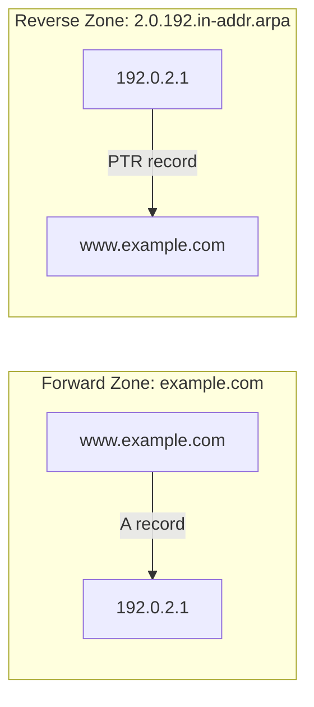

# Forward and Reverse DNS Zones

In DNS (Domain Name System), **zones** are distinct, administratively delegated parts of the DNS namespace, each managed by an authoritative DNS server. A zone holds the resource records for the names it is responsible for, and zones are categorized by lookup direction as **forward zones** (name → IP) and **reverse zones** (IP → name).

## Overview

A **forward lookup zone** answers the everyday question "what is the IP address for this name?" and holds the records ([A, AAAA, CNAME, MX](DNS-Records-and-Their-Types.md), and others) that clients need to reach services. A **reverse lookup zone** answers the opposite question "what name owns this IP address?" using **PTR** records, and is relied on by mail servers, logging, and troubleshooting. Both zone types are hosted on the same authoritative servers (see [Primary-(Master)-DNS-Server](Primary-(Master)-DNS-Server.md) and [Secondary-(Slave)-DNS-Server](Secondary-(Slave)-DNS-Server.md)) and fit into the broader resolution flow described in [DNS-Hierarchy-and-How-It-Works](DNS-Hierarchy-and-How-It-Works.md).

| Feature | Forward Zone | Reverse Zone |
|---------|--------------|--------------|
| Purpose | Name → IP mapping | IP → Name mapping |
| Common Record | A, AAAA, CNAME, MX | PTR |
| Zone namespace | The domain itself (e.g. `example.com`) | `in-addr.arpa` (IPv4) / `ip6.arpa` (IPv6) |
| Use Case | Access websites, email delivery | Email verification, logging, troubleshooting |

- **Forward Zone**: You type `www.example.com` and get `192.0.2.1`.
- **Reverse Zone**: You have `192.0.2.1` and want to find `www.example.com`.



## Concepts

### Forward Zone

A **Forward DNS Zone** maps **domain names to IP addresses**.

**Purpose**

- Translate human-readable domain names (like `www.example.com`) to machine-readable IP addresses (like `192.0.2.1`).

**Example Records**

- **A (Address) Record**: Maps a domain name to an IPv4 address.
- **AAAA Record**: Maps a domain name to an IPv6 address.
- **CNAME Record**: Alias to another domain name.
- **MX Record**: Defines mail servers for the domain.

### Reverse Zone

A **Reverse DNS Zone** maps **IP addresses to domain names**.

**Purpose**

- Provides the opposite of forward lookup: it allows you to determine which domain name corresponds to a specific IP address.
- Used for services like email (anti-spam checks often rely on reverse lookups).

**Example Records**

- **PTR (Pointer) Record**: Maps an IP address to a domain name.

> [!NOTE]
> **The `in-addr.arpa` reverse namespace**
> The reverse zone uses a **special domain** (`in-addr.arpa` for IPv4) that represents IP addresses in reverse order. Because DNS names are read most-specific-first (left to right) but IPv4 addresses are written most-significant-first, the octets are reversed. For an IP like `192.0.2.1`, the reverse zone name is `1.2.0.192.in-addr.arpa` — and the `/24` reverse zone itself is `2.0.192.in-addr.arpa`.

### IPv4 vs IPv6 reverse zones

- **IPv4 Reverse Zone**: Uses `in-addr.arpa` (e.g., `1.2.0.192.in-addr.arpa`).
- **IPv6 Reverse Zone**: Uses `ip6.arpa`, with each of the 32 hex nibbles reversed (e.g., for IPv6 address `2001:db8::1`).

## Configuration

On Windows Server, forward and reverse lookup zones are created through the DNS Manager console or PowerShell. The reverse zone is created from a network ID rather than a name; Windows derives the `in-addr.arpa` zone name automatically.

```powershell
# Create a forward lookup zone
Add-DnsServerPrimaryZone -Name "example.com" -ZoneFile "example.com.dns"

# Create a reverse lookup zone for the 192.0.2.0/24 network
Add-DnsServerPrimaryZone -NetworkID "192.0.2.0/24" -ZoneFile "2.0.192.in-addr.arpa.dns"
```

> [!TIP]
> **Keep forward and reverse in sync**
> Create the matching **PTR** record whenever you add a host **A** record (in Windows DNS Manager the New Host dialog has a "Create associated pointer (PTR) record" checkbox). Orphaned or missing PTRs are the most common cause of failed reverse lookups. For bulk provisioning, see [PowerShell-script-to-create-DNS-zones](PowerShell-script-to-create-DNS-zones.md).

## Examples

**Forward zone file** — defines how to resolve domain names to IPs:

```text
www.example.com. IN A 192.0.2.1
mail.example.com. IN A 192.0.2.2
```

**Reverse zone record** — for an IP like `192.0.2.1`, the reverse zone would contain:

```text
1.2.0.192.in-addr.arpa. IN PTR www.example.com.
```

## Security Considerations

> [!WARNING]
> **Zone transfers leak the namespace**
> If a DNS server permits unrestricted zone transfers (`AXFR`), an attacker can pull the entire forward zone — every hostname and IP — in one query. Reverse zones similarly map out live IP ranges. Restrict zone transfers to authorized secondary servers only.

- **Reverse-sweep reconnaissance** — an attacker who can query the reverse zone can walk an IP range and recover internal hostnames (`dc01`, `sql-prod`, `backup`) that reveal infrastructure and high-value targets. Populated reverse zones are a reconnaissance goldmine.
- **PTR forgery / spoofing** — because forward and reverse records are independent, a PTR value alone is not authoritative. Services should perform **forward-confirmed reverse DNS (FCrDNS)**: resolve the PTR name back to an A record and confirm it matches the original IP.
- **Information disclosure via descriptive names** — avoid encoding role, environment, or vendor details into names that appear in either zone; they leak straight to anyone who can query.

## Best Practices

- **Restrict zone transfers** to named secondary servers only, for both forward and reverse zones.
- **Keep forward and reverse records paired** — every A/AAAA record that needs reachability or mail delivery should have a corresponding PTR.
- **Delegate reverse zones on `/24` (or classless) boundaries** so each subnet's PTRs are managed by its owner.
- **Use split-horizon DNS** (see [Split-DNS](Split-DNS.md)) so internal names in either zone are never served to external queries.
- **Set deliberate TTLs** — short for records that change often, longer for stable infrastructure to reduce query load.

## Troubleshooting

| Symptom | Likely cause & fix |
|---------|--------------------|
| `nslookup <ip>` returns "non-existent domain" | No reverse zone exists, or the PTR record is missing — create the `in-addr.arpa` zone and add the PTR. |
| Forward lookup works but reverse fails | A record added without its associated PTR — enable "Create associated pointer (PTR) record" or add the PTR manually. |
| Mail rejected / flagged as spam | Missing or mismatched reverse DNS for the sending IP — publish a PTR whose forward record matches the IP (FCrDNS). |
| Secondary server missing new records | Zone transfer not occurring — check the SOA serial incremented and that the secondary is authorized for AXFR/IXFR (see [Secondary-(Slave)-DNS-Server](Secondary-(Slave)-DNS-Server.md)). |

## References

- [Add-DnsServerPrimaryZone (Microsoft Learn)](https://learn.microsoft.com/powershell/module/dnsserver/add-dnsserverprimaryzone)
- [RFC 1035 — Domain Names: Implementation and Specification](https://www.rfc-editor.org/rfc/rfc1035)
- [RFC 1912 — Common DNS Operational and Configuration Errors (reverse zones / PTR)](https://www.rfc-editor.org/rfc/rfc1912)

## Related
- [Enterprise Windows Infrastructure Security](../Readme.md) — course hub
- [DNS-Records-and-Their-Types](DNS-Records-and-Their-Types.md) — the A/PTR records held in zones — related note
- [DNS-Hierarchy-and-How-It-Works](DNS-Hierarchy-and-How-It-Works.md) — zones within the resolution hierarchy — related note
- [PowerShell-script-to-create-DNS-zones](PowerShell-script-to-create-DNS-zones.md) — script that provisions forward & reverse zones — related note
- [Primary-(Master)-DNS-Server](Primary-(Master)-DNS-Server.md) — server that hosts these zones — related note
- [Secondary-(Slave)-DNS-Server](Secondary-(Slave)-DNS-Server.md) — replicates zones via transfer — related note
- [Split-DNS](Split-DNS.md) — internal vs external views of a zone — related note
