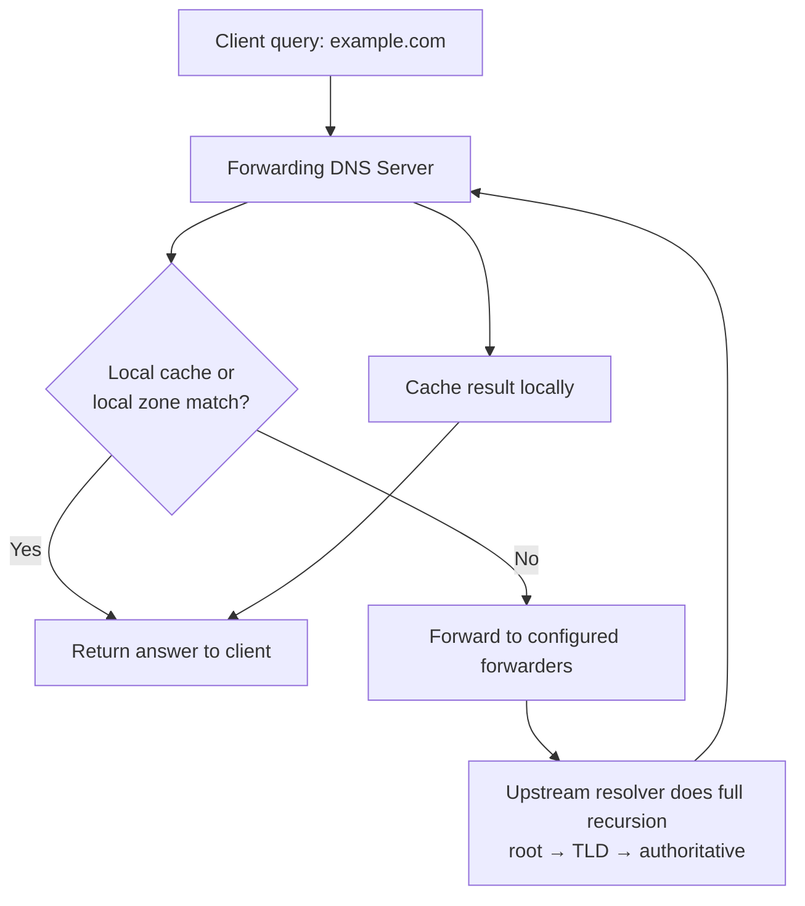

# Forwarders Nameserver

A **Forwarders Nameserver** is an upstream DNS server that a **forwarding DNS server** queries when it cannot resolve a DNS request locally. Instead of performing full recursive resolution itself, the forwarding DNS server delegates the task to **external DNS resolvers** such as Google Public DNS or Cloudflare.

## Overview

Forwarding offloads recursion to optimized upstream resolvers while keeping local caching, logging, and control. It is common in enterprise networks, ISPs, and home routers.

## Architecture

### How Forwarders Nameservers Work



1. **Client Request** — a client sends a DNS query (e.g., `example.com`) to the local DNS server.
2. **Forwarding DNS Server** — checks local cache and local zones. If no match, it forwards the query to configured forwarders.
3. **Forwarders Nameservers** — upstream DNS servers perform full recursive resolution, querying root → TLD → authoritative servers if needed.
4. **Response to Client** — the result is returned to the forwarding server, cached locally, and sent back to the client.

## Concepts

### Why Use Forwarders?

- **Reduced complexity** — internal DNS servers don't need to perform full recursion.
- **Improved performance** — public DNS resolvers are highly optimized and globally distributed.
- **Centralized control** — enables logging, filtering, and monitoring.
- **Bandwidth efficiency** — repeated queries are cached locally.

### Common Forwarders

| Provider | IP Address |
| --- | --- |
| Google DNS | `8.8.8.8`, `8.8.4.4` |
| Cloudflare DNS | `1.1.1.1`, `1.0.0.1` |
| OpenDNS | `208.67.222.222`, `208.67.220.220` |
| Quad9 | `9.9.9.9`, `149.112.112.112` |

### Forwarding vs Recursive DNS

| Feature | Recursive DNS Server | Forwarding DNS Server |
| --- | --- | --- |
| Resolution | Queries root → authoritative servers | Sends queries to upstream servers |
| Control | Full control | Depends on forwarders |
| Performance | Depends on setup | Often faster with optimized resolvers |
| Use Case | ISPs, large enterprises | Small networks, branch offices, home |

## Configuration

### Example: BIND Configuration

```text
options {
    directory "/var/named";

    forwarders {
        8.8.8.8;
        1.1.1.1;
    };

    forward only;
};
```

> [!NOTE]
> **Directives**
> - `forwarders` → defines upstream DNS servers.
> - `forward only` → disables recursion; only forwarders are used.

### Forwarding Modes in BIND

| Mode | Behavior |
| --- | --- |
| `forward first` | Try forwarders first, fall back to recursion if they fail |
| `forward only` | Use only forwarders; no recursive queries allowed |

## Examples

### Corporate DNS Setup

**Environment**

- Internal DNS server: `10.0.0.10` (running BIND)
- Handles internal domains: `*.company.local`
- Uses forwarders for external domains: `8.8.8.8`, `1.1.1.1`

**Query flow** — user requests `www.armourinfosec.com`:

1. Client → Local DNS:

    ```text
    DNS Server: 10.0.0.10
    Query: www.armourinfosec.com
    ```

2. Local DNS — no cache/local record found, forwards query to upstream servers.
3. Forwarders — resolve the domain via full recursion, return IP (e.g., `208.80.154.224`).
4. Local DNS — caches the result and sends the response to the client.

### Home Network Example

- Router (`192.168.1.1`) acts as a DNS forwarder.
- Devices send DNS queries to the router.
- Router forwards queries to `1.1.1.1` (Cloudflare).
- Benefits: faster browsing and optional filtering / parental controls.

## Security Considerations

> [!WARNING]
> **Trust your forwarders**
> A forwarding server trusts whatever answer its upstream returns. Point forwarders only at resolvers you trust, prefer encrypted transport (DoT/DoH) where supported, and monitor forwarded query logs for DNS-based exfiltration or unexpected destinations.

## Best Practices

- Point forwarders at two or more trusted, geographically close resolvers for redundancy and latency.
- Prefer `forward first` over `forward only` unless recursion must be blocked by policy, so resolution survives a dead upstream.
- Use [conditional forwarders](Conditional-Forwarders-in-DNS.md) for specific internal or partner domains instead of blanket forwarding.
- Where supported, forward over encrypted transport (DoT/DoH) and log forwarded queries for monitoring.
- Keep local zones and caches ahead of the forwarding path so internal names never leak upstream.

## Troubleshooting

| Symptom | Likely cause | Resolution |
| --- | --- | --- |
| External domains fail to resolve | Forwarders unreachable or `forward only` with dead upstreams | Verify forwarder IPs and connectivity; consider `forward first` |
| Internal domains leak upstream | Local zone not matched before forwarding | Confirm local zone configuration and order |
| Slow resolution | Distant or overloaded forwarder | Switch to a faster nearby resolver |

## References

- [Microsoft Learn — DNS overview (Windows Server)](https://learn.microsoft.com/en-us/windows-server/networking/dns/dns-top)
- [ISC BIND 9 Configuration Reference — `forward` / `forwarders` options](https://bind9.readthedocs.io/en/latest/reference.html)
- [RFC 1034 — Domain Names: Concepts and Facilities](https://www.rfc-editor.org/rfc/rfc1034)
- [Cloudflare Learning — What is a DNS server?](https://www.cloudflare.com/learning/dns/dns-server-types/)

## Related

- [Enterprise Windows Infrastructure Security](../Readme.md) — course hub and map of content
- [Conditional-Forwarders-in-DNS](Conditional-Forwarders-in-DNS.md) — per-domain forwarding variant — related note
- [DNS-Server-Types](DNS-Server-Types.md) — forwarding among server roles — related note
- [Recursive-(Caching)-DNS-Server](Recursive-(Caching)-DNS-Server.md) — resolver that may forward queries — related note
- [DNS-Hierarchy-and-How-It-Works](DNS-Hierarchy-and-How-It-Works.md) — recursion the forwarder offloads — related note
