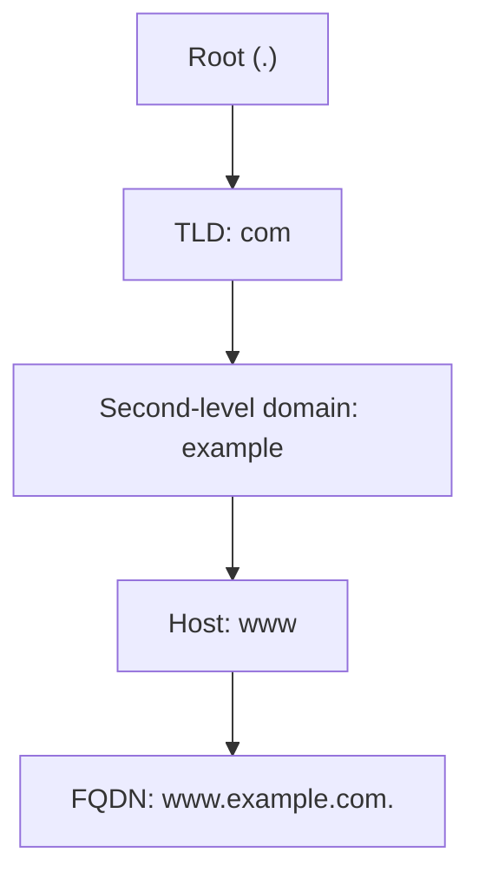

# Fully Qualified Domain Name (FQDN)

A **Fully Qualified Domain Name (FQDN)** is the complete, absolute address of a domain name within the DNS hierarchy, specifying the exact location of a host or service all the way up to the root (`.`).

## Overview

An FQDN names a resource *unambiguously* by spelling out every label from the host down to the DNS root, so it resolves the same way from anywhere on the Internet or a private network. Where a bare hostname or a relative name may depend on a search suffix, an FQDN leaves no room for interpretation — it is the fully-specified path through the [DNS hierarchy](DNS-Hierarchy-and-How-It-Works.md). An FQDN combines the **hostname** with the **domain name** that the [domain name structure](Domain-Name-Structure.md) defines, terminated by the root dot, and this is the form that DNS records, certificates, and service locators rely on.

## Structure of an FQDN

An FQDN typically has three parts plus the root:

```text
hostname.domain.tld.
```

For example: `www.example.com.`

- `www` → Hostname
- `example` → Second-level domain
- `com` → Top-level domain (TLD)
- `.` → Root (implicit or explicit in the DNS structure)

The FQDN reads left-to-right from the most specific label (the host) to the most general (the root), which is the reverse of how DNS actually resolves it — resolution starts at the root and walks down:



> [!NOTE]
> **The trailing dot**
> The final dot (`.`) represents the **root domain**. It is often omitted in day-to-day use but is always present in the DNS resolution process. A name ending in the dot is *absolute* (an FQDN); a name without it may be treated as *relative* and have a search suffix (DNS suffix) appended before resolution.

### Example FQDNs

- `mail.google.com.`
- `ftp.example.org.`
- `ns1.company.net.`

In these examples:

- `mail`, `ftp`, `ns1` are hostnames.
- `google.com`, `example.org`, `company.net` are domain names.
- `.` is the root.

### Key Characteristics

- **Unique Identification** — an FQDN is globally unique; no two hosts share the same absolute name.
- **Absolute Path** — it provides the full path from the host to the root, leaving no ambiguity.
- **Used in DNS Records** — records such as `A`, `AAAA`, `MX`, and `CNAME` rely on FQDNs to map names to addresses. See [DNS-Records-and-Their-Types](DNS-Records-and-Their-Types.md).

> [!TIP]
> **Hostname vs. FQDN**
> A **hostname** is just the leftmost label (`www`); the **FQDN** is that label plus the full domain suffix up to the root (`www.example.com.`). On a domain-joined Windows host the FQDN is the computer name concatenated with its **primary DNS suffix**.

## Determining a Host's FQDN

Windows (Command Prompt) — the **Host Name** plus **Primary DNS Suffix** fields together form the FQDN:

```cmd
ipconfig /all
```

Windows (PowerShell) — resolve the local machine's fully qualified name:

```powershell
[System.Net.Dns]::GetHostEntry($env:COMPUTERNAME).HostName
```

Linux / Unix — print the fully qualified name:

```bash
hostname --fqdn
```

## Use Cases

An FQDN is required (or strongly expected) wherever a precise, globally unique identifier is needed:

- Configuring web servers such as Apache or Nginx (virtual-host / server-name matching).
- Email server `MX` record configurations.
- SSL/TLS certificates, whose subject and Subject Alternative Names are FQDNs.
- Active Directory service location — domain controllers are found through `SRV` records under the domain's FQDN. See [Active Directory Domain Services](../Active-Directory-Domain-Services-AD-DS/Readme.md).

## Security Considerations

FQDNs are a primary target of reconnaissance because they double as an inventory of an organization's hosts and services. Predictable naming (for example `sql-prod-01.corp.example.com`) discloses role, environment, and topology before a single packet is sent at the host itself.

> [!WARNING]
> **FQDNs leak your attack surface**
> - **Subdomain / host enumeration** — brute forcing or scraping FQDNs (via [DNS records](DNS-Records-and-Their-Types.md), zone transfers, or wordlists) maps out reachable hosts and services.
> - **Certificate Transparency logs** — publicly logged TLS certificates expose FQDNs, frequently including internal or pre-production names an organization never intended to publish.
> - **Split-horizon misconfiguration** — internal FQDNs bleeding into the external view reveal private infrastructure. See [Split-DNS](Split-DNS.md).
> - **Virtual-host routing** — because web servers select a site by the FQDN in the `Host`/SNI value, an attacker who learns hidden FQDNs can reach otherwise-unlisted applications on a shared IP.
> - **PTR / reverse records** — reverse zones can map an address range straight back to descriptive FQDNs. See [Forward-and-Reverse-DNS-Zones](Forward-and-Reverse-DNS-Zones.md).

## Best Practices

- Avoid encoding sensitive role, environment, or technology hints into public FQDNs; keep descriptive naming to internal zones.
- Use [split-horizon DNS](Split-DNS.md) so internal FQDNs are never resolvable from the outside.
- Restrict zone transfers so the full list of FQDNs in a zone cannot be pulled by anyone.
- Always configure services (web, mail, AD, certificates) with the intended absolute FQDN rather than a bare hostname, to avoid suffix-dependent ambiguity.
- Audit Certificate Transparency logs periodically to catch inadvertently published internal FQDNs.

## Troubleshooting

| Symptom | Likely cause & fix |
|---------|--------------------|
| A short name resolves inconsistently across hosts | Different DNS search suffixes; use the full FQDN (or fix the suffix search list). |
| Name only resolves with a trailing dot | The name was being treated as relative and a suffix was appended; supply the absolute FQDN. |
| FQDN resolves internally but not externally | Record exists only in the internal [split-horizon](Split-DNS.md) view, or is missing from the public zone. |
| `ping <host>` works but `ping <host>.<domain>` fails | Missing or stale `A`/`AAAA` record for the FQDN; verify the zone and clear the [resolver cache](DNS-Cache.md). |

## References

- [RFC 1035 — Domain Names: Implementation and Specification](https://www.rfc-editor.org/rfc/rfc1035)
- [RFC 1034 — Domain Names: Concepts and Facilities](https://www.rfc-editor.org/rfc/rfc1034)
- [Microsoft — Naming conventions in Active Directory](https://learn.microsoft.com/en-us/troubleshoot/windows-server/active-directory/naming-conventions-for-computer-domain-site-ou)

## Related

- [Enterprise Windows Infrastructure Security](../Readme.md) — course hub and map of content
- [Domain-Name-Structure](Domain-Name-Structure.md) — the namespace structure an FQDN expresses — related note
- [DNS-Hierarchy-and-How-It-Works](DNS-Hierarchy-and-How-It-Works.md) — how an FQDN is resolved from the root down — related note
- [DNS-Records-and-Their-Types](DNS-Records-and-Their-Types.md) — the records an FQDN maps to — related note
- [Hosts-File](Hosts-File.md) — local FQDN-to-IP mapping — related note
- [Split-DNS](Split-DNS.md) — internal vs. external views of the same FQDN — related note
