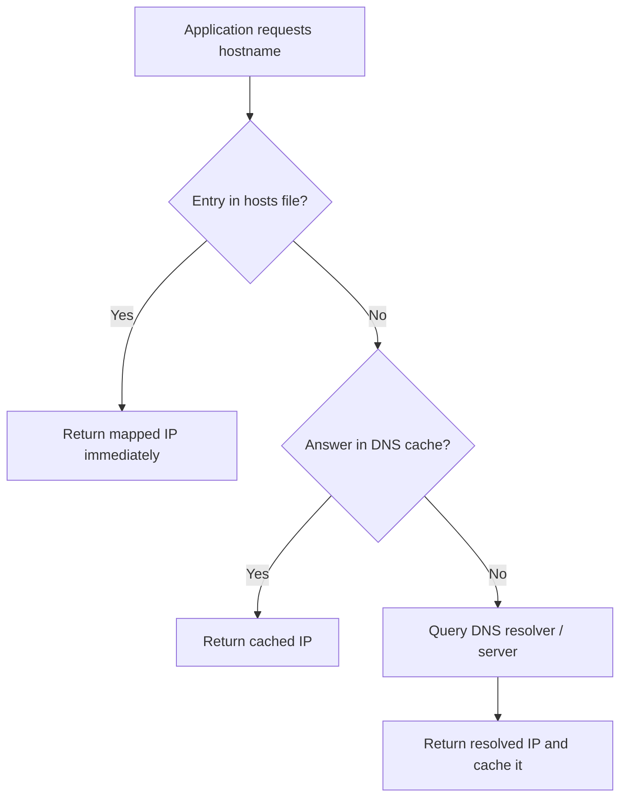

# Hosts File

The **hosts file** is a plain text configuration file used by operating systems to map **hostnames to IP addresses** before querying a DNS server. This allows **local and manual hostname resolution**, giving administrators or users control over how domains resolve on a specific machine.

## Overview

The hosts file predates the modern [Domain Name System](DNS-Hierarchy-and-How-It-Works.md) — before DNS existed, every host on the ARPANET shared a single `HOSTS.TXT` file mapping names to addresses. Today it survives as a per-machine static override: when an application resolves a name, the operating system's resolver typically consults the hosts file **before** issuing a query to a DNS server or reading the [DNS-Cache](DNS-Cache.md). A [Fully-Qualified-Domain-Name(FQDN)](Fully-Qualified-Domain-Name(FQDN).md) listed here therefore resolves locally with no network traffic at all.

For example, if you want `mywebsite.com` to resolve to `192.168.1.100`, add the following entry:

```text
192.168.1.100    mywebsite.com
```

When the system tries to access `mywebsite.com`, it will **use the hosts file first instead of DNS**.

> [!NOTE]
> **Resolution order**
> On most systems the hosts file is consulted **before** DNS. An entry here silently overrides whatever a DNS server would return for that name.

The diagram below shows where the hosts file sits in the client-side resolution path:



## Concepts

### Key Points

- Each entry contains an **IP address followed by one or more hostnames**
- Entries must be **one per line**
- **Comments start with `#`**
- **Administrator / root privileges** are required to modify the file
- The hosts file is **checked before DNS resolution**

### Location of Hosts File

|Operating System|Location|
|---|---|
|Windows|`C:\Windows\System32\drivers\etc\hosts`|
|Linux|`/etc/hosts`|
|macOS|`/etc/hosts`|
|Android|`/system/etc/hosts`|
|iOS|`/etc/hosts`|

### Hosts File Format

Example format:

```text
IP_ADDRESS    hostname    alias
```

Example entries:

```text
# Localhost
127.0.0.1       localhost
::1             localhost

# Local machines
192.168.1.61    win11-1.local
192.168.1.62    win11-2.local
192.168.1.7     kali.local

# Router
192.168.1.1     router.local www.router.local
```

Default Windows hosts file (annotated sample):

```text
# Copyright (c) 1993-2009 Microsoft Corp.
# Hosts File
# This is a sample HOSTS file used by Microsoft TCP/IP for Windows.
#
# This file contains the mappings of IP addresses to host names. Each
# entry should be kept on an individual line. The IP address should
# be placed in the first column followed by the corresponding host name.
# The IP address and the host name should be separated by at least one
# space.
#
# Additionally, comments (such as these) may be inserted on individual
# lines or following the machine name denoted by a '#' symbol.
#
# For example:
#
#      102.54.94.97     rhino.acme.com          # source server
#       38.25.63.10     x.acme.com              # x client host

# localhost name resolution is handled within DNS itself.
#	127.0.0.1       localhost
#	::1             localhost
192.168.1.61 win11.local
192.168.1.62 win11-2.local
192.168.1.7	kali.local
192.168.1.1 www.router.local router.local
```

## Configuration

> [!WARNING]
> **Requires elevation**
> Editing the hosts file requires **Administrator** (Windows) or **root** (Linux/macOS) privileges. On Windows, open the editor "as Administrator"; on Linux/macOS use `sudo`.

> [!NOTE]
> **Screenshot**
> 

### Common Uses

#### 1. Blocking Websites

Redirect unwanted domains to `0.0.0.0` or `127.0.0.1`.

```text
0.0.0.0 facebook.com
0.0.0.0 www.facebook.com
0.0.0.0 youtube.com
0.0.0.0 www.youtube.com
```

#### 2. Redirecting a Domain to a Specific IP

Force a domain to resolve to a chosen server.

```text
192.168.1.1 www.armourinfosec.com armourinfosec.com
```

#### 3. Testing Local Development Websites

Useful for testing websites before public DNS changes.

```text
127.0.0.1 armour.local
192.168.1.31 armour.local
```

#### 4. Bypassing DNS Resolution

If DNS is misconfigured or blocked, a manual entry can be used.

```text
203.0.113.10 mycustomdomain.com
```

### Sample Linux / macOS Hosts File

View the hosts file:

```bash
cat /etc/hosts
```

Example:

```text
127.0.0.1       localhost localhost.localdomain localhost4 localhost4.localdomain4
::1             localhost localhost.localdomain localhost6 localhost6.localdomain6

192.168.1.25    ns1.armour.local www.armour.local armour.local
192.168.1.26    ai.local www.ai.local infosec.local www.infosec.local
```

## Administration

### Flush DNS Cache (After Editing)

Sometimes DNS cache must be cleared for changes to take effect.

- Linux

```bash
systemctl restart systemd-resolved
```

- Windows

```cmd
ipconfig /flushdns
```

- macOS

```bash
dscacheutil -flushcache; sudo killall -HUP mDNSResponder
```

## Security Considerations

The hosts file is often used in **security testing and malware attacks**.

### Legitimate Uses

- Local development
- Blocking ads or trackers
- Testing DNS changes
- Network lab environments

### Malicious Uses

Malware may modify the hosts file to:

- Redirect banking websites
- Block antivirus update servers
- Perform phishing attacks

Example malicious entry:

```text
192.168.10.50  bank.com
```

> [!WARNING]
> **Hosts-file hijacking**
> This entry could redirect users to a **fake phishing server**. Because the hosts file overrides DNS, tampering here bypasses secure resolvers entirely. Monitor the file's integrity and restrict write access to administrators.

## Best Practices

- Keep the hosts file **minimal** — use it for local development, lab, and testing overrides, not as a substitute for proper DNS zone management.
- Restrict write permissions to **Administrators / root** and monitor the file's integrity (file-integrity monitoring or a scheduled hash check) to detect malicious edits.
- **Comment every custom entry** (`# reason / date`) so stale overrides are easy to find and remove later.
- **Flush the DNS/resolver cache** after editing so changes take effect, and remove temporary entries once testing is done — a forgotten override can silently break production resolution.
- During incident response, **inspect the hosts file first** when a host reaches the wrong server; malware and adware commonly plant redirects here.

## Troubleshooting

| Symptom | Likely cause & fix |
|---------|--------------------|
| Edit has no effect | Stale resolver cache — flush it (`ipconfig /flushdns` on Windows, restart `systemd-resolved` on Linux) and close/reopen the browser (browsers keep their own DNS cache). |
| Cannot save the file | Editor not elevated — reopen "as Administrator" (Windows) or edit with `sudo` (Linux/macOS). |
| Entry ignored entirely | Malformed line — ensure `IP` then whitespace then hostname, one entry per line, no leading `#` on the entry. |
| Name still resolves via DNS | Duplicate or later entry overrides it, or the name is fetched over a proxy/VPN that resolves remotely; check for split entries and proxy settings. |
| Redirect you did not create | Possible **hosts-file hijack** (malware/adware) — audit the file, compare against a known-good default, and restrict write access. |

## References

- [StevenBlack/hosts — curated hosts file blocking ads, malware, and trackers](https://github.com/StevenBlack/hosts)
- [Microsoft — TCP/IP host name resolution order](https://learn.microsoft.com/en-us/troubleshoot/windows-server/networking/tcpip-and-nbt-configuration-parameters)

## Related

- [Enterprise Windows Infrastructure Security](../Readme.md) — course hub and map of content
- [DNS-Cache](DNS-Cache.md) — resolution order before/after DNS lookups — related note
- [Fully-Qualified-Domain-Name(FQDN)](Fully-Qualified-Domain-Name(FQDN).md) — names mapped in the file — related note
- [DNS-Hierarchy-and-How-It-Works](DNS-Hierarchy-and-How-It-Works.md) — where the hosts file fits resolution — related note
