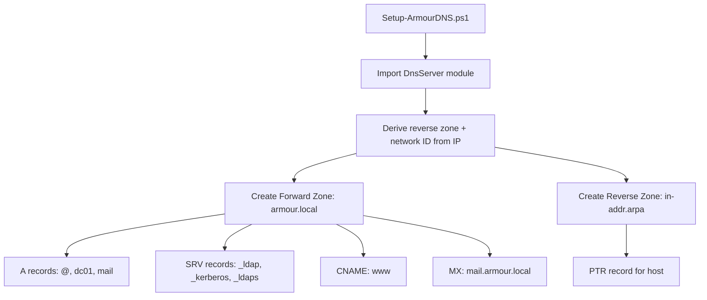

# PowerShell script to create DNS zones and DNS records for ADDS domain

An idempotent PowerShell script that provisions the forward and reverse DNS zones plus the core resource records (A, PTR, CNAME, MX, SRV) required by an Active Directory Domain Services domain (`armour.local`). It is designed to run on a Windows Server acting as the domain's DNS server.

## Overview

The script `Setup-ArmourDNS.ps1` automates DNS setup for the `armour.local` AD domain:

- Creates the **forward zone** `armour.local`.
- Auto-derives and creates the matching **reverse zone** (`in-addr.arpa`) from the server IP.
- Publishes the records a domain controller needs: `A`, `PTR`, `CNAME`, `MX`, and the `SRV` locator records for LDAP, Kerberos, and LDAPS.
- Is **idempotent** — an `Add-OrUpdateRecord` helper removes and re-adds an existing record instead of failing, so the script can be re-run safely.

> [!IMPORTANT]
> **Run as Administrator on the DNS server**
> The script imports the `DnsServer` module (part of the DNS Server role / RSAT DNS tools) and modifies the DNS zone data. It must be run in an elevated session on the machine holding the DNS Server role.

## Architecture



## PowerShell

> [!NOTE]
> **Invocation**
> The script file is named `Setup-ArmourDNS.ps1`.

```cmd
Setup-ArmourDNS.ps1
```

```powershell
<#
.SYNOPSIS
    Creates forward & reverse DNS zones and records for armour.local

.DESCRIPTION
    - Forward Zone: armour.local
    - Reverse Zone: Auto-derived from IP
    - Records: A, PTR, CNAME, MX, SRV (LDAP, Kerberos, LDAPS)
    - Includes validation & error handling

.NOTES
    Run as Administrator on DNS Server
#>

# ------------------------------
# Pre-checks
# ------------------------------
try {
    Import-Module DnsServer -ErrorAction Stop
} catch {
    Write-Error "DnsServer module not available. Install DNS role first."
    exit
}

# ------------------------------
# Variables
# ------------------------------
$zoneName = "armour.local"
$domainController = "dc01"
$ipAddress = "192.168.10.51"

# Auto-generate reverse zone
$ipParts = $ipAddress.Split('.')
$reverseZone = "$($ipParts[2]).$($ipParts[1]).$($ipParts[0]).in-addr.arpa"
$networkId = "$($ipParts[0]).$($ipParts[1]).$($ipParts[2]).0/24"

Write-Host "`n=== DNS Configuration for $zoneName ===" -ForegroundColor Cyan

# ------------------------------
# Function: Safe Record Add
# ------------------------------
function Add-OrUpdateRecord {
    param (
        $Name,
        $Zone,
        $Type,
        $ScriptBlock
    )

    try {
        $existing = Get-DnsServerResourceRecord -ZoneName $Zone -Name $Name -RRType $Type -ErrorAction SilentlyContinue

        if ($existing) {
            Write-Host "Updating $Type record: $Name.$Zone"
            Remove-DnsServerResourceRecord -ZoneName $Zone -Name $Name -RRType $Type -Force -ErrorAction Stop
        } else {
            Write-Host "Adding $Type record: $Name.$Zone"
        }

        & $ScriptBlock
    } catch {
        Write-Warning "Failed to process $Type record ($Name): $_"
    }
}

# ------------------------------
# Create Forward Zone
# ------------------------------
try {
    if (-not (Get-DnsServerZone -Name $zoneName -ErrorAction SilentlyContinue)) {
        Write-Host "Creating Forward Zone..."
        Add-DnsServerPrimaryZone -Name $zoneName -ReplicationScope "Domain" -ErrorAction Stop
    } else {
        Write-Host "Forward zone exists. Skipping..."
    }
} catch {
    Write-Error "Forward zone creation failed: $_"
}

# ------------------------------
# Create Reverse Zone
# ------------------------------
try {
    if (-not (Get-DnsServerZone -Name $reverseZone -ErrorAction SilentlyContinue)) {
        Write-Host "Creating Reverse Zone..."
        Add-DnsServerPrimaryZone -NetworkId $networkId -ReplicationScope "Domain" -ErrorAction Stop
    } else {
        Write-Host "Reverse zone exists. Skipping..."
    }
} catch {
    Write-Error "Reverse zone creation failed: $_"
}

# ------------------------------
# A Records
# ------------------------------
$records = @(
    @{ Name = "@"; IPv4 = $ipAddress },
    @{ Name = $domainController; IPv4 = $ipAddress },
    @{ Name = "mail"; IPv4 = $ipAddress }
)

foreach ($rec in $records) {
    Add-OrUpdateRecord -Name $rec.Name -Zone $zoneName -Type "A" -ScriptBlock {
        Add-DnsServerResourceRecordA -Name $rec.Name -ZoneName $zoneName -IPv4Address $rec.IPv4
    }
}

# ------------------------------
# SRV Records (LDAP, Kerberos, LDAPS)
# ------------------------------
$dcFQDN = "$domainController.$zoneName"

$SrvRecords = @(
    @{ Name="_ldap._tcp"; Port=389 },
    @{ Name="_kerberos._tcp"; Port=88 },
    @{ Name="_ldaps._tcp"; Port=636 }
)

foreach ($srv in $SrvRecords) {
    Add-OrUpdateRecord -Name $srv.Name -Zone $zoneName -Type "SRV" -ScriptBlock {
        Add-DnsServerResourceRecord -Srv `
            -Name $srv.Name `
            -ZoneName $zoneName `
            -DomainName $dcFQDN `
            -Port $srv.Port `
            -Priority 0 `
            -Weight 100
    }
}

# ------------------------------
# CNAME Record
# ------------------------------
Add-OrUpdateRecord -Name "www" -Zone $zoneName -Type "CNAME" -ScriptBlock {
    Add-DnsServerResourceRecordCName -Name "www" -ZoneName $zoneName -HostNameAlias $dcFQDN
}

# ------------------------------
# MX Record
# ------------------------------
Add-OrUpdateRecord -Name "@" -Zone $zoneName -Type "MX" -ScriptBlock {
    Add-DnsServerResourceRecordMX -Name "@" -ZoneName $zoneName -MailExchange "mail.$zoneName" -Preference 10
}

# ------------------------------
# PTR Record
# ------------------------------
try {
    $lastOctet = $ipParts[3]

    Add-OrUpdateRecord -Name $lastOctet -Zone $reverseZone -Type "PTR" -ScriptBlock {
        Add-DnsServerResourceRecordPtr -Name $lastOctet -ZoneName $reverseZone -PtrDomainName $dcFQDN
    }
} catch {
    Write-Warning "PTR creation failed: $_"
}

Write-Host "`nDNS configuration completed successfully." -ForegroundColor Green
```

Run the script bypassing the execution policy for a single invocation:

```cmd
powershell.exe -ExecutionPolicy Bypass -File .\Setup-ArmourDNS.ps1 -Verbose
```

## Configuration

Adjust these variables at the top of the script to match your environment before running:

| Variable | Purpose | Example |
| --- | --- | --- |
| `$zoneName` | Forward zone (AD domain FQDN) | `armour.local` |
| `$domainController` | DC hostname (short) used for A/SRV records | `dc01` |
| `$ipAddress` | DC IPv4 address; drives A/PTR and reverse zone | `192.168.10.51` |
| `$reverseZone` | Auto-derived reverse zone | `10.168.192.in-addr.arpa` |
| `$networkId` | Auto-derived /24 network ID for the reverse zone | `192.168.10.0/24` |

> [!TIP]
> **Records created**
> `A` for `@`, `dc01`, and `mail`; `SRV` locators for `_ldap._tcp`, `_kerberos._tcp`, `_ldaps._tcp`; a `www` `CNAME`; an `MX` pointing to `mail.armour.local`; and a `PTR` for the host in the reverse zone.

## Security Considerations

> [!WARNING]
> **AD-integrated DNS is a high-value target**
> - The `SRV` records this script publishes (`_ldap`, `_kerberos`, `_ldaps`) are exactly what an attacker enumerates to locate domain controllers. Keep AD-integrated zones on internal DNS only — never expose them to the internet.
> - `ReplicationScope "Domain"` stores the zones in AD and replicates them to all DCs in the domain; ensure this matches your intended replication boundary.
> - Restrict who can run DNS management cmdlets; the ability to add/remove records enables spoofing and man-in-the-middle attacks (e.g. malicious `A`/`SRV` overrides).

## Best Practices

- Run the script in a lab or change window first; it removes and re-adds records that already exist.
- Keep `$ipAddress` consistent with the DC's actual static IP so the auto-derived reverse zone and `PTR` are correct.
- Prefer secure dynamic updates on AD-integrated zones so only authenticated hosts can register records.
- Version-control the script so zone provisioning is repeatable and auditable.

## Troubleshooting

| Symptom | Likely cause | Action |
| --- | --- | --- |
| `DnsServer module not available` | DNS Server role / RSAT DNS tools missing | Install the DNS role, then re-run |
| Zone creation fails | Not elevated, or replication scope invalid outside a domain | Run as Administrator on a domain-joined DNS server |
| PTR not resolving | Reverse zone or `networkId` mismatch | Verify `$ipAddress` and confirm the reverse zone exists |

## References

- [Add-DnsServerPrimaryZone (Microsoft Learn)](https://learn.microsoft.com/powershell/module/dnsserver/add-dnsserverprimaryzone)
- [DnsServer PowerShell module (Microsoft Learn)](https://learn.microsoft.com/powershell/module/dnsserver/)

## Related
- [Enterprise Windows Infrastructure Security](../Readme.md) — course hub and map of content
- [Forward-and-Reverse-DNS-Zones](Forward-and-Reverse-DNS-Zones.md) — the forward/reverse zones this script creates — related note
- [DNS-Records-and-Their-Types](DNS-Records-and-Their-Types.md) — the A/PTR/CNAME/MX/SRV records published here — related note
- [Primary-(Master)-DNS-Server](Primary-(Master)-DNS-Server.md) — the primary zone role this script provisions — related note
- [Dynamic-DNS-(DDNS)](Dynamic-DNS-(DDNS).md) — dynamic registration of the records shown here — related note
