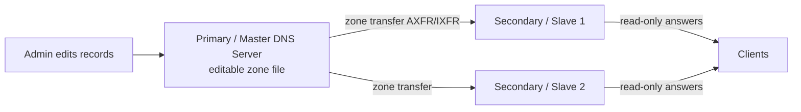

# Primary (Master) DNS Server

The **Primary (Master) DNS Server** is a fundamental part of the DNS (Domain Name System) infrastructure, responsible for storing and managing the original, authoritative zone data for a domain. It is the single **editable** source of truth from which every [Secondary (Slave)](Secondary-(Slave)-DNS-Server.md) server replicates.

## Overview

A Primary (Master) DNS Server is the authoritative server that **holds the original copy** of the DNS zone file for a specific domain. This zone file contains the resource records that map domain names to IP addresses and other essential data — see [DNS-Records-and-Their-Types](DNS-Records-and-Their-Types.md) for the record types involved.

- It is the **editable** source of truth for a domain's DNS information.
- All updates and changes to DNS records are made directly on this server.
- [Secondary (Slave)](Secondary-(Slave)-DNS-Server.md) servers receive copies of this data through **zone transfers**.
- It answers queries with the **Authoritative Answer (AA)** flag set for the [zones](Forward-and-Reverse-DNS-Zones.md) it hosts.

In a Windows Server deployment, a primary zone can be either **standard (file-backed)** — stored as a `.dns` text file on one server — or **Active Directory-integrated**, where the zone lives inside AD and multi-master-replicates to every domain controller. See [DNS-Server-Types](DNS-Server-Types.md) for how the primary role compares to the other server roles.

> [!NOTE]
> **"Master" vs "Primary"**
> The BIND/RFC world uses **master/slave**; Microsoft DNS uses **primary/secondary**. They describe the same relationship — the authoritative editable copy versus the read-only replica. AD-integrated zones blur this distinction because every DC holds a writable copy (multi-master), so there is no single "master" server.

## Key Characteristics

- **Original Zone File Storage** — contains all DNS records for the zone.
- **Direct Editability** — administrators can directly modify DNS records.
- **Zone Transfer Source** — provides zone data to [Secondary (Slave)](Secondary-(Slave)-DNS-Server.md) DNS servers via AXFR/IXFR.
- **Authoritative** — responds to queries with authoritative answers for the zone.

## Key Functions

- Stores and maintains the **zone file** for a domain.
- Responds to DNS queries and zone transfer requests.
- Supports adding, modifying, or deleting DNS records.
- Ensures high availability of DNS data when combined with Secondary servers.

## How It Works with Secondary Servers



- Secondary (Slave) DNS servers **retrieve a copy** of the zone file from the Primary (Master) via a **zone transfer**.
- The secondary polls the Primary's **SOA serial number**; a higher serial triggers a transfer of the changed data.
- Secondary servers ensure redundancy and load balancing for DNS queries.

## The Zone File

A zone file is the on-disk representation of the authoritative data the Primary owns. Every zone begins with a single **SOA (Start of Authority)** record followed by the **NS** records and the individual resource records.

### Example of a Zone File

A simple zone file (`example.com`) might look like:

```text
$TTL 86400
@ IN SOA ns1.example.com. admin.example.com. (
2025060901 ; Serial
3600 ; Refresh
1800 ; Retry
1209600 ; Expire
86400 ) ; Minimum TTL
```

```text
IN  NS  ns1.example.com.
IN  NS  ns2.example.com.
```

```text
www IN A 192.0.2.1
mail IN A 192.0.2.2
```

- `SOA` (Start of Authority) defines the zone's primary information.
- `NS` records specify the authoritative name servers.
- `A` records map domain names to IP addresses.

### SOA Timers

The SOA record's timers govern how [secondaries](Secondary-(Slave)-DNS-Server.md) stay in sync with the Primary:

| Field | Meaning |
|-------|---------|
| **Serial** | Version number of the zone; incremented on every edit so secondaries know to pull changes. |
| **Refresh** | How often (seconds) a secondary checks the Primary's serial. |
| **Retry** | How long a secondary waits before retrying a failed refresh. |
| **Expire** | How long a secondary keeps serving the zone if it cannot reach the Primary. |
| **Minimum TTL** | Default/negative-caching TTL for records without their own TTL. |

> [!IMPORTANT]
> **Always bump the serial**
> If you edit the zone but do not increase the **Serial**, secondaries will not detect the change and will keep serving stale data. Windows AD-integrated zones and most tooling increment it automatically, but hand-edited file-backed zones do not.

## Configuration (Windows Server)

On a Windows Server with the DNS Server role installed, primary zones are created and managed with the `DnsServer` PowerShell module. Create a standard file-backed primary zone:

```powershell
Add-DnsServerPrimaryZone -Name "armour.local" -ZoneFile "armour.local.dns"
```

Or create an Active Directory-integrated primary zone that replicates to every DC in the domain:

```powershell
Add-DnsServerPrimaryZone -Name "armour.local" -ReplicationScope "Domain"
```

List the zones the server hosts and inspect one:

```powershell
Get-DnsServerZone
Get-DnsServerZone -Name "armour.local"
```

Restrict zone transfers so only named secondaries can pull the zone (see Security Considerations):

```powershell
Set-DnsServerPrimaryZone -Name "armour.local" -SecureSecondaries TransferToSecureServers -SecondaryServers 192.168.1.52  # untested
```

See [PowerShell-script-to-create-DNS-zones](PowerShell-script-to-create-DNS-zones.md) for a full, idempotent zone-and-record provisioning script.

## Security Considerations

The Primary is the authoritative origin of a domain's name data, which makes both its **transfer surface** and its **write access** high-value to an attacker.

> [!WARNING]
> **Lock down zone transfers and record edits**
> - **Unrestricted zone transfers (AXFR)** let anyone dump every record in the zone — internal hostnames, subdomains, mail and service records — a reconnaissance goldmine. Restrict transfers to named secondaries only (`SecureSecondaries`), never allow "any server".
> - **Write access is spoofing power.** Anyone who can add or overwrite records on the Primary can redirect traffic with malicious `A`/`CNAME`/`SRV` records, enabling man-in-the-middle and credential capture. In AD, DNS `SRV` records (`_ldap`, `_kerberos`, `_ldaps`) are exactly what attackers enumerate to locate domain controllers — keep AD-integrated zones internal.
> - **Cache poisoning / spoofed answers** targeting downstream resolvers can be mitigated with [DNSSEC](DNSSEC.md) signing of the authoritative zone.
> - **Insecure dynamic updates** on an AD-integrated primary let unauthenticated hosts register or overwrite records; require **secure dynamic updates** only.

## Best Practices

- Pair every authoritative primary zone with at least one [secondary](Secondary-(Slave)-DNS-Server.md) for redundancy and load distribution.
- Restrict zone transfers to explicitly named secondary servers; never leave AXFR open.
- Sign internet-facing authoritative zones with [DNSSEC](DNSSEC.md) and require **secure dynamic updates** on AD-integrated zones.
- Increment the SOA **Serial** on every change (or let AD-integrated replication handle it) so secondaries stay in sync.
- Keep AD-integrated zones on internal DNS only — never expose domain-controller locator records to the internet.
- Back up zone data and version-control provisioning scripts so zones are repeatable and auditable.

## Troubleshooting

| Symptom | Likely cause & fix |
|---------|--------------------|
| Secondaries serving stale records | SOA **Serial** not incremented after an edit — bump it and confirm the transfer. |
| Zone transfer refused / secondary empty | Transfers restricted or secondary not in the allow-list — add it under `SecureSecondaries` / secondary servers. |
| `Add-DnsServerPrimaryZone` fails | DNS Server role / RSAT DNS tools missing or session not elevated — install the role and run as Administrator. |
| Records not resolving after edit | Client/resolver caching — flush with `ipconfig /flushdns` and re-query (see [DNS-Cache](DNS-Cache.md)). |
| AD-integrated zone missing on another DC | Replication lag or wrong `ReplicationScope` — verify scope and AD replication health. |

## References

- [Microsoft Learn — Add-DnsServerPrimaryZone](https://learn.microsoft.com/powershell/module/dnsserver/add-dnsserverprimaryzone)
- [Microsoft Learn — DNS on Windows Server](https://learn.microsoft.com/windows-server/networking/dns/dns-top)
- [RFC 1035 — Domain Names: Implementation and Specification](https://www.rfc-editor.org/rfc/rfc1035)
- [RFC 1034 — Domain Names: Concepts and Facilities](https://www.rfc-editor.org/rfc/rfc1034)

## Related

- [Enterprise Windows Infrastructure Security](../Readme.md) — course hub and map of content
- [Secondary-(Slave)-DNS-Server](Secondary-(Slave)-DNS-Server.md) — read-only replica and zone-transfer target — related note
- [DNS-Server-Types](DNS-Server-Types.md) — where the primary role fits among DNS roles — related note
- [Forward-and-Reverse-DNS-Zones](Forward-and-Reverse-DNS-Zones.md) — the zones a primary is authoritative for — related note
- [DNS-Records-and-Their-Types](DNS-Records-and-Their-Types.md) — the records stored in the zone file — related note
- [PowerShell-script-to-create-DNS-zones](PowerShell-script-to-create-DNS-zones.md) — scripted zone and record provisioning — related note
- [Dynamic-DNS-(DDNS)](Dynamic-DNS-(DDNS).md) — automatic record registration on the primary — related note
- [DNSSEC](DNSSEC.md) — signing the authoritative zone — related note
