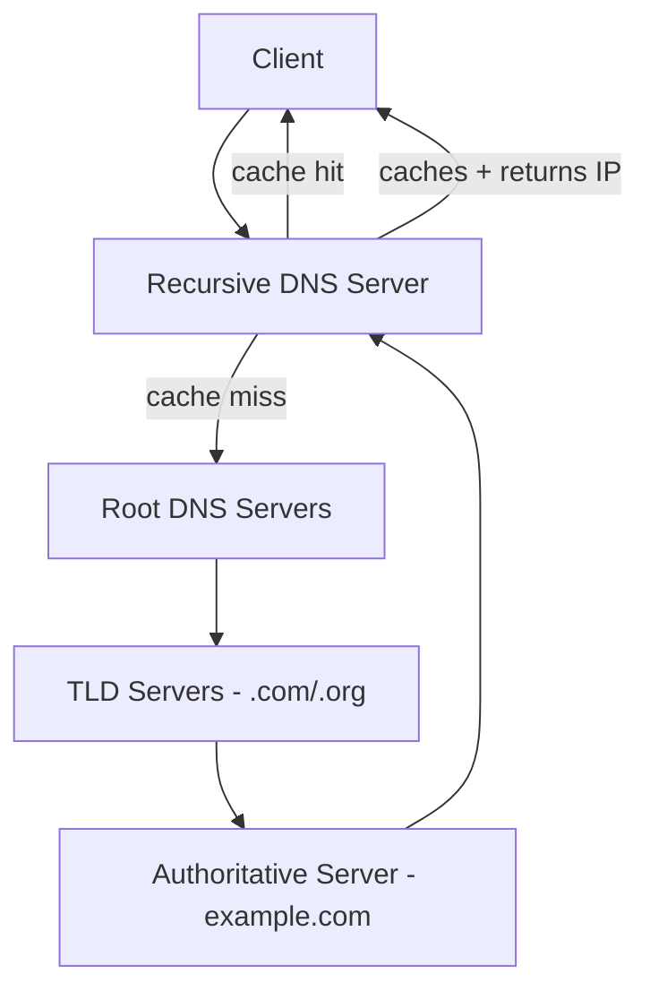

# Recursive (Caching) DNS Server

A **recursive (caching) DNS server** resolves domain names **on behalf of the client** by performing the full lookup process (recursion) through the [DNS hierarchy](DNS-Hierarchy-and-How-It-Works.md), then **caches** the answers so future queries for the same name are served instantly. It is the resolver a client actually talks to — the middleman between the stub resolver on a device and the global name-server tree.

## Overview

Client devices run only a lightweight *stub resolver*: they know how to ask a question but not how to walk the root → TLD → authoritative chain themselves. That work is delegated to a recursive resolver, which does two jobs:

- **Resolve** DNS queries from clients (PCs, phones, IoT devices) by chasing referrals down the [hierarchy](DNS-Hierarchy-and-How-It-Works.md) until it obtains an authoritative answer.
- **Cache** each resolved answer for the duration of its **TTL**, reducing lookup latency, bandwidth, and load on upstream [authoritative servers](Primary-(Master)-DNS-Server.md).

This is distinct from an [authoritative server](Primary-(Master)-DNS-Server.md), which answers *only* for zones it hosts and does not resolve arbitrary names for others. See [DNS Server Types](DNS-Server-Types.md) for how the roles compare. Instead of full recursion, a resolver can also be pointed at [forwarders](Forwarders-Nameserver.md) to hand queries upstream.

> [!NOTE]
> **In short**
> A recursive (caching) DNS server takes care of the **entire DNS lookup** for the client and **remembers the results** so it can answer faster next time.

## How It Works

1. A client (e.g., your laptop) wants to visit `www.example.com` but doesn't know the IP address.
2. It sends a DNS query to the **recursive DNS server** (e.g., your ISP's DNS or Google's `8.8.8.8`).
3. The recursive server:
     - If the record is in its **cache** (and still within TTL), it immediately returns the IP address — a **cache hit**.
     - If not (a **cache miss**), it performs **recursive queries**:
        - Contacts the **root DNS servers**.
        - Root servers refer it to the **TLD servers** (like `.com`, `.org`).
        - TLD servers refer it to the **authoritative server** for `example.com`.
        - It receives the IP address from the authoritative server and returns it to the client.
4. The server **stores (caches)** the answer for future requests, obeying the **TTL** (Time to Live) of the record.



> [!NOTE]
> **Recursive vs. iterative queries**
> The client-to-resolver step is a **recursive** query ("get me the final answer"). The resolver-to-nameserver steps are **iterative** queries ("give me your best referral"). One recursive request from the client typically drives several iterative requests behind the scenes.

## Caching and TTL

- **Speeds up** subsequent DNS queries for the same domain (served straight from memory).
- Reduces **bandwidth usage** and **latency** for clients.
- Lowers the load on root, TLD, and [authoritative](Primary-(Master)-DNS-Server.md) servers.
- Each cached record lives only as long as its **TTL**; once it expires, the resolver re-queries the hierarchy.

The cache this resolver builds is covered in [DNS-Server-Cache](DNS-Server-Cache.md) (server-side), which is distinct from the [DNS-Cache](DNS-Cache.md) each client maintains locally.

## Public Recursive Resolvers

Well-known open recursive resolvers on the internet:

| Provider | Primary | Secondary |
|----------|---------|-----------|
| Google Public DNS | `8.8.8.8` | `8.8.4.4` |
| Cloudflare | `1.1.1.1` | `1.0.0.1` |
| OpenDNS | `208.67.222.222` | `208.67.220.220` |
| Quad9 | `9.9.9.9` | `149.112.112.112` |

Your ISP's DNS servers also act as recursive resolvers for their subscribers.

## Windows Server Configuration

The Windows DNS Server role acts as a **recursive resolver** for clients on the network and **caches** results to speed up resolution and reduce external lookups. Recursion is controlled per-server.

```powershell
# Inspect recursion settings
Get-DnsServerRecursion

# Disable recursion (recommended on authoritative-only / internet-facing servers)
Set-DnsServerRecursion -Enable $false

# Enable recursion (internal caching resolver)
Set-DnsServerRecursion -Enable $true
```

Inspect and clear the server-side resolver cache:

```powershell
# View cached records held by the DNS server
Show-DnsServerCache

# Clear the DNS server cache
Clear-DnsServerCache
```

Trace resolution and test the resolver from a client:

```cmd
nslookup www.example.com 8.8.8.8
```

```bash
dig +trace www.example.com   # walk the hierarchy tier by tier
```

## Security Considerations

> [!WARNING]
> **Recursion is an attack surface**
> - **Open resolvers / DNS amplification** — a recursive server that answers queries from *anyone* on the internet can be abused for **DDoS amplification**: attackers spoof a victim's source IP and send small queries that return large responses, flooding the victim. Never expose recursion to the public internet.
> - **Cache poisoning / spoofing** — an attacker who injects forged answers into the resolver's cache can redirect users to malicious hosts. Mitigate with **DNSSEC validation**, **source-port randomization**, and query-ID entropy. See [DNSSEC](DNSSEC.md).
> - **Information disclosure** — cached entries and resolver logs reveal which internal and external services clients are contacting, making the resolver a reconnaissance goldmine.
> - **DNS tunneling / exfiltration** — a permissive recursive resolver can be used as a covert channel to smuggle data out over DNS queries.

Defensively, separate roles: keep **authoritative** servers non-recursive and internet-facing, and keep **recursive** resolvers internal-only (or restricted by ACL to known client ranges).

## Best Practices

- **Disable recursion on authoritative and internet-facing servers**; run recursion only on internal resolvers.
- **Restrict recursion to trusted client subnets** so the server is never an open resolver.
- **Enable DNSSEC validation** on resolvers to reject forged/poisoned answers.
- **Set TTLs deliberately** — short for records that change often, long to maximize cache benefit and reduce query load.
- Prefer [forwarders](Forwarders-Nameserver.md) or [conditional forwarders](Conditional-Forwarders-in-DNS.md) where policy, filtering, or split-horizon resolution is required.

## Troubleshooting

| Symptom | Likely cause & fix |
|---------|--------------------|
| Client gets stale IP after a record changed | Cached entry still within TTL — run `Clear-DnsServerCache` on the server and `ipconfig /flushdns` on the client. |
| Resolver returns wrong / malicious answers | Possible cache poisoning — clear the cache and enable DNSSEC validation ([DNSSEC](DNSSEC.md)). |
| External names fail to resolve | Recursion disabled or no upstream path — check `Get-DnsServerRecursion` or configure [forwarders](Forwarders-Nameserver.md). |
| Server abused in DDoS reflection reports | Open resolver exposed to the internet — restrict recursion to internal client ranges. |
| Slow first-time lookups | Normal cache miss walking the hierarchy; subsequent queries are cached until TTL expiry. |

## References

- [Cloudflare — What is a DNS resolver / recursive DNS](https://www.cloudflare.com/learning/dns/what-is-dns/)
- [Microsoft Learn — DNS on Windows Server](https://learn.microsoft.com/en-us/windows-server/networking/dns/dns-top)
- [Microsoft Learn — Set-DnsServerRecursion](https://learn.microsoft.com/en-us/powershell/module/dnsserver/set-dnsserverrecursion)
- [RFC 1034 — Domain Names: Concepts and Facilities](https://datatracker.ietf.org/doc/html/rfc1034)

## Related

- [Enterprise Windows Infrastructure Security](../Readme.md) — course hub and map of content
- [DNS-Server-Cache](DNS-Server-Cache.md) — the server-side cache this resolver builds — related note
- [DNS-Cache](DNS-Cache.md) — the client-side resolver cache — related note
- [DNS-Server-Types](DNS-Server-Types.md) — where recursive fits among DNS roles — related note
- [Forwarders-Nameserver](Forwarders-Nameserver.md) — forwarding upstream instead of full recursion — related note
- [Conditional-Forwarders-in-DNS](Conditional-Forwarders-in-DNS.md) — domain-specific forwarding — related note
- [DNS-Hierarchy-and-How-It-Works](DNS-Hierarchy-and-How-It-Works.md) — the hierarchy a recursive resolver walks — related note
- [DNSSEC](DNSSEC.md) — validation that defends against cache poisoning — related note
