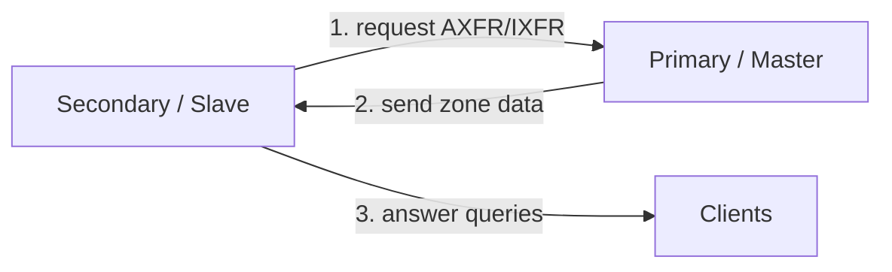

# Secondary (Slave) DNS Server

A **Secondary (Slave) DNS Server** holds a **read-only copy** of a zone that it obtains from a [Primary-(Master)-DNS-Server](Primary-(Master)-DNS-Server.md) through a **zone transfer**. It provides **redundancy**, **load balancing**, and **fault tolerance** so that DNS name resolution survives the loss of any single authoritative server.

## Overview

A secondary server is still an **authoritative** source for the zone — clients cannot tell whether an answer came from the primary or a secondary — but it never owns the editable master copy. All record changes are made on the [Primary-(Master)-DNS-Server](Primary-(Master)-DNS-Server.md) and then **replicated** to every secondary via a zone transfer (AXFR or IXFR). Because the secondary answers queries without adding load to the primary and can keep serving if the primary goes offline, keeping at least one secondary per authoritative zone is a baseline availability practice. Secondaries sit alongside the other roles described in [DNS-Server-Types](DNS-Server-Types.md), and they replicate the [forward and reverse zones](Forward-and-Reverse-DNS-Zones.md) defined on the primary.

> [!NOTE]
> **The SOA record drives replication**
> The [SOA record](DNS-Records-and-Their-Types.md) at the apex of the zone carries a **serial number** and the **refresh**, **retry**, and **expire** timers. A secondary polls the primary every *refresh* interval and compares serials; if the primary's serial is higher, it pulls the changes. If it cannot reach the primary, it keeps trying every *retry* interval until the *expire* time is reached, after which it stops answering for the zone to avoid serving stale data.

## Key Characteristics

- **Read-only copy** — zone data is managed on the primary and copied down; the secondary cannot be edited directly.
- **Zone transfer** — synchronization happens through AXFR (full) or IXFR (incremental) transfers.
- **Redundancy** — if the primary is down, the secondary continues to answer queries.
- **Load balancing** — queries can be distributed across primary and multiple secondaries.

## How Zone Transfer Works

1. The **primary server** maintains the authoritative, editable zone file.
2. The **secondary server** periodically requests a zone transfer (AXFR/IXFR) after comparing SOA serial numbers.
3. The primary sends the zone data to the secondary.
4. The secondary loads the data into its DNS service and begins answering queries.



Zone transfers ride on **port 53**. The initial handshake and small queries use UDP, but the transfer itself uses **TCP** because the payload usually exceeds a single UDP datagram. Example Wireshark display filters:

```text
udp.port == 53 || tcp.port == 53
```

```text
ip.addr == 192.168.1.52 && (udp.port == 53 || tcp.port == 53)
```

## Zone Transfer Types

Zone transfers replicate DNS records between a **Primary (Master)** and **Secondary (Slave)** server. There are two types: **AXFR (Full Zone Transfer, RFC 5936)** and **IXFR (Incremental Zone Transfer, RFC 1995)**.

> [!NOTE]
> **Further reading**
> For more in-depth documentation, see [Cloudflare's Guide](https://developers.cloudflare.com/dns/zone-setups/zone-transfers/).

### Why Zone Transfers Matter

- Ensure **redundancy** and **high availability** of DNS data.
- Keep secondary servers **in sync** with the primary.
- Facilitate **load balancing** and **distributed DNS infrastructure**.

### AXFR (Full Zone Transfer)

**Purpose:** Transfers the **entire DNS zone** from the primary to the secondary.

**Use cases:**

- Setting up a **new secondary DNS server**.
- When the secondary **loses sync** with the primary.

**Downsides:**

- Resource-intensive for **large zones**.
- A **security risk** if misconfigured — an open AXFR is the classic DNS Zone Transfer Attack.

**Example commands:**

```bash
# Canonical: dig AXFR against a specific server
dig axfr armour.local @192.168.1.51
```

```bash
nslookup -type=axfr armour.local 192.168.1.51   # untested
```

### IXFR (Incremental Zone Transfer)

**Purpose:** Transfers **only the records that changed** since the last synchronization.

**Use cases:**

- When **only a few records** have changed.
- Reduces **bandwidth usage** and speeds up synchronization.

**How it works:**

- The secondary requests changes since a specific **serial number** in the **SOA record**.
- The primary sends **only the updated records**; if it cannot compute a delta it falls back to a full AXFR.

**Example commands:**

```bash
# dig requests IXFR from the given serial number
dig ixfr=2024010101 armour.local @192.168.1.51
```

```bash
nslookup -type=ixfr armour.local 192.168.1.51   # untested
```

> [!NOTE]
> **Screenshot**
> 

### Key Differences Between AXFR and IXFR

| Feature              | AXFR (Full Zone Transfer)           | IXFR (Incremental Zone Transfer)   |
|----------------------|-------------------------------------|------------------------------------|
| **Data Transferred** | Entire DNS zone                     | Only changed records               |
| **Bandwidth Usage**  | High                                | Low                                |
| **Performance**      | Slower                              | Faster                             |
| **Best Used When**   | Setting up a new secondary server   | Keeping secondaries in sync        |
| **Security Risk**    | Can expose all DNS records          | More controlled                    |

## Security Considerations

An unrestricted secondary/transfer configuration turns the primary into an information-disclosure oracle: a single AXFR dumps every A, CNAME, SRV, MX, and TXT record in the zone, handing an attacker a map of internal hosts, subdomains, and services with no exploitation required. Zone-transfer enumeration is a standard reconnaissance step (`dig axfr`, `fierce`, `dnsrecon`).

> [!WARNING]
> **Restrict zone transfers**
> Restrict transfers to **named, trusted secondary servers only** — never allow AXFR from arbitrary clients. On Windows DNS Server set **Zone Transfers → Only to servers listed on the Name Servers tab** (or to specific IPs); on BIND use `allow-transfer { ...; }` ACLs. Test from an untrusted host that `dig axfr <zone> @<server>` is **refused**. Consider **TSIG** (transaction signatures) to authenticate transfers cryptographically.

## Best Practices

- Keep **at least one secondary** for every authoritative zone; place secondaries on separate subnets/sites for real fault tolerance.
- Lock transfers down to explicit secondary IPs and authenticate them with **TSIG** where supported.
- Prefer **IXFR** for routine updates to save bandwidth; reserve **AXFR** for initial setup or resync.
- Always **increment the SOA serial** after editing the zone, or secondaries will never pull the change.
- Tune SOA **refresh/retry/expire** timers to balance propagation speed against load on the primary.

## Troubleshooting

| Symptom | Likely cause & fix |
|---------|--------------------|
| Secondary never updates after an edit | SOA **serial not incremented** on the primary — bump it and let refresh run, or reload the zone. |
| Transfer refused / zone fails to load | Primary's **allow-transfer / Name Servers** list omits the secondary's IP — add it. |
| Zone goes stale and stops answering | Secondary could not reach primary past the **expire** timer — restore connectivity, then force a transfer. |
| Only full AXFRs, never IXFR | Primary doesn't support IXFR for the zone, or the requested serial is too old — verify IXFR support and journal retention. |
| Transfer starts on UDP then fails | Large zone needs **TCP/53** — ensure firewalls permit TCP, not just UDP, port 53. |

## References

- [RFC 5936 — DNS Zone Transfer Protocol (AXFR)](https://www.rfc-editor.org/rfc/rfc5936)
- [RFC 1995 — Incremental Zone Transfer in DNS (IXFR)](https://www.rfc-editor.org/rfc/rfc1995)
- [Microsoft Learn — DNS on Windows Server](https://learn.microsoft.com/en-us/windows-server/networking/dns/dns-top)
- [Cloudflare — DNS Zone Transfers](https://developers.cloudflare.com/dns/zone-setups/zone-transfers/)

## Related

- [Enterprise Windows Infrastructure Security](../Readme.md) — course hub
- [Primary-(Master)-DNS-Server](Primary-(Master)-DNS-Server.md) — source of zone transfers
- [DNS-Server-Types](DNS-Server-Types.md) — where the secondary role fits among DNS roles
- [Forward-and-Reverse-DNS-Zones](Forward-and-Reverse-DNS-Zones.md) — the zones a secondary replicates
- [DNS-Records-and-Their-Types](DNS-Records-and-Their-Types.md) — the SOA record that governs replication
- [Recursive-(Caching)-DNS-Server](Recursive-(Caching)-DNS-Server.md) — the non-authoritative resolver role
