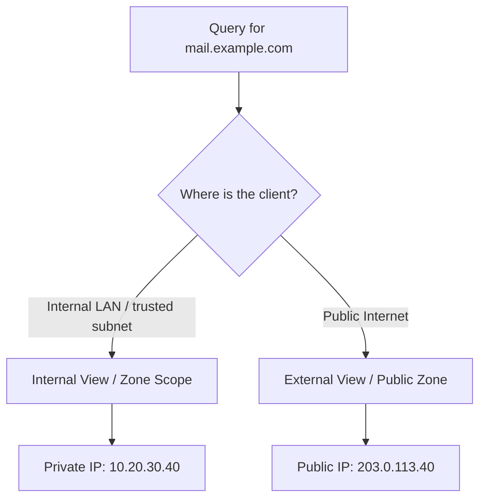
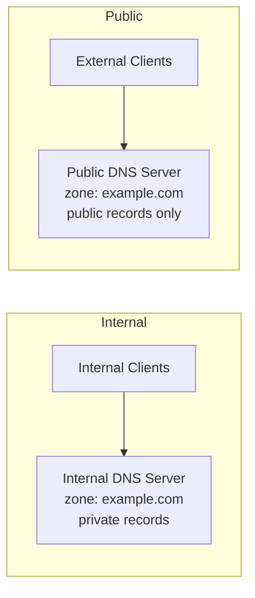

# Split-DNS

**Split DNS** (also called **split-horizon** or **split-brain DNS**) is a configuration in which the same DNS zone name resolves to *different answers depending on where the query originates* — internal clients receive one set of records, external clients another. It lets an organization publish the same domain name (e.g. `armour.local` or `corp.example.com`) both inside and outside the network while keeping internal topology private.

## Overview

- The same fully qualified domain name (FQDN) returns **different data** to internal vs. external resolvers.
- Internal clients typically get **private/RFC 1918 addresses** and see internal-only hostnames; external clients get only **public addresses** for public-facing services.
- Achieved either with **two separate authoritative servers** hosting the same zone name, or with **DNS Policies / zone scopes** on a single Windows Server (2016+).

> [!NOTE]
> **Two common motivations**
> **Security** — internal hostnames, server names, and private IP ranges are never exposed to the public internet. **Optimization** — internal users reach a service by its internal (often faster/nearer) IP rather than routing out to the public edge and back in (hairpinning).

## Concepts

| Term | Meaning |
| --- | --- |
| **Split-horizon / split-brain** | Same zone name serving different views by client origin |
| **Internal view** | Records returned to trusted internal networks (private IPs, internal-only hosts) |
| **External view** | Records returned to the public internet (public IPs, public services only) |
| **View / zone scope** | The named set of records selected per client (BIND calls it a *view*; Windows calls it a *zone scope*) |

**Example: same FQDN, two answers**

```text
; Internal view (queried from the corporate LAN)
mail.example.com.   IN  A   10.20.30.40

; External view (queried from the public internet)
mail.example.com.   IN  A   203.0.113.40
```

Internal clients reach the mail server directly on its private address; external clients are steered to the public-facing address (e.g. a reverse proxy or load balancer).

## Architecture



### Approach 1 — Two separate DNS servers

The classic implementation: an **internal DNS server** (e.g. AD-integrated, reachable only from the LAN) hosts the internal copy of the zone, and a separate **external/public DNS server** (hosted with a registrar or public DNS provider) hosts the public copy of the same zone name. The two zones are administered independently; internal records are simply never published to the external server.



### Approach 2 — Single Windows DNS server with DNS Policies

Windows Server 2016 and later support **DNS Policies** with **zone scopes**, letting one server return different records for the same zone based on a **client subnet** (or other criteria). This avoids running two separate servers.

## Configuration

### GUI Steps (separate-server model)

> [!NOTE]
> **Screenshot**
> 

1. On the internal DNS server, create/host the forward lookup zone `example.com` with **internal (private) records only**.
2. Ensure this internal zone is **not reachable from the internet** (internal interface / firewall).
3. Host the **public** `example.com` zone with your registrar or public DNS provider, containing **only public-facing records**.
4. Keep the two record sets in sync manually or via automation — they are independent copies.

### PowerShell — DNS Policies with zone scopes (Windows Server 2016+)

The following define an internal client subnet, add a zone scope to hold internal records, populate it, and create a query-resolution policy that maps that subnet to the internal scope. Commands are marked `# untested` — validate in a lab before production.

```powershell
# untested
# 1. Define the client subnet that represents "internal" clients
Add-DnsServerClientSubnet -Name "InternalSubnet" -IPv4Subnet "10.0.0.0/8"

# 2. Add a zone scope to the existing zone to hold the internal view
Add-DnsServerZoneScope -ZoneName "example.com" -Name "InternalScope"

# 3. Populate the internal scope with the private A record
Add-DnsServerResourceRecord -ZoneName "example.com" -A `
    -Name "mail" -IPv4Address "10.20.30.40" -ZoneScope "InternalScope"

# 4. The default scope keeps the public record
Add-DnsServerResourceRecord -ZoneName "example.com" -A `
    -Name "mail" -IPv4Address "203.0.113.40"

# 5. Create the query-resolution policy: internal subnet -> internal scope
Add-DnsServerQueryResolutionPolicy -Name "SplitBrainPolicy" `
    -Action ALLOW `
    -ClientSubnet "EQ,InternalSubnet" `
    -ZoneScope "InternalScope,1" `
    -ZoneName "example.com"
```

With this policy in place, queries from `10.0.0.0/8` resolve `mail.example.com` to `10.20.30.40`, while all other clients get the default `203.0.113.40`.

## Security Considerations

> [!WARNING]
> **Split DNS is an information-disclosure control — get it right**
> - **Internal-view leakage**: if internal records are accidentally published to the external zone (or the internal server answers internet-facing queries), attackers learn internal hostnames, naming conventions, and private IP ranges — valuable reconnaissance.
> - **Inconsistent views break trust chains**: differing answers can complicate TLS/SNI, certificate validation, and DNSSEC if a signed public zone diverges from an unsigned internal zone.
> - **Policy misconfiguration**: an overly broad client-subnet definition can hand the internal view to untrusted networks. Scope subnets tightly.

> [!TIP]
> **Defensive value**
> Correctly implemented split DNS is itself a hardening measure: the public zone exposes *only* the records an outsider legitimately needs, shrinking the external attack surface and the reconnaissance an attacker can gather via `dig`/`nslookup`.

## Best Practices

- Publish **only public-facing services** in the external view; keep everything else internal-only.
- Keep the internal and external record sets **documented and change-controlled** so they don't silently drift.
- Restrict the internal DNS server so it is **not resolvable from the internet**.
- Define client subnets **as narrowly as possible** when using DNS Policies.
- If you sign the public zone with **DNSSEC**, plan how the internal view interacts with validation (see [DNSSEC](DNSSEC.md)).

## Troubleshooting

| Symptom | Likely cause | Action |
| --- | --- | --- |
| Internal clients get the public IP | Client subnet not matched by the policy | Verify `Get-DnsServerClientSubnet` covers the client's source range |
| External clients see internal records | Internal records leaked into the public/default scope | Move private records into the internal zone scope only |
| Inconsistent answers after change | Cached results | Flush resolver cache (`ipconfig /flushdns`) and confirm TTLs |

Compare the two views from each vantage point:

```bash
# From an internal host
nslookup mail.example.com

# From an external host / public resolver
nslookup mail.example.com 8.8.8.8
```

## References

- [Add-DnsServerQueryResolutionPolicy (Microsoft Learn)](https://learn.microsoft.com/powershell/module/dnsserver/add-dnsserverqueryresolutionpolicy)
- [Add-DnsServerZoneScope (Microsoft Learn)](https://learn.microsoft.com/powershell/module/dnsserver/add-dnsserverzonescope)
- [Split-Brain DNS Deployment Using Windows DNS Server Policies (Microsoft Learn)](https://learn.microsoft.com/windows-server/networking/dns/deploy/split-brain-dns-deployment)

## Related
- [Enterprise Windows Infrastructure Security](../Readme.md) — course hub and map of content
- [DNS-Server-Types](DNS-Server-Types.md) — authoritative/recursive roles a split view builds on — related note
- [Forward-and-Reverse-DNS-Zones](Forward-and-Reverse-DNS-Zones.md) — zones the internal/external views duplicate — related note
- [Conditional-Forwarders-in-DNS](Conditional-Forwarders-in-DNS.md) — selective forwarding, often paired with split DNS — related note
- [DNSSEC](DNSSEC.md) — signing considerations for the public view — related note
- [DNS-Records-and-Their-Types](DNS-Records-and-Their-Types.md) — the records that differ between views — related note
