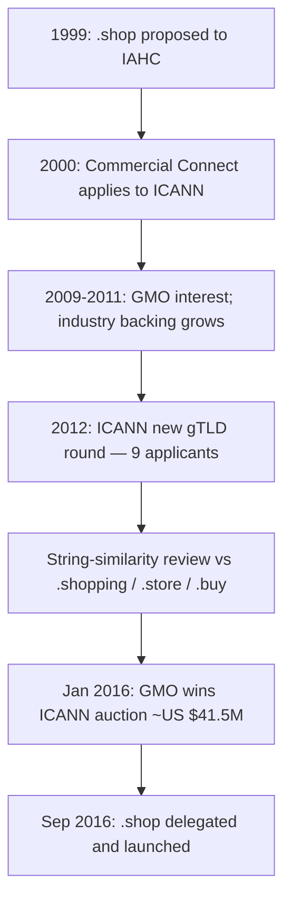

# .shop Top-Level Domain

**`.shop`** is a **generic top-level domain (gTLD)** launched in **September 2016** as a dedicated namespace for e-commerce websites. It is operated by **GMO Registry**, which won the rights in an **ICANN public auction** after a delegation process that stretched from a **1999 proposal** to a **2016 launch**.

## Overview

A top-level domain (TLD) is the right-most label in a domain name — the level directly beneath the DNS root (see [Domain-Name-Structure](Domain-Name-Structure.md) and [DNS-Hierarchy-and-How-It-Works](DNS-Hierarchy-and-How-It-Works.md)). `.shop` is an **unrestricted commercial gTLD**: anyone may register a second-level name under it, and it is marketed as an intuitive namespace for online retailers. Its unusually long road to delegation makes it a useful case study in how ICANN's **new gTLD program** handles competing applicants, string-similarity disputes, and contention resolution by auction.

> [!NOTE]
> **At a glance**
> `.shop` is a generic, unrestricted commercial gTLD intended for e-commerce. Nine organizations applied for it in the 2012 ICANN round; **GMO Registry** won the contention set at auction in January 2016 for approximately **US $41.5 million** and delegated the string in September 2016.

## History

The idea of a `.shop` gTLD dates back to at least **1999**, when an attempt was made to register it with the **International Ad Hoc Committee (IAHC)**. Its proposed purpose mirrored today's vision: providing a **dedicated namespace for e-commerce websites on the Internet**.

### Early Attempts (1999–2000)

- In **2000**, **Commercial Connect, LLC** submitted a request to **ICANN** to operate the `.shop` registry.
- The proposal was **well received**, but ICANN prioritized other domain extensions at the time.

### Growing Interest (2009–2011)

- In **2009**, Japan-based **GMO Registry** also expressed interest in the `.shop` domain.
- Despite this, **Commercial Connect** remained the most committed applicant, having pursued delegation since the early stages.
- By **2011**, Commercial Connect had gained support from several **e-commerce companies**.
- To strengthen industry backing, **Richard E. Last** of the **National Retail Federation** and **Shop.org** joined the company's board in late **2011**.

### ICANN gTLD Application Round (2012)

When ICANN opened the **new gTLD application round in 2012**, Commercial Connect founder **Jeffrey Smith** described `.shop` as:

> *"a hybrid between general public and specific use" designed to create a more secure, stable, and intuitive Internet.*

The domain was envisioned as a **clear indicator for websites engaged in online commerce**, particularly those using **credit-card transactions for selling products**.

In **May 2012**, **nine organizations** applied to operate the `.shop` registry, including:

- Google
- Amazon
- Famous Four Media
- Commercial Connect
- GMO Registry

Commercial Connect was notable for being the **only applicant that had also applied for `.shop` in the 2000 new-TLD round**.

### String Similarity Issues

During the application process, ICANN also received proposals for related domain extensions such as:

- `.shopping`
- `.store`
- `.buy`
- Similar names in **non-Latin languages**

ICANN stated it would avoid creating domain extensions that could **confuse users**, introducing the concept of **"string similarity."** This issue became part of the broader **dispute-resolution framework** within the new gTLD program.

### Auction Outcome (2016)

In **January 2016**, **GMO Registry of Japan** won the **ICANN public auction** with a **winning bid of approximately ₹380–₹390 crore (US $41.5 million)**, securing the rights to operate the **`.shop` registry**.

The domain officially **launched in September 2016**, providing businesses worldwide with a dedicated **e-commerce-focused domain namespace**.

## Delegation Timeline



## Looking Up the TLD

The delegation record for any TLD — including its sponsoring organization and authoritative name servers — is published in the **IANA Root Zone Database** and can be queried directly. WHOIS and `dig` expose the same data programmatically (see [Whois](Whois.md)).

Query IANA's WHOIS server for the `.shop` delegation record:

```bash
whois -h whois.iana.org shop   # untested
```

List the authoritative name servers for the `.shop` zone:

```bash
dig NS shop. +short   # untested
```

> [!TIP]
> **TLD vs. second-level lookups**
> Querying `shop.` (with the trailing dot) returns data about the **TLD itself** — its NS records and registry. To research an individual storefront, query the full domain, e.g. `dig NS example.shop`, or run WHOIS against the registry/registrar for registrant details.

## Security Considerations

> [!WARNING]
> **New gTLDs are a phishing and typosquatting surface**
> Commerce-themed gTLDs like `.shop` are attractive to attackers precisely because they *look* trustworthy to shoppers. Common abuse patterns include:
> - **Fake storefronts and credit-card phishing** — a namespace explicitly associated with buying goods lends false legitimacy to lookalike shops harvesting payment data.
> - **Typosquatting / combosquatting** — registering `brand.shop` or `brand-shop.shop` to impersonate a legitimate retailer's brand.
> - **String-similarity / homograph confusion** — the very ambiguity between `.shop`, `.shopping`, `.store`, and `.buy` that ICANN flagged can be weaponized to mislead users about who they are transacting with.

From an offensive standpoint, enumerating a target brand's presence across new gTLDs (via WHOIS, certificate transparency, and passive DNS) surfaces both legitimate assets and rogue lookalikes. From a defensive standpoint, brands often make **defensive registrations** in high-risk gTLDs and monitor for abusive registrations of their marks. Because `.shop` is **unrestricted**, there is no eligibility gate to slow down malicious registrants — vetting must happen downstream through brand-protection and takedown processes.

## Best Practices

- **Defensively register** your primary brand under high-risk commerce gTLDs (`.shop`, `.store`, `.shopping`) to deny them to squatters.
- **Monitor** certificate transparency logs and passive-DNS feeds for newly registered lookalike `.shop` domains impersonating your brand.
- Treat an unfamiliar `.shop` (or other new-gTLD) storefront as **unverified** until WHOIS, HTTPS certificate ownership, and business identity are confirmed.
- Use registry/registrar **abuse contacts** and ICANN's dispute mechanisms (e.g. UDRP) to pursue takedowns of infringing registrations.

## Troubleshooting

| Symptom | Likely cause & fix |
|---------|--------------------|
| `whois shop` returns nothing useful | Query IANA's server explicitly: `whois -h whois.iana.org shop`. |
| A `.shop` site looks like a known brand but "feels off" | Verify the registrant via WHOIS and the HTTPS certificate subject; likely a typosquat, not the real brand. |
| `dig NS shop.` returns no records | Confirm the trailing dot and that your resolver can reach the root/TLD servers (see [DNS-Hierarchy-and-How-It-Works](DNS-Hierarchy-and-How-It-Works.md)). |

## References

- [ICANN — New gTLD Program](https://newgtlds.icann.org/en/)
- [IANA — Root Zone Database: .shop delegation record](https://www.iana.org/domains/root/db/shop.html)
- [GMO Registry — nic.shop](https://nic.shop/)

## Related

- [Enterprise Windows Infrastructure Security](../Readme.md) — course hub and map of content
- [Domain-Name-Structure](Domain-Name-Structure.md) — where the TLD sits in the namespace
- [DNS-Hierarchy-and-How-It-Works](DNS-Hierarchy-and-How-It-Works.md) — root, TLD, and authoritative resolution flow
- [Domain-Appraisals](Domain-Appraisals.md) — how the TLD influences a domain's value
- [Whois](Whois.md) — registration and delegation lookups for domains and TLDs
