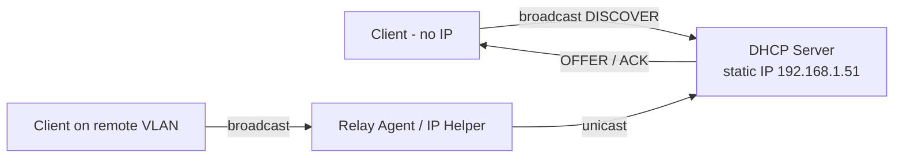

# DHCP (Dynamic Host Configuration Protocol)

**DHCP** is a network management protocol used to automatically assign IP addresses and other network configuration parameters (such as subnet mask, default gateway, and DNS servers) to devices on a network. This eliminates the need to manually configure each client device.

## Overview

DHCP centralizes IP address management: a single server hands out leases to clients on demand, guaranteeing consistent, conflict-free addressing across a subnet. It runs over **UDP** — port **67** on the server, port **68** on the client — and delivers the initial configuration through the [DORA-Process](DORA-Process.md) handshake.

## Concepts

- **Lease** — a time-bound assignment of an IP address (and options) to a client.
- **Scope** — the pool of addresses a server may lease on a subnet (see [Scope-in-a-DHCP-Server](Scope-in-a-DHCP-Server.md)).
- **Options** — extra parameters (gateway, DNS, domain, boot server) delivered with a lease.
- **Relay agent** — forwards DHCP across subnets when the server is not local (see [DHCP-Relay-Agent-IP-Helper](DHCP-Relay-Agent-IP-Helper.md)).

## Architecture



## Installation

### Requirements for a DHCP Server

#### 1. Static IP Address

The DHCP server **must use a static IP address** to ensure clients can reliably communicate with it.

```text
IP Address : 192.168.1.51
Subnet     : 255.255.255.0
Gateway    : 192.168.1.1
DNS        : 8.8.8.8
```

#### 2. Operating System

A DHCP server can run on:

- **Linux** (Ubuntu, Debian, CentOS, etc.)
- **Windows Server**
- **Network appliances / routers** with built-in DHCP functionality

#### 3. DHCP Server Software

Examples:

- **Linux**:
    - `isc-dhcp-server`
    - `dnsmasq`
- **Windows Server**:
    - Built-in DHCP Server role
- **Network OS / Routers**:
    - MikroTik RouterOS
    - Cisco IOS
    - OpenWRT

#### 4. Defined IP Pool (Address Scope)

You must define the **range of IP addresses (scope)** that can be leased to clients.

```text
Range  : 192.168.1.111 – 192.168.1.250
Subnet : 255.255.255.0
```

This prevents the DHCP server from assigning IPs reserved for:

- Servers
- Printers
- Network devices
- Infrastructure components

#### 5. Gateway and DNS Information

The DHCP server should provide:

- Default Gateway (for external routing)
- DNS Server (for name resolution)

```text
Gateway : 192.168.1.1
DNS     : 8.8.8.8
```

#### 6. Lease Time Configuration

Lease time defines how long a client can use an IP address before renewal.

- **Short leases** → Useful for guest Wi-Fi or high device turnover
- **Long leases** → Suitable for stable environments

Example:

```text
default-lease-time 600;
max-lease-time     7200;
```

> [!TIP]
> **Match lease time to churn**
> Short leases reclaim addresses quickly on high-turnover networks (guest Wi-Fi) but increase renewal traffic; long leases suit stable workstation subnets. Right-sizing the lease avoids pool exhaustion without flooding the server with `DHCPREQUEST` renewals.

#### 7. Network Interface Binding

The DHCP service must bind to the correct network interface connected to the target subnet.

Example (Linux `/etc/default/isc-dhcp-server`):

```ini
INTERFACESv4="eth0"
```

#### 8. Firewall & Port Requirements

DHCP uses **UDP**:

- **Port 67** → DHCP Server
- **Port 68** → DHCP Client

Ensure:

- Firewall rules allow UDP 67/68
- Broadcast traffic is not blocked within the subnet

## Enterprise Deployment

### Should There Be More Than One DHCP Server?

In most environments, there should be **only one active DHCP server per broadcast domain**.

> [!WARNING]
> **Uncoordinated DHCP servers**
> Two uncoordinated DHCP servers in the same broadcast domain can cause:
> - IP address conflicts
> - Inconsistent DNS or gateway settings
> - Intermittent connectivity issues
> - Unpredictable client behavior

### When Multiple DHCP Servers Are Acceptable

Multiple DHCP servers are valid **only if properly configured**.

#### 1. Split Scope Configuration

Each server manages a different portion of the IP pool:

```text
Server A: 192.168.1.10  – 192.168.1.100
Server B: 192.168.1.101 – 192.168.1.200
```

#### 2. DHCP Failover

Supported in enterprise environments (e.g., Windows Server failover or ISC DHCP failover):

- Active/Standby
- Load-balanced configuration
- Automatic lease synchronization

See [DHCP-High-Availability-Failover](DHCP-High-Availability-Failover.md) for the full comparison of these modes.

#### 3. Different Subnets / VLANs

Each VLAN or subnet can have its own DHCP server or centralized DHCP with relay agents.

Example:

- VLAN 10 → 192.168.10.0/24
- VLAN 20 → 192.168.20.0/24

In routed environments, a **DHCP relay agent (IP helper)** forwards requests to the central server.

## Security Considerations

> [!WARNING]
> **DHCP is unauthenticated by design**
> The protocol has no built-in authentication — a client accepts configuration from whichever server answers its broadcast first. Attackers abuse this two ways: a [rogue server](Rogue-DHCP-Server.md) hands out its own IP as the gateway/DNS to become a man-in-the-middle, and a [starvation attack](DHCP-Starvation-Attack.md) exhausts the legitimate pool so clients are forced onto the rogue server. Both are staples of internal network attacks.

To secure DHCP infrastructure:

- Limit leases per MAC address (mitigates [DHCP-Starvation-Attack](DHCP-Starvation-Attack.md))
- Enable **DHCP snooping** on managed switches (see [DHCP-Snooping](DHCP-Snooping.md))
- Block rogue DHCP servers (see [Rogue-DHCP-Server](Rogue-DHCP-Server.md))
- Use MAC filtering where appropriate (see [DHCP-Filters-Allow-and-Deny](DHCP-Filters-Allow-and-Deny.md))
- Monitor logs for abnormal lease activity

Full attack surface and defenses: [DHCP-Security-Issues-and-Attacks](DHCP-Security-Issues-and-Attacks.md).

## Best Practices

- Run **only one DHCP server per broadcast domain**, unless a properly designed split-scope or failover configuration is implemented.
- Give the DHCP server a **static IP** and keep its address (and other infrastructure hosts) outside the leasable scope via an [exclusion range](Exclusion-Range-in-DHCP.md).
- Use [reservations](DHCP-Reservations.md) for servers and printers instead of static addresses, so option and DNS changes propagate centrally.
- Size the lease duration to match device churn and monitor logs for abnormal lease activity.
- Enable **DHCP snooping** on access switches and authorize DHCP servers so rogue servers cannot offer leases.

## Troubleshooting

| Symptom | Likely cause & fix |
| --- | --- |
| Clients receive `169.254.x.x` (APIPA) addresses | No DHCP reply reaching them — confirm the scope is active/authorized, the service is bound to the right interface, and a [relay agent](DHCP-Relay-Agent-IP-Helper.md) is set on remote subnets |
| IP address conflicts on the LAN | A second or [rogue](Rogue-DHCP-Server.md) server is answering — check `ipconfig /all` for an unexpected gateway/DNS and enable [DHCP snooping](DHCP-Snooping.md) |
| Pool exhausted, new clients get no lease | Scope too small or a [starvation attack](DHCP-Starvation-Attack.md) — widen the scope, shorten leases, and limit leases per MAC |
| Remote-subnet clients get no address | Missing IP helper — configure the relay agent to forward broadcasts to the central server |

## References

- [RFC 2131 — Dynamic Host Configuration Protocol](https://www.rfc-editor.org/rfc/rfc2131)
- [RFC 2132 — DHCP Options and BOOTP Vendor Extensions](https://www.rfc-editor.org/rfc/rfc2132)
- [DHCP overview (Microsoft Learn)](https://learn.microsoft.com/en-us/windows-server/networking/technologies/dhcp/dhcp-top)

## Related

- [Enterprise Windows Infrastructure Security](../Readme.md) — course hub and map of content
- [DORA-Process](DORA-Process.md) — related note
- [Scope-in-a-DHCP-Server](Scope-in-a-DHCP-Server.md) — related note
- [DHCP-Server-Options](DHCP-Server-Options.md) — related note
- [DHCP-Relay-Agent-IP-Helper](DHCP-Relay-Agent-IP-Helper.md) — related note
- [DHCP-High-Availability-Failover](DHCP-High-Availability-Failover.md) — related note
- [DHCP-Snooping](DHCP-Snooping.md) — related note
- [DHCP-Security-Issues-and-Attacks](DHCP-Security-Issues-and-Attacks.md) — related note
- [Networking Fundamentals](../Networking-Fundamentals/Readme.md) — related note
