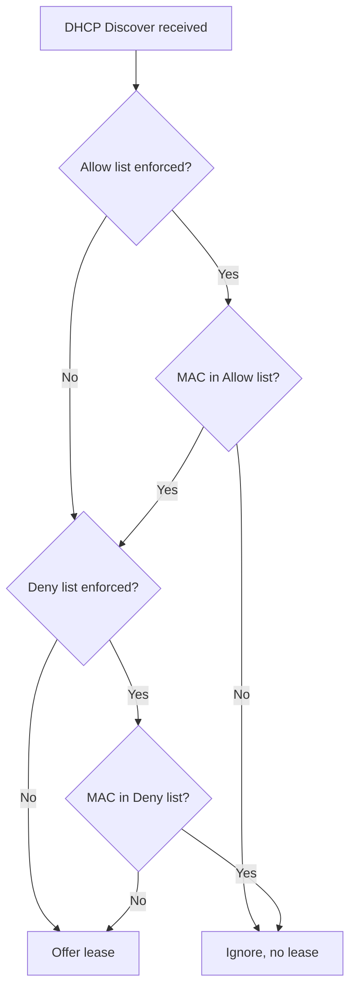

# DHCP Filters: Allow and Deny

DHCP filters (Allow/Deny) control **which devices may receive an IP address** from a DHCP server, keyed on the client's **MAC address**. They add a layer of link-layer access control on top of a standard scope.

## Overview

A Windows DHCP server can maintain two independent MAC lists — an **Allow list** and a **Deny list** — and enforce either or both. When a client broadcasts a DHCP Discover during the [DORA-Process](DORA-Process.md), the server checks the client's hardware address against the enforced lists before it will offer a lease from the [scope](Scope-in-a-DHCP-Server.md). This is complementary to [DHCP-Reservations](DHCP-Reservations.md) (which bind a specific MAC to a fixed address) but serves a different purpose: filters decide *whether* a client is served at all, not *which* address it gets.

Because the decision is based purely on a self-reported MAC address, filtering is an administrative convenience and a weak deterrent — not a security boundary. See [DHCP-Security-Issues-and-Attacks](DHCP-Security-Issues-and-Attacks.md) for where it fits in the broader defense picture.

## How It Works

- **Allow filter** — only devices whose MAC address is in the Allow list receive DHCP leases. Everything else is ignored, even if it broadcasts a valid DHCP Discover.
- **Deny filter** — devices whose MAC address is in the Deny list are refused a lease. Everything else is served.

> [!NOTE]
> **Allow only, Deny only, or both**
> Choose the model that fits your strategy. **Allow only** is a strict whitelist for high-trust segments (labs, classrooms, secure VLANs). **Deny only** is a lightweight blacklist for quarantining known-bad devices. **Both** enforces the Allow list first, then subtracts anything also on the Deny list.

The server evaluates an incoming request against whichever lists are enforced:



### Behavior Summary

| Filter setup | Result |
|---|---|
| Only Allow list used | Only listed MACs get DHCP leases |
| Only Deny list used | All except listed MACs get DHCP leases |
| Both Allow and Deny | Only MACs in the Allow list **and not** in the Deny list |
| No filters used | All DHCP clients are served (default) |

### Use Cases

- Block unauthorized or rogue devices from leasing an address.
- Restrict a segment to approved devices only (classrooms, labs, secure environments).
- Add coarse device-level access control where full VLAN segmentation is not in place.

## Configuration

### DHCP Manager (GUI)

1. Open **DHCP Manager**.
2. Expand the server → IPv4 → **Filters** → right-click **Allow** or **Deny** → **Enable**.
3. Right-click **Allow Filters** or **Deny Filters** → **New Filter**.
4. Enter the client MAC address (no separators, e.g. `001122334455`) and an optional description.

### `netsh` equivalent

```cmd
netsh dhcp server v4 set filterstatus enforceallowlist=1 enforcedenylist=1
netsh dhcp server v4 add filter allow 001122334455 "Approved laptop"
netsh dhcp server v4 add filter deny  AABBCCDDEEFF "Rogue device"
netsh dhcp server v4 show filter
```

### PowerShell equivalent

```powershell
Set-DhcpServerv4FilterList -Allow $true -Deny $true                                   # untested
Add-DhcpServerv4Filter -List Allow -MacAddress "00-11-22-33-44-55" -Description "Approved laptop"  # untested
Add-DhcpServerv4Filter -List Deny  -MacAddress "AA-BB-CC-DD-EE-FF" -Description "Rogue device"     # untested
Get-DhcpServerv4Filter                                                                # untested
```

> [!TIP]
> **Vendor OUI wildcards**
> MAC wildcards are supported (e.g. `001122*`) so you can allow or deny an entire vendor OUI in a single entry — useful for admitting a fleet of known hardware, but remember the OUI is trivially spoofable.

## Security Considerations

> [!WARNING]
> **MAC filtering is not a security boundary**
> DHCP filters are defeated trivially because the attacker fully controls their own source MAC address. The filter only decides who gets an automatically-assigned lease — a device can still be **manually** configured with a static IP and reach the network regardless of the filter.

MAC spoofing to defeat an Allow filter:

```bash
# Read the current MAC, spoof an allow-listed one, then request a lease
ip link set eth0 down
macchanger -m 00:11:22:33:44:55 eth0      # or: ip link set eth0 address 00:11:22:33:44:55
ip link set eth0 up
dhclient -v eth0
```

The hard part for the attacker is **discovering** an allow-listed MAC. That is obtained via passive sniffing (`tcpdump -e`), ARP scanning (`arp-scan -l`, `nmap -PR`), or simply reading the label on an approved device. Once a valid MAC is known, the filter provides no protection.

This is why MAC filtering must be backed by switch-level and network-access controls rather than relied on alone — see [DHCP-Snooping](DHCP-Snooping.md) for the trusted-port defense that actually stops [rogue servers](Rogue-DHCP-Server.md), plus 802.1X and NAC for authenticated port access.

## Best Practices

- Treat filtering as **defense-in-depth**, never as the sole access control — pair it with [DHCP-Snooping](DHCP-Snooping.md), 802.1X, or NAC.
- Prefer an **Allow list** (whitelist) for high-security segments; a Deny list only stops MACs you already know about.
- Combine with **port security** on the switch so a spoofed MAC on the wrong port is dropped before it reaches DHCP.
- Keep filter entries documented and reviewed — stale Allow entries silently admit decommissioned or cloned devices.
- Log and alert on DHCP denials to surface unauthorized connection attempts.

## Troubleshooting

| Symptom | Likely cause & fix |
|---|---|
| Approved device gets an APIPA (169.254.x.x) address | Its MAC is missing from the enforced Allow list, or the Allow list is enforced but empty — add the MAC or verify `filterstatus` |
| Denied device still on the network | It has a **static IP** configured; filtering only governs dynamic leases — enforce at the switch (port security / 802.1X) |
| Filter changes have no effect | Enforcement not enabled — confirm `enforceallowlist` / `enforcedenylist` is set and the correct list is active |
| Whole vendor unexpectedly blocked/allowed | An OUI **wildcard** entry (e.g. `001122*`) is matching more devices than intended — narrow it to full MACs |

## References

- [Add-DhcpServerv4Filter (Microsoft Learn PowerShell reference)](https://learn.microsoft.com/en-us/powershell/module/dhcpserver/add-dhcpserverv4filter)
- [DHCP overview (Microsoft Learn)](https://learn.microsoft.com/en-us/windows-server/networking/technologies/dhcp/dhcp-top)
- [RFC 2131 — Dynamic Host Configuration Protocol](https://www.rfc-editor.org/rfc/rfc2131)

## Related

- [DHCP-Reservations](DHCP-Reservations.md) — MAC-based fixed-address assignment
- [DHCP(Dynamic-Host-Configuration-Protocol)](DHCP(Dynamic-Host-Configuration-Protocol).md) — the protocol these filters govern
- [DHCP-Security-Issues-and-Attacks](DHCP-Security-Issues-and-Attacks.md) — filtering as one mitigation among many
- [DHCP-Snooping](DHCP-Snooping.md) — the stronger switch-level control filters should back onto
- [Rogue-DHCP-Server](Rogue-DHCP-Server.md) — the threat MAC filtering only partially addresses
- [Enterprise Windows Infrastructure Security](../Readme.md) — course hub
