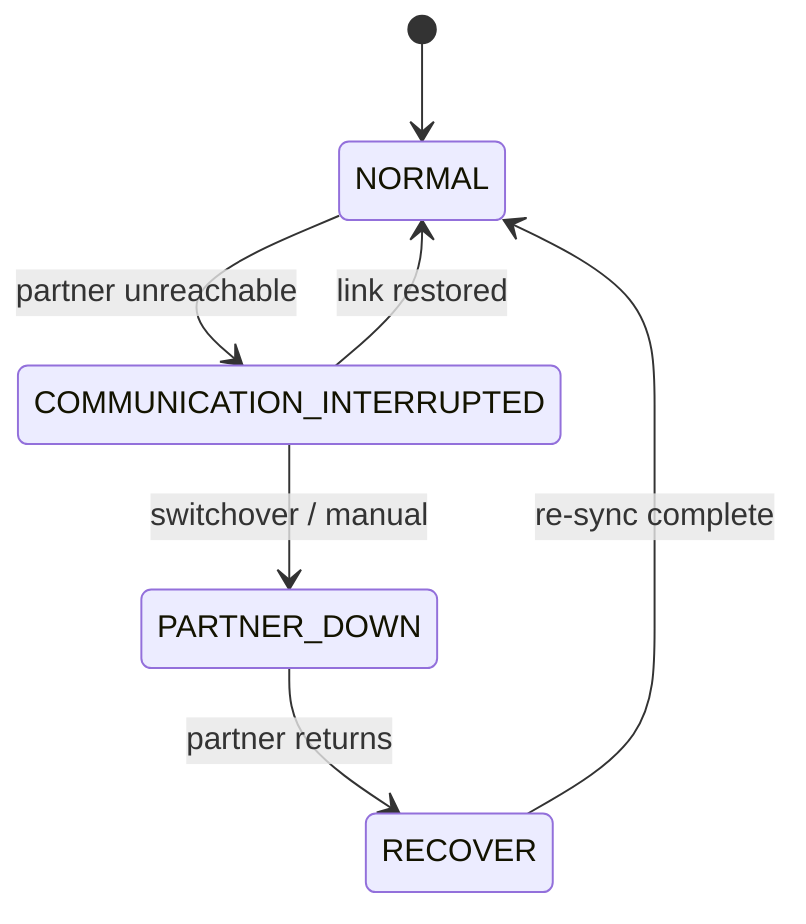

# DHCP High Availability (Failover)

DHCP Failover is a Windows Server feature (introduced in **Windows Server 2012**) that lets two DHCP servers share responsibility for the same IPv4 scopes, so clients keep getting and renewing leases even if one server goes down. It replaces older, clumsier high-availability patterns like split scopes.

## Overview

A single DHCP server is a single point of failure: if it dies, clients can no longer obtain or renew leases and eventually fall back to APIPA (`169.254.x.x`) addresses, losing connectivity. DHCP Failover solves this by pairing **two** servers into a *failover relationship* that continuously replicates lease and scope data, so either partner can serve the whole address pool.

Because the two servers stay synchronized, a client that got its lease from Server A can renew it against Server B without any conflict — both know about the lease. Failover is configured per-scope and applies to **IPv4 scopes only** (there is no IPv6 failover). See [DORA-Process](DORA-Process.md) for the lease handshake this protects, and [Scope-in-a-DHCP-Server](Scope-in-a-DHCP-Server.md) for the scope objects that get replicated.

> [!NOTE]
> **Failover vs. the older approaches**
> Before 2012, redundancy meant **split scope** (two independent servers each owning part of the pool, often an 80/20 split) or a failover **cluster** (shared storage). Split scope wastes addresses and does not replicate reservations or lease state; clustering needs shared storage and Failover Clustering. DHCP Failover needs neither — the two servers can sit on different subnets and share nothing but a TCP link.

## How It Works

The two partners maintain a persistent connection and exchange **binding update** messages so each has a full copy of the active leases. Configuration (scopes, [exclusions](Exclusion-Range-in-DHCP.md), [reservations](DHCP-Reservations.md), and options) is replicated when the relationship is created and whenever it changes.

Two settings govern the safety of this design:

- **Maximum Client Lead Time (MCLT)** — the maximum time one server may extend a lease *beyond* the lease the partner knows about, and the grace period before a surviving server is allowed to fully take over the partner's address range. The wizard default is **1 hour**. It is the single most important tuning knob: it bounds how long a lease can drift out of sync.
- **State Switchover Interval** — how long a server waits in the `COMMUNICATION INTERRUPTED` state before automatically assuming the partner is truly down. This automatic transition is **disabled by default** (an administrator manually sets `PARTNER DOWN`); when enabled the default is **60 minutes**.

Failover communication runs over **TCP port 647**, authenticated with a **shared secret** so a rogue host cannot inject binding updates.

### Failover states



In `NORMAL` state each server serves its configured share. On losing contact a server enters `COMMUNICATION INTERRUPTED` and keeps serving its own leases. Only in `PARTNER DOWN` (after the MCLT grace period) does the survivor take over the *entire* pool, including the partner's addresses.

## Failover Modes

| Mode | Behavior | Key parameter | Use when |
| --- | --- | --- | --- |
| **Load Balance** (load sharing) | Both servers actively lease from the pool simultaneously, splitting requests by a hash of the client MAC | Load-balance percentage — default **50/50** | Both servers are healthy peers in the same site |
| **Hot Standby** | One server is **active**, the other **standby**; the standby only leases from a small reserved block until the active fails | Reserve percentage — default **5%** | A central active server with a backup in a branch/DR site |

> [!TIP]
> **Which mode to pick**
> Use **Load Balance** for two servers side-by-side in the same datacenter — you get redundancy *and* even load. Use **Hot Standby** when one server is primary and the other is a disaster-recovery standby that should stay idle until needed.

## Configuration

Configure failover from the **DHCP console** (right-click a scope or the IPv4 node → *Configure Failover*) or with PowerShell.

Create a load-balancing relationship for one scope:

```powershell
Add-DhcpServerv4Failover -ComputerName "DHCP1.corp.local" `
  -Name "DHCP1-DHCP2" `
  -PartnerServer "DHCP2.corp.local" `
  -ScopeId 10.0.0.0 `
  -LoadBalancePercent 50 `
  -SharedSecret "S3cr3tFailover!" `
  -MaxClientLeadTime 01:00:00
```

Create a hot-standby relationship (active/standby with a 5% reserve):

```powershell
Add-DhcpServerv4Failover -ComputerName "DHCP1.corp.local" `
  -Name "DHCP1-DHCP2-HS" `
  -PartnerServer "DHCP2.corp.local" `
  -ScopeId 10.0.0.0 `
  -ServerRole Active `
  -ReservePercent 5 `
  -SharedSecret "S3cr3tFailover!" `
  -MaxClientLeadTime 01:00:00   # untested
```

Add more scopes to an existing relationship, inspect it, and force a re-sync:

```powershell
Add-DhcpServerv4FailoverScope -Name "DHCP1-DHCP2" -ScopeId 10.0.1.0   # untested
Get-DhcpServerv4Failover -ComputerName "DHCP1.corp.local"
Invoke-DhcpServerv4FailoverReplication -Name "DHCP1-DHCP2" -Force      # untested
```

> [!IMPORTANT]
> **Time synchronization is mandatory**
> Because MCLT and lease-expiry decisions depend on absolute timestamps, the two partners must have their clocks in sync (within a couple of minutes). A skewed clock can cause premature lease expiry or refusal to enter takeover. Keep both servers on the same NTP/domain time source.

## Security Considerations

> [!WARNING]
> **Failover does not authenticate clients — and can widen the blast radius**
> DHCP itself is unauthenticated (see [DHCP-Security-Issues-and-Attacks](DHCP-Security-Issues-and-Attacks.md)), and failover changes nothing about that: a [DHCP-Starvation-Attack](DHCP-Starvation-Attack.md) that drains the pool now drains **both** servers, and a [Rogue-DHCP-Server](Rogue-DHCP-Server.md) answering faster still wins the race. Worse, a misconfigured or over-large **hot-standby reserve**, or a server stuck in `PARTNER DOWN`, can let one box hand out the *entire* pool — amplifying the impact of starvation. Protect the failover control plane too: the **TCP 647** channel and its **shared secret** authenticate binding updates, so a weak or leaked secret lets an attacker poison lease state across the pair.

- Enable **[DHCP-Snooping](DHCP-Snooping.md)**, Dynamic ARP Inspection, and IP Source Guard on access switches — these mitigate starvation/rogue-server attacks regardless of how many DHCP servers you run.
- Use a strong, unique **shared secret** and restrict TCP 647 between the two partners with host/network firewall rules.
- **Authorize** both DHCP servers in Active Directory so an unauthorized Windows DHCP server cannot service the domain.
- Monitor the failover **state**: a relationship sitting in `COMMUNICATION INTERRUPTED` or `PARTNER DOWN` is both an availability and a security signal.

## Best Practices

- Deploy the two partners so they do not share a failure domain (different hosts/racks; ideally different power and network paths).
- Keep both servers **time-synchronized** and set the **MCLT** deliberately (1 hour is a sane default; lower it only with reason).
- Replicate configuration through the relationship — edit scope options once and let failover propagate them rather than hand-editing both servers.
- Choose the mode intentionally: **Load Balance 50/50** for peer datacenter servers, **Hot Standby** for a DR/branch backup.
- Alert on failover state changes and periodically run `Get-DhcpServerv4Failover` to confirm both partners are `NORMAL`.

## Troubleshooting

| Symptom | Likely cause & fix |
| --- | --- |
| Relationship stuck in `COMMUNICATION INTERRUPTED` | Partners cannot reach each other on **TCP 647** — check connectivity, host firewall, and that both DHCP services are running |
| "Failover configuration failed" / shared-secret error | Mismatched shared secret, or clocks skewed between partners — re-enter the secret and re-sync time |
| Scope changes not appearing on the partner | Replication drifted — run `Invoke-DhcpServerv4FailoverReplication` to force a re-sync |
| One server hands out addresses the other also leased | A partner was left in `PARTNER DOWN` too long, or MCLT/exclusions differ — return it to `NORMAL` and reconcile scope config |
| Clients still fall back to APIPA after a server fails | Relationship never reached `PARTNER DOWN` (auto switchover disabled) — set the surviving server to `PARTNER DOWN` manually or enable state switchover |

## References

- [Deploy DHCP Failover — Microsoft Learn](https://learn.microsoft.com/windows-server/networking/technologies/dhcp/dhcp-deploy-wps)
- [DHCP Failover (design and deployment) — Microsoft Learn](https://learn.microsoft.com/windows-server/networking/technologies/dhcp/dhcp-top)
- [Add-DhcpServerv4Failover — Microsoft Learn (DhcpServer PowerShell)](https://learn.microsoft.com/powershell/module/dhcpserver/add-dhcpserverv4failover)
- [RFC 2131 — Dynamic Host Configuration Protocol](https://www.rfc-editor.org/rfc/rfc2131)

## Related

- [Enterprise Windows Infrastructure Security](../Readme.md) — course hub
- [DHCP(Dynamic-Host-Configuration-Protocol)](DHCP(Dynamic-Host-Configuration-Protocol).md) — the protocol this makes highly available
- [DORA-Process](DORA-Process.md) — the lease handshake failover keeps working during an outage
- [Scope-in-a-DHCP-Server](Scope-in-a-DHCP-Server.md) — the scopes replicated across a failover relationship
- [DHCP-Reservations](DHCP-Reservations.md) — reservations synchronized between partners
- [DHCP-Relay-Agent-IP-Helper](DHCP-Relay-Agent-IP-Helper.md) — how remote subnets reach either DHCP server
- [DHCP-Security-Issues-and-Attacks](DHCP-Security-Issues-and-Attacks.md) — the attack surface failover does not close
- [Rogue-DHCP-Server](Rogue-DHCP-Server.md) — malicious server race that redundancy alone won't stop
- [DHCP-Snooping](DHCP-Snooping.md) — switch-level defense to pair with failover
