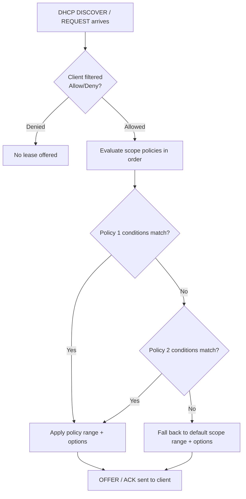

# DHCP Policies

**DHCP Policies** are rules that dynamically assign **different IP settings, option sets, or address ranges** to clients **based on conditions** — such as vendor class, MAC address pattern, user class, client identifier, relay-agent information, or fully qualified domain name. Policies give administrators **granular control** over how the DHCP server responds to different types of clients within a single [scope](Scope-in-a-DHCP-Server.md).

## Overview

A standard [DHCP](DHCP(Dynamic-Host-Configuration-Protocol).md) scope hands out the same address range and the same [options](DHCP-Scope-Options.md) to every client that leases from it. Policies break that uniformity: they let one scope treat clients differently depending on who — or what — the client is. During the [DORA process](DORA-Process.md), the server evaluates each incoming request against the policies defined for the matching scope (or server-wide) and applies the first policy whose conditions match.

Typical uses:

- Assign **different options** (DNS, gateway, TFTP boot server, etc.) to specific device types.
- Redirect specific clients to a **different address sub-range or VLAN**.
- Apply **security or QoS** settings to certain classes of clients.
- Customize **lease duration** based on business rules (for example, short leases for mobile devices).

> [!NOTE]
> **Policies vs. filters vs. reservations**
> A policy *shapes what a client receives*; a [filter](DHCP-Filters-Allow-and-Deny.md) *decides whether a client is served at all*; a [reservation](DHCP-Reservations.md) *pins one client to one fixed address*. Policies compose with reservations and [exclusions](Exclusion-Range-in-DHCP.md) rather than replacing them.

## How Policies Work

Each policy is built from three parts:

- **Conditions** — the criteria to match (for example, a MAC prefix or vendor class). Conditions can be combined with an `AND` or `OR` operator.
- **Scope of application** — server-wide, scope-level, or reservation-level.
- **Action** — the specific address sub-range and/or option set applied when the client matches.



> [!IMPORTANT]
> **First match wins**
> Policies are **evaluated in processing order**; the **first** policy whose conditions match is applied and evaluation stops. Order your policies deliberately — a broad policy placed before a specific one will shadow it.

## Common Policy Conditions

| Condition Type | Example | Notes |
|---|---|---|
| MAC address pattern | Devices with MACs starting `00-15-5D` | Supports `EQ`/`NE` and `*` wildcards (Hyper-V OUI shown) |
| Vendor Class | `MSFT 5.0`, `PXEClient` | Identifies OS or boot agent via option 60 |
| User Class | Custom-defined client class | Client advertises via option 77 |
| Client Identifier | Unique identifier per device | Option 61 |
| Relay Agent Info | Circuit/remote ID from option 82 | Used in large, segmented networks |
| FQDN | `NE,*.contoso.com` | Match/exclude by domain-joined name |

## Configuration

### Windows Server DHCP Manager (GUI)

1. Open **DHCP Manager**.
2. Right-click a **scope** → **Policies** → **New Policy**.
3. Define a name and description.
4. Add **conditions** (for example, vendor class = `PXEClient`).
5. Set the **IP range or options** to apply when a client matches.

> [!TIP]
> **Example use case**
> Assign a shorter lease time to **mobile devices**, or direct **PXE clients** to a specific TFTP boot server, all without carving out a separate scope.

### PowerShell Equivalent

```powershell
# Create a scope-level policy matching PXE boot clients (vendor class "PXEClient")
Add-DhcpServerv4Policy -Name "PXE-Boot" -ScopeId 192.168.1.0 `
  -Condition OR -VendorClass EQ,"PXEClient*"

# Give matched clients option 066/067 (boot server + boot file)
Set-DhcpServerv4OptionValue -ScopeId 192.168.1.0 -PolicyName "PXE-Boot" `
  -OptionId 66 -Value "192.168.1.10"
Set-DhcpServerv4OptionValue -ScopeId 192.168.1.0 -PolicyName "PXE-Boot" `
  -OptionId 67 -Value "boot\x64\wdsnbp.com"

Get-DhcpServerv4Policy -ScopeId 192.168.1.0   # verify
```

A MAC-based example — match a hardware vendor by OUI prefix:

```powershell
# Match Hyper-V virtual machines by MAC OUI and shorten their lease
Add-DhcpServerv4Policy -Name "HyperV-VMs" -ScopeId 192.168.1.0 `
  -Condition OR -MacAddress EQ,"00155D*" -LeaseDuration 04:00:00
```

## Advanced Use Cases

- Redirect IoT devices to isolated VLANs by handing them a different option/router set.
- Apply different DNS servers for guest vs. internal devices.
- Tag devices by function (via vendor/user class) and apply policies accordingly.

## Security Considerations

DHCP policies are an option-delivery mechanism, and options that steer a client's *boot* or *routing* behaviour are attacker-relevant. Options 066/067 tell a PXE client **where to fetch its boot image and file** — pre-OS code that runs before any endpoint protection loads.

> [!WARNING]
> **Offensive angle — PXE boot hijack**
> An attacker who can inject option 066/067 — via a [Rogue-DHCP-Server](Rogue-DHCP-Server.md) or by winning the DHCP race against the legitimate server (see [DHCP-Starvation-Attack](DHCP-Starvation-Attack.md)) — can serve a **malicious boot file**, a classic path to pre-OS code execution in imaging environments. Likewise, poisoned router (option 003) or DNS (option 006) values delivered through a rogue policy set up a network-level [man-in-the-middle](DHCP-Security-Issues-and-Attacks.md). Policy conditions such as MAC and vendor class are **client-asserted and trivially spoofable**, so they are a convenience feature, not a security boundary.

Defensively, policies help as much as they hurt: a policy can steer unknown/unmanaged devices to a quarantine range, while [DHCP-Snooping](DHCP-Snooping.md) on the switch and DHCP server authorization in [Active-Directory-Domain-Services](../Active-Directory-Domain-Services-AD-DS/Active-Directory-Domain-Services.md) blunt the rogue-server vector that would abuse them.

## Best Practices

- Order policies from **most specific to least specific**; remember first-match-wins.
- Do **not** treat MAC/vendor/user-class conditions as authentication — they are spoofable.
- Combine policies with [Allow/Deny filters](DHCP-Filters-Allow-and-Deny.md), [reservations](DHCP-Reservations.md), and [exclusions](Exclusion-Range-in-DHCP.md) for layered control.
- Authorize DHCP servers in Active Directory and enable **DHCP snooping** on access switches to prevent rogue servers from delivering competing policies.
- Document each policy's condition and intent; audit periodically for stale or shadowing rules.

## Troubleshooting

| Symptom | Likely cause & fix |
|---|---|
| Policy never applies | A broader policy earlier in the list matches first — reorder so the specific policy comes first. |
| Client gets default options, not policy options | Condition doesn't actually match (wrong wildcard, wrong `EQ`/`NE`, class not advertised). Verify with `Get-DhcpServerv4Policy` and check the client's option 60/77 values. |
| Policy options ignored on a reservation | Reservation-level settings can override scope-policy options; check the reservation. |
| Policy has no effect at all | Feature is Windows Server DHCP–specific; confirm the server (not a third-party/appliance DHCP) is authoritative for the scope. |

> [!NOTE]
> **Not universal**
> DHCP policies are a **Windows Server DHCP** feature and are not available in every DHCP implementation (many router/appliance DHCP services lack them).

## References

- Microsoft Learn — What is DHCP Server in Windows Server: https://learn.microsoft.com/en-us/windows-server/networking/technologies/dhcp/dhcp-top
- Microsoft Learn — `Add-DhcpServerv4Policy` (DhcpServer PowerShell module): https://learn.microsoft.com/en-us/powershell/module/dhcpserver/add-dhcpserverv4policy
- RFC 2132 — DHCP Options and BOOTP Vendor Extensions: https://www.rfc-editor.org/rfc/rfc2132
- RFC 3046 — DHCP Relay Agent Information Option (option 82): https://www.rfc-editor.org/rfc/rfc3046

## Related

- [DHCP-Scope-Options](DHCP-Scope-Options.md) — options that policies override per condition
- [Scope-in-a-DHCP-Server](Scope-in-a-DHCP-Server.md) — the scope within which policies apply
- [DHCP-Server-Options](DHCP-Server-Options.md) — server-wide option defaults
- [DHCP-Filters-Allow-and-Deny](DHCP-Filters-Allow-and-Deny.md) — client admit/deny control
- [DHCP-Reservations](DHCP-Reservations.md) — fixed address bindings that compose with policies
- [Exclusion-Range-in-DHCP](Exclusion-Range-in-DHCP.md) — addresses withheld from assignment
- [DORA-Process](DORA-Process.md) — the lease exchange during which policies are evaluated
- [Rogue-DHCP-Server](Rogue-DHCP-Server.md) — attacker delivery of malicious options
- [DHCP-Security-Issues-and-Attacks](DHCP-Security-Issues-and-Attacks.md) — broader DHCP attack surface
- [DHCP-Snooping](DHCP-Snooping.md) — switch-level defense against rogue servers
- [Enterprise Windows Infrastructure Security](../Readme.md) — course hub
