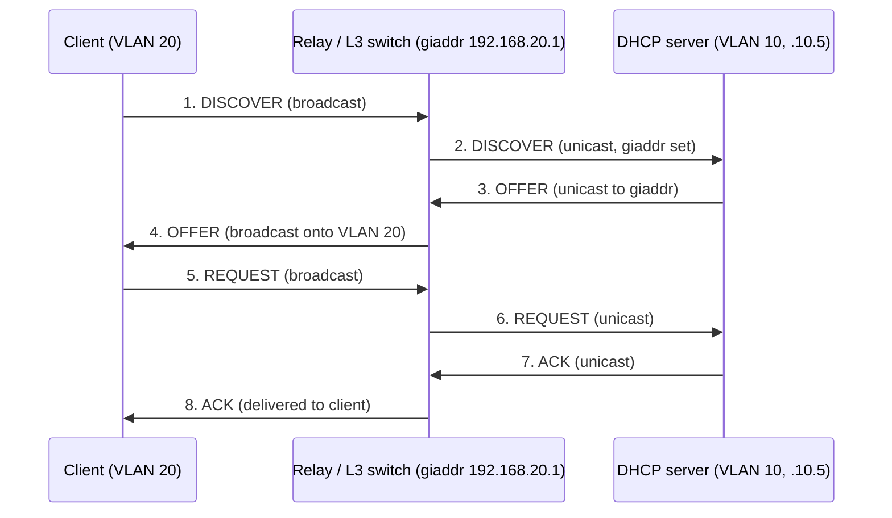

# DHCP Relay Agent (IP Helper)

A **DHCP Relay Agent** forwards DHCP messages between clients and a DHCP server that live on **different subnets**. Because the initial [DORA](DORA-Process.md) exchange is **broadcast** — and routers do not forward broadcasts — a client on VLAN 20 cannot directly reach a central DHCP server on VLAN 10. The relay agent bridges that gap so one server can lease addresses to many subnets.

## Overview

The relay agent — usually the router or L3 switch acting as the client's default gateway — captures the client's broadcast and **unicasts** it to the server, then relays the reply back onto the client's segment. This lets a single, centrally-managed [DHCP server](DHCP(Dynamic-Host-Configuration-Protocol).md) serve every VLAN instead of requiring a dedicated server in each broadcast domain.

On Cisco gear the relay is configured with the **`ip helper-address`** command, which is why it is often called the "IP helper." Windows provides the same function through Routing and Remote Access (RRAS), and Linux through `isc-dhcp-relay` / `dhcrelay`.

## How It Works

Without a relay you would need a separate DHCP server in **every** broadcast domain. The relay solves this by forwarding the broadcast phases of DORA as unicast to a known server address.



The same flow, annotated with how the server picks a scope:

```text
VLAN 20 client ──DISCOVER (broadcast)──  Router/L3 switch (relay)
                                          │  fills giaddr = 192.168.20.1
                                          ▼
                                   ──unicast── DHCP server (VLAN 10, 192.168.10.5)
Server uses giaddr to pick the correct scope (192.168.20.0/24) and replies to the relay,
which broadcasts the OFFER back onto VLAN 20.
```

## The `giaddr` Field

The relay stamps its own subnet interface IP into the packet's **`giaddr` (gateway IP address)** field. The server uses `giaddr` to:

- **Select the matching [scope](Scope-in-a-DHCP-Server.md)** for the originating subnet.
- Know **where to send the reply** (back to the relay, not the server's local segment).

`giaddr` is `0.0.0.0` for locally-broadcast (non-relayed) requests.

> [!NOTE]
> **giaddr drives scope selection**
> The server never sees the client's Layer-2 broadcast — only the relay's unicast. `giaddr` is therefore the *only* signal telling the server which subnet the request came from, and thus which scope to lease from.

## Configuration

### Cisco — `ip helper-address`

```cmd
conf t
interface Vlan20
 ip address 192.168.20.1 255.255.255.0
 ip helper-address 192.168.10.5      ! central DHCP server
end
```

> [!TIP]
> **Restrict the forwarded UDP services**
> `ip helper-address` forwards **8 UDP services** by default (BOOTP/DHCP 67, TFTP 69, DNS 53, TIME, NetBIOS name/datagram 137/138, TACACS). If you only want DHCP relayed, disable the rest with `no ip forward-protocol udp <port>` so the router isn't relaying unintended traffic.

### Linux — `isc-dhcp-relay`

```bash
# /etc/default/isc-dhcp-relay
SERVERS="192.168.10.5"       # upstream DHCP server
INTERFACES="eth1 eth2"       # client-facing + server-facing interfaces
```

```bash
sudo systemctl restart isc-dhcp-relay
# or run directly:
sudo dhcrelay -i eth1 192.168.10.5
```

### Windows Server

The relay role is provided by **Routing and Remote Access (RRAS) → IPv4 → DHCP Relay Agent**, where you add the client-facing interface and the remote DHCP server address.

## Option 82 — Relay Agent Information

A relay can inject **Option 82 (DHCP Relay Agent Information)** describing the physical port/circuit the request came from (**Circuit ID** + **Remote ID**). The server can use this for per-port policies and logging, and [DHCP-Snooping](DHCP-Snooping.md) relies on it. This is the "option 82 gotcha" that trips up snooping when a switch inserts it but an upstream device isn't expecting it.

## Security Considerations

> [!WARNING]
> **A trusted relay can be abused to cross scopes**
> Because the DHCP server trusts `giaddr` to choose a scope, spoofing `giaddr` can make a server hand out addresses from an **arbitrary scope**, and abusing Option-82 trust can influence port-based policy decisions. A relay that forwards more than DHCP also widens the router's exposed UDP surface.

- **Attack surface:** a relay unicasts client requests to a fixed server; forged `giaddr` or Option-82 values let an on-path attacker steer scope selection and policy.
- **Defense:** enable [DHCP snooping](DHCP-Snooping.md) trust **only** on the relay-facing uplink; validate Option 82; and restrict `ip helper-address` to DHCP so the router isn't relaying unintended UDP services.
- Relays are why a [Rogue-DHCP-Server](Rogue-DHCP-Server.md) on one VLAN normally **cannot** poison clients on another — the rogue's broadcast isn't relayed, so rogue attacks stay within a single broadcast domain unless the attacker is on the DHCP path itself.

## Best Practices

- Restrict `ip helper-address` to DHCP/BOOTP only; drop the other seven default forwarded services unless you actually use them.
- Point relays at **two** DHCP servers (split-scope or failover) so a single server outage doesn't break leasing on remote subnets.
- Configure the relay on the **client's gateway interface** so `giaddr` matches the intended scope subnet.
- Treat only the uplink toward the DHCP server as a **trusted** snooping port; leave all access ports untrusted.
- Validate or strip Option 82 consistently end-to-end to avoid snooping/relay mismatches.

## Troubleshooting

| Symptom | Likely cause & fix |
| --- | --- |
| Remote-subnet clients get APIPA (169.254.x.x) | No relay configured — add `ip helper-address` (or RRAS relay) on the client VLAN's gateway |
| Clients get addresses from the wrong scope | `giaddr` doesn't match the intended subnet — relay is bound to the wrong interface IP |
| Snooping drops legitimate offers | Option 82 inserted by the relay but not expected upstream — align Option-82 trust/validation |
| Relay forwards unexpected traffic (TFTP/DNS) | Default `ip helper-address` UDP services are on — prune with `no ip forward-protocol udp <port>` |

## References

- [RFC 2131 — Dynamic Host Configuration Protocol (`giaddr`, relay behavior)](https://www.rfc-editor.org/rfc/rfc2131)
- [RFC 3046 — DHCP Relay Agent Information Option (Option 82)](https://www.rfc-editor.org/rfc/rfc3046)
- [Cisco — Configuring the Cisco IOS DHCP Relay Agent](https://www.cisco.com/c/en/us/td/docs/ios-xml/ios/ipaddr_dhcp/configuration/xe-16/dhcp-xe-16-book/config-dhcp-relay.html)
- [DHCP overview (Microsoft Learn)](https://learn.microsoft.com/en-us/windows-server/networking/technologies/dhcp/dhcp-top)

## Related

- [DORA-Process](DORA-Process.md) — the broadcast handshake relays extend across subnets
- [Scope-in-a-DHCP-Server](Scope-in-a-DHCP-Server.md) — `giaddr` selects which scope answers
- [DHCP(Dynamic-Host-Configuration-Protocol)](DHCP(Dynamic-Host-Configuration-Protocol).md) — parent protocol note
- [DHCP-Snooping](DHCP-Snooping.md) — depends on relay-inserted Option 82
- [Rogue-DHCP-Server](Rogue-DHCP-Server.md) — why relays contain rogue attacks to one segment
- [Enterprise Windows Infrastructure Security](../Readme.md) — course hub
