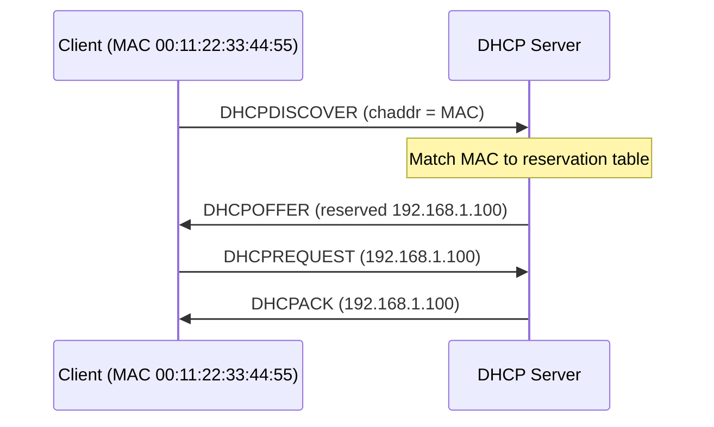

# DHCP Reservations

A **DHCP reservation** binds a **specific IP address** to a **specific device** (identified by its MAC address / client ID) so the device receives the **same address every time** it requests a lease. It combines the automatic configuration of DHCP with the predictability of a static IP.

## Overview

A reservation lives inside a DHCP [scope](Scope-in-a-DHCP-Server.md) but overrides the normal dynamic pool for one client: instead of handing out the next free address, the server always answers a matching MAC with its pre-assigned IP. This is the preferred way to give servers, printers, and other infrastructure a stable address, because the address — and any DNS or option changes — stays centrally managed on the DHCP server rather than being hand-configured on each device. Reservations still flow through the normal [DORA](DORA-Process.md) handshake; only the offered address is fixed.

> [!NOTE]
> **Reservation vs. static IP**
> A static IP is configured **on the device** and is invisible to the DHCP server (risking conflicts if it falls inside the pool). A reservation is configured **on the server**, so the address is tracked, conflict-free, and updated centrally alongside its [scope options](DHCP-Scope-Options.md).

## How It Works

1. The client broadcasts a **DHCPDISCOVER** carrying its hardware address (`chaddr` / MAC).
2. The DHCP server matches that MAC against its reservation list.
3. On a match, the server returns the **reserved IP** in the **DHCPOFFER** instead of drawing from the free pool.
4. The client sends a **DHCPREQUEST** and the server confirms with a **DHCPACK** for the same reserved address — every lease renewal, indefinitely.



## Why Use Reservations

- Guarantee **consistent IPs** for critical devices — printers, servers, VoIP phones, cameras, access points.
- Simplify **port forwarding**, firewall rules, and monitoring that reference a fixed address.
- Avoid per-device manual static configuration and the address conflicts it invites.
- Keep DNS records and [scope](DHCP-Scope-Options.md)/[server options](DHCP-Server-Options.md) pointed at a stable target that only changes in one place.

## Placement Within the Scope

A reserved address **must lie inside the scope's subnet range** but should be kept out of the dynamically leased pool so it is never offered to another client. Two common patterns:

- Place reservations inside an [exclusion range](Exclusion-Range-in-DHCP.md) so the dynamic pool never hands the address to anyone else, or
- Reserve an address that is simply not part of the active lease range.

> [!IMPORTANT]
> **Stay inside the scope, outside the dynamic pool**
> A reservation outside the scope subnet is invalid, and one that overlaps the active dynamic pool can collide with a client that leased that address before the reserved device came online. Reserve from an excluded band.

## Example

| Device | MAC Address | Reserved IP |
| --- | --- | --- |
| Printer | `00:11:22:33:44:55` | `192.168.1.100` |
| File Server | `AA:BB:CC:DD:EE:FF` | `192.168.1.101` |

## Configuration

### Linux (`isc-dhcp-server`, `dhcpd.conf`)

```text
host printer {
  hardware ethernet 00:11:22:33:44:55;
  fixed-address 192.168.1.100;
}
```

### Windows Server (`netsh`)

```cmd
netsh dhcp server scope 192.168.1.0 add reservedip 192.168.1.100 001122334455 "Printer"
```

### Windows Server (PowerShell)

```powershell
Add-DhcpServerv4Reservation -ScopeId 192.168.1.0 -IPAddress 192.168.1.100 `
  -ClientId "00-11-22-33-44-55" -Description "Printer"
Get-DhcpServerv4Reservation -ScopeId 192.168.1.0   # verify
```

## Security Considerations

> [!WARNING]
> **Reservations are convenience, not access control**
> A reservation is keyed on the MAC address, so it inherits the weakness of every MAC-based control: MAC addresses are trivially spoofable. An attacker who **enumerates a reserved MAC** — via ARP, `nmap -PR`, or passive sniffing — can **spoof it** to inherit that host's reserved IP, DNS, and gateway. That enables impersonating a trusted device or capturing traffic intended for it. Never treat a reservation (or a MAC [filter](DHCP-Filters-Allow-and-Deny.md)) as a security boundary.

- Reservations do not authenticate the client — DHCP has no built-in authentication (see [DHCP-Security-Issues-and-Attacks](DHCP-Security-Issues-and-Attacks.md)).
- Pair MAC-based conveniences with switch-level controls (802.1X, [DHCP-Snooping](DHCP-Snooping.md), Dynamic ARP Inspection) that actually enforce identity.
- From the offensive side, the reservation table is a useful recon artifact: it maps critical hosts to fixed IPs and MACs, telling an attacker exactly which addresses to impersonate.

## Best Practices

- Reserve addresses for servers, printers, and network gear instead of configuring static IPs on the devices themselves.
- Keep reserved addresses inside an [exclusion range](Exclusion-Range-in-DHCP.md) so the dynamic pool cannot hand them out.
- Document each reservation with a clear `-Description` (device role/owner) for later auditing.
- Do not rely on reservations or MAC filters as a security control — enforce with 802.1X and DHCP snooping instead.
- Review the reservation list periodically and remove entries for decommissioned devices.

## Troubleshooting

| Symptom | Likely cause & fix |
| --- | --- |
| Device still gets a dynamic (pool) address | MAC/client ID in the reservation doesn't match the adapter — confirm the real MAC and delimiter format (`netsh` uses no separators, PowerShell uses `-`) |
| Reservation rejected when created | Reserved IP is outside the scope subnet — pick an address within the scope range |
| Two hosts claim the reserved IP | Reserved address overlaps the active dynamic pool — move it into an exclusion range |
| Device has the right IP but no gateway/DNS | Reservation only fixes the address; verify [scope](DHCP-Scope-Options.md)/[server options](DHCP-Server-Options.md) are applied |

## References

- [Add-DhcpServerv4Reservation (Microsoft Learn)](https://learn.microsoft.com/en-us/powershell/module/dhcpserver/add-dhcpserverv4reservation)
- [DHCP overview (Microsoft Learn)](https://learn.microsoft.com/en-us/windows-server/networking/technologies/dhcp/dhcp-top)
- [RFC 2131 — Dynamic Host Configuration Protocol](https://www.rfc-editor.org/rfc/rfc2131)

## Related

- [Scope-in-a-DHCP-Server](Scope-in-a-DHCP-Server.md) — the scope a reservation lives inside
- [Exclusion-Range-in-DHCP](Exclusion-Range-in-DHCP.md) — addresses kept out of dynamic assignment
- [DHCP-Filters-Allow-and-Deny](DHCP-Filters-Allow-and-Deny.md) — related MAC-based control
- [DORA-Process](DORA-Process.md) — the handshake that delivers the reserved address
- [DHCP-Security-Issues-and-Attacks](DHCP-Security-Issues-and-Attacks.md) — why MAC-bound controls are spoofable
- [Enterprise Windows Infrastructure Security](../Readme.md) — course hub
