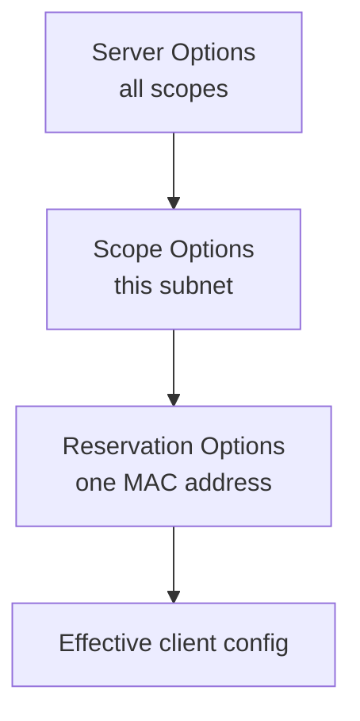

# DHCP Scope Options

**Scope Options** are configuration settings applied to every client that receives a lease from a specific **DHCP scope**. They define the network parameters — default gateway, DNS servers, domain name, and more — that a client needs to communicate on the network beyond just its IP address and subnet mask.

## Overview

When a client completes the [DORA-Process](DORA-Process.md) handshake, the server does more than hand out an address: it also delivers a set of **options** describing the local network. Scope options are the middle tier of the DHCP option hierarchy — they apply to all clients within one [scope](Scope-in-a-DHCP-Server.md), sitting above server-wide [DHCP-Server-Options](DHCP-Server-Options.md) and below per-client [reservation](DHCP-Reservations.md) options. Because these values steer where a client sends its traffic (gateway) and how it resolves names (DNS), they are both operationally critical and a prime target for attackers running a [Rogue-DHCP-Server](Rogue-DHCP-Server.md).

## Common Scope Options

Each option is identified by a numeric **option code** defined in RFC 2132. The most frequently configured ones:

| Option | Name | Example |
|---|---|---|
| 003 | **Router** (default gateway) | `192.168.1.1` |
| 006 | **DNS Servers** | `8.8.8.8`, `8.8.4.4` |
| 015 | **DNS Domain Name** | `example.local` |
| 044 | **WINS/NBNS Servers** (if used) | `192.168.1.10` |
| 046 | **WINS/NBT Node Type** | `0x8` (Hybrid recommended) |
| 051 | **Lease Time** | `86400` (seconds) |

> [!NOTE]
> **Options are delivered during DORA**
> Scope options ride along in the server's **DHCPOFFER** and **DHCPACK** messages during the [DORA-Process](DORA-Process.md). The client applies them alongside its assigned address, so a client trusts whatever gateway and DNS values the answering server supplies.

## Option Precedence — Server vs. Scope vs. Reservation

The same option can be set at multiple levels. When a value is defined at more than one level, the **most specific** setting wins:

| Level | Applies To | Precedence |
|---|---|---|
| Server | All scopes on the server globally | Lowest |
| Scope | All clients in a specific scope | Overrides server |
| Reservation | A specific client (MAC-based) | Overrides both |



> [!TIP]
> **Set the common case once, override the exceptions**
> Configure network-wide values (like DNS) as **server options**, override per-subnet values (like the gateway) as **scope options**, and reserve **reservation options** for individual hosts that need something different. This keeps changes centralized and avoids duplicating the same DNS list across every scope.

## Configuration

### Windows Server — PowerShell

Set option 006 (DNS) and 003 (router) on a single scope, then verify:

```powershell
# Set DNS (006) and router (003) options on one scope
Set-DhcpServerv4OptionValue -ScopeId 192.168.1.0 -DnsServer 8.8.8.8,8.8.4.4
Set-DhcpServerv4OptionValue -ScopeId 192.168.1.0 -Router 192.168.1.1
Set-DhcpServerv4OptionValue -ScopeId 192.168.1.0 -OptionId 15 -Value "example.local"
Get-DhcpServerv4OptionValue -ScopeId 192.168.1.0   # verify
```

### Linux — ISC DHCP server

The equivalent options declared inside a `subnet` block in `dhcpd.conf`:

```text
subnet 192.168.1.0 netmask 255.255.255.0 {
  range 192.168.1.100 192.168.1.200;
  option routers 192.168.1.1;
  option domain-name-servers 8.8.8.8, 8.8.4.4;
  option domain-name "example.local";
}
```

## Security Considerations

> [!WARNING]
> **Whoever controls the options controls the traffic**
> Options **003 (router)** and **006 (DNS)** are exactly what a [Rogue-DHCP-Server](Rogue-DHCP-Server.md) overwrites. By answering a client's DHCPDISCOVER faster than the legitimate server, an attacker can push its own gateway and DNS values, silently placing itself in the middle of the victim's traffic (MITM) for interception, credential capture, or redirection. DHCP has no authentication, so the client cannot tell a malicious offer from a legitimate one.

- The DNS option (006) is a common lever for redirecting name resolution to an attacker-controlled resolver — a stepping stone to poisoning or spoofing.
- Mitigate at the switch with **DHCP snooping** (see [DHCP-Snooping](DHCP-Snooping.md)), which only allows trusted ports to send DHCPOFFER/ACK, so rogue option sets never reach clients.
- See [DHCP-Security-Issues-and-Attacks](DHCP-Security-Issues-and-Attacks.md) for the full attack surface.

## Best Practices

- Set truly global values (DNS, domain name) as **server options** and only override per-subnet specifics (gateway) at the **scope** level to avoid drift.
- Prefer **Hybrid (0x8)** for the WINS node type where NetBIOS is still in use, to reduce broadcast traffic.
- Document all configured option codes and values in one place so rogue or misconfigured options are easy to spot.
- Enable **DHCP snooping** and authorize DHCP servers in Active Directory so client-facing options can only come from trusted sources.
- Review scope options after any DNS or gateway change so stale values don't linger in a client's lease.

## Troubleshooting

| Symptom | Likely cause & fix |
|---|---|
| Clients get an IP but can't reach other subnets | Missing or wrong **003 (Router)** option — set the correct default gateway on the scope |
| Clients get an IP but can't resolve names | Missing or wrong **006 (DNS Servers)** option — verify the DNS server list |
| A reservation ignores the scope's DNS setting | A **reservation-level** option is overriding the scope value (expected precedence) — clear it or align the values |
| Clients suddenly point at an unexpected gateway/DNS | Possible **rogue DHCP server** overriding options — locate via `ipconfig /all` and enable [DHCP-Snooping](DHCP-Snooping.md) |

## References

- [DHCP options and BOOTP vendor extensions — RFC 2132](https://www.rfc-editor.org/rfc/rfc2132)
- [Set-DhcpServerv4OptionValue (Microsoft Learn)](https://learn.microsoft.com/en-us/powershell/module/dhcpserver/set-dhcpserverv4optionvalue)
- [DHCP overview (Microsoft Learn)](https://learn.microsoft.com/en-us/windows-server/networking/technologies/dhcp/dhcp-top)

## Related

- [Scope-in-a-DHCP-Server](Scope-in-a-DHCP-Server.md) — the scope these options belong to
- [DHCP-Server-Options](DHCP-Server-Options.md) — server-wide option counterpart
- [DHCP-Reservations](DHCP-Reservations.md) — per-client options that override scope options
- [DHCP-Policies](DHCP-Policies.md) — conditional option assignment within a scope
- [DORA-Process](DORA-Process.md) — the handshake that delivers these options
- [Rogue-DHCP-Server](Rogue-DHCP-Server.md) — attack that abuses options 003/006
- [DHCP-Snooping](DHCP-Snooping.md) — switch-level mitigation
- [Enterprise Windows Infrastructure Security](../Readme.md) — course hub
