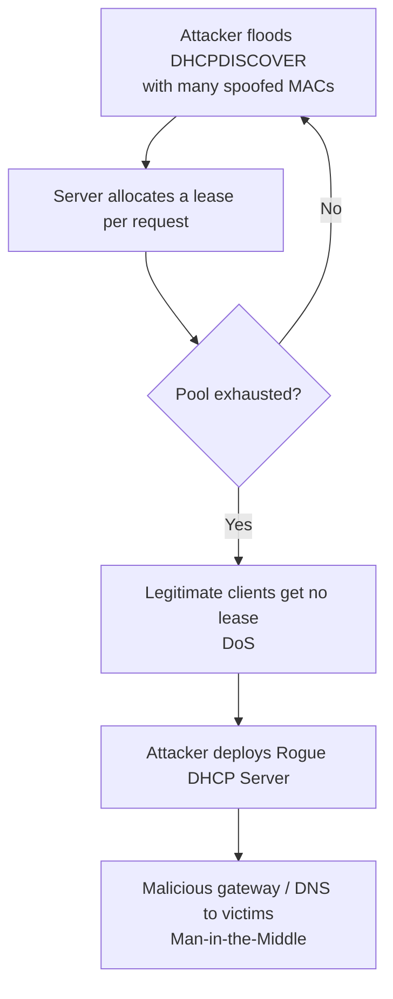

# DHCP Security Issues and Attacks

DHCP is unauthenticated by design — a client trusts whichever server answers first and never verifies who sent a reply. This note surveys the DHCP attack surface (MAC-based filters, starvation, and rogue servers) and the layered switch controls that defend it, from a defensive and penetration-testing perspective.

## Overview

Because the protocol has no built-in authentication or integrity, the controls layered on top of it — MAC allow/deny lists, `DHCP snooping`, port security — carry the whole security burden. Weak controls (MAC filters alone) are trivially bypassed; strong controls (snooping plus Dynamic ARP Inspection) close the man-in-the-middle path. The attacks here abuse the [DORA-Process](DORA-Process.md) handshake: exhaust the pool ([DHCP-Starvation-Attack](DHCP-Starvation-Attack.md)), then win the race with a [Rogue-DHCP-Server](Rogue-DHCP-Server.md) that hands out a malicious gateway and DNS. The primary mitigation across all of them is [DHCP-Snooping](DHCP-Snooping.md).

> [!NOTE]
> **Scope of this note**
> The material below explains how these techniques work and how defenders detect and mitigate them — knowledge for authorized penetration testing and security research. Only run these techniques against networks you own or are explicitly authorized to test.

## DHCP Allow List

A **DHCP Allow List** permits only specific devices — usually identified by **MAC address** — to obtain IP addresses from the server. See [DHCP-Filters-Allow-and-Deny](DHCP-Filters-Allow-and-Deny.md) for the Windows configuration.

| Allowed MAC       | Device        |
|-------------------|---------------|
| 00:1A:2B:3C:4D:5E | Office Laptop |
| 00:1A:2B:3C:4D:6F | Printer       |

A device whose MAC is **not listed** will **not receive an IP address** from the DHCP server.

**Security weakness** — MAC addresses are **not a strong authentication mechanism**; they can be spoofed or cloned. An attacker who observes an allowed MAC (via passive sniffing) can set their own interface to that address and pass the filter.

Strengthen an allow list by pairing it with:

- **802.1X** port authentication
- **Switch port security**
- **Network Access Control (NAC)**
- **DHCP snooping**

## DHCP Deny List

A **DHCP Deny List** blocks specific devices (by MAC) from receiving IP addresses.

| Denied MAC        | Reason              |
|-------------------|---------------------|
| 11:22:33:44:55:66 | Unauthorized device |
| AA:BB:CC:DD:EE:FF | Suspicious activity |

Like allow lists, deny lists rely on **MAC identification**, which is unreliable in adversarial environments — a blocked attacker simply spoofs a different MAC. Administrators combine deny lists with **switch port security**, **802.1X**, **DHCP snooping**, and **Dynamic ARP Inspection (DAI)**.

## DHCP Starvation Attack

A **DHCP Starvation Attack** is a **Denial-of-Service (DoS)** in which an attacker floods the server with lease requests, each using a **different spoofed MAC address**, to **exhaust the available IP address pool**. Once the pool is drained, legitimate clients cannot obtain an address and fail to connect. Full tooling walkthrough: [DHCP-Starvation-Attack](DHCP-Starvation-Attack.md).

### Attack flow



### Impact

| Impact | Description |
|--------|-------------|
| Denial of Service | Clients cannot obtain IP addresses |
| Network Disruption | Users lose connectivity |
| Gateway Hijacking | Often a precursor to a rogue DHCP attack |

## Rogue DHCP Server

A starvation attack is frequently followed by a **Rogue DHCP Server**. Having silenced (or out-raced) the legitimate server, the attacker's server answers clients and can:

- Assign a **malicious default gateway** (routing victim traffic through the attacker)
- Set an **attacker-controlled DNS server** to intercept name resolution
- Enable **Man-in-the-Middle (MITM)** interception of traffic

> [!IMPORTANT]
> **Starvation is optional**
> Even **without** starvation, a rogue server can win the race for new clients simply by replying to `DHCPDISCOVER` faster than the legitimate server — the client accepts the **first** offer it receives. Full hands-on walkthrough: [Rogue-DHCP-Server](Rogue-DHCP-Server.md).

### Detecting a rogue server

Enumerate every DHCP server that answers on a segment and flag any unexpected one:

```bash
sudo nmap --script broadcast-dhcp-discover
# or
sudo dhcpdump -i eth0            # watch for OFFERs from an unknown server IP/MAC
```

On a client, confirm which server actually leased the address:

```bash
grep -i dhcp-server-identifier /var/lib/dhcp/dhclient.leases   # Linux
ipconfig /all | findstr "DHCP Server"                         # Windows
```

## Mitigations

### DHCP Snooping

Enable **DHCP snooping** on access switches — the single most important control. It classifies ports as **trusted** or **untrusted** and only permits server replies (`DHCPOFFER` / `DHCPACK`) from trusted ports, killing rogue servers. It also builds a binding table that feeds DAI and IP Source Guard. Deep dive and config: [DHCP-Snooping](DHCP-Snooping.md).

### Port Security

Limit the number of MAC addresses learned per switch port so a single port cannot generate the flood of MACs a starvation attack needs:

```text
switchport port-security maximum 2
```

### Rate Limiting

Cap DHCP requests per second on switch interfaces to blunt flooding attempts (often configured alongside snooping as a rate limit on untrusted ports).

### Network Access Control (NAC)

Require **802.1X** authentication so devices must prove identity before receiving any network access — this removes the anonymous, unauthenticated foothold the above attacks depend on.

### Monitoring and Detection

Security teams should alert on:

- Abnormal DHCP request volumes
- Rapid MAC address churn on a single port
- DHCP pool exhaustion warnings
- Client gateway/DNS values that do not match the sanctioned server

## Security Considerations

> [!WARNING]
> **MAC-based controls are not security**
> Allow/deny lists rely on MAC addresses, which attackers spoof at will — treat them as inventory hygiene, not a security boundary. Real protection comes from **DHCP snooping** (trusted-port enforcement), **802.1X/NAC**, **port security**, and **Dynamic ARP Inspection**. On the offensive side, an unauthenticated segment lets a tester drain the pool and stand up a rogue server to pivot into full MITM; on the defensive side, the same gaps are what an audit should flag first.

## Best Practices

- Enable **DHCP snooping** on all access switches and mark only the uplink to the real server as trusted.
- Enforce **802.1X / NAC** so only authenticated devices reach the DHCP service.
- Apply **switch port security** and **DHCP rate limiting** to contain MAC flooding and starvation.
- Layer **Dynamic ARP Inspection** and **IP Source Guard** on top of the snooping binding table to close the MITM path.
- Continuously monitor for pool exhaustion, MAC churn, and unexpected DHCP servers rather than relying on MAC filters alone.

## Troubleshooting

| Symptom | Likely cause & fix |
| --- | --- |
| Clients get 169.254.x.x (APIPA) addresses | Pool exhausted (starvation) or no reply reaching them — check for MAC flooding, confirm the scope is active/authorized, verify relay/IP-helper on remote subnets |
| Address conflicts or wrong gateway/DNS on clients | A rogue or second DHCP server is answering — locate it via `ipconfig /all` mismatch, then enable DHCP snooping to enforce trusted ports |
| Known-good device denied a lease | Overly strict MAC allow list or tripped port-security — verify the MAC is listed and the port has not shut down |

## References

- Microsoft Learn — DHCP overview: https://learn.microsoft.com/en-us/windows-server/networking/technologies/dhcp/dhcp-top
- RFC 2131 — Dynamic Host Configuration Protocol: https://www.rfc-editor.org/rfc/rfc2131
- Cisco — DHCP Snooping configuration guide: https://www.cisco.com/c/en/us/td/docs/switches/lan/catalyst9300/software/release/17-x/configuration_guide/sec/b_17x_sec_9300_cg/configuring_dhcp_features_and_option_82.html

## Related

- [DHCP-Starvation-Attack](DHCP-Starvation-Attack.md) — pool-exhaustion DoS, hands-on tooling
- [Rogue-DHCP-Server](Rogue-DHCP-Server.md) — malicious server for gateway/DNS hijacking and MITM
- [DHCP-Snooping](DHCP-Snooping.md) — switch-level control that stops both attacks
- [DHCP-Filters-Allow-and-Deny](DHCP-Filters-Allow-and-Deny.md) — MAC allow/deny lists (and why they are weak)
- [DORA-Process](DORA-Process.md) — the handshake these attacks abuse
- [DHCP(Dynamic-Host-Configuration-Protocol)](DHCP(Dynamic-Host-Configuration-Protocol).md) — protocol overview
- [Enterprise Windows Infrastructure Security](../Readme.md) — course hub
