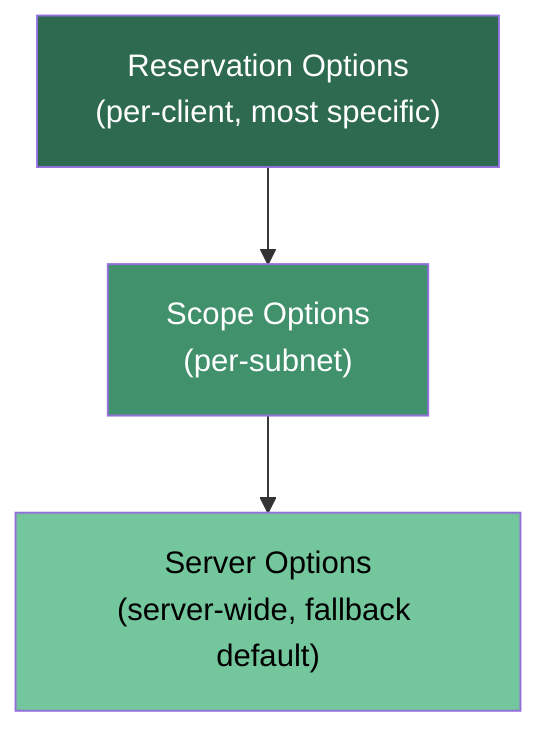

# DHCP Server Options

**Server options** are global DHCP configuration values that apply to **every scope** and **every client** served by a DHCP server, unless a more specific option overrides them. They are the default-value layer of a DHCP server's configuration.

## Overview

When a client completes the [DORA-Process](DORA-Process.md) lease exchange, the server returns not just an IP address but a set of configuration **options** (DNS servers, default gateway, domain name, and more). Where those option values are defined determines how broadly they apply. Server options sit at the broadest, lowest-priority level: they are inherited by all scopes on the server unless a [scope option](DHCP-Scope-Options.md) or a per-client reservation option supersedes them. Because they propagate everywhere, server options are the natural place to publish values that are truly network-wide — most commonly [DNS](../Domain-Name-System-DNS/Readme.md) servers and the DNS domain name.

> [!NOTE]
> **Server vs. scope options**
> Set an option at the **server** level when the value is identical for the whole DHCP server; set it at the **[scope](DHCP-Scope-Options.md)** level when it differs per subnet (for example, each subnet has its own router/gateway). The default gateway (option 003) is almost always a scope option because it is subnet-specific.

## When to Use Server Options

- When a value should be consistent across **multiple scopes** (e.g. DNS servers, DNS domain name).
- When managing a **small or uniform network** where all clients share the same settings.
- To **reduce redundancy** — define once, inherit everywhere, instead of repeating the same value in each scope.

## Common Options

These are the same numeric option codes used at the scope and reservation levels; only the level at which they are defined differs.

| Code | Option | Example |
|---|---|---|
| 003 | Router (Default Gateway) | `192.168.0.1` |
| 006 | DNS Servers | `8.8.8.8`, `1.1.1.1` |
| 015 | DNS Domain Name | `corp.local` |
| 044 | WINS/NBNS Servers | `192.168.0.10` |
| 051 | Lease Time | `691200` (seconds) |

## Configuration Hierarchy

Options are resolved from most specific to least specific. When the same option code is set at more than one level, the **most specific** definition wins.



> [!IMPORTANT]
> **Precedence, not merge**
> A scope or reservation option does not blend with the server option — it **replaces** it for that option code. Reservation options override scope options, which override server options. Codes that are not overridden fall through to the server-level default.

## Configuration

### Windows Server — DHCP Manager (GUI)

- Open **DHCP Manager**.
- Right-click the **IPv4** node under the DHCP server name.
- Choose **Configure Options** (or **Set Predefined Options** to define the option template first).
- Apply values such as DNS servers (006), DNS domain name (015), and router (003).

### Windows Server — PowerShell

Server-level options are set by **omitting** `-ScopeId`; without a scope, the value applies server-wide.

```powershell
# Set the server-wide DNS servers (option 006)
Set-DhcpServerv4OptionValue -DnsServer 8.8.8.8,1.1.1.1

# Set the server-wide DNS domain name (option 015)
Set-DhcpServerv4OptionValue -OptionId 15 -Value "corp.local"

# Verify the server-level options currently defined
Get-DhcpServerv4OptionValue
```

### Linux — isc-dhcp-server (global config)

Options declared outside any `subnet {}` block in `dhcpd.conf` act as server-wide defaults.

```text
option domain-name "corp.local";
option domain-name-servers 8.8.8.8, 1.1.1.1;
```

## Security Considerations

> [!WARNING]
> **Options are an attacker's payload delivery channel**
> DHCP options are trusted implicitly by clients — the protocol has no authentication (see [DHCP-Security-Issues-and-Attacks](DHCP-Security-Issues-and-Attacks.md)). A [Rogue-DHCP-Server](Rogue-DHCP-Server.md) that answers before the legitimate one can hand out attacker-controlled option values:
> - **Option 006 (DNS)** — point clients at a malicious resolver to spoof records and man-in-the-middle traffic.
> - **Option 003 (Router)** — set the gateway to the attacker's host to intercept and relay all off-subnet traffic.
> - **Option 252 (WPAD / auto-proxy URL)** — feed a rogue proxy auto-config to capture HTTP(S) and credential traffic.

- The blast radius of a compromised or misconfigured **server** option is the entire DHCP server, not one subnet — treat server-level changes as high-impact.
- Defend the delivery path with **[DHCP-Snooping](DHCP-Snooping.md)** on access switches so only trusted ports may send DHCP offers, cutting off the rogue-server option-injection path.

## Best Practices

- Reserve the server level for values that are genuinely network-wide (DNS servers, DNS domain name); keep subnet-specific values like the router at the scope level.
- Document where each option is defined so troubleshooting an unexpected client value has one authoritative reference.
- Prefer a small, deliberate set of server options over duplicating the same values across many scopes.
- Authorize DHCP servers in Active Directory and enable DHCP snooping so rogue servers cannot override your options.
- Review server options after any DNS or gateway change so stale values do not silently propagate to all clients.

## Troubleshooting

| Symptom | Likely cause & fix |
| --- | --- |
| A client shows an option value you did not set at the server level | A scope or reservation option is overriding it — check the hierarchy (reservation > scope > server) and inspect the more specific level |
| A server option is not reaching some clients | Those scopes define the same option code, which takes precedence — remove the scope-level value or align it |
| Wrong DNS/gateway on clients across all subnets | A server option is misconfigured, or a [Rogue-DHCP-Server](Rogue-DHCP-Server.md) is answering — verify with `ipconfig /all` and enable [DHCP-Snooping](DHCP-Snooping.md) |

## References

- [DHCP options reference (Microsoft Learn)](https://learn.microsoft.com/en-us/windows-server/networking/technologies/dhcp/dhcp-subnet-options)
- [Set-DhcpServerv4OptionValue (Microsoft Learn)](https://learn.microsoft.com/en-us/powershell/module/dhcpserver/set-dhcpserverv4optionvalue)
- [RFC 2132 — DHCP Options and BOOTP Vendor Extensions](https://www.rfc-editor.org/rfc/rfc2132)

## Related

- [DHCP-Scope-Options](DHCP-Scope-Options.md) — scope-level option counterpart (per-subnet)
- [Scope-in-a-DHCP-Server](Scope-in-a-DHCP-Server.md) — the scope that inherits server options
- [DHCP-Reservations](DHCP-Reservations.md) — per-client options at the most specific level
- [DORA-Process](DORA-Process.md) — the lease exchange that delivers options to clients
- [DHCP(Dynamic-Host-Configuration-Protocol)](DHCP(Dynamic-Host-Configuration-Protocol).md) — protocol that carries the options
- [Rogue-DHCP-Server](Rogue-DHCP-Server.md) — attack that abuses option injection
- [DHCP-Snooping](DHCP-Snooping.md) — switch-level defense against rogue option delivery
- [Enterprise Windows Infrastructure Security](../Readme.md) — course hub
