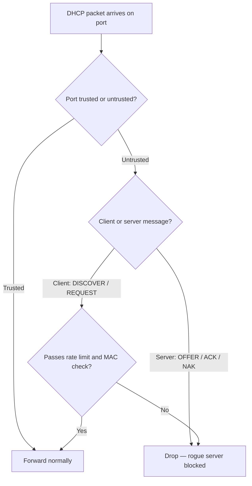

# DHCP Snooping

**DHCP Snooping** is a Layer-2 switch security feature that inspects DHCP traffic and enforces which ports are allowed to act as DHCP servers. It is the **primary defense** against both [Rogue-DHCP-Server](Rogue-DHCP-Server.md) attacks and [DHCP-Starvation-Attack](DHCP-Starvation-Attack.md)s.

## Overview

Because DHCP is unauthenticated by design, a client trusts whichever server answers its [DORA](DORA-Process.md) handshake first — exactly the assumption rogue-server and man-in-the-middle attacks abuse. DHCP snooping restores that trust at the switch: it classifies every port as **trusted** or **untrusted**, drops server-originated replies arriving on untrusted ports, and builds a **binding table** of legitimate MAC-to-IP leases that downstream controls such as Dynamic ARP Inspection and IP Source Guard depend on. See [DHCP-Security-Issues-and-Attacks](DHCP-Security-Issues-and-Attacks.md) for the full attack surface it defends.

## How It Works

The switch classifies every port as **trusted** or **untrusted**:

- **Trusted ports** — may forward *server* messages (`DHCPOFFER`, `DHCPACK`, `DHCPNAK`). Uplinks toward the legitimate DHCP server or [relay agent](DHCP-Relay-Agent-IP-Helper.md).
- **Untrusted ports** — may only send *client* messages (`DISCOVER`, `REQUEST`). Any server-side reply arriving on an untrusted port is **dropped**, killing rogue servers.

The following diagram traces how the switch decides whether a snooped DHCP packet is forwarded or dropped:



### What It Protects Against

| Threat | How snooping stops it |
|---|---|
| Rogue DHCP server | Server replies on an untrusted port are dropped |
| DHCP starvation | Per-port **rate limiting** throttles the DISCOVER flood |
| MAC/lease spoofing | Optional **MAC-address verification** checks the DHCP `chaddr` matches the frame source |
| ARP spoofing (indirect) | Builds the **binding table** that Dynamic ARP Inspection depends on |

## The Binding Table

As legitimate leases complete, the switch records each one in the **DHCP snooping binding table**:

```text
MAC Address        IP Address     Lease(sec)  Type      VLAN  Interface
-----------------  -------------  ----------  --------  ----  ----------------
00:11:22:33:44:55  192.168.1.101  86400       dhcp-snp  10    GigabitEthernet0/5
```

This table is the trust anchor for **Dynamic ARP Inspection (DAI)** and **IP Source Guard**, which drop traffic whose MAC/IP pairing doesn't match a real lease.

## Configuration

The commands below are Cisco IOS; enable snooping globally, then per-VLAN, then mark only the uplink toward the real DHCP server as trusted.

```bash
conf t
! 1. Enable globally, then per-VLAN
ip dhcp snooping
ip dhcp snooping vlan 10

! 2. Trust the uplink toward the real DHCP server (everything else stays untrusted)
interface GigabitEthernet0/1
 ip dhcp snooping trust

! 3. Rate-limit client ports to blunt starvation floods
interface range GigabitEthernet0/2 - 24
 ip dhcp snooping limit rate 10

! 4. (Optional) verify the L2 source MAC matches the DHCP chaddr field
ip dhcp snooping verify mac-address
end

show ip dhcp snooping
show ip dhcp snooping binding
```

> [!IMPORTANT]
> **Option 82 gotcha**
> Switches insert DHCP Relay Information (option 82) into snooped packets. If the server or an upstream device drops option-82 packets from a non-relay source, clients stop getting leases. Fix with `no ip dhcp snooping information option` (or trust it appropriately) when the switch is not the relay agent.

## Complementary Controls

DHCP snooping is the foundation for a stack of Layer-2 protections that reuse its binding table:

```text
DHCP Snooping  ─┬─  Dynamic ARP Inspection (DAI)   ← blocks ARP spoofing / MITM
                └─  IP Source Guard                 ← blocks IP spoofing per port
Port Security / 802.1X / NAC   ← authenticate the device before it ever gets an IP
```

Dynamic ARP Inspection leans directly on the snooping binding table:

```bash
! Dynamic ARP Inspection, validating against the snooping binding table
ip arp inspection vlan 10
interface GigabitEthernet0/1
 ip arp inspection trust
```

> [!TIP]
> **Layer the defenses**
> Snooping alone stops rogue servers; pair it with DAI and IP Source Guard to also stop ARP and IP spoofing, and front the whole stack with 802.1X/NAC so an unauthorized device never reaches the DHCP exchange in the first place.

## Security Considerations

> [!WARNING]
> **Where snooping still fails**
> On managed switches, snooping **breaks** the classic rogue-server + starvation playbook — server replies never leave the attacker's untrusted port. But the control is only as good as its coverage, and attackers probe the gaps:
> - **Unmanaged switches or hubs** downstream of a trusted port, where snooping never sees the traffic.
> - **VLANs where snooping was never enabled**, or **mis-trusted access ports** left in the trusted state.
> - **Slow starvation floods** spread under the per-second rate-limit threshold to evade throttling.
> - Switches that **ignore option-82 / MAC checks**, weakening lease-spoofing defenses.

- Enable snooping on **every** access VLAN, not just the ones that "matter" — a forgotten VLAN is an open door.
- Keep the **trusted** designation to genuine uplinks only; audit port trust state regularly.
- Combine with DAI and IP Source Guard so a compromised host cannot spoof MAC/IP even if it obtains a lease.

## Best Practices

- Enable DHCP snooping globally and on each client VLAN; leave every access port **untrusted** by default.
- Trust only the interfaces facing the authorized DHCP server or relay agent.
- Apply per-port **rate limiting** on untrusted ports to blunt starvation attacks.
- Build DAI and IP Source Guard on top of the snooping binding table for full Layer-2 anti-spoofing.
- Validate option-82 handling end-to-end so legitimate clients still receive leases.

## Troubleshooting

| Symptom | Likely cause & fix |
|---|---|
| Clients on a VLAN stop getting leases after enabling snooping | Uplink to the DHCP server/relay is still **untrusted** — add `ip dhcp snooping trust` on that interface |
| Leases fail only when traffic crosses a relay | Option-82 packets dropped upstream — apply `no ip dhcp snooping information option` or trust option 82 appropriately |
| Legitimate clients rate-limited / err-disabled | Rate limit set too low for the port's normal DHCP volume — raise `ip dhcp snooping limit rate` |
| Rogue server still hands out addresses | The rogue sits behind an **unmanaged switch/hub** on a trusted port, or snooping was never enabled on that VLAN — enable per-VLAN and eliminate unmanaged L2 |

## References

- [Cisco — Configuring DHCP Snooping and Option 82](https://www.cisco.com/c/en/us/td/docs/switches/lan/catalyst9300/software/release/17-x/configuration_guide/sec/b_17x_sec_9300_cg/configuring_dhcp_features_and_option_82.html)
- [RFC 2131 — Dynamic Host Configuration Protocol](https://www.rfc-editor.org/rfc/rfc2131)
- [RFC 3046 — DHCP Relay Agent Information Option (Option 82)](https://www.rfc-editor.org/rfc/rfc3046)

## Related

- [Rogue-DHCP-Server](Rogue-DHCP-Server.md) — the primary attack this stops
- [DHCP-Starvation-Attack](DHCP-Starvation-Attack.md) — mitigated by port rate-limiting
- [DHCP-Security-Issues-and-Attacks](DHCP-Security-Issues-and-Attacks.md) — parent overview of DHCP attacks
- [DHCP-Filters-Allow-and-Deny](DHCP-Filters-Allow-and-Deny.md) — weaker MAC-based control snooping backs up
- [DHCP-Relay-Agent-IP-Helper](DHCP-Relay-Agent-IP-Helper.md) — relay agent and the source of option-82 insertion
- [DORA-Process](DORA-Process.md) — the messages snooping classifies as client vs. server
- [Enterprise Windows Infrastructure Security](../Readme.md) — course hub
