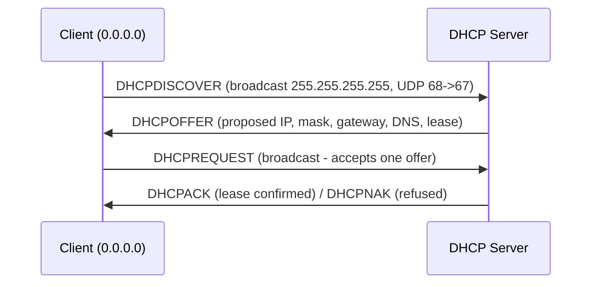

# DORA Process (Discover, Offer, Request, Acknowledge)

The **DORA** process is the four-step DHCP handshake used to dynamically assign IP configuration to a client.

## Overview

DORA covers the *initial* lease acquisition: the client broadcasts to find a server (**D**iscover), the server proposes configuration (**O**ffer), the client accepts one offer (**R**equest), and the server confirms the lease (**A**cknowledge). All four messages ride on UDP ports 67 (server) and 68 (client). It is the foundation of [DHCP(Dynamic-Host-Configuration-Protocol)](DHCP(Dynamic-Host-Configuration-Protocol).md), drawing the offered address from a configured [Scope-in-a-DHCP-Server](Scope-in-a-DHCP-Server.md) and its associated options. Because the exchange begins as an unauthenticated broadcast, it is also the exact window a [Rogue-DHCP-Server](Rogue-DHCP-Server.md) or a [DHCP-Starvation-Attack](DHCP-Starvation-Attack.md) abuses.

## Architecture



### Basic DHCP Packet Exchange (Initial Discover Phase)

```text
Client IP:      0.0.0.0
Destination IP: 255.255.255.255
Client MAC:     08:00:27:D6:86:94
Destination MAC: FF:FF:FF:FF:FF:FF
Client Port:    UDP 68
Server Port:    UDP 67
```

Important clarification:

- `0.0.0.0` → Client does not yet have an IP address.
- `255.255.255.255` → Limited broadcast address.
- `FF:FF:FF:FF:FF:FF` → Ethernet broadcast MAC.
- UDP 67/68 → Standard DHCP ports.

## How It Works

### 1. DHCP Discover

- The client does not yet have an IP address.
- It sends a **broadcast** packet to locate available DHCP servers.

**Source IP:** `0.0.0.0`
**Destination IP:** `255.255.255.255`
**Source Port:** UDP 68
**Destination Port:** UDP 67

- Why broadcast?
- Because the client does not know the DHCP server's IP address.

### 2. DHCP Offer

- One or more DHCP servers respond with an offer.
- The offer includes:
    - Proposed IP address
    - Subnet mask
    - Default gateway
    - DNS server
    - Lease time
- The offer is usually sent as a **broadcast**, but may be unicast if supported and appropriate.

### 3. DHCP Request

- The client selects one offer.
- It broadcasts a **DHCP Request** message.
- This informs:
    - The chosen server to reserve the IP
    - Other servers to withdraw their offers
- This step prevents duplicate IP assignments.

### 4. DHCP Acknowledgment (ACK)

- The selected server confirms the lease.
- The client can now configure the assigned IP and begin normal communication.
- If there is a problem (e.g., IP already in use), the server may respond with **DHCP NAK (Negative Acknowledgment)** instead.

> [!TIP]
> **Read the flow as a race**
> The OFFER and the first client-side broadcast are the moments an attacker competes for. Whichever server answers first — legitimate or rogue — can win the client, which is why the client selection in step 3 is broadcast so *both* servers see the decision.

### What Actually Identifies the Client?

- DHCP primarily identifies clients using:
    - **MAC address**
    - **Transaction ID (xid)**
    - **Client Identifier (optional field)**
- The transaction ID ensures replies match the correct request.

### What's Inside a DHCP Packet?

Key DHCP fields include:

- op (message type)
- htype (hardware type)
- hlen (hardware address length)
- xid (transaction ID)
- chaddr (client hardware address)
- options (contains DHCP message type, lease time, DNS, etc.)

DHCP operates over **BOOTP format** and uses DHCP Options (Option 53 defines message type).

## Message Types

### Beyond DORA — Full Lease Lifecycle

DORA covers the *initial* lease. These additional message types govern its life:

| Message | Option 53 | When it happens |
|---|---|---|
| DHCPDISCOVER | 1 | Client looks for a server (the **D**) |
| DHCPOFFER | 2 | Server proposes config (the **O**) |
| DHCPREQUEST | 3 | Client accepts / renews (the **R**) |
| DHCPACK | 5 | Server confirms lease (the **A**) |
| DHCPNAK | 6 | Server refuses (bad/expired request) |
| DHCPDECLINE | 4 | Client found the offered IP already in use (ARP probe failed) |
| DHCPRELEASE | 7 | Client gives the lease back early |
| DHCPINFORM | 8 | Client has a static IP but wants options (DNS, etc.) |

### Renewal timers

- **T1 (≈50% of lease)** → client **unicasts** a REQUEST to renew with the *same* server.
- **T2 (≈87.5% of lease)** → renewal failed, client **broadcasts** a REQUEST to *any* server (rebinding).
- **Lease expiry** → client stops using the IP and restarts DORA from DISCOVER.

> [!NOTE]
> **Broadcast is the exception, not the rule**
> DHCP only broadcasts during initial discovery. After a lease is assigned, renewal is normally **unicast** to the leasing server; the client falls back to broadcast (rebinding) only when that server does not answer. In routed networks a [DHCP-Relay-Agent-IP-Helper](DHCP-Relay-Agent-IP-Helper.md) (IP helper) forwards the broadcasts between subnets so a central server can serve remote VLANs.

## Examples

### Capturing DORA

```bash
# Watch the full exchange on the wire
sudo tcpdump -i eth0 -n 'port 67 or port 68' -vv

# Wireshark display filter (modern):  dhcp
#                         (legacy):   bootp
# Isolate just discovers:            dhcp.option.dhcp == 1
```

```cmd
:: Force a fresh DORA cycle from a Windows client
ipconfig /release
ipconfig /renew
```

## Security Considerations

> [!WARNING]
> **Attacks live inside this flow**
> DHCPDECLINE and the client's pre-assignment ARP probe are what a defender's **Dynamic ARP Inspection** relies on. A [DHCP-Starvation-Attack](DHCP-Starvation-Attack.md) floods DISCOVER to drain the pool; a [Rogue-DHCP-Server](Rogue-DHCP-Server.md) races the OFFER to hand out a malicious gateway/DNS — both live entirely inside this message flow. Because DORA carries no authentication, a client trusts whichever server replies first.

- **No authentication** — the client cannot verify the responding server, so a faster rogue server wins.
- **Broadcast visibility** — DISCOVER/REQUEST are broadcast, so any host on the segment can see and answer them.
- **Defensive anchor** — enforce [DHCP-Snooping](DHCP-Snooping.md) on access switches so only trusted ports may send OFFER/ACK, and pair it with Dynamic ARP Inspection and IP Source Guard.

## Best Practices

- Enable **DHCP snooping** on access switches so only trusted uplink ports may return OFFER/ACK messages.
- Authorize legitimate DHCP servers in Active Directory to prevent unauthorized Windows servers from leasing addresses.
- Size scopes and lease durations to normal client churn so the pool cannot be trivially exhausted by a starvation flood.
- Monitor for duplicate OFFERs on a segment — two servers answering the same DISCOVER usually means a rogue server is present.
- Use a [DHCP-Relay-Agent-IP-Helper](DHCP-Relay-Agent-IP-Helper.md) rather than one broadcast domain per subnet, keeping lease policy centralized and auditable.

## Troubleshooting

| Symptom | Likely cause & fix |
|---|---|
| Client falls back to APIPA (`169.254.x.x`) | No OFFER reached the client — verify the scope is active/authorized and that a relay/IP-helper is configured on the client's subnet. |
| Repeated DHCPDECLINE / address conflicts | Offered IP already in use — check for overlapping scopes or static IPs colliding with the pool; add an exclusion range. |
| Client gets an unexpected gateway/DNS | A [Rogue-DHCP-Server](Rogue-DHCP-Server.md) won the OFFER race — locate it via `ipconfig /all` and enable snooping. |
| Renewal fails then succeeds after delay | T1 unicast renewal to the leasing server failed; client rebound (T2 broadcast) to another server — check leasing server health/reachability. |

## References

- RFC 2131 — Dynamic Host Configuration Protocol: https://www.rfc-editor.org/rfc/rfc2131
- RFC 2132 — DHCP Options and BOOTP Vendor Extensions: https://www.rfc-editor.org/rfc/rfc2132
- Microsoft Learn — Dynamic Host Configuration Protocol (DHCP): https://learn.microsoft.com/windows-server/networking/technologies/dhcp/dhcp-top

## Related

- [Enterprise Windows Infrastructure Security](../Readme.md) — course hub and map of content
- [DHCP(Dynamic-Host-Configuration-Protocol)](DHCP(Dynamic-Host-Configuration-Protocol).md) — related note (protocol overview)
- [Scope-in-a-DHCP-Server](Scope-in-a-DHCP-Server.md) — related note (where offered addresses come from)
- [DHCP-Relay-Agent-IP-Helper](DHCP-Relay-Agent-IP-Helper.md) — related note (forwarding DORA across subnets)
- [DHCP-Starvation-Attack](DHCP-Starvation-Attack.md) — related note (flooding DISCOVER)
- [Rogue-DHCP-Server](Rogue-DHCP-Server.md) — related note (racing the OFFER)
- [DHCP-Snooping](DHCP-Snooping.md) — related note (switch-level mitigation)
- [Networking Fundamentals](../Networking-Fundamentals/Readme.md) — related note
