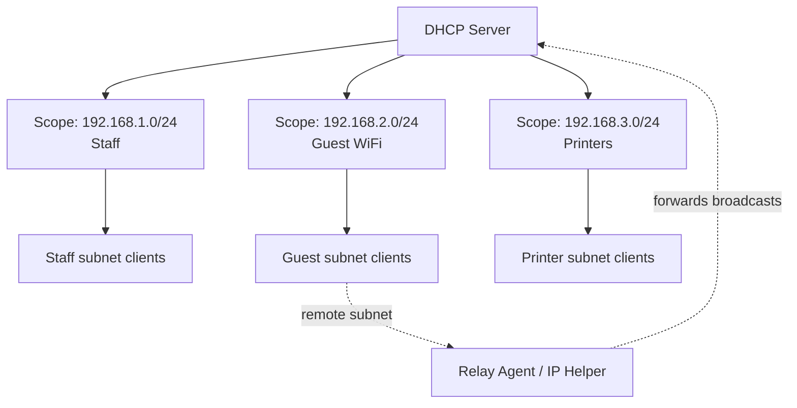

# Scope in a DHCP Server

In a **Dynamic Host Configuration Protocol (DHCP)** server, a **scope** is a range of IP addresses, together with the associated settings, that the server can lease to devices on a network. Creating multiple scopes lets a single DHCP server manage different networks or groups of devices efficiently.

## Overview

A scope is the fundamental unit of address administration on a DHCP server: it defines the pool of addresses that clients on a given subnet may be leased through the [DORA-Process](DORA-Process.md), along with the subnet mask, lease duration, and the options (gateway, DNS, domain name) handed out with each lease. A single [DHCP(Dynamic-Host-Configuration-Protocol)](DHCP(Dynamic-Host-Configuration-Protocol).md) server can host many scopes — typically one per subnet/VLAN — so one server can serve an entire routed enterprise while keeping addressing, organization, and security boundaries clean.

> [!NOTE]
> **Scope vs. superscope vs. multicast scope**
> A **scope** serves one subnet. A **superscope** groups several scopes so they can service a single physical network (multinet). A **multicast scope** hands out addresses from the 224.0.0.0/4 range for multicast applications. This note deals with the ordinary (unicast) IPv4 scope.

## What a Scope Contains

Each scope bundles the address pool with the settings a client needs to be fully configured:

| Element | Purpose |
|---------|---------|
| **Address range** | Start and end IP addresses the server may lease |
| **Subnet mask** | Defines the subnet the scope serves |
| **Lease duration** | How long a client keeps an address before renewing |
| **Scope options** | Per-scope settings such as router/gateway (003), DNS servers (006), and DNS domain name (015) — see [DHCP-Scope-Options](DHCP-Scope-Options.md) |
| **Exclusion range** | Addresses inside the range that must *not* be leased (statically assigned) — see [Exclusion-Range-in-DHCP](Exclusion-Range-in-DHCP.md) |
| **Reservations** | Specific addresses bound to a device's MAC so it always gets the same IP — see [DHCP-Reservations](DHCP-Reservations.md) |

## Why Use Multiple Scopes

### 1. Support for Multiple Subnets

Each network subnet requires its own IP address range. Therefore, a separate DHCP scope is created for each subnet.

**Example**

| Subnet | DHCP Scope Range |
|------|----------------|
| 192.168.1.0/24 | 192.168.1.10 – 192.168.1.200 |
| 192.168.2.0/24 | 192.168.2.10 – 192.168.2.200 |

Each subnet receives IP addresses from its corresponding scope.

### 2. Better Network Organization

Multiple scopes help administrators organize devices based on departments, locations, or device types.

**Example**

| Department | Scope Range |
|-----------|-------------|
| Office PCs | 192.168.10.1 – 192.168.10.200 |
| Printers | 192.168.20.1 – 192.168.20.50 |
| Guest WiFi | 192.168.30.1 – 192.168.30.200 |

This makes monitoring and troubleshooting easier.

### 3. Different Network Configurations

Each DHCP scope can have different configuration settings such as:

- Default Gateway
- DNS Server
- Lease Duration
- Domain Name

**Example**

| Network | DNS Server | Lease Time |
|-------|-----------|-----------|
| Corporate Network | Internal DNS | 8 Days |
| Guest Network | Public DNS | 4 Hours |

### 4. Network Segmentation and Security

Creating multiple scopes allows separation of different network types:

- Employee Network
- Guest Network
- IoT Devices
- Servers

This segmentation improves **security, access control, and traffic management**.

### 5. Efficient IP Address Management

Different device groups require different numbers of IP addresses. Multiple scopes prevent IP address wastage and help manage address allocation efficiently.

### 6. Support for Large Networks

In large organizations with many departments or buildings, multiple scopes allow a single DHCP server to manage multiple networks across the infrastructure. Serving remote subnets this way relies on a [DHCP-Relay-Agent-IP-Helper](DHCP-Relay-Agent-IP-Helper.md) to forward client broadcasts to the central server.

## Architecture

One DHCP server hosts several scopes; each scope maps to a single subnet, and the relay agent lets a remote subnet reach the central server.



## Configuration

On Windows Server, scopes are created in the **DHCP** console (`dhcpmgmt.msc`) or with the `DhcpServer` PowerShell module. The following creates a scope, sets its gateway and DNS, and lists the result.

```powershell
# Create a new IPv4 scope for the staff subnet
Add-DhcpServerv4Scope -Name "Staff Network" -StartRange 192.168.1.10 -EndRange 192.168.1.200 -SubnetMask 255.255.255.0 -LeaseDuration 8.00:00:00 -State Active

# Set scope-level options: router/gateway (003) and DNS server (006)
Set-DhcpServerv4OptionValue -ScopeId 192.168.1.0 -Router 192.168.1.1 -DnsServer 192.168.1.5 -DnsDomain corp.local

# List all scopes configured on the server
Get-DhcpServerv4Scope
```

> [!TIP]
> **Reserve the low addresses**
> Start the leasable range above the infrastructure block (e.g. begin at `.10`) and use an [exclusion range](Exclusion-Range-in-DHCP.md) to keep statically assigned devices — routers, switches, servers — out of the pool. This avoids address conflicts between DHCP and static hosts.

### Example Network Design

| Network Type | Subnet | DHCP Scope |
|--------------|--------|------------|
| Staff Network | 192.168.1.0/24 | 192.168.1.10 – 192.168.1.200 |
| Guest WiFi | 192.168.2.0/24 | 192.168.2.10 – 192.168.2.150 |
| Printers | 192.168.3.0/24 | 192.168.3.10 – 192.168.3.50 |

## Security Considerations

Scope design has direct security consequences. A scope's *size* determines how many leases exist to exhaust, and its *options* (gateway and DNS) are exactly what an attacker wants to control.

> [!WARNING]
> **Scopes are a target, not a control**
> - **Starvation** — an oversized pool gives a [DHCP-Starvation-Attack](DHCP-Starvation-Attack.md) more addresses to drain; when the legitimate scope is empty, clients turn to whichever server answers next.
> - **Rogue scopes** — a [Rogue-DHCP-Server](Rogue-DHCP-Server.md) serves its own scope with an attacker-controlled gateway/DNS, putting itself in the middle of victim traffic (man-in-the-middle).
> - **Option poisoning** — because DHCP is unauthenticated, the gateway (003) and DNS (006) options a client accepts are trusted blindly; a malicious scope redirects a victim's routing and name resolution.
> - **Right-size the pool** — tight ranges plus exclusions and short guest leases limit both wastage and the blast radius of an attack.

Defensively, scope integrity is enforced at the switch, not in the scope itself: [DHCP-Snooping](DHCP-Snooping.md) ensures only the trusted server's scope offers are accepted on the LAN. See [DHCP-Security-Issues-and-Attacks](DHCP-Security-Issues-and-Attacks.md) for the full attack surface.

## Best Practices

- Create **one scope per subnet/VLAN** and segment by network type (staff, guest, IoT, servers) for cleaner organization and security.
- Size ranges with headroom but no waste, and match **lease duration** to device churn — short for guest/Wi-Fi, long for static workstations.
- Use **exclusion ranges** and **reservations** so DHCP never collides with statically addressed infrastructure.
- Authorize the DHCP server in Active Directory and enable **DHCP snooping** on access switches so rogue scopes cannot answer clients.
- Document each scope's options (gateway, DNS, domain) in one place so changes propagate centrally instead of per host.

## Troubleshooting

| Symptom | Likely cause & fix |
|---------|--------------------|
| Clients receive 169.254.x.x (APIPA) addresses | No lease from the scope — confirm the scope is **Active** and authorized, and that a relay/IP-helper reaches remote subnets |
| "Scope full" / no addresses available | Pool exhausted (real growth or a starvation attack) — widen the range, shorten the lease, and check for starvation via snooping |
| Clients get wrong gateway/DNS | Scope options misconfigured, or a rogue server is answering first — verify options and enable DHCP snooping |
| Address conflicts on the LAN | Static hosts inside the scope range — add an exclusion range or a reservation for them |

## References

- [DHCP overview (Microsoft Learn)](https://learn.microsoft.com/en-us/windows-server/networking/technologies/dhcp/dhcp-top)
- [Add-DhcpServerv4Scope (Microsoft Learn)](https://learn.microsoft.com/en-us/powershell/module/dhcpserver/add-dhcpserverv4scope)
- [RFC 2131 — Dynamic Host Configuration Protocol](https://www.rfc-editor.org/rfc/rfc2131)

## Related

- [Enterprise Windows Infrastructure Security](../Readme.md) — course hub and map of content
- [DHCP(Dynamic-Host-Configuration-Protocol)](DHCP(Dynamic-Host-Configuration-Protocol).md) — the protocol this scope belongs to
- [DORA-Process](DORA-Process.md) — how a client obtains a lease from a scope
- [DHCP-Scope-Options](DHCP-Scope-Options.md) — per-scope settings delivered with a lease
- [Exclusion-Range-in-DHCP](Exclusion-Range-in-DHCP.md) — addresses withheld from a scope
- [DHCP-Reservations](DHCP-Reservations.md) — MAC-bound fixed addresses within a scope
- [DHCP-Relay-Agent-IP-Helper](DHCP-Relay-Agent-IP-Helper.md) — serving scopes across subnets
- [Rogue-DHCP-Server](Rogue-DHCP-Server.md) — attacker-run scope (man-in-the-middle)
- [DHCP-Snooping](DHCP-Snooping.md) — switch-level defense protecting legitimate scopes
