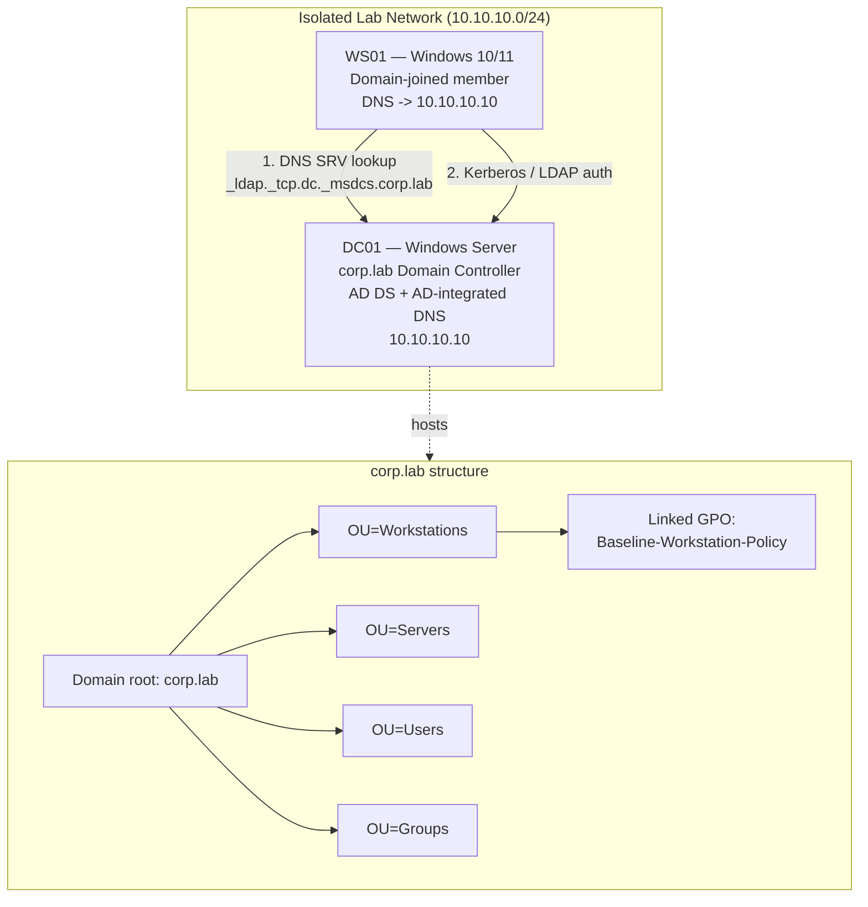

# Project 01 — Build a Single-DC Domain

The first capstone: take a fresh Windows Server, promote it into the first Domain Controller of a brand-new forest, and give the domain real structure with DNS, Organizational Units and a first Group Policy Object. Everything that follows in this course — file services, remote access, monitoring, and the attack/defend projects — assumes this domain exists and is healthy.

> [!NOTE]
> **Project at a glance**
> Combines **[Active-Directory-Domain-Services](../Active-Directory-Domain-Services-AD-DS/Active-Directory-Domain-Services.md)**, **[DNS](../Domain-Name-System-DNS/DNS-Server-Types.md)**, **[Organizational-Units-OU](../Active-Directory-Domain-Services-AD-DS/Organizational-Units-OU.md)** and **[Group Policy](../Group-Policy-Objects-GPO/Group-Policy(GPO).md)** into one working single-DC domain. Estimated time: 1–2 hours on the baseline lab.

## Overview

This project builds the foundation of the whole lab: a single-Domain-Controller Active Directory domain. Promoting a server to DC installs AD DS, creates the AD database (`NTDS.dit`) and SYSVOL, and stands up the DNS zone the domain depends on. You then model an organization with an OU hierarchy and prove that policy flows down that hierarchy with a first GPO.

Skills it proves:

- Installing the **AD DS** role and running a first-forest promotion with `Install-ADDSForest`.
- Understanding why **AD and DNS are inseparable** — clients find DCs through DNS SRV records.
- Designing an **OU structure** that mirrors administration, not the org chart, and delegating/targeting policy to it.
- Linking a **GPO** and confirming it applies with `gpresult` / `gpupdate`.
- Verifying domain health the way an administrator does: `dcdiag`, `Get-ADDomain`, and the SYSVOL/NETLOGON shares.

## Objective and Scope

End goal: a healthy single-DC forest root domain named `corp.lab`, with a working AD-integrated DNS zone, a small OU tree, at least one first GPO linked and verified, and one member workstation joined to the domain.

In scope: forest/domain creation, DNS, OUs, one baseline GPO, one domain join. Out of scope: a second DC/replication (that is [Project-02-Core-Network-Services](Project-02-Core-Network-Services.md) territory for DHCP and beyond), and any hardening — that is deliberately deferred to [Project-08-Harden-the-Enterprise](Project-08-Harden-the-Enterprise.md).

## Prerequisites

- Completed lab baseline: two VMs on an **isolated** internal network — see [Lab Setup and Virtualization](../Lab-Setup-and-Virtualization/Readme.md) and [Lab-Design](../Lab-Setup-and-Virtualization/Lab-Design.md).
  - **DC01** — Windows Server (2019/2022), static IP, patched.
  - **WS01** — Windows 10/11 client to join the domain.
- Concept grounding: [Active-Directory-Domain-Services](../Active-Directory-Domain-Services-AD-DS/Active-Directory-Domain-Services.md), [Forest-Tree-and-Domain](../Active-Directory-Domain-Services-AD-DS/Forest-Tree-and-Domain.md), [DNS-Hierarchy-and-How-It-Works](../Domain-Name-System-DNS/DNS-Hierarchy-and-How-It-Works.md), [Organizational-Units-OU](../Active-Directory-Domain-Services-AD-DS/Organizational-Units-OU.md) and [Group Policy](../Group-Policy-Objects-GPO/Group-Policy(GPO).md).
- Comfort with an elevated PowerShell prompt — see [Windows PowerShell](../Windows-PowerShell/Readme.md).

> [!IMPORTANT]
> **Set the DC's IP before you promote**
> Give **DC01** a **static IPv4 address** and point its **preferred DNS server at itself** (its own static IP, or `127.0.0.1`) *before* promotion. A DC that resolves DNS through a router or public resolver cannot register its own SRV records correctly, and every later problem traces back to this.

## Architecture



## Build Sequence

**1. Rename and set static networking on DC01** (do this before promotion, then reboot).

```powershell
Rename-Computer -NewName "DC01" -Restart
```

```powershell
# Static IP + self-referencing DNS (adjust interface alias / addresses to your lab)
New-NetIPAddress -InterfaceAlias "Ethernet" -IPAddress 10.10.10.10 -PrefixLength 24 -DefaultGateway 10.10.10.1
Set-DnsClientServerAddress -InterfaceAlias "Ethernet" -ServerAddresses 10.10.10.10
```

**2. Install the AD DS role** (the DNS role is pulled in during promotion).

```powershell
Install-WindowsFeature -Name AD-Domain-Services -IncludeManagementTools
```

**3. Promote DC01 to the first DC of a new forest** `corp.lab`. This prompts for the Directory Services Restore Mode (DSRM) password and reboots.

```powershell
Install-ADDSForest `
  -DomainName "corp.lab" `
  -DomainNetbiosName "CORP" `
  -ForestMode "WinThreshold" `
  -DomainMode "WinThreshold" `
  -InstallDns `
  -SafeModeAdministratorPassword (Read-Host -AsSecureString "DSRM password") `
  -Force
```

> [!TIP]
> **`WinThreshold` = 2016 functional level**
> `WinThreshold` is the functional-level identifier for Windows Server 2016 and is the highest level current server builds expose. Choose the highest level all your DCs support; in a single-DC lab that is simply the newest one.

**4. After reboot, create the OU structure.** Model OUs on how you will *administer and apply policy*, not on the HR org chart.

```powershell
Import-Module ActiveDirectory
New-ADOrganizationalUnit -Name "Workstations" -Path "DC=corp,DC=lab"
New-ADOrganizationalUnit -Name "Servers"      -Path "DC=corp,DC=lab"
New-ADOrganizationalUnit -Name "Users"        -Path "DC=corp,DC=lab"
New-ADOrganizationalUnit -Name "Groups"       -Path "DC=corp,DC=lab"
```

**5. Create a first user and group** (used later for policy/testing).

```powershell
New-ADUser -Name "Jane Admin" -SamAccountName "jadmin" `
  -AccountPassword (Read-Host -AsSecureString "Password") -Enabled $true `
  -Path "OU=Users,DC=corp,DC=lab"
New-ADGroup -Name "Workstation Admins" -GroupScope Global -Path "OU=Groups,DC=corp,DC=lab"
```

**6. Create and link a first GPO** to the Workstations OU. (The GroupPolicy module ships with the GPMC management tools.)

```powershell
New-GPO -Name "Baseline-Workstation-Policy" | Out-Null
New-GPLink -Name "Baseline-Workstation-Policy" -Target "OU=Workstations,DC=corp,DC=lab"
```

Edit the GPO in **Group Policy Management** (`gpmc.msc`) to add a visible, testable setting (for example a desktop message or a screen-lock timeout) so you can prove it applied in Verification.

**7. Join WS01 to the domain.** On **WS01**, first set its DNS to the DC, then join.

```powershell
# On WS01
Set-DnsClientServerAddress -InterfaceAlias "Ethernet" -ServerAddresses 10.10.10.10
Add-Computer -DomainName "corp.lab" -Credential (Get-Credential) -Restart
```

**8. Move WS01's computer object** into the Workstations OU so the GPO targets it.

```powershell
# On DC01, after WS01 has joined
Get-ADComputer WS01 | Move-ADObject -TargetPath "OU=Workstations,DC=corp,DC=lab"
```

## Verification (Definition of Done)

Run these on **DC01** unless noted. The build is done when all pass.

```powershell
dcdiag /v          # all core tests report "passed test" (Connectivity, Advertising, DNS, SysVolCheck)
Get-ADDomain       # returns corp.lab, correct NetBIOS name CORP, and the DC listed as a ReplicaDirectoryServer
Get-ADDomainController -Identity DC01   # confirms roles/FSMO holder
```

- **DNS**: `Resolve-DnsName -Type SRV _ldap._tcp.dc._msdcs.corp.lab` returns DC01 — this is what clients use to find the DC.
- **Shares**: `net share` on DC01 lists **SYSVOL** and **NETLOGON**.
- **OUs**: `Get-ADOrganizationalUnit -Filter *` lists the four OUs.
- **GPO**: on WS01, run `gpupdate /force`, then `gpresult /r` (or `Get-GPResultantSetOfPolicy`) and confirm **Baseline-Workstation-Policy** appears under Applied Group Policy Objects, and the visible setting is in effect.

> [!NOTE]
> **Snapshot the good state**
> Once every check passes, take a VM snapshot named `P01-domain-healthy`. Later projects build on this exact point, and the attack projects will want to roll back to it.

## Security Considerations

> [!WARNING]
> **A DC is the crown jewel — treat this build as pre-hardening**
> A Domain Controller holds the entire domain's credential material in `NTDS.dit`; compromising one DC compromises the whole domain. This project intentionally leaves the domain **unhardened** — that is what [Project-08-Harden-the-Enterprise](Project-08-Harden-the-Enterprise.md) and [Project-09-Attack-the-Lab](Project-09-Attack-the-Lab.md) exercise. Until then, keep the DC and the whole domain on an **isolated network** and treat it as hostile to anything outside.

- **Weak/default policy is exposed by default.** A fresh domain applies only the Default Domain Policy; the built-in password/lockout baseline is modest and there is no auditing yet. Do not model production password strength from an untouched lab.
- **DSRM password is a standing local admin credential.** The DSRM account can be abused for persistence (attackers can sync it to a domain account). Set it strong, store it in the lab's secret store, and never reuse a real password.
- **DNS is attack surface.** AD-integrated DNS allows dynamic updates; on a real network that enables record spoofing. Keep it internal-only in the lab.
- **NTLM is still enabled.** A brand-new domain accepts NTLM alongside Kerberos — see [NTLM](../Active-Directory-Domain-Services-AD-DS/NTLM.md) for why that matters. Hardening it is deferred, not free.
- Detection/remediation framing for the later attack phases: DC promotion and OU/GPO changes are exactly the events your [monitoring pipeline](../Windows-Monitoring-and-Logging/Readme.md) should record (directory-service and Group Policy change auditing).

## Troubleshooting

| Symptom | Likely cause & fix |
| --- | --- |
| `Install-ADDSForest` fails on the DNS delegation step | Expected for a new isolated forest with no parent zone — the warning about a delegation is safe to ignore; promotion still completes. |
| WS01 domain join: "domain could not be contacted" | WS01's DNS is not pointing at DC01 — set `Set-DnsClientServerAddress` to `10.10.10.10` and retry. |
| `dcdiag` DNS/Advertising tests fail | DC's own DNS is not self-referencing, or it never registered SRV records — fix DNS client to point at itself, then `ipconfig /registerdns` and `Restart-Service netlogon`. |
| GPO doesn't apply on WS01 | Computer object is not in the linked OU, or client hasn't refreshed — move the object into `OU=Workstations`, then `gpupdate /force` and re-check `gpresult /r`. |
| GPO applied but setting has no effect | Setting may be a **user** setting on a computer-scoped link (or vice versa); confirm the scope, and check GPO link/precedence — see [GPO-Processing-Order](../Group-Policy-Objects-GPO/GPO-Processing-Order.md). |

## References

- [Microsoft Learn — Install a new Windows Server Active Directory forest](https://learn.microsoft.com/en-us/windows-server/identity/ad-ds/deploy/install-a-new-windows-server-2012-active-directory-forest--level-200-)
- [Microsoft Learn — `Install-ADDSForest` cmdlet](https://learn.microsoft.com/en-us/powershell/module/addsdeployment/install-addsforest)
- [Microsoft Learn — Create an Organizational Unit](https://learn.microsoft.com/en-us/windows-server/identity/ad-ds/plan/creating-an-organizational-unit-design)
- [Microsoft Learn — Group Policy overview for Windows Server](https://learn.microsoft.com/en-us/previous-versions/windows/it-pro/windows-server-2012-r2-and-2012/hh831791(v=ws.11))

## Related

- [Active-Directory-Domain-Services](../Active-Directory-Domain-Services-AD-DS/Active-Directory-Domain-Services.md) — the core service this project stands up
- [Organizational-Units-OU](../Active-Directory-Domain-Services-AD-DS/Organizational-Units-OU.md) — the structure you build in step 4
- [Group Policy (GPO)](../Group-Policy-Objects-GPO/Group-Policy(GPO).md) — the policy layer applied in step 6
- [DNS](../Domain-Name-System-DNS/DNS-Server-Types.md) and [DNS-Hierarchy-and-How-It-Works](../Domain-Name-System-DNS/DNS-Hierarchy-and-How-It-Works.md) — the resolution AD depends on
- [FSMO-Roles](../Active-Directory-Domain-Services-AD-DS/FSMO-Roles.md) and [AD-Replication](../Active-Directory-Domain-Services-AD-DS/AD-Replication.md) — single-DC now; these matter once you add a second DC
- [Lab Setup and Virtualization](../Lab-Setup-and-Virtualization/Readme.md) — the baseline VMs this project runs on
- [Project-02-Core-Network-Services](Project-02-Core-Network-Services.md) — next project: DHCP and core network services on this domain
- [Project-08-Harden-the-Enterprise](Project-08-Harden-the-Enterprise.md) — where this deliberately-soft build gets hardened
- [Enterprise Windows Infrastructure Security](../Readme.md) — course hub
