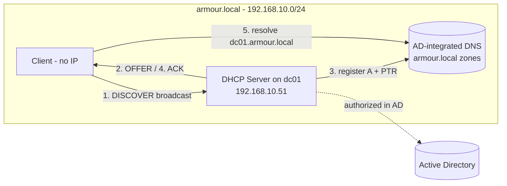

# Project 02 — Core Network Services (DHCP + DNS)

This project builds the addressing and name-resolution layer of the lab: an authorized Windows DHCP server that leases addresses to clients, wired to the AD-integrated DNS from Project 01 so that leased hosts register themselves and resolve the domain. It proves you can deliver working Layer-3 services to a domain rather than statically configuring every host.

## Overview

Modules teach DHCP and DNS in isolation; a real network needs them cooperating. Here you stand up the **DHCP Server role** on the domain controller (or a member server), authorize it in Active Directory, define a scope with the correct options (gateway, DNS, DNS domain), reserve addresses for infrastructure, and configure **dynamic DNS registration** so DHCP-leased clients get correct forward (`A`) and reverse (`PTR`) records automatically. The skills proved are: AD-authorized DHCP deployment, scope/option/reservation design, and DHCP-to-DNS integration on an AD-integrated zone.

> [!NOTE]
> **Where this sits in the build order**
> Project 01 delivered the domain, the DNS Server role, and the `armour.local` forward/reverse zones. This project consumes that DNS and adds automatic addressing on top of it. Do not start until Project 01's definition of done passes.

## Objective and Scope

Deliver automatic, conflict-free addressing and name resolution to the `armour.local` lab subnet, such that a freshly booted client:

- receives an IPv4 lease from the authorized DHCP server (not APIPA, not a rogue),
- is handed the correct default gateway, DNS server, and DNS domain suffix,
- and is automatically registered in DNS with matching forward (`A`) and reverse (`PTR`) records.

Out of scope: split-scope / failover partner servers (see [DHCP-High-Availability-Failover](../Dynamic-Host-Configuration-Protocol-DHCP/DHCP-High-Availability-Failover.md)), IPv6 (DHCPv6), and cross-subnet relay (covered conceptually in [DHCP-Relay-Agent-IP-Helper](../Dynamic-Host-Configuration-Protocol-DHCP/DHCP-Relay-Agent-IP-Helper.md)).

## Prerequisites

- **[Project-01-Single-DC-Domain](Project-01-Single-DC-Domain.md)** — a working `armour.local` domain with the DNS Server role and forward/reverse zones already in place.
- Lab environment from [Lab Setup and Virtualization](../Lab-Setup-and-Virtualization/Readme.md) on an **isolated** network.
- Module background: [DHCP](../Dynamic-Host-Configuration-Protocol-DHCP/Readme.md), [DNS](../Domain-Name-System-DNS/Readme.md), and [Networking Fundamentals](../Networking-Fundamentals/Readme.md).

### Lab hosts

| Host | Role | IPv4 |
| --- | --- | --- |
| `dc01` | DC + DNS + DHCP server (static) | `192.168.10.51` |
| Gateway | Lab router / NAT interface | `192.168.10.1` |
| Client | Domain-joined test workstation (DHCP) | leased from scope |

## Architecture



## Build Sequence

Run all commands in an **elevated PowerShell** session on `dc01` unless noted.

1. **Install the DHCP Server role** with its management tools.

    ```powershell
    Install-WindowsFeature -Name DHCP -IncludeManagementTools
    ```

2. **Create the DHCP security groups** and restart the service so the role is fully initialized.

    ```cmd
    netsh dhcp add securitygroups
    ```

    ```powershell
    Restart-Service dhcpserver
    ```

3. **Authorize the server in Active Directory.** An unauthorized Windows DHCP server refuses to lease on a domain network — authorization is the AD control that stops rogue Windows servers.

    ```powershell
    Add-DhcpServerInDC -DnsName "dc01.armour.local" -IPAddress 192.168.10.51
    ```

4. **Create the scope** for the subnet.

    ```powershell
    Add-DhcpServerv4Scope -Name "armour-LAN" `
        -StartRange 192.168.10.100 -EndRange 192.168.10.200 `
        -SubnetMask 255.255.255.0 -State Active
    ```

5. **Exclude the infrastructure range** so the server, gateway, and static hosts are never leased out.

    ```powershell
    Add-DhcpServerv4ExclusionRange -ScopeId 192.168.10.0 `
        -StartRange 192.168.10.1 -EndRange 192.168.10.60
    ```

6. **Set the scope options** — router (option 3), DNS server (option 6), and DNS domain name (option 15).

    ```powershell
    Set-DhcpServerv4OptionValue -ScopeId 192.168.10.0 `
        -Router 192.168.10.1 `
        -DnsServer 192.168.10.51 `
        -DnsDomain "armour.local"
    ```

7. **Add a reservation** for a fixed-address host (e.g. a printer or app server) so it always gets the same lease with central option control.

    ```powershell
    Add-DhcpServerv4Reservation -ScopeId 192.168.10.0 `
        -IPAddress 192.168.10.90 `
        -ClientId "00-11-22-33-44-55" `
        -Description "Lab printer"    # untested
    ```

8. **Enable dynamic DNS registration** so DHCP updates both `A` and `PTR` records, including for non-Windows / down-level clients.

    ```powershell
    Set-DhcpServerv4DnsSetting -ScopeId 192.168.10.0 `
        -DynamicUpdates "Always" `
        -DeleteDnsRROnLeaseExpiry $true `
        -UpdateDnsRRForOlderClients $true
    ```

9. **Give DHCP a credential for secure DNS updates** so it registers records without using the machine account (recommended when DHCP and DNS run on the same DC).

    ```powershell
    Set-DhcpServerDnsCredential -Credential (Get-Credential) -ComputerName "dc01.armour.local"   # untested
    ```

## Verification (Definition of Done)

- **Server authorized and scope active:**

    ```powershell
    Get-DhcpServerInDC
    Get-DhcpServerv4Scope
    ```

    `Get-DhcpServerInDC` should list `dc01.armour.local` / `192.168.10.51`; the scope should show `State = Active`.

- **Options are set** — `Get-DhcpServerv4OptionValue -ScopeId 192.168.10.0` shows options 3, 6, and 15 with the gateway, `192.168.10.51`, and `armour.local`.

- **A client gets a real lease** — on the client run `ipconfig /all`; it should show an address in `192.168.10.100–200`, the DHCP server `192.168.10.51`, DNS `192.168.10.51`, and the `armour.local` suffix (not a `169.254.x.x` APIPA address). Confirm the lease server-side:

    ```powershell
    Get-DhcpServerv4Lease -ScopeId 192.168.10.0
    ```

- **DNS auto-registration works** — after the client leases, forward and reverse lookups both resolve:

    ```powershell
    Resolve-DnsName client01.armour.local
    Resolve-DnsName 192.168.10.105   # reverse / PTR
    ```

## Security Considerations

> [!WARNING]
> **DHCP is unauthenticated; DNS registration can be spoofed**
> - **Rogue DHCP** — DHCP has no client-side authentication, so a client trusts whichever server answers first. On a switched network, enable **DHCP snooping** and trust only the uplink toward the real server (see [DHCP-Snooping](../Dynamic-Host-Configuration-Protocol-DHCP/DHCP-Snooping.md) and [Rogue-DHCP-Server](../Dynamic-Host-Configuration-Protocol-DHCP/Rogue-DHCP-Server.md)). AD authorization only stops rogue *Windows* servers, not a Linux/appliance rogue.
> - **DHCP starvation** — an attacker floods `DISCOVER`s with spoofed MACs to exhaust the pool and force clients onto a rogue server (see [DHCP-Starvation-Attack](../Dynamic-Host-Configuration-Protocol-DHCP/DHCP-Starvation-Attack.md)). Mitigate with port security / limits per MAC and monitor for abnormal lease churn.
> - **Dynamic DNS hijack / name squatting** — unsecured dynamic updates let any host overwrite another's `A` record. Use **AD-integrated zones with secure-only dynamic updates**, and set a dedicated DHCP DNS credential rather than letting the DC machine account own records. See [DHCP-Security-Issues-and-Attacks](../Dynamic-Host-Configuration-Protocol-DHCP/DHCP-Security-Issues-and-Attacks.md).

Study-level detection: DHCP server operational logs and Event ID **1341** (lease issued) surface lease activity; a spike in unique MACs against the pool indicates starvation. These are exercised for real in [Project-09-Attack-the-Lab](Project-09-Attack-the-Lab.md) and defended in [Project-10-Purple-Team-Capstone](Project-10-Purple-Team-Capstone.md).

## Troubleshooting

| Symptom | Likely cause & fix |
| --- | --- |
| Client gets `169.254.x.x` (APIPA) | No reply reaching it — confirm the scope is `Active` and the server is **authorized** (`Get-DhcpServerInDC`); check the service is bound to the LAN interface |
| Server installed but won't lease | Not authorized in AD, or the DHCP security groups weren't created — run `Add-DhcpServerInDC` then `netsh dhcp add securitygroups` and restart the service |
| Client leases but has no gateway/DNS | Scope options 3/6/15 missing — set them with `Set-DhcpServerv4OptionValue` |
| Lease works but name doesn't resolve | Dynamic DNS not registering — check `Set-DhcpServerv4DnsSetting` and that the DHCP DNS credential can perform secure updates |
| Two clients get the same IP | An exclusion for a static host is missing, or a second/rogue server is answering — verify the exclusion range and inspect `ipconfig /all` for an unexpected DHCP server |

## References

- [DHCP overview (Microsoft Learn)](https://learn.microsoft.com/en-us/windows-server/networking/technologies/dhcp/dhcp-top)
- [DhcpServer PowerShell module (Microsoft Learn)](https://learn.microsoft.com/en-us/powershell/module/dhcpserver/)
- [RFC 2131 — Dynamic Host Configuration Protocol](https://www.rfc-editor.org/rfc/rfc2131)
- [MITRE ATT&CK — Adversary-in-the-Middle: DHCP Spoofing (T1557.003)](https://attack.mitre.org/techniques/T1557/003/)

## Related

- [DHCP](../Dynamic-Host-Configuration-Protocol-DHCP/Readme.md) — the module this project applies
- [DNS](../Domain-Name-System-DNS/Readme.md) — AD-integrated zones this project registers into
- [Networking Fundamentals](../Networking-Fundamentals/Readme.md) — addressing and subnetting background
- [DORA-Process](../Dynamic-Host-Configuration-Protocol-DHCP/DORA-Process.md) — the DISCOVER/OFFER/REQUEST/ACK handshake behind step 4's verification
- [Scope-in-a-DHCP-Server](../Dynamic-Host-Configuration-Protocol-DHCP/Scope-in-a-DHCP-Server.md) — scope design detail
- [Dynamic-DNS-(DDNS)](../Domain-Name-System-DNS/Dynamic-DNS-(DDNS).md) — the auto-registration mechanism configured in steps 8–9
- [Project-01-Single-DC-Domain](Project-01-Single-DC-Domain.md) — prerequisite domain + DNS build
- [Project-03-Publish-Web-and-Database](Project-03-Publish-Web-and-Database.md) — next project, which relies on this name resolution
- [Enterprise Windows Infrastructure Security](../Readme.md) — course hub
