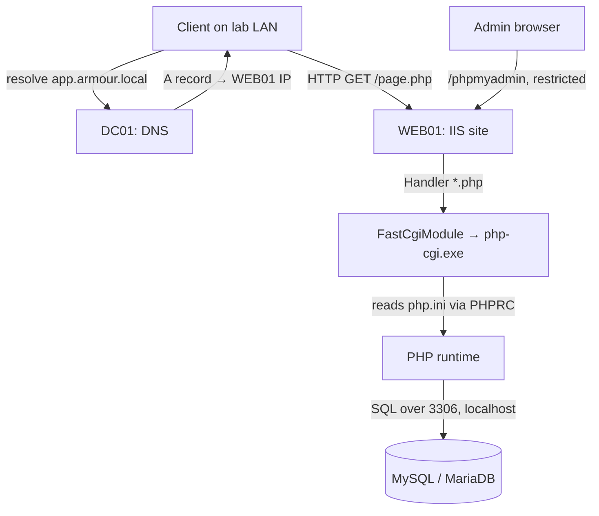

# Project 03 — Publish Web + Database

This capstone project stands up a working web application on a domain-joined Windows Server: **IIS** serving a **PHP** front end backed by a **MySQL/MariaDB** database, deployed with a lightweight **SDLC** discipline (source → staging → production). It assembles the [Web Server (IIS)](../Web-Server-IIS/Readme.md) module into one end-to-end build on top of the domain from the earlier projects.

## Overview

Modules teach IIS, PHP, and databases separately; a real internal web service needs all three wired together and reachable through DNS on the domain network. This project builds that stack — the web tier (IIS + PHP via FastCGI) and the data tier (MySQL/MariaDB with phpMyAdmin for administration) — then verifies the app renders dynamic, database-driven pages. It proves you can host and publish an internal line-of-business web application on Windows infrastructure and reason about its attack surface.

> [!NOTE]
> **What this project proves**
> Skills demonstrated: installing and binding an IIS site, wiring PHP through FastCGI, connecting PHP to a relational database, publishing the app through domain DNS, and hardening the result before it is reachable by users.

## Objective and Scope

Deliver an internal web application at a friendly DNS name (for example `http://app.armour.local`) that:

- serves static and PHP pages from IIS,
- reads and writes data in a MySQL/MariaDB database,
- is administered through a restricted phpMyAdmin instance, and
- is deployed through a minimal SDLC flow rather than editing live files in production.

Out of scope: public internet exposure, load balancing, and a real CI/CD pipeline — this is a single-host internal publish, kept on the isolated lab network.

## Prerequisites

- **[Project-01-Single-DC-Domain](Project-01-Single-DC-Domain.md)** — a working domain (`armour.local`) with a DC providing DNS. The web host is joined to this domain.
- **[Project-02-Core-Network-Services](Project-02-Core-Network-Services.md)** — DHCP/DNS so the web server has a stable address and a resolvable name.
- Module knowledge:
  - [Web Server (IIS)](../Web-Server-IIS/Readme.md) — IIS, site bindings, PHP, phpMyAdmin, and the authentication model.
  - [Setting-Up-PHP-on-Windows-Server](../Web-Server-IIS/Setting-Up-PHP-on-Windows-Server.md) — the FastCGI PHP install this build reuses.
  - [phpMyAdmin-on-Windows-Server-with-IIS](../Web-Server-IIS/phpMyAdmin-on-Windows-Server-with-IIS.md) — the database admin front end.
  - [Software-Development-Life-Cycle(SDLC)-and-Related-IT-Roles](../Software-Development-Life-Cycle/Software-Development-Life-Cycle(SDLC)-and-Related-IT-Roles.md) — the deploy discipline framing.
- Lab VMs from [Lab Setup and Virtualization](../Lab-Setup-and-Virtualization/Readme.md):
  - **DC01** — domain controller + DNS (from Project 01).
  - **WEB01** — Windows Server, domain-joined, static/reserved IP; hosts IIS, PHP, and the database.

> [!TIP]
> **Keep tiers separable**
> This lab collapses web and database onto one host (WEB01) for simplicity. In production they belong on separate servers so a web-tier compromise does not directly land on the database. Note the collapse as a documented lab decision.

## Architecture

The following diagram shows the request flow — client to DNS to IIS to PHP to the database — plus the admin path.



## Build Sequence

1. **Prepare WEB01.** Domain-join the server and confirm it resolves the domain and reaches the DC.

   ```powershell
   Add-Computer -DomainName "armour.local" -Credential (Get-Credential) -Restart
   ```

2. **Install the IIS Web Server role.**

   ```powershell
   Install-WindowsFeature -Name Web-Server -IncludeManagementTools
   ```

3. **Install PHP (Non Thread Safe) and register the FastCGI handler.** Follow [Setting-Up-PHP-on-Windows-Server](../Web-Server-IIS/Setting-Up-PHP-on-Windows-Server.md) — extract to `C:\PHP`, create `php.ini`, add the `*.php` module mapping to `C:\PHP\php-cgi.exe`, and set the `PHPRC` FastCGI environment variable. The CGI/FastCGI feature must be present:

   ```powershell
   Install-WindowsFeature -Name Web-CGI
   ```

4. **Install MySQL or MariaDB** on WEB01 and secure the root account. Confirm the service is listening on `localhost:3306`.

   ```cmd
   mysql -u root -p -e "STATUS;"
   ```

5. **Create the application database and a least-privilege app user** (not root) scoped to the app schema:

   ```text
   CREATE DATABASE appdb CHARACTER SET utf8mb4;
   CREATE USER 'appuser'@'localhost' IDENTIFIED BY '<strong-password>';
   GRANT SELECT, INSERT, UPDATE, DELETE ON appdb.* TO 'appuser'@'localhost';
   FLUSH PRIVILEGES;
   ```

6. **Deploy phpMyAdmin** for database administration per [phpMyAdmin-on-Windows-Server-with-IIS](../Web-Server-IIS/phpMyAdmin-on-Windows-Server-with-IIS.md) — extract to `C:\inetpub\wwwroot\phpmyadmin` and add it as an IIS application. Restrict it (see Security Considerations).

7. **Create the application site and binding.** Put the app code in its own root and bind a host header so it answers to `app.armour.local`:

   ```powershell
   New-Item -Path 'C:\inetpub\app' -ItemType Directory
   New-Website -Name 'AppSite' -PhysicalPath 'C:\inetpub\app' -HostHeader 'app.armour.local' -Port 80
   ```

8. **Publish the name in DNS.** On DC01, create an A record pointing the app name at WEB01's IP:

   ```powershell
   Add-DnsServerResourceRecordA -ZoneName "armour.local" -Name "app" -IPv4Address "192.168.10.51"   # untested
   ```

9. **Deploy the app through a minimal SDLC.** Keep source in a repo/staging folder, test on WEB01's staging path, then copy the verified build into `C:\inetpub\app` — never edit files live in production. Store DB credentials in app config, not in source control.

## Verification (Definition of Done)

- **DNS resolves the app name** to WEB01:

  ```powershell
  Resolve-DnsName app.armour.local
  ```

- **IIS site is started** and bound to the host header:

  ```powershell
  Get-Website -Name 'AppSite'
  Get-WebBinding -Name 'AppSite'
  ```

- **PHP executes** — a `phpinfo()` test page renders the PHP environment (then delete it), confirming FastCGI is wired.
- **Database connectivity** — an application page performs a live query and returns rows from `appdb`, proving the PHP → MySQL path works end to end.
- **phpMyAdmin** loads only from the admin host and requires authentication; it is unreachable from a normal client.
- A browser on the lab LAN loads `http://app.armour.local` and sees dynamic, database-driven content.

> [!IMPORTANT]
> **Done means verified, not deployed**
> The project is complete only when a client resolves the name and renders a database-backed page — not merely when the files are copied. Walk each checkpoint above before declaring success.

## Security Considerations

A domain-joined web + database host is a high-value pivot: it is reachable by every client and it holds application data and DB credentials.

> [!WARNING]
> **Harden before the app is reachable**
> - **Least-privilege app pool + DB user** — run the IIS app pool under a low-privilege identity and connect to MySQL as `appuser` (scoped grants), never as `root`. A web compromise must not equal SYSTEM or DBA.
> - **Restrict phpMyAdmin** — bind it to an admin-only path, require authentication, and limit it by source IP; a reachable DB admin panel is a direct database-takeover surface.
> - **Harden `php.ini`** — set `display_errors = Off`, enable `log_errors`, and disable dangerous functions (`exec,passthru,shell_exec,system`) so an injection or upload flaw cannot become command execution. See [Setting-Up-PHP-on-Windows-Server](../Web-Server-IIS/Setting-Up-PHP-on-Windows-Server.md).
> - **Remove test artefacts** — delete `phpinfo.php` and any sample pages; they leak versions, paths, and extensions to attackers.
> - **Isolation** — keep the whole build on the isolated lab network; never expose it to a home or production LAN.
> - **Parameterise queries** — the app's own SQL must use prepared statements; SQL injection here is the classic path from web access to full database compromise (see Web-Application-Penetration-Test).

## Troubleshooting

| Symptom | Likely cause & fix |
| --- | --- |
| `.php` files download as raw source | `*.php` handler mapping missing — add the FastCGI module mapping to `C:\PHP\php-cgi.exe` |
| `500` / FastCGI process fails to start | `php.ini` not found or malformed — verify the `PHPRC` FastCGI env var points to `C:\PHP` |
| Page loads but DB query errors | `mysqli` extension not loaded, or `appuser` grants/host wrong — uncomment `extension=mysqli`, restart the pool, recheck `GRANT` |
| Browser can't resolve `app.armour.local` | A record missing on DC01, or client using the wrong DNS server — add the record; confirm client DNS points at the DC |
| Site answers on IP but not host header | Binding host header mismatch — confirm `Get-WebBinding` matches the DNS name exactly |
| phpMyAdmin reachable from any client | Access restriction not applied — bind to admin path/IP and require auth |

## References

- [Install and Configure PHP on IIS — Microsoft Learn](https://learn.microsoft.com/en-us/iis/application-frameworks/install-and-configure-php-on-iis/)
- [Web Server (IIS) role — Microsoft Learn](https://learn.microsoft.com/en-us/iis/get-started/introduction-to-iis/introduction-to-iis-architecture)
- [MySQL 8.0 Reference Manual — Securing the Initial Accounts](https://dev.mysql.com/doc/refman/8.0/en/default-privileges.html)
- [MITRE ATT&CK — T1190 Exploit Public-Facing Application](https://attack.mitre.org/techniques/T1190/)

## Related

- [Web Server (IIS)](../Web-Server-IIS/Readme.md) — the module this project assembles
- [Setting-Up-PHP-on-Windows-Server](../Web-Server-IIS/Setting-Up-PHP-on-Windows-Server.md) — the PHP/FastCGI install reused here
- [phpMyAdmin-on-Windows-Server-with-IIS](../Web-Server-IIS/phpMyAdmin-on-Windows-Server-with-IIS.md) — database admin front end
- [Internet-Information-Services(IIS)](../Web-Server-IIS/Internet-Information-Services(IIS).md) — the IIS web server role
- [Types-of-Site-Binding-in-IIS](../Web-Server-IIS/Types-of-Site-Binding-in-IIS.md) — host-header and HTTPS bindings
- [Software-Development-Life-Cycle(SDLC)-and-Related-IT-Roles](../Software-Development-Life-Cycle/Software-Development-Life-Cycle(SDLC)-and-Related-IT-Roles.md) — the deploy discipline
- [Project-01-Single-DC-Domain](Project-01-Single-DC-Domain.md) — provides the domain and DNS
- [Project-02-Core-Network-Services](Project-02-Core-Network-Services.md) — provides addressing and name resolution
- [Project-04-File-Services-and-DFS](Project-04-File-Services-and-DFS.md) — sibling project
- [Project-08-Harden-the-Enterprise](Project-08-Harden-the-Enterprise.md) — hardening applied estate-wide
- [Project-09-Attack-the-Lab](Project-09-Attack-the-Lab.md) — attacks this web app becomes a target of
- [Enterprise Windows Infrastructure Security](../Readme.md) — course hub
