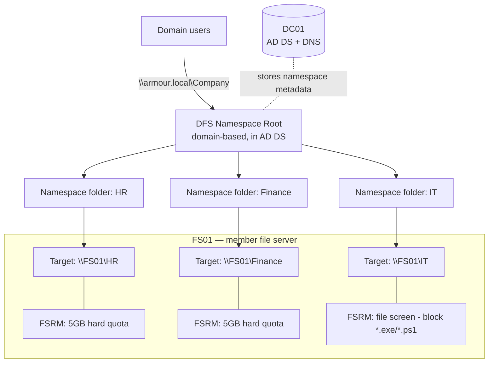

# Project 04 — File Services & DFS Namespace

This project builds an enterprise file-services tier for the lab domain: departmental SMB shares protected by layered NTFS and share permissions, unified behind a single domain-based DFS Namespace, and governed by File Server Resource Manager (FSRM) quotas and file screening. It proves you can present, secure, and control shared storage the way a real Windows shop does.

## Overview

By the end you will have a file server that:

- Hosts departmental shares (HR, Finance, IT) with **least-privilege** NTFS ACLs behind restrictive share permissions.
- Exposes every share under one stable path — `\\armour.local\Company\...` — via a **domain-based DFS Namespace**, so users never memorize server names.
- Enforces **hard quotas** and **file screens** with FSRM so storage growth and unwanted file types are controlled and audited.

Skills proven: NTFS vs. share permission interaction (most-restrictive-wins), DFS-N referral design, and FSRM policy authoring — the building blocks of [File Services and DFS](../File-Services-and-DFS/Readme.md).

> [!NOTE]
> **Domain convention**
> This lab uses the domain `armour.local` established in [Project-01-Single-DC-Domain](Project-01-Single-DC-Domain.md). Substitute your own domain and server names throughout.

## Objective and Scope

Stand up a member file server (`FS01`) joined to `armour.local` that:

1. Serves three department shares with correct NTFS + share ACLs.
2. Publishes them under a single domain-based namespace `\\armour.local\Company`.
3. Applies a 5 GB hard quota to each department folder and blocks executable/script uploads via a file screen.

Out of scope: DFS **Replication** between multiple targets (covered as an optional extension), clustering, and Access-Based Enumeration tuning beyond enabling it.

## Prerequisites

- **[Project-01-Single-DC-Domain](Project-01-Single-DC-Domain.md)** — a working DC (`DC01`) with AD DS and DNS for `armour.local`.
- **[Project-02-Core-Network-Services](Project-02-Core-Network-Services.md)** — DHCP/DNS so the file server resolves and is resolvable.
- A second Windows Server VM (`FS01`) domain-joined, with a dedicated data volume `D:`.
- Working knowledge from [File Services and DFS](../File-Services-and-DFS/Readme.md) — NTFS permissions, [Share-Permissions](../File-Services-and-DFS/Share-Permissions.md), [DFS-Namespaces-(Distributed-File-System-Namespaces)](../File-Services-and-DFS/DFS-Namespaces-(Distributed-File-System-Namespaces).md), and [Storage-Quotas](../File-Services-and-DFS/Storage-Quotas.md).
- Security groups pre-created in AD (e.g. via [GPO](../Group-Policy-Objects-GPO/Readme.md) delegation): `HR-Users`, `Finance-Users`, `IT-Users`, `FileAdmins`.

## Architecture



## Build Sequence

### 1. Install the role services on FS01

```powershell
Install-WindowsFeature -Name FS-FileServer, FS-DFS-Namespace, FS-Resource-Manager `
  -IncludeManagementTools
```

### 2. Create the folder structure and shares

```powershell
"HR","Finance","IT" | ForEach-Object {
    New-Item -Path "D:\Shares\$_" -ItemType Directory -Force
    New-SmbShare -Name $_ -Path "D:\Shares\$_" `
      -FullAccess "ARMOUR\FileAdmins" -ChangeAccess "ARMOUR\Domain Users" `
      -FolderEnumerationMode AccessBased
}
```

> [!IMPORTANT]
> **Share vs. NTFS**
> Share permissions and NTFS permissions are evaluated separately and the **most restrictive** of the two wins. Keep share permissions broad but sane (Change for users, Full for admins) and enforce least privilege at the NTFS layer below.

### 3. Lock down NTFS permissions (least privilege)

Break inheritance, then grant only the owning department Modify on its own folder:

```powershell
icacls "D:\Shares\HR" /inheritance:r
icacls "D:\Shares\HR" /grant "ARMOUR\HR-Users:(OI)(CI)M" `
  "ARMOUR\FileAdmins:(OI)(CI)F" "SYSTEM:(OI)(CI)F"
# Repeat for Finance -> Finance-Users, IT -> IT-Users
```

### 4. Create the domain-based DFS Namespace

```powershell
New-DfsnRoot -Path "\\armour.local\Company" -TargetPath "\\FS01\HR" -Type DomainV2
```

Then add a namespace folder per department pointing at its share target:

```powershell
New-DfsnFolder -Path "\\armour.local\Company\HR"      -TargetPath "\\FS01\HR"
New-DfsnFolder -Path "\\armour.local\Company\Finance" -TargetPath "\\FS01\Finance"
New-DfsnFolder -Path "\\armour.local\Company\IT"      -TargetPath "\\FS01\IT"
```

### 5. Apply FSRM quotas and a file screen

```powershell
# 5 GB hard quota on each department folder
"HR","Finance","IT" | ForEach-Object {
    New-FsrmQuota -Path "D:\Shares\$_" -Size 5GB                       # untested
}

# Block executables and scripts across the shares tree
New-FsrmFileScreen -Path "D:\Shares" `
  -IncludeGroup "Executable Files" -Active                             # untested
```

> [!TIP]
> **Templates over one-offs**
> In production, define an FSRM **quota template** and **file group** once, then apply them by name (`-Template`, `-IncludeGroup`). It keeps policy consistent and lets you re-tune every folder from a single definition.

## Verification (Definition of Done)

- **Namespace resolves**: `Get-DfsnRoot -Path "\\armour.local\Company"` returns `State: Online`, and `\\armour.local\Company` browses to HR/Finance/IT in Explorer.
- **Referrals correct**: `Get-DfsnFolderTarget -Path "\\armour.local\Company\HR"` shows target `\\FS01\HR`.
- **Permissions enforced**: an `HR-Users` member can open `\\armour.local\Company\HR` but is denied `...\Finance`; verify NTFS with `icacls "D:\Shares\HR"`.
- **Quota active**: `Get-FsrmQuota -Path "D:\Shares\HR"` shows a 5 GB **hard** limit; copying >5 GB fails with "out of disk space".
- **File screen active**: copying a `.exe`/`.ps1` into a share is blocked; `Get-FsrmFileScreen` lists the screen as Active.
- **Shares present**: `Get-SmbShare` lists HR/Finance/IT with `FolderEnumerationMode = AccessBased`.

## Security Considerations

> [!WARNING]
> **Shares are a top lateral-movement and data-exfiltration surface**
> - **Over-permissive ACLs** (e.g. `Everyone: Full Control`, or leaving `Domain Users: Modify` on inheritance) let any compromised account read or tamper with department data. Enforce least privilege at the NTFS layer and break inheritance deliberately.
> - **Share enumeration** — tools like `net view`, `smbclient`, PowerView, or `CrackMapExec`/`SharpShares` map reachable shares and readable files during recon; open shares accelerate discovery (MITRE ATT&CK **T1135 Network Share Discovery**) and collection (**T1039**).
> - **Writable shares as a payload drop / staging point** support lateral movement and exfiltration; a file screen blocking `*.exe`/`*.ps1`/`*.bat` raises the bar and generates an audit trail.
> - **DFS metadata lives in AD DS** — a compromised DC or delegated DFS-management right can silently re-point a namespace folder to an attacker-controlled target.

Controls: least-privilege NTFS ACLs with inheritance broken per department, **Access-Based Enumeration** so users only see what they can access, **SMB signing enforced** (see [NTLM](../Active-Directory-Domain-Services-AD-DS/NTLM.md) on relay), FSRM screens plus object-access auditing, and restricting who can edit the namespace. Feed share/file-access events into the [monitoring pipeline](../Windows-Monitoring-and-Logging/Readme.md).

## Troubleshooting

| Symptom | Likely cause & fix |
| --- | --- |
| `\\armour.local\Company` not found | DFS-N role missing, or client can't reach DC for referral — reinstall `FS-DFS-Namespace`; check DNS points at `DC01`. |
| Namespace folder shows offline target | Underlying share deleted/renamed or `FS01` down — verify `Get-SmbShare` and `Get-DfsnFolderTarget`. |
| User denied despite share access | NTFS more restrictive than share — inspect `icacls`; remember most-restrictive-wins. |
| User sees folders they can't open | Access-Based Enumeration off — set `-FolderEnumerationMode AccessBased` on the share. |
| Quota not blocking large writes | Quota is **soft**, not hard — recreate with a hard quota / hard template. |
| File screen not blocking | Screen created in **passive** mode — recreate `-Active`, and confirm the file group matches the extension. |

## References

- Microsoft Learn — DFS Namespaces overview: https://learn.microsoft.com/en-us/windows-server/storage/dfs-namespaces/dfs-overview
- Microsoft Learn — File Server Resource Manager (FSRM): https://learn.microsoft.com/en-us/windows-server/storage/fsrm/fsrm-overview
- Microsoft Learn — NTFS permissions / file server overview: https://learn.microsoft.com/en-us/windows-server/storage/file-server/ntfs-overview
- MITRE ATT&CK — T1135 Network Share Discovery: https://attack.mitre.org/techniques/T1135/

## Related

- [File Services and DFS](../File-Services-and-DFS/Readme.md) — module this project builds on
- [DFS-Namespaces-(Distributed-File-System-Namespaces)](../File-Services-and-DFS/DFS-Namespaces-(Distributed-File-System-Namespaces).md) — namespace design and referrals
- [Share-Permissions](../File-Services-and-DFS/Share-Permissions.md) — SMB share ACLs
- [NTFS-(New-Technology-File-System)-Permissions](../File-Services-and-DFS/NTFS-(New-Technology-File-System)-Permissions.md) — on-disk ACLs
- [Storage-Quotas](../File-Services-and-DFS/Storage-Quotas.md) — FSRM quotas
- [File-Screening](../File-Services-and-DFS/File-Screening.md) — FSRM file screens
- [Windows Monitoring and Logging](../Windows-Monitoring-and-Logging/Readme.md) — where to send file-access events
- [Project-01-Single-DC-Domain](Project-01-Single-DC-Domain.md) · [Project-02-Core-Network-Services](Project-02-Core-Network-Services.md) · [Project-03-Publish-Web-and-Database](Project-03-Publish-Web-and-Database.md) · [Project-05-Remote-Access-for-a-Branch](Project-05-Remote-Access-for-a-Branch.md) — sibling projects
- [Enterprise Windows Infrastructure Security](../Readme.md) — course hub
