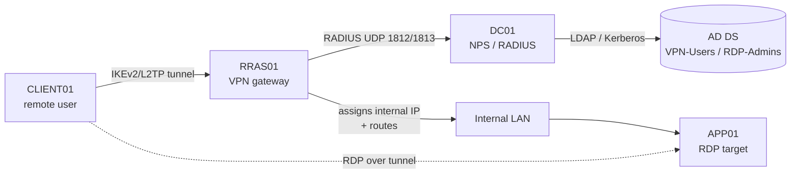

# Project 05 — Remote Access for a Branch

This capstone connects remote branch users back to the corporate LAN over an encrypted VPN, authenticates them against Active Directory through a central RADIUS policy server, and gives administrators controlled Remote Desktop access to internal servers. It assembles three modules — RRAS VPN, NPS/RADIUS, and RDP — into one working remote-access story.

## Overview

Modules teach each remote-access piece in isolation; a real branch needs them wired together. In this project you stand up an **RRAS** server as the VPN gateway, point its authentication at a central **NPS (RADIUS)** server that enforces connection policy against AD group membership, and expose an internal server for administrative **RDP** — ideally through a Remote Desktop Gateway rather than a raw open port. Finishing it proves you can deliver least-privilege remote access instead of a flat "VPN in, touch everything" tunnel.

Skills proven:

- Configure RRAS as a VPN server and delegate authentication to RADIUS.
- Author NPS connection-request and network policies that gate access on AD group membership.
- Enable and constrain RDP so only authorized admins reach only the servers they need.

## Objective and Scope

Deliver a working, policy-controlled remote-access path: a client on the "internet" side dials an IKEv2/L2TP VPN, NPS authorizes it against a `VPN-Users` AD group, the client receives an internal IP, and an administrator in `RDP-Admins` can then RDP to a designated internal server. Site-to-site routing, public PKI, and production-scale HA are **out of scope** — this is a single-branch lab build.

## Prerequisites

> [!NOTE]
> **Build these first**
> This project reuses services from earlier projects rather than rebuilding them.

- A working domain — [Project-01-Single-DC-Domain](Project-01-Single-DC-Domain.md) (AD DS + DNS).
- Core network services (DHCP/DNS) — [Project-02-Core-Network-Services](Project-02-Core-Network-Services.md) for address assignment and name resolution.
- The isolated lab environment from [Lab Setup and Virtualization](../Lab-Setup-and-Virtualization/Readme.md).

Lab VMs:

| VM | Role | Notes |
|---|---|---|
| `DC01` | AD DS + DNS + NPS/RADIUS | Domain controller; NPS role can live here in a lab |
| `RRAS01` | Remote Access (VPN gateway) | Dual-homed: one "external" NIC, one internal NIC |
| `APP01` | Internal RDP target | The server the remote admin manages |
| `CLIENT01` | Remote VPN client | Placed on the "external" network segment |

Module references: [Remote Access and VPN](../Remote-Access-and-VPN-Configuration/Readme.md), [RRAS](../Remote-Access-and-VPN-Configuration/RRAS.md), [Remote-Desktop-Access-to-a-Domain-User](../Remote-Access-and-VPN-Configuration/Remote-Desktop-Access-to-a-Domain-User.md), and [Remote-Desktop-Gateway](../Remote-Access-and-VPN-Configuration/Remote-Desktop-Gateway.md).

## Architecture



## Build Sequence

1. **Prepare AD groups.** Create the groups the policies will gate on.

```powershell
New-ADGroup -Name "VPN-Users"  -GroupScope Global -Path "OU=Groups,DC=armour,DC=local"
New-ADGroup -Name "RDP-Admins" -GroupScope Global -Path "OU=Groups,DC=armour,DC=local"
Add-ADGroupMember -Identity "VPN-Users"  -Members jdoe
Add-ADGroupMember -Identity "RDP-Admins" -Members jdoe
```

2. **Install the Remote Access role on `RRAS01`** and enable it as a VPN server.

```powershell
Install-WindowsFeature -Name RemoteAccess -IncludeManagementTools   # untested
Install-RemoteAccess -VpnType Vpn                                    # untested
```

3. **Install NPS on `DC01`.** The Network Policy and Access Services role provides RADIUS.

```powershell
Install-WindowsFeature -Name NPAS -IncludeManagementTools           # untested
```

4. **Register NPS in AD** so it can read dial-in properties, then add `RRAS01` as a RADIUS client.

```powershell
# On DC01, register the NPS server in Active Directory
netsh nps add registeredserver                                      # untested
```

   In the **Network Policy Server** console (`nps.msc`) → **RADIUS Clients** → add `RRAS01` with a strong shared secret. Record that secret for the next step.

5. **Point RRAS at RADIUS.** In the **Routing and Remote Access** console (`rrasmgmt.msc`) → server **Properties → Security**, set **Authentication provider** and **Accounting provider** to **RADIUS Authentication/Accounting**, and add `DC01` with the shared secret from step 4.

6. **Author the NPS network policy.** In `nps.msc` → **Policies → Network Policies**, create a policy that:
   - **Condition:** `Windows Groups` = `ARMOUR\VPN-Users` and `NAS Port Type` = `Virtual (VPN)`.
   - **Access permission:** Grant access.
   - **Constraints:** allow only strong auth (**MS-CHAP v2** at minimum, EAP/certificate preferred for IKEv2).

7. **Assign the client address pool.** In RRAS server **Properties → IPv4**, either enable **DHCP relay** to `DC02`/the DHCP scope from [Project-02-Core-Network-Services](Project-02-Core-Network-Services.md) or set a static pool on the internal subnet so tunneled clients get an internal IP.

8. **Enable and scope RDP on `APP01`.** Turn on Remote Desktop, require NLA, and permit only `RDP-Admins`.

```powershell
# Enable RDP and require Network Level Authentication
Set-ItemProperty -Path "HKLM:\System\CurrentControlSet\Control\Terminal Server" -Name "fDenyTSConnections" -Value 0
Set-ItemProperty -Path "HKLM:\System\CurrentControlSet\Control\Terminal Server\WinStations\RDP-Tcp" -Name "UserAuthentication" -Value 1
Enable-NetFirewallRule -DisplayGroup "Remote Desktop"

# Restrict logon to the RDP-Admins group
Add-LocalGroupMember -Group "Remote Desktop Users" -Member "ARMOUR\RDP-Admins"   # untested
```

9. **Connect from `CLIENT01`.** Add a VPN connection to the RRAS public address, choosing the tunnel type the NPS policy allows, and authenticate as `jdoe`. Once connected, RDP across the tunnel to `APP01`.

## Verification (Definition of Done)

- **VPN dial succeeds** for a `VPN-Users` member and **fails** for a user outside the group (proves NPS policy is doing the gating, not RRAS defaults).
- **Client gets an internal IP.** On `CLIENT01`, `Get-NetIPConfiguration` shows a PPP/VPN adapter with an address from the internal pool, and `Test-NetConnection APP01 -Port 3389` succeeds.
- **RADIUS accounting logs the session.** On `DC01`, NPS logs an **Event ID 6272** (access granted) in the *Security* log for the successful connection and **6273** for a denied one.
- **Active connection is visible on the server.** `Get-RemoteAccessConnectionStatistics` (or the RRAS console **Remote Access Clients** node) shows `jdoe` connected.  `# untested`
- **RDP is scoped.** A `RDP-Admins` member reaches `APP01`; a domain user who is not in the group is refused at logon.

> [!TIP]
> **Snapshot the milestone**
> Once dial + authorize + RDP all pass, snapshot every VM. The attack projects ([Project-09-Attack-the-Lab](Project-09-Attack-the-Lab.md)) will target this remote-access path, and you will want a clean baseline to return to.

## Security Considerations

> [!WARNING]
> **A VPN is a hole you punched in the perimeter — treat it like one**
> The whole point of this build is to let outside clients onto the internal LAN, so every weakness here is directly internet-facing in a real deployment.
>
> - **Kill PPTP and MS-CHAP where you can.** PPTP and MS-CHAPv2 are broken; prefer **IKEv2** or **L2TP/IPsec** with certificate or EAP authentication. Study/detection framing: PPTP handshakes and NTLM-relayable MS-CHAPv2 are classic soft entry points an attacker probes first.
> - **Never expose raw RDP (3389) to the outside.** Put administrative RDP behind the VPN or a **[Remote-Desktop-Gateway](../Remote-Access-and-VPN-Configuration/Remote-Desktop-Gateway.md)** (RDP over TLS 443); internet-facing 3389 is a top ransomware entry vector. This lab stays on an isolated segment (see [Enterprise Projects](Readme.md)).
> - **Enforce NLA and least privilege.** Require Network Level Authentication, gate access on `VPN-Users` / `RDP-Admins` groups only, and do not grant tunneled clients unrestricted routing to the whole LAN.
> - **Protect the RADIUS shared secret and log the failures.** A weak or reused shared secret undermines the whole trust chain; monitor NPS 6273 denials for password-spray and brute-force patterns.

For hardening baselines and monitoring of these events, see [Enterprise Security](../Enterprise-Security/Readme.md) and [Windows Monitoring and Logging](../Windows-Monitoring-and-Logging/Readme.md).

## Troubleshooting

| Symptom | Likely cause & fix |
|---|---|
| VPN fails with auth error but creds are correct | RRAS not pointed at RADIUS, or `RRAS01` not added as an NPS RADIUS client / shared-secret mismatch — recheck steps 4–5 |
| All users rejected regardless of group | NPS network policy condition too strict or ordered below a deny; verify the `VPN-Users` + `Virtual (VPN)` conditions and policy processing order |
| Connects but no internal resources reachable | No address pool / DHCP relay, or no route to the internal subnet — configure RRAS IPv4 pool (step 7) and check `Get-NetRoute` on the client |
| NPS can't read dial-in properties | NPS server not registered in AD — run `netsh nps add registeredserver` on `DC01` |
| RDP refused for a valid admin | User not in `Remote Desktop Users` / `RDP-Admins`, or NLA mismatch on an old client — confirm group membership and `UserAuthentication` value |

## References

- [Microsoft Learn — Remote Access (RRAS) overview](https://learn.microsoft.com/en-us/windows-server/remote/remote-access/remote-access)
- [Microsoft Learn — Network Policy Server (NPS)](https://learn.microsoft.com/en-us/windows-server/networking/technologies/nps/nps-top)
- [Microsoft Learn — Remote Desktop Services security](https://learn.microsoft.com/en-us/windows-server/remote/remote-desktop-services/remote-desktop-services-overview)
- [MITRE ATT&CK — T1133 External Remote Services](https://attack.mitre.org/techniques/T1133/)

## Related

- [RRAS](../Remote-Access-and-VPN-Configuration/RRAS.md) — the VPN gateway role this project configures
- [Remote Access and VPN](../Remote-Access-and-VPN-Configuration/Readme.md) — module hub (RRAS, NPS/RADIUS, VPN types)
- [Remote-Desktop-Access-to-a-Domain-User](../Remote-Access-and-VPN-Configuration/Remote-Desktop-Access-to-a-Domain-User.md) — RDP access to a domain host
- [Remote-Desktop-Gateway](../Remote-Access-and-VPN-Configuration/Remote-Desktop-Gateway.md) — publishing RDP over TLS instead of raw 3389
- [L2TP-IPsec](../Remote-Access-and-VPN-Configuration/L2TP-IPsec.md) — a stronger tunnel type than PPTP
- [Project-01-Single-DC-Domain](Project-01-Single-DC-Domain.md) — prerequisite domain
- [Project-02-Core-Network-Services](Project-02-Core-Network-Services.md) — prerequisite DHCP/DNS
- [Project-06-Backup-and-Disaster-Recovery](Project-06-Backup-and-Disaster-Recovery.md) — sibling project (next in sequence)
- [Project-09-Attack-the-Lab](Project-09-Attack-the-Lab.md) — sibling project that attacks this remote-access path
- [Enterprise Windows Infrastructure Security](../Readme.md) — course hub
